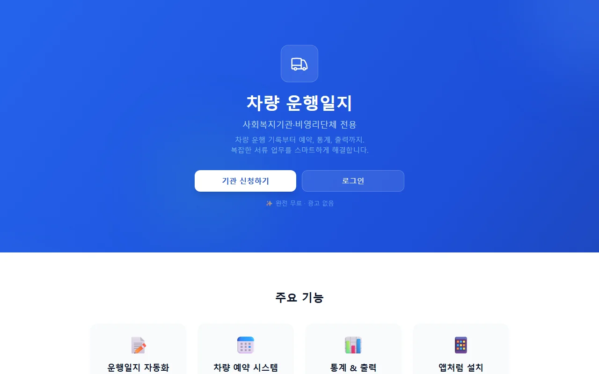
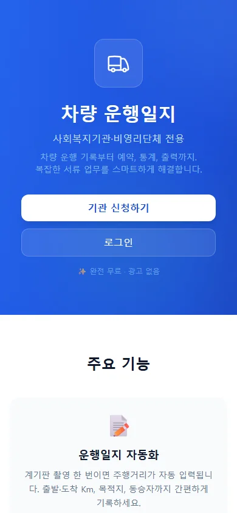
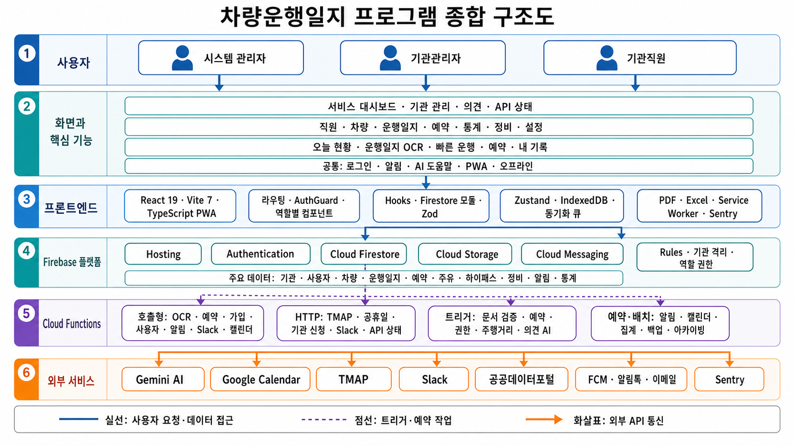

# 🚗 차량 운행일지

사회복지기관·비영리단체를 위한 **무료** 차량 운행일지 웹 애플리케이션 (PWA)

> 🔗 **지금 써보기**: **[vehicle-drive-log.web.app](https://vehicle-drive-log.web.app)** &nbsp;·&nbsp; ▶️ **[데모 영상](https://youtu.be/XdT5Wm_pd3s)** &nbsp;·&nbsp; 🛠 **[내 기관에 직접 설치하기](docs/SELF_HOSTING.md)**

<p>
  
  
</p>

---

## 이렇게 활용하세요

MIT 라이선스로 공개된 프로젝트입니다. 아래처럼 자유롭게 활용·응용할 수 있습니다.

| 대상 | 활용 방법 |
|------|-----------|
| 🏢 **다른 기관·단체** | fork 후 자기 Firebase에 배포하면 무료 차량 운행일지 시스템을 그대로 사용. **멀티테넌트라 한 인스턴스로 여러 기관 수용** 가능 → [셀프호스팅 가이드](docs/SELF_HOSTING.md) |
| 🔀 **인접 도메인** | 차량 → 회의실·장비·공용 물품으로 바꾸면 예약/사용대장 시스템. OCR 입력은 검침·영수증 등으로 응용 |
| 👩‍💻 **개발자** | 실제 프로덕션에서 돌아가는 **React 19 + Firebase 멀티테넌트 PWA** 레퍼런스. OCR·PDF/Excel·FCM·캘린더 연동 등 패턴을 개별 참고 |
| 🤖 **AI 협업 개발** | [.agent/](.agent/) 의 스킬·워크플로우·행동 규칙 셋업은 AI 에이전트로 규율 있게 개발하는 사례로 참고 가능 |

> 한국 사회복지기관 환경(사업자번호 기반 기관 인증, 카카오 알림톡, 공휴일/티맵)에 맞춰져 있으나, 이 기능들을 끄면 **운행일지·예약·통계·출력·푸시** 등 핵심은 어느 지역에서든 동작합니다. 자세한 내용은 [셀프호스팅 가이드 §8](docs/SELF_HOSTING.md#8-한국-특화-기능-참고) 참고.

### 떼어 쓸 수 있는 것

전체를 fork하지 않아도, 아래는 **스택·도메인과 독립적으로** 가져갈 수 있는 부분입니다.

| 무엇 | 어디를 보면 되나 | 왜 참고할 만한가 |
|------|------------------|------------------|
| **에이전트 하네스** | [.agent/](.agent/) · [scripts/check-harness.ts](scripts/check-harness.ts) · [scripts/skill-trigger-eval.json](scripts/skill-trigger-eval.json) | 스킬·워크플로·행동 규칙이 단일 원본이고 `.claude/`는 파생물이며 CI가 드리프트를 막습니다. 하네스 Doctor는 13개 영역 정합성을 검사해 **불일치 시 CI를 실패**시키고, eval 세트로 **에이전트 행동을 회귀 측정**합니다. 지침을 "문서에 적힌 약속"이 아니라 실행 가능한 게이트로 만드는 방식이라 어떤 언어·프레임워크에도 옮겨집니다 |
| **멀티테넌트 격리** | [eslint-rules/require-organization-filter.js](eslint-rules/require-organization-filter.js) · [firestore.rules](firestore.rules) · [tests/firestore-rules.test.ts](tests/firestore-rules.test.ts) · `setCustomClaims` | 테넌트 필터 누락은 코드 리뷰로 막기 어려운 사고입니다. 여기서는 커스텀 ESLint 규칙 `local/require-organization-filter`가 쿼리의 `organizationId` 누락을 **정적으로 차단**하고, Rules 테스트와 Custom Claims 동기화 트리거가 서버 측을 이중으로 받칩니다. 기관 → 회사·학교·지점으로 이름만 바꾸면 그대로 쓰입니다 |
| **무료 한도 비용 설계** | [docs/FIRESTORE_COST_ANALYSIS.md](docs/FIRESTORE_COST_ANALYSIS.md) · `dailyNightlyBatch`·`monthlyBatch` · [firestore-query-optimization](.agent/skills/firestore-query-optimization/SKILL.md) | 비영리 서비스의 실질 제약은 기능이 아니라 과금입니다. 개별 스케줄러를 야간·월간 배치로 통합해 잡 수를 줄이고, 주기를 업무 시간으로 좁히고(평일 08~18시), 집계 캐싱·쿨다운·페이지네이션으로 읽기를 줄인 결정과 실측이 남아 있습니다 |
| **예약 + 사용대장 골격** | `createReservationSafe` · [src/components/common/ReservationCalendar.tsx](src/components/common/ReservationCalendar.tsx) · [data-export-pattern](.agent/skills/data-export-pattern/SKILL.md) | 차량이라는 명사를 빼면 남는 구조는 일반적입니다. `vehicles`=자원, `reservations`는 그대로, `driveLogs`=사용대장으로 두면 회의실·장비·공용 물품 대여가 됩니다. 트랜잭션 충돌 방지, 승인 흐름, 반복 예약(공휴일 제외), 공식 양식 PDF/Excel 출력은 도메인과 무관합니다 |
| **개인정보 규제 대응** | `functions/src/handlers/triggers/auditLog.ts` · `PROCESSORS`(처리방침) | 접속기록을 클라이언트가 아니라 Firestore 트리거로 남기고, **무엇을 기록하지 않을지**를 화이트리스트로 정한 설계입니다. 처리방침의 위탁·국외이전 조항은 실제 연동 목록 단일 원본에서 파생시켜 두 조항이 구조적으로 어긋날 수 없게 했습니다. 법 문구는 각자 사실관계가 다르니 그대로 베끼지 말고 **구조만** 참고하세요 |
| **의사결정 기록** | [docs/구현이력.md](docs/구현이력.md) | Phase 141개에 무엇을 했는지가 아니라 **왜 그렇게 했고 어떤 지적을 기각했는지**가 남아 있습니다(오진을 CI 아티팩트로 뒤집은 과정, 리뷰 지적의 반영·기각 분리). 알려진 제약과 열린 항목도 여기서 확인할 수 있습니다 |

> 포크할 때 함께 상속되는 제약: **Firebase 종속**(Rules·Functions·클레임에 설계가 얽혀 있어 다른 백엔드로 옮기는 것은 재작성에 가깝습니다) · **한국어 전용**(UI·주석·문서, i18n 없음) · **커버리지 편중**(출력물·경로 계산 등 조용히 틀리는 영역은 두껍지만 전체 수치는 낮습니다).

---

## 시스템 구조

사용자 역할부터 프론트엔드·Firebase·Cloud Functions·외부 서비스까지, 실제 코드 기준으로 한 장에 정리한 전체 구조도입니다.



---

## 주요 기능

| 기능 | 설명 |
|------|------|
| 📝 운행일지 자동화 | 계기판 OCR 촬영으로 주행거리 자동 입력, 목적 프리셋, 동승자 선택, ⚡ 전기차(EV) 자동 감지 |
| 📅 차량 예약 시스템 | 달력 UI, 구글 캘린더 연동, 시간대 충돌 방지, 다일 및 요일 지정 반복 예약(휴일 제외) 지원 |
| 📊 통계 & 출력 | 월별·직원별·목적별 통계, 공식 양식 PDF/Excel 다운로드, 결재란 커스터마이징 |
| 📱 앱처럼 설치 | iPhone/Android 홈 화면에 추가하여 네이티브 앱처럼 사용 (PWA) |
| 🤖 AI 기관 인증 | 고유번호증/사업자등록증 OCR → 자동 승인/거절 (영리 기업 차단, 단 사업자번호 중간 '82'는 비영리로 인정하여 허용) |
| 🗺️ 길안내 연동 | 네이버/카카오/티맵 딥링크, 다중 목적지 경로 탐색 (거리·시간·톨비) |
| 📴 오프라인 지원 | Firestore 오프라인 캐시, 연결 복구 시 자동 동기화 |
| 🔔 푸시 알림 | 예약 10분 전 알림, 운행일지 미작성 알림, 관리자 공지 (FCM) |
| 📱 카카오 알림톡 | 기관 승인·리마인드 알림톡 자동 발송 (알리고 API) |
| 🔧 차량 정비 관리 | 정비/수리 기록, 정비 중 차량 사용 차단 |
| ⛽ 주유·하이패스 | 주유 기록, 하이패스 충전 관리, 통계 차트 |
| 💬 Slack 어시스턴트 | 워크스페이스를 연결하면 대화로 예약 조회·생성. 기관이 직접 OAuth로 연결(기관별 토큰 암호화 보관) |
| 🙋 AI 도움말·문의 | FAQ·매뉴얼 기반 질문 답변, 접수된 문의에 AI 답변 초안 자동 생성 |
| 🔐 보안·개인정보 | App Check(reCAPTCHA v3), 기관 간 데이터 격리(Firestore Rules), 개인정보 변경 접속기록 서버 기록 |
| 🌙 다크 모드 | 신규 사용자 기본 다크 모드 적용, 시스템/사용자 설정 기반 테마 지원, 글꼴 크기 3단계 조절 |

---

## 기술 스택

| 영역 | 기술 |
|------|------|
| 프론트엔드 | Vite 7 + React 19 + TypeScript |
| 상태 관리 | Zustand (글로벌 UI 상태) |
| 스타일링 | TailwindCSS v4 (반응형, 다크 모드) |
| 언어 | TypeScript (프론트엔드 + Cloud Functions + 테스트 + 스크립트) |
| 인증 | Firebase Auth (Google 로그인 전용) |
| 데이터베이스 | Cloud Firestore (실시간 구독 + 하이브리드 캐시) |
| 서버리스 | Cloud Functions for Firebase (TypeScript → CommonJS, Node.js 22) |
| AI/OCR | Gemini 3.1 Flash Lite (Cloud Functions 경유) |
| 호스팅 | Firebase Hosting |
| 보안 | Firebase App Check (reCAPTCHA v3) + Firestore/Storage Rules 멀티테넌트 격리 |
| 모니터링 | Sentry (프론트엔드 에러 + Web Vitals) |
| 알림톡 | 알리고 API + Cafe24 PHP 프록시 (카카오 알림톡) |
| 봇 연동 | Slack OAuth (기관별 봇 토큰 암호화 저장) |

---

## 사용자 역할

| 역할 | 권한 |
|------|------|
| 시스템 관리자 | 기관 신청 승인/거절, 기관·사용자 관리, 서비스 대시보드 |
| 기관관리자 | 직원·차량 관리, 운행일지 조회/수정/출력, 차량 예약, 설정 |
| 기관직원 | 운행일지 작성(OCR), 차량 예약, 길안내, 내 기록 조회 |

---

## 시작하기

> 💡 **내 기관에 처음부터 설치**하려면 단계별 안내가 있는 **[셀프호스팅 가이드](docs/SELF_HOSTING.md)** 를 참고하세요. 아래는 개발용 요약입니다.

### 사전 요구사항

- **Node.js 22 LTS** (필수, Node 24에서 Rollup 빌드 실패)
- Firebase CLI (`npm i -g firebase-tools`)
- `fnm use 22`로 Node 버전 전환 권장

### 설치

```bash
npm install
cd functions && npm install && cd ..
npx playwright install chromium webkit
```

### 환경변수 설정

루트에 `.env` 파일 생성:

```env
# Firebase (프로젝트 설정 → 웹 앱의 firebaseConfig)
VITE_FIREBASE_API_KEY=...
VITE_FIREBASE_AUTH_DOMAIN=...
VITE_FIREBASE_PROJECT_ID=...
VITE_FIREBASE_STORAGE_BUCKET=...
VITE_FIREBASE_MESSAGING_SENDER_ID=...
VITE_FIREBASE_APP_ID=...
VITE_FIREBASE_MEASUREMENT_ID=...

# FCM 웹 푸시 (Cloud Messaging → 웹 푸시 인증서)
VITE_FIREBASE_VAPID_KEY=...

# App Check (콘솔 → App Check → reCAPTCHA v3 사이트 키)
VITE_RECAPTCHA_SITE_KEY=...

# 티맵 API
VITE_TMAP_API_KEY=...

# 공휴일 API
VITE_HOLIDAY_API_KEY=...

# Sentry
VITE_SENTRY_DSN=...
# VITE_SENTRY_RELEASE — 직접 넣지 않습니다. 배포 워크플로가 배포 커밋 SHA로 주입해
# 에러가 어느 배포에서 났는지 추적하고 "Resolved in next release"를 쓸 수 있게 합니다.
```

> 개발 전용 변수(`VITE_APPCHECK_DEBUG_TOKEN`, `VITE_USE_EMULATOR`)는 `.env.local`에 둡니다 — [.env.local.example](.env.local.example) 참고.

`functions/.env` 파일 — 평문 보관이 가능한 값만 둡니다:

```env
GMAIL_USER=...
ALIMTALK_PROXY_URL=...
ADMIN_NOTIFICATION_EMAIL=...
SENTRY_DSN_FUNCTIONS=...     # 없으면 Functions 예외가 Sentry로 가지 않음
DISCORD_WEBHOOK_URL=...      # 선택 (운영 알림)
FIRESTORE_BACKUP_BUCKET=     # 선택. 비우면 {projectId}-backups (기본 버킷은 리전이 달라 못 씀)
TMAP_API_KEY=...
HOLIDAY_API_KEY=...
ALLOW_TEST_WHITELIST=        # 운영에서는 비워 둔다
SENTRY_RELEASE=              # 비워 둔다. 배포 워크플로가 배포 커밋 SHA로 채운다
```

> 이 목록은 `npm run check:functions-env`가 코드(`defineString`/`process.env`)와 대조합니다 —
> [functions/.env.example](functions/.env.example)과 위 블록이 코드와 어긋나면 CI가 실패합니다.
> EmailJS의 서비스·템플릿·공개 키는 환경변수가 아니라 코드 상수입니다([verifyHelpers.ts](functions/src/services/driveLog/verifyHelpers.ts)).

크리덴셜은 **Secret Manager**로 관리합니다([functions/src/core/params.ts](functions/src/core/params.ts)). `functions/.env`에 같은 키가 남아 있으면 **이름 충돌로 배포가 거부**됩니다.

```bash
firebase functions:secrets:set GMAIL_APP_PASSWORD      # 승인/거절 메일 발송(Gmail SMTP)
firebase functions:secrets:set EMAILJS_PRIVATE_KEY     # 기관 자동 검증 메일
firebase functions:secrets:set ALIMTALK_PROXY_TOKEN    # 카카오 알림톡 프록시
firebase functions:secrets:set SLACK_SIGNING_SECRET    # Slack 요청 서명 검증
firebase functions:secrets:set SLACK_CLIENT_ID         # Slack OAuth
firebase functions:secrets:set SLACK_CLIENT_SECRET
firebase functions:secrets:set SLACK_STATE_SECRET      # openssl rand -base64 32
firebase functions:secrets:set SLACK_TOKEN_ENC_KEY     # openssl rand -base64 32 (AES-256)
```

---

## npm 스크립트

| 명령어 | 설명 |
|--------|------|
| `npm run dev` | 개발 서버 실행 (Vite, localhost:5173) |
| `npm run build` | 프로덕션 빌드 (prebuild: Node 버전 확인 + SW 설정 생성, postbuild: 번들 크기 체크) |
| `npm run check:node` | Node 메이저 버전이 22인지 확인 (불일치 시 경고) |
| `npm run lint` | ESLint 실행 (프론트엔드 + Cloud Functions) |
| `npm run lint:functions` | Cloud Functions만 ESLint 실행 |
| `npm run type-check` | 프론트엔드 타입 검사 (`tsc --noEmit`) |
| `npm run type-check:functions` | Cloud Functions 타입 검사 (`tsc --noEmit`) |
| `npm test` | 단위 테스트 (Vitest) |
| `npm run test:coverage` | 단위 테스트 + 커버리지 리포트 |
| `npm run test:rules` | Firestore Rules 테스트 (Firebase Emulator) |
| `npm run test:e2e` | E2E 테스트 — chromium · mobile-chrome · mobile-safari (사전에 `npx playwright install chromium webkit` 필요) |
| `npm run test:e2e:all` | E2E 전체 브라우저 (위 3종 + 데스크톱 webkit). 주간 워크플로가 쓰는 조합 |
| `npm run lighthouse` | Lighthouse CI (모바일 프리셋 3회 측정 + 임계치 검증) |
| `npm run test:e2e:emulator` | Firebase Emulator 기반 인증 E2E 테스트 |
| `npm run screenshots` | PWA 스크린샷 생성 (Playwright + sharp) |
| `npm run audit` | npm 보안 감사 리포트 |
| `npm run health` | Cloud Functions 상태 점검 |
| `npm run verify:harness` | 하네스 Doctor — 에이전트 지침·스킬·워크플로·eval 정합성 검사 |
| `npm run verify:fast` | 빠른 검증 (Node 확인 + lint + 타입 검사 프론트/Functions) |
| `npm run verify:full` | 전체 게이트 (하네스 + fast + 커버리지 + Functions 테스트 + 빌드 + Rules + E2E) |
| `npm run test:functions` | Cloud Functions 단위 테스트 (Jest) |
| `npm run sync:agents` | `.agent/` → `.claude/` 브리지 재생성 (CI가 `--check`로 강제) |

---

## 배포

이 저장소의 운영 배포는 **CI 단일 경로**입니다. `master`에 푸시되면 [Deploy 워크플로](.github/workflows/deploy.yml)가 빌드·검증 후 Hosting·Functions·Rules를 배포합니다. 로컬에서 `firebase deploy`를 병행하면 같은 함수를 동시에 업데이트해 충돌하므로 실행하지 않습니다.

```bash
# 배포 전 로컬 검증
fnm use 22
npm run verify:fast     # lint + 타입 검사
npm run build           # 프로덕션 빌드 확인
```

> ⚠️ Node 22 필수: `fnm use 22 && node --version` (Node 24는 Rollup 빌드 실패)

**셀프호스터**는 자기 Firebase 프로젝트에 직접 배포하면 됩니다 — 명령과 순서는 [셀프호스팅 가이드 §5](docs/SELF_HOSTING.md#5-로컬-확인--배포) 참고.

---

## 프로젝트 구조

```
차량운행일지/
├── public/
│   ├── firebase-messaging-sw.js      FCM Service Worker
│   ├── manifest.json                 PWA 매니페스트
│   └── icons/                        앱 아이콘
├── src/
│   ├── App.tsx                       역할별 라우팅 + 랜딩 페이지
│   ├── index.css                     TailwindCSS + 커스텀 스타일
│   ├── main.tsx                      분할 진입점 (인증 상태에 따라 Full/Light 앱 로드)
│   ├── components/
│   │   ├── auth/                     인증 및 라우터 가드 (AuthGuard, 로그인, 랜딩 등)
│   │   ├── superAdmin/               시스템 관리자 화면 (기관 관리, 대시보드)
│   │   ├── admin/                    기관관리자 화면 (운행일지, 통계, 분석)
│   │   ├── employee/                 직원 화면 (모바일 최적화)
│   │   └── common/                   공통 (알림, 달력, 에러, 오프라인)
│   ├── store/                        Zustand 전역 상태 (테마, 폰트, Toast, 모달 등)
│   ├── schemas/                      Zod 런타임 검증 스키마
│   ├── types/                        TypeScript 타입 정의
│   ├── hooks/                        커스텀 훅 (비즈니스 로직 분리)
│   │   └── utils/                    훅에서 추출된 순수 함수
│   ├── lib/                          유틸리티 (Firestore, 티맵, OCR, PDF/Excel)
│   │   └── firestore/                Firestore CRUD (도메인별 분리)
│   └── __tests__/                    단위 테스트 (Vitest)
├── functions/                        Cloud Functions (TypeScript → CommonJS)
│   └── src/                          소스 (빌드 → functions/lib/)
├── e2e/                              E2E 테스트 (Playwright)
├── scripts/                          빌드/운영 스크립트
└── .github/workflows/                CI/CD 파이프라인
```

---

## Cloud Functions

전체 72개 함수(리전 `asia-northeast3`)의 파라미터·권한·트리거 경로는 **[Cloud Functions 레퍼런스](docs/FUNCTIONS_REFERENCE.md)** 에 정리되어 있습니다. 아래는 종류별 요약입니다.

> 이 절의 숫자는 `npm run check:functions-catalog`가 `functions/src/index.ts`와 대조합니다 — 어긋나면 CI가 실패합니다.

| 종류 | 개수 | 대표 함수 |
|------|------|-----------|
| 호출형 (onCall) | 40 | `ocrDashboard`(계기판 OCR) · `createReservationSafe`(트랜잭션 예약 생성) · `joinOrganization`(초대 코드 가입) · `withdrawOrganization`(기관 해지) · `askAI`(FAQ 기반 답변) · `getSlackInstallUrl`·`diagnoseSlackConnection`(Slack 연결) |
| HTTP (onRequest) | 4 | `tmapProxy`·`holidayProxy`(외부 API 프록시, 인증 + Rate Limit) · `slackEvents`(Slack 이벤트 수신) · `slackOauthCallback`(설치 콜백) |
| 스케줄 (onSchedule) | 7 | 아래 표 참고 |
| Firestore 트리거 | 20 | `autoVerifyDocument`(증빙서류 AI 심사) · `setCustomClaims`(권한 동기화) · `onReservation*`(캘린더·푸시) · `onDriveLog*`(주행거리·집계) · `onFuelLogCreated`(주유 필요 표시 해제) · `audit*`(접속기록) · `onSlackTaskCreated`(Slack 워커) |
| Auth 트리거 | 1 | `onUserDelete`(탈퇴 시 개인정보 익명화) |

### 스케줄 함수

| 함수명 | 주기 (Asia/Seoul) | 용도 |
|--------|------|------|
| `reservationReminder` | 평일 08~18시 매시 정각 | 예약 임박 FCM + 일지 미작성/미출발 알림 (OCR 워밍업 편승) |
| `syncCalendarToApp` | 평일 06~22시 30분 주기 | 구글 캘린더 → Firestore 역동기화 |
| `nightlyStatsBatch` | 매일 02:00 | 기관 월간 집계 캐싱 + superAdmin 대시보드 통계 캐시 |
| `dailyNightlyBatch` | 매일 02:20 | Firestore 백업 export + 차량 보험 만료 알림 |
| `weeklyMaintenanceBatch` | 매주 일 03:00 | 기관 퍼지, 증빙 이미지 정리, 3년+ 운행 기록 아카이빙 |
| `monthlyBatch` | 매월 1일 06:00 | 공휴일 캐시 동기화 + 주행거리 정합성 검증 |
| `sendInactiveOrgAlimtalkScheduled` | 평일 14:00 | 미활성 기관 알림톡 발송 대상 점검 |

> 스케줄 잡 수(=과금)를 줄이려고 개별 배치를 야간·월간 배치로 통합했습니다. 다만 통합에도 한계선이 있습니다 —
> 성격이 다른 일곱 스텝을 한 함수에 몰아넣었더니 메모리를 가장 무거운 스텝에 맞춰야 했고(1GiB), 한 스텝이 죽으면
> 재시도가 나머지 여섯까지 다시 돌렸습니다. 2026-08-28 Cloud Run 비용 점검에서 이 함수가 청구 시간 1위로 나와
> **집계 · 백업 · 주간 유지보수** 셋으로 다시 갈랐습니다.

---

## 테스트

| 종류 | 규모 | 도구 |
|------|------|------|
| 단위 테스트 (프론트 + 스크립트) | 167파일 / 1,982개 테스트 | Vitest |
| Functions 단위 테스트 | 77개 suite / 1,026개 테스트 (emulator 테스트 제외) | Jest + ts-jest |
| Rules 테스트 | 2파일 / 37개 테스트 | Firebase Emulator + Vitest |
| E2E 테스트 | 26개 spec 파일 (일부 인증/오프라인 시나리오 fixme) | Playwright |

> 테스트 케이스 수는 2026-09-04 Node 22 실행 결과입니다. 파일·suite 수는 `npm run verify:harness`가 저장소와 대조합니다.

---

## 관련 문서

| 문서 | 설명 |
|------|------|
| [셀프호스팅 가이드](docs/SELF_HOSTING.md) | 내 기관 Firebase에 직접 설치·배포하는 단계별 안내 |
| [구현계획서](docs/차량운행일지_구현계획서.md) | 전체 설계 문서 (아키텍처, DB 스키마, API 명세, 시퀀스 다이어그램) |
| [구현이력](docs/구현이력.md) | Phase별 구현 이력 색인 (구간별 분할 파일로 연결) |
| [Cloud Functions 레퍼런스](docs/FUNCTIONS_REFERENCE.md) | 함수별 트리거·권한·파라미터 (자동 생성) |
| [OPERATIONS.md](OPERATIONS.md) | 시스템 관리자용 운영 매뉴얼 (백업, 장애 대응, 기관 관리) |
| [CONTRIBUTING.md](CONTRIBUTING.md) | 개발 참여 가이드 (코딩 컨벤션, PR 규칙, 브랜치 전략) |
| [API_FALLBACK.md](docs/API_FALLBACK.md) | 외부 API 장애 대응 매뉴얼 |
| [CHANGELOG.md](CHANGELOG.md) | Phase 61(2026-06-14)까지의 변경 이력 — 이후는 위 구현이력으로 일원화 |

---

## 서비스 URL

| 환경 | URL |
|------|-----|
| 프로덕션 | `https://vehicle-drive-log.web.app` |
| 개발 서버 | `http://localhost:5173` |

## 라이선스

[MIT License](LICENSE) © 2026 소셜프리즘 (Social Prism)

누구나 자유롭게 사용·수정·재배포할 수 있습니다. 저작권 표시만 유지해 주세요.
