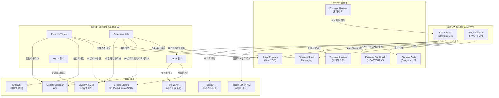
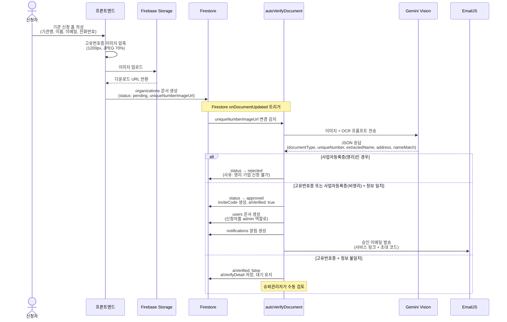
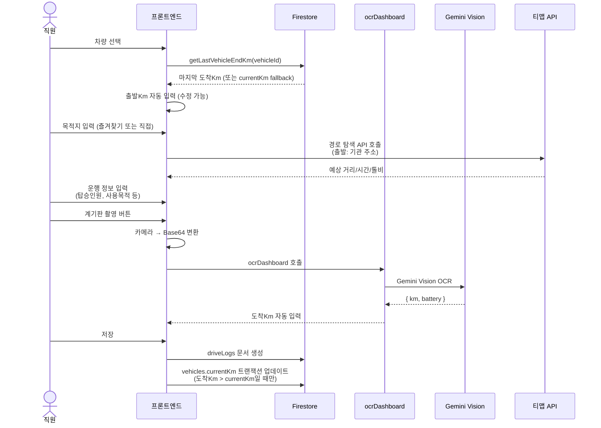
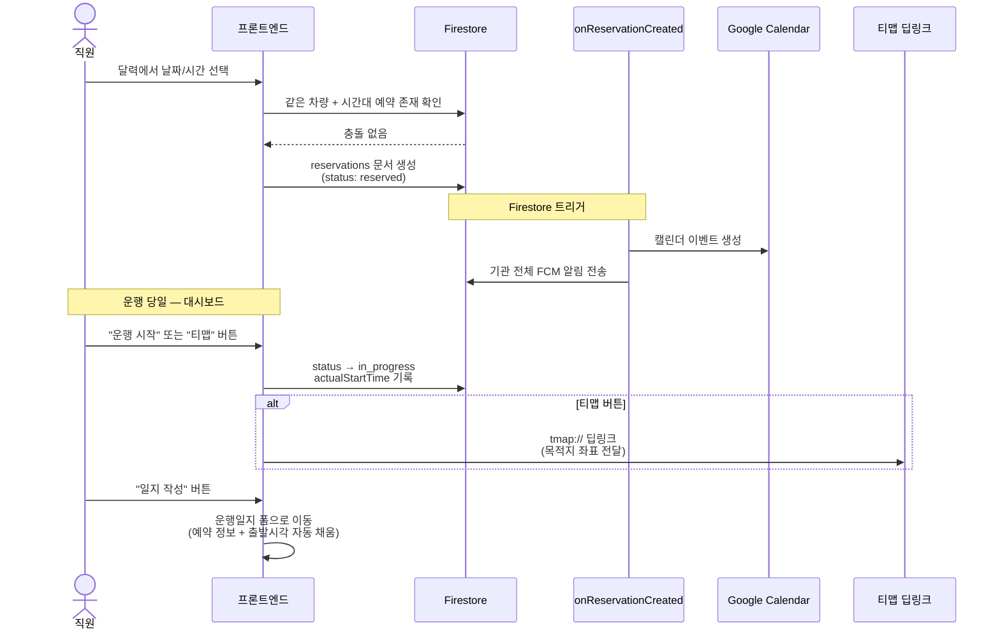
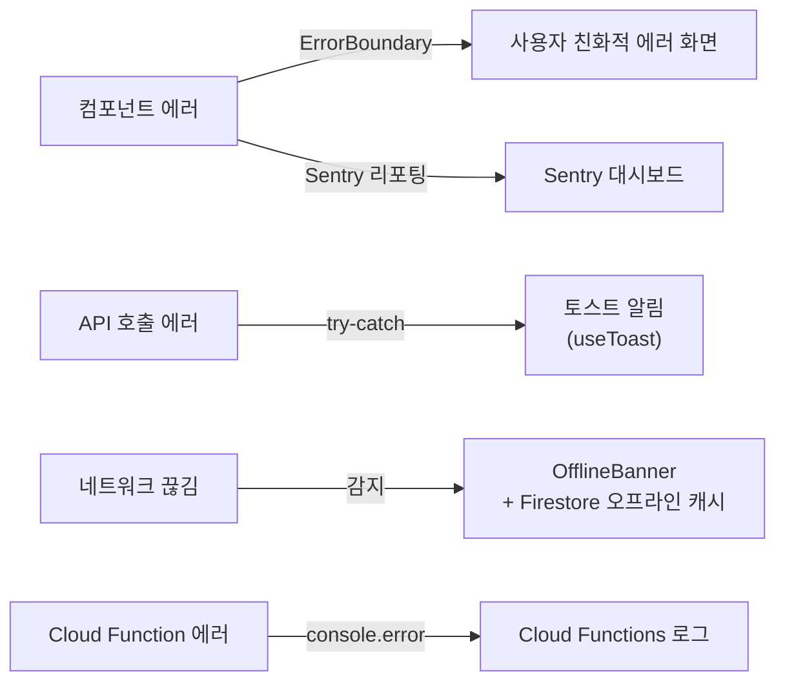

# 🚗 차량 운행일지 앱 — 구현 계획서

> **최종 업데이트**: 2026-05-19 12:48 | **전체 진행률**: Phase 1~57 완료 ✅ (서비스 운영 대시보드 갱신 시각 표시 기능 추가 및 배포 완료) | 서비스 운영 중 (170개+ 기관)

---

## 1. 프로젝트 개요

본 프로젝트는 **사회복지기관 및 비영리단체**를 대상으로 **무료**로 제공되는 **차량 운행일지 웹 애플리케이션**입니다.  
차량 사용 기록 관리, 예약, 계기판 OCR 인식, 그리고 네이버, 카카오, 티맵을 활용한 길안내 딥링크 연동 등 다양한 편의 기능을 제공합니다.  
단, 일반 영리 기업(사업자등록증 보유 기관)은 서비스 이용 대상에서 제외되며, 가입 신청 시 반려될 수 있습니다.

---

## 2. 기술 스택

| 영역 | 기술 |
|------|------|
| **프론트엔드** | Vite + React + TypeScript |
| **상태 관리** | Zustand (글로벌 UI 상태: 테마, 폰트, Toast, 모달) |
| **스타일링** | TailwindCSS v3 (반응형, 다크 모드) |
| **언어** | TypeScript (프론트엔드 + Cloud Functions + 테스트 + 스크립트) |
| **인증** | Firebase Auth (Google 로그인 전용) |
| **보안** | Firebase App Check (reCAPTCHA v3) |
| **데이터베이스** | Cloud Firestore |
| **서버리스 함수** | Cloud Functions for Firebase (TypeScript ESM) |
| **호스팅** | Firebase Hosting |
| **AI/OCR** | Gemini 3.1 Flash Lite Preview (Cloud Functions 경유) |
| **외부 연동** | 네이버맵 / 카카오맵 / 티맵 딥링크 |

---

## 3. 시스템 아키텍처



### 데이터 흐름 요약

| 흐름 | 경로 |
|------|------|
| **인증** | 브라우저 → Firebase Auth (Google OAuth) → Firestore `users/` |
| **운행일지 작성** | 브라우저 → Firestore `driveLogs/` + `vehicles.currentKm` 트랜잭션 |
| **계기판 OCR** | 브라우저 → Cloud Function `ocrDashboard` → Gemini Vision → 브라우저 |
| **기관 신청** | 브라우저 → Storage (이미지) + Firestore `organizations/` → Cloud Function `autoVerifyDocument` (트리거) → Gemini + EmailJS |
| **예약 알림** | Cloud Function `reservationReminder` (스케줄) → FCM → Service Worker → 브라우저 |
| **캘린더 연동** | Firestore 예약 변경 → Cloud Function 트리거 → Google Calendar API ↔ 역동기화 |

---

## 4. 사용자 역할 및 권한

### 4.1 시스템 관리자 (`ehsheh@gmail.com`)
- 특정 기관에 소속되지 않는 최상위 관리자입니다.
- 신규 기관의 사용 신청을 승인하거나 거절할 수 있습니다.
- 승인 시 신청자에게 서비스 링크와 초대 코드가 포함된 이메일을 발송합니다.
- 반려된 기관 신청 내역을 조회하고 삭제하여 관리합니다.
- 기관 목록을 관리하며, 기관명과 주소를 직접 편집할 수 있습니다.
- 특정 기관 삭제 시, 해당 기관에 소속된 관리자 및 직원의 계정을 일괄 삭제하여 즉시 로그인을 차단합니다.
- 기기에 구애받지 않는 반응형 웹 화면을 제공합니다.

### 4.2 기관관리자
- 소속 기관의 직원을 등록하고 관리할 수 있습니다.
- 기관의 차량 정보를 등록하고 관리합니다.
- 직원을 초대하기 위한 기관 전용 6자리 초대 코드를 발급합니다.
- 소속 직원이 작성한 운행일지를 조회, 수정, 출력 및 다운로드할 수 있습니다.
- 기관의 전체 차량 예약 내역을 관리합니다.
- 직원이 운행일지에 잘못 입력한 정보를 수정할 수 있는 권한이 있습니다.
- **관리자 화면 ↔ 직원 화면 간 자유로운 전환이 가능합니다.** (기관관리자 본인도 차량을 직접 운행하는 경우를 지원합니다.)
- PC 환경에 최적화된 반응형 웹 화면을 제공하며, 모바일 화면도 지원합니다.

### 4.3 기관직원
- 계기판 OCR 기능을 활용하여 손쉽게 운행일지를 작성할 수 있습니다.
- 본인이 작성한 운행일지 기록에 한해 수정이 가능합니다.
- 최근 1개월간의 차량별 이용 내역을 조회할 수 있습니다.
- 차량별 보험 정보를 조회할 수 있으며, 전화번호 터치 시 즉시 보험사로 통화가 연결됩니다.
- 달력 UI를 통해 차량을 예약할 수 있습니다.
- 길안내 앱 연동을 지원하여, 네이버 지도, 카카오내비, 티맵 중 선호하는 앱을 기본값으로 선택할 수 있습니다.
- 모바일 환경에 최적화된 화면을 제공하며, PC에서도 동일하게 작동합니다.

---

## 5. Firestore 데이터베이스 설계

### 5.1 컬렉션 구조

```
Firestore
├── organizations/                    ← 기관 정보
│   └── {orgId}
│       ├── name: string              (기관명)
│       ├── uniqueNumber: string      (고유번호, AI OCR로 사본에서 추출)
│       ├── status: string            (pending | approved | rejected)
│       ├── applicantName: string     (신청자 이름)
│       ├── applicantEmail: string    (신청자 이메일)
│       ├── applicantPhone: string    (신청자 전화번호)
│       ├── uniqueNumberImageUrl: string (고유번호증 사본 URL)
│       ├── aiVerified: boolean       (AI 문서유형+기관명 검증 통과 여부)
│       ├── aiVerifyDetail: object    ({documentType, numberMatch, nameMatch, extractedNumber, extractedName})
│       ├── inviteCode: string        (6자리 직원 초대 코드)
│       ├── address: string           (기관 주소, AI OCR로 사본에서 추출)
│       ├── approvalSignatures: array (결재란 항목 목록, 예: ['담당', '팀장', '관장'])
│       ├── createdAt: timestamp
│       ├── approvedAt: timestamp
│       ├── rejectedAt: timestamp
│       └── customHolidays/            ← 커스텀 휴일 (서브컬렉션)
│           └── {holidayId}
│               ├── name: string       (휴일명)
│               ├── date: string       (YYYY-MM-DD)
│               └── createdAt: timestamp
│
├── users/                            ← 사용자 정보
│   └── {uid}
│       ├── email: string
│       ├── name: string
│       ├── role: string              (superAdmin | admin | employee)
│       ├── organizationId: string
│       ├── phone: string
│       ├── disabled: boolean         (soft delete 비활성화 여부)
│       └── createdAt: timestamp
│
├── vehicles/                         ← 차량 목록
│   └── {vehicleId}
│       ├── displayName: string       (예: "소나타2744")
│       ├── modelName: string         (모델명)
│       ├── plateNumber: string       (차량번호)
│       ├── type: string              (compact | sedan | van | bus | truck)
│       ├── fuelType: string          (gasoline | diesel | lpg | electric)
│       ├── organizationId: string
│       ├── currentKm: number         (최신 누적Km 캐시)
│       ├── currentBattery: number    (전기차만, 현재 배터리 %)
│       ├── status: string            (active | retired, 기본값 active)
│       ├── retiredAt: timestamp      (퇴역 시점, status=retired일 때)
│       ├── hipassCardNumber: string  (선택, 하이패스 카드번호)
│       ├── googleCalendarId: string  (선택, 구글 캘린더 리소스 ID)
│       ├── insurance: object         (보험 정보, 선택)
│       │   ├── company: string       (보험사명, 예: "삼성화재")
│       │   └── phone: string         (보험사 전화번호, 예: "1588-5114")
│       └── createdAt: timestamp
│
├── driveLogs/                        ← 운행일지
│   └── {logId}
│       ├── timestamp: timestamp      (작성 시각)
│       ├── vehicleId: string
│       ├── vehicleDisplayName: string
│       ├── date: string              (운행 날짜, YYYY-MM-DD)
│       ├── departureTime: string     (출발시각, HH:mm)
│       ├── arrivalTime: string       (도착시각, HH:mm)
│       ├── driverUid: string
│       ├── driverName: string
│       ├── passengerCount: number    (탑승인원 수)
│       ├── passengerNames: array     (탑승자 이름 목록)
│       ├── destination: string       (목적지)
│       ├── purposeCategory: string   (가정방문|관공서|외부교육|물품운송|기타)
│       ├── purposeDetail: string     (상세 목적, 자유 텍스트)
│       ├── linkedLogId: string       (이전 운행 연결 ID, 다중 방문 시)
│       ├── departureKm: number       (출발Km)
│       ├── arrivalKm: number         (도착Km)
│       ├── fuelAmount: number        (주유/충전금액 — 신규 필드, energyCost 대체)
│       ├── energyCost: number        (내연기관: 주유금액 / 전기차: 충전금액, 레거시)
│       ├── departureBattery: number  (전기차만, 출발 배터리 %)
│       ├── arrivalBattery: number    (전기차만, 도착 배터리 %)
│       ├── note: string              (비고)
│       ├── organizationId: string
│       ├── reservationId: string     (연동된 예약 ID, 있으면)
│       └── createdAt: timestamp
│
├── reservations/                     ← 차량 예약
│   └── {reservationId}
│       ├── vehicleId: string
│       ├── vehicleDisplayName: string
│       ├── userId: string
│       ├── userName: string
│       ├── date: string              (YYYY-MM-DD)
│       ├── startTime: string         (HH:mm, 예약 시작)
│       ├── endTime: string           (HH:mm, 예약 종료)
│       ├── destination: string       (목적지)
│       ├── purpose: string           (용도)
│       ├── status: string            (reserved | in_progress | completed | cancelled)
│       ├── actualStartTime: string   (실제 출발 시각, HH:mm — 운행 시작 시 기록)
│       ├── organizationId: string
│       └── createdAt: timestamp
│
├── notifications/                    ← 앱 내 알림
│   └── {notificationId}
│       ├── targetUid: string         (수신자)
│       ├── type: string              (approval | rejection | info | reservation_reminder | drive_log_reminder | no_show_reminder)
│       ├── title: string
│       ├── message: string
│       ├── read: boolean
│       ├── organizationId: string
│       └── createdAt: timestamp
│
├── favorites/                        ← 자주 가는 목적지 (사용자별)
│   └── {favoriteId}
│       ├── userId: string
│       ├── name: string              (별칭, 예: "김OO 어르신 댁")
│       ├── address: string           (주소)
│       ├── organizationId: string
│       └── createdAt: timestamp
│
├── maintenanceRecords/               ← 차량 정비/수리 기록
│   └── {recordId}
│       ├── vehicleId: string
│       ├── vehicleName: string
│       ├── organizationId: string
│       ├── type: string              (정기점검|오일교환|타이어|수리|기타)
│       ├── date: string              (YYYY-MM-DD)
│       ├── cost: number              (비용)
│       ├── memo: string
│       ├── blockVehicle: boolean     (정비 중 차량 사용 차단 여부)
│       ├── maintenanceEndDate: string (정비 종료 예정일, YYYY-MM-DD)
│       └── createdAt: timestamp
│
├── fuelLogs/                         ← 주유/충전 기록
│   └── {fuelLogId}
│       ├── organizationId: string
│       ├── vehicleId: string
│       ├── vehicleName: string       (비정규화)
│       ├── driverUid: string
│       ├── driverName: string        (비정규화)
│       ├── date: string              (YYYY-MM-DD)
│       ├── meterReading: number      (주유 시 계기판 km)
│       ├── meterPhotoUrl: string     (선택, 계기판 사진 URL)
│       ├── fuelAmount: number        (주유량, 리터)
│       ├── fuelCost: number          (주유 금액, 원)
│       └── createdAt: timestamp
│
└── orgApplications/                  ← 기관 가입 신청
    └── {appId}
        ├── orgName: string
        ├── adminEmail: string
        ├── status: string            (pending|approved|rejected)
        ├── uniqueNumberImageUrl: string
        └── createdAt: timestamp
```

### 5.2 주요 설계 결정사항

| 결정 | 이유 |
|------|------|
| **결정론적 ID(Hash ID) 기반 운행일지 생성** | 오프라인 환경에서 네트워크 단절/복구 시 동일한 로그가 중복 생성되는 것(Idempotency)을 막고, 서버측 중복 체크 쿼리 비용을 절감하기 위해 `{vehicleId}_{uid}_{date}_{startKm}_{endKm}` 형태의 고정 ID를 사용해 `setDoc`을 수행합니다. |
| `vehicles.currentKm` 캐시 + 마지막 운행 endKm 조회 | 출발Km 자동 입력 시 `getLastVehicleEndKm()`로 최신 endKm 우선 사용, fallback으로 `currentKm` 사용 |
| 출발Km는 추천값, 수동 수정 가능 | 입력 순서가 뒤바뀌어도 문제없도록 |
| `currentKm` 갱신은 조건부 | 도착Km > currentKm일 때만 갱신 (뒤늦은 입력 대응) |
| `driveLogs`에 `vehicleDisplayName`, `driverName` 비정규화 | 목록 조회 시 JOIN 불필요 |
| `reservations`에 `userName`, `vehicleDisplayName` 비정규화 | 달력 표시 시 추가 쿼리 방지 |
| `inviteCode`를 organizations에 저장 | 기관 단위 1개 코드, 재발급 가능 |
| 기관 삭제 시 소속 사용자 일괄 삭제 | `writeBatch`로 원자적 처리, 삭제된 사용자는 로그인 불가 |
| 사용자 문서 실시간 감시 (`onSnapshot`) | 기관 삭제 시 새로고침 없이 즉시 차단 |
| 관리자 대시보드 훅 최적화 (상태 객체화) | 개별 useState 54개를 도메인별 4개 그룹 객체(summary, timeSeries, rankings, external)로 병합하여 대시보드 컴포넌트의 불필요한 리렌더링 차단 및 유지보수성 향상 |

---

## 6. 화면 구성

### 6.1 공통 화면
- 구글 계정을 이용한 로그인 화면
- 신규 직원을 위한 초대 코드 입력 화면
- 기관 가입 신청 후 결과를 기다리는 승인 대기 화면

### 6.2 시스템 관리자 화면 (반응형)
- 기관 신청 목록: 대기 중이거나 거절된 내역을 탭으로 구분하며, 신청 정보와 AI 검증 결과를 함께 표시합니다.
  - 승인 시: 신청자에게 감사 메시지, 서비스 링크, 기관관리자용 초대 코드를 이메일로 자동 발송합니다.
  - 거절 시: 거절 내역을 조회하거나 삭제할 수 있습니다.
- 기관 관리: 승인된 기관 목록을 조회하고, 기관명과 주소를 화면에서 직접(인라인) 편집할 수 있습니다.
- 사용자 피드백 관리: 사용자가 제출한 피드백 목록을 조회하고 처리 상태를 관리합니다.
- 알림 관리

### 6.3 공통 공개 페이지
- **FAQ 페이지** (`FAQPage.tsx`): 자주 묻는 질문을 아코디언 UI로 제공하며, 대시보드 우측에 배치됩니다.
- **업데이트 소식** (`ReleaseNotesPage.tsx`): 서비스의 주요 변경 이력을 사용자가 이해하기 쉽게 제공합니다.

### 6.4 기관관리자 화면 (반응형, PC 중심)
- **대시보드**: 당일 운행 현황과 전체 차량의 상태를 한눈에 요약하여 보여줍니다.
- **직원 관리**: 소속 직원 목록을 조회하고 기관 초대 코드를 관리합니다.
- **차량 관리**: 차량을 신규 등록, 수정, 삭제할 수 있으며, 보험사명과 전화번호 등 보험 정보를 등록합니다.
- **운행일지**: 직원이 작성한 운행일지를 조회, 검색, 수정하고 PDF나 Excel 형태로 출력할 수 있습니다.
- **차량 예약**: 달력 UI를 통해 차량 예약 현황을 확인하고 관리합니다.
- **설정**: 기관 정보(이메일, 전화번호 수정 가능), 결재란 항목, 공휴일, 푸시 알림, 다크 모드 등을 설정할 수 있습니다. (단, 기관명과 주소는 읽기 전용입니다.)

### 6.5 기관직원 화면 (모바일 최적화)
- **오늘 대시보드 (메인)**: 당일 본인의 예약 목록과 '운행 시작', '길안내' 버튼을 제공합니다. 예약이 없을 경우 안내 문구를 표시하며, 운행 중에는 다른 시작 버튼이 비활성화되는 **동시 운행 제한** 기능이 적용됩니다.
- **운행일지 작성**: 계기판 OCR, 목적지 프리셋, 동승자 선택, 다중 방문을 위한 '이어서 기록' 등 운행일지 입력을 위한 다양한 편의 기능을 제공하는 폼입니다.
- **즐겨찾기**: 자주 방문하는 목적지를 등록하고 선택할 수 있습니다.
- **내 기록**: 본인이 작성한 운행 기록 목록을 확인하고 수정할 수 있으며, 미완료된 기록이 있을 경우 알림을 제공합니다.
- **차량 이용 내역**: 특정 차량의 최근 1개월간 이용 내역을 검색할 수 있습니다.
- **차량 보험 정보**: 차량별 보험사 이름과 전화번호를 제공하며, 전화번호 터치 시 즉시 전화가 연결됩니다.
- **차량 예약**: 달력 기반으로 차량을 예약(목적지 및 용도 입력)하거나 취소할 수 있으며, 현재 시각 기준 미래 일정만 예약 가능합니다.
- **예약 없는 운행**: 예약 없이 대시보드 하단에서 즉시 운행을 시작할 수 있습니다. (운행 중에는 해당 카드가 숨겨집니다.)
- **길안내 연동**: 예약 카드 내 길안내 버튼 클릭 시, 설정된 기본 앱(네이버 지도, 카카오내비, 티맵)을 통해 길안내를 시작합니다.
- **더보기**: 기본 길안내 앱 변경, 화면 글자 크기 조절(소/중/대), 다크 모드, 알림 수신 여부 등을 설정할 수 있습니다.

---

## 7. 핵심 기능 상세

### 7.1 기관 신청 및 승인 프로세스

```
기관 대표 → 신청 폼 작성
  (이름, 기관명, 고유번호증 사본, 이메일, 전화번호)
      ↓
프론트: 이미지 업로드 → Firestore에 uniqueNumberImageUrl 저장
      ↓
Cloud Function(autoVerifyDocument) 자동 트리거 (Firestore onDocumentUpdated)
  → Gemini Vision으로 사본 OCR (서버사이드)
  → 검증 단계:
    ① 문서 유형 판별 (3분류):
       - 고유번호증 → 다음 단계 진행
       - 사업자등록증(비영리) → 다음 단계 진행 (비영리사단법인, 사회복지법인 등)
       - 사업자등록증(영리) → 중간 자리 '82'인 경우에 한하여 비영리로 취급하여 다음 단계 진행. 그 외는 즉시 자동 거부 (영리 기업 신청 불가)
    ② 고유번호/사업자번호 추출 → organizations.uniqueNumber에 저장
    ③ 기관명(단체명) 추출 → 입력된 기관명과 비교
    ④ 기관 주소 추출 → organizations.address에 저장
      ↓
모두 일치 → organizations.aiVerified = true → ✅ 자동 승인
  - status = "approved", inviteCode 생성
  - 알림 생성 + 승인 이메일 발송 (@emailjs/nodejs, 서버사이드)
  - 사용자 organizationStatus = "approved"로 등록
일부 불일치 → organizations.aiVerified = false, aiVerifyDetail 저장
  → ⏳ 대기중(pending) 유지 → 슈퍼관리자 수동 검토
사업자등록증(영리) → 자동 거부 (rejected)
AI 분석 실패 → 대기중 유지 (관리자가 수동으로 AI 재분석 또는 직접 승인)
      ↓
슈퍼관리자 수동 승인 시:
  - 승인 이메일 발송 (프론트 EmailJS, 실패 시 alert으로 관리자에게 알림)
  - 수동 거절 시 알림 생성
```

> ⚡ **핵심 구조**: 프론트는 이미지 URL 저장만 담당, AI 분석 + 자동 승인 + 이메일 발송은 모두 Cloud Function이 처리

### 7.2 직원 등록 프로세스

```
기관관리자 → 직원 목록에 이름/이메일 사전 등록
        → 기관 초대 코드를 직원에게 공유
             ↓
직원 → 구글 로그인 → 초대 코드 입력
     → 코드 검증 → 기관에 연결 (role: employee)
     → 사전 등록된 이메일과 매칭되면 이름 자동 설정
```

### 7.3 운행일지 작성 (직원)

```
차량 선택 → 출발 Km 추천값 표시 (getLastVehicleEndKm()로 최신 endKm 우선, fallback: vehicles.currentKm, 수동 수정 가능)
         → 전기차인 경우: 출발 배터리 % 입력 (수동 또는 OCR)
         → 목적지 입력 (즐겨찾기에서 선택 또는 직접 입력, 저장 가능)
         → 사용목적 (프리셋 선택 + 상세 내용 자유 입력)
            프리셋: 가정방문 | 관공서 | 외부교육 | 물품운송 | 기타
         → 예약 연동 시 자동 채움
         → 탑승인원 (숫자 + 직원 목록에서 선택 또는 직접 입력)
         → 운행 후 도착 시:
            → 계기판 사진 촬영
            → Gemini Vision OCR → 누적Km 추출 (전기차는 배터리%도 추출)
            → (사진은 저장하지 않음)
         → 도착시각 입력
         → 차량 연료 유형에 따라:
            → 내연기관(LPG/휘발유/경유/하이브리드): "주유금액" 입력
            → 전기차: "충전금액" + "도착 배터리%" 입력
         → 비고 입력
         → 저장 시 도착Km > currentKm이면 vehicles.currentKm 트랜잭션 업데이트
         → 전기차는 vehicles.currentBattery도 조건부 업데이트

[이어서 기록] (하루 다중 방문 시)
이전 기록의 도착지 → 다음 기록의 출발지로 자동 연결
         → 출발Km = 이전 도착Km 자동 입력
         → 나머지는 일반 모드와 동일
```

### 7.4 차량 예약

```
달력 UI → 날짜 선택 → 시간대별 예약 현황 표시
       → 예약은 시간 기준으로 미래만 가능:
          - 과거 날짜: 예약 불가 (+ 예약 버튼 미표시)
          - 오늘 날짜: 현재 시각 이후만 예약 가능 (시작 시간 자동 설정)
          - 미래 날짜: 자유롭게 예약
       → 오늘 선택 시 시작 시간이 30분 단위 올림으로 자동 설정
       → 예약 시 차량, 시작/종료 시간, 용도, 목적지 입력
       → 다일 예약(연속) 및 요일 기반 반복 예약(휴일 제외, 시작/종료일 지정) 동시 생성 지원
       → 겹치는 시간 있으면 차단 (생성 불가)
       → 취소: 본인 또는 관리자만 가능
       → 같은 기관 직원 간 예약 상호 조회 가능
       → 예약 → 운행일지 작성 시 자동 연동
       → 차량에 googleCalendarId가 있으면:
          → 예약 생성 시 구글 캘린더에 일정 자동 추가
          → 예약 취소 시 구글 캘린더 일정 자동 삭제

[운행 시작 워크플로우]
예약 카드에서:
  1. "운행 시작" 버튼 클릭
     → 예약 상태: reserved → in_progress
     → 현재 시각을 actualStartTime으로 Firestore에 기록
     → 페이지 이동 없이 현재 화면 유지
     → 버튼이 "🚗 운행 중" 뱃지 + "일지 작성" 버튼으로 변경
  2. "티맵" 버튼 클릭
     → 위 1번과 동일한 상태 변경 수행
     → + 티맵 앱 딥링크로 실행 (목적지 자동 입력)
  3. "일지 작성" 버튼 클릭 (운행 중 상태)
     → 운행일지 작성 페이지로 이동 (예약 정보 + actualStartTime 전달)
```

#### 7.4.1 원클릭 예약 추천 (스마트 패턴 분석)

사용자의 이전 예약 기록을 통계적으로 분석하여 다가올 일정을 예측하고, 이를 바탕으로 원클릭 추천 배너를 제공합니다.

1. **데이터 추출**: 해당 사용자의 최근 차량 예약 기록 30건을 조회합니다.
2. **패턴 검증**: `요일 + 시간 + 차량 + 목적지` 조합의 빈도를 분석합니다. 동일한 패턴이 3회 이상 발견될 경우, 해당 요일과 시각을 다음 예약일로 예측합니다.
3. **가용성 확인 및 차선책 제공 (Smart Alternative)**: 
   - 추천된 시간에 사용자가 이미 다른 일정을 예약해 둔 경우, 최대 10주 앞까지 탐색하여 겹치지 않는 일정으로 미룹니다.
   - 1순위로 추천된 차량이 이미 예약 마감된 상태라면, **평소 자주 이용하던 다른 가용 차량 중 가장 이용 빈도가 높은 차량을 자동으로 찾아** 대체 차량으로 추천합니다.
4. **빠른 예약 지원**: **대시보드 하단에 단일 박스 형태의 리스트 UI로 추천 내역을 노출**합니다. 우측의 '예약' 버튼을 클릭하면, 분석된 정보(`prefillPattern`)가 중복되지 않는 가장 빠른 날짜로 예약 폼에 자동 입력되어 진입합니다.

### 7.5 길안내 앱 연동 (네이버/카카오/티맵)

```
[더보기에서 기본 앱 선택]
  → localStorage에 preferred-nav-app 저장 (naver | kakao | tmap)
  → 기본값: naver (네이버맵만 다중 경유지 지원)

[예약 카드에서 길안내 버튼]
  → 🗺️ 버튼 클릭 → 설정된 기본 앱으로 길안내 시작
  → 네이버: nmap:// 딥링크 (경유지 자동 설정)
  → 카카오: kakaomap:// 딥링크
  → 티맵: tmap:// 딥링크 (목적지 자동 입력)
  → 목적지가 없으면 앱만 실행
  → PC에서는 딥링크가 동작하지 않을 수 있음 (모바일 전용)

[운행일지 작성 화면에서]
   → 목적지 입력 시 티맵 경로 탐색 API 호출 (출발지: 기관 주소)
   → 다중 목적지 지원: 쉼표(,)로 구분하여 최대 5곳 입력 가능
   → 다중 경로: 출발지→목적지1→목적지2→...→출발지 순환 경로 합산
   → 예상 거리(km), 예상 시간, 예상 톨비 표시
   → 톨비가 있는 경로: ▼ 펼치기로 무통행료(무료도로) 경로 거리/시간 비교 가능
   → 길안내 버튼 → 설정된 기본 앱으로 딥링크 열기 (경유지 자동 설정)
   → PC에서는 딥링크 대신 경로 정보만 표시
```

### 7.6 계기판 OCR

```
직원 화면에서 "계기판 촬영" 버튼
  → 카메라로 사진 촬영 (input type="file" capture="environment")
  → 이미지를 Base64로 변환
  → Cloud Functions 호출 → Gemini Vision API에 전달
  → 프롬프트: "이 계기판 사진에서 누적 주행거리(총 Km)를 숫자만 추출해주세요"
  → 반환된 숫자를 도착Km 필드에 자동 입력
  → 이미지는 서버/스토리지에 저장하지 않음
```

### 7.7 구글 캘린더 연동

차량 예약 일정을 Google Calendar와 자동으로 동기화하는 기능입니다. 관리자가 개별 차량에 구글 캘린더를 연결해 두면, 앱 내에서의 예약 변경 사항이 캘린더에 실시간으로 반영됩니다.

#### 관리자 설정

```
차량 관리 → 차량 수정 → Google Calendar ID 입력
  → vehicles.googleCalendarId에 저장
  → 해당 차량의 예약부터 캘린더 연동 활성화
```

> ⚡ `googleCalendarId`가 비어있는 차량은 캘린더 연동을 건너뜁니다.

#### 정방향 동기화 (예약 → Google Calendar)

```
[예약 생성] Firestore onDocumentCreated 트리거
  → calendarSync.js: 해당 차량의 googleCalendarId 확인
  → Google Calendar API: events.insert()
     - summary: "🚗 차량명 - 예약자명"
     - description: "목적지: OOO / 목적: OOO"
     - start/end: 예약 시작~종료 시간 (KST)
  → 생성된 calendarEventId를 reservations 문서에 저장

[예약 수정] Firestore onDocumentUpdated 트리거
  → calendarSync.js: calendarEventId로 기존 일정 검색
  → Google Calendar API: events.update()
  → 시간/목적지/목적 변경 반영

[예약 취소] Firestore onDocumentUpdated 트리거 (status → cancelled)
  → calendarSync.js: calendarEventId로 일정 삭제
  → Google Calendar API: events.delete()

[예약 삭제] Firestore onDocumentDeleted 트리거
  → calendarSync.js: calendarEventId로 일정 삭제
```

#### 역방향 동기화 (Google Calendar → 예약)

```
syncCalendarToApp (10분 주기 스케줄 함수)
  → googleCalendarId가 설정된 모든 차량 조회
  → Google Calendar API: events.list() (향후 7일 범위)
  → 캘린더 이벤트 중 앱에 없는 일정:
     → Firestore reservations에 새 예약 문서 생성
     → source: 'google_calendar' 표시
  → 앱 예약 중 캘린더에서 삭제된 일정:
     → Firestore 예약 상태를 cancelled로 변경
  → ReservationSidePanel에 "📅 캘린더" 출처 뱃지 표시
```

#### 에러 처리

| 상황 | 처리 |
|------|------|
| Google Calendar API 장애 | 예약 자체는 정상 저장, 캘린더 동기화 실패 로그 기록 |
| calendarEventId 누락 | 역동기화 시 매칭 불가 → 새 이벤트로 생성 |
| 인증 토큰 만료 | Cloud Function에서 서비스 계정 재인증 |
| 중복 이벤트 감지 (시간 충돌) | 같은 차량 + 같은 시간대 이벤트 → 생성 건너뛰기 |
| 중복 이벤트 감지 (동일 일정) | 같은 `calendarEventId`가 기관 내 여러 차량에 연동된 경우 → 첫 번째 차량에만 생성하고 나머지는 건너뛰기 |

#### 7.7.5 향후 계획: 개인 캘린더 연동 (Google OAuth 2.0)

현재 적용된 공용 서비스 계정(Service Account) 연동 방식에서 나아가, 개별 사용자의 개인 캘린더에 직접 일정을 연동할 수 있도록 시스템 확장을 계획하고 있습니다.

*   **권한 동의**: 앱 내에서 "Google 캘린더 개인 연동" 버튼을 클릭하면 구글의 OAuth 2.0 동의 화면(Consent Screen)이 호출됩니다.
*   **토큰 보관**: 인증 후 발급된 Access Token과 Refresh Token은 Firestore의 개별 사용자 프로필(`users/{uid}`) 내부에 안전하게 저장됩니다.
*   **이벤트 생성 주체**: 사용자가 차량을 예약할 때 공용 서비스 계정이 아닌 사용자 본인의 Access Token을 사용하여, 개인 캘린더에 직접 예약 이벤트를 생성합니다.
*   **오프라인 갱신**: Access Token이 만료될 경우, 시스템이 보관 중인 Refresh Token을 활용하여 자동으로 Access Token을 재발급받습니다.
*   **정책 심사**: Google Calendar API의 민감한 권한 범위를 사용하므로, 프로덕션 배포 전 Google Cloud Console을 통한 OAuth 동의 화면 심사 및 승인이 필수적으로 요구됩니다.

---

## 8. Cloud Functions API 명세

> 💡 **안내**: 최신 API 명세는 빌드 과정에서 `scripts/generate-functions-doc.ts` 스크립트를 통해 `docs/FUNCTIONS_REFERENCE.md` 문서로 자동 생성 및 갱신됩니다. 상세 파라미터 및 반환값은 해당 문서를 참조하세요.

### 8.1 호출형 함수 (onCall)

| 함수명 | 파일 | 리전 | 인증 | 입력 | 출력 | 타임아웃 | 메모리 |
|--------|------|------|------|------|------|----------|--------|
| `ocrDashboard` | `ocrDashboard.ts` | asia-northeast3 | ✅ 필수 | `{ imageBase64, mimeType, isElectric }` | `{ km: number\|null, battery: number\|null, raw: string }` | 60초 | 512MiB |
| `createReservationSafe` | `createReservationSafe.ts` | asia-northeast3 | ✅ 필수 | `{ vehicleId, date, startTime, endTime, ... }` | `{ reservationId }` | 30초 | 256MiB |
| `sendAdminNotice` | `sendAdminNotice.ts` | asia-northeast3 | ✅ 필수 (admin) | `{ title, message }` | `{ success: boolean }` | 30초 | 256MiB |
| `calendarSchedule` | `calendarSchedule.ts` | asia-northeast3 | ✅ 필수 (admin) | `{ vehicleId, calendarId }` | `{ events: array }` | 60초 | 256MiB |
| `disableUser` | `disableUser.ts` | asia-northeast3 | ✅ 필수 (superAdmin) | `{ uid }` | `{ success: boolean }` | 30초 | 256MiB |
| `restoreUser` | `restoreUser.ts` | asia-northeast3 | ✅ 필수 (superAdmin) | `{ email, name, organizationId }` | `{ uid, success: boolean }` | 30초 | 256MiB |
| `joinOrganization` | `joinOrganization.ts` | asia-northeast3 | ✅ 필수 | `{ code }` | `{ success, orgId, orgName, role }` | 30초 | 256MiB |
| `sendBulkReminder` | `index.ts` | asia-northeast3 | ✅ 필수 (superAdmin) | — | `{ sentCount, failCount, noPhoneCount, results }` | 120초 | 256MiB |
| `askAI` | `askAI.ts` | asia-northeast3 | ✅ 필수 | `{ question: string }` | `{ answer: string }` | 30초 | 256MiB |

### 8.2 Firestore 트리거 함수

| 함수명 | 파일 | 트리거 | 감시 경로 | 동작 |
|--------|------|--------|-----------|------|
| `autoVerifyDocument` | `autoVerifyDocument.ts` | `onDocumentUpdated` | `organizations/{orgId}` | `uniqueNumberImageUrl` 추가 시 Gemini OCR → 문서유형 판별 → 자동 승인/거절 → 이메일 발송 |
| `notifyNewApplication` | `notifyNewApplication.ts` | `onDocumentCreated` | `organizations/{orgId}` | 신규 기관 신청 시 시스템 관리자에게 FCM 푸시 알림 전송 |
| `onReservationCreated` | `reservationTriggers.ts` | `onDocumentCreated` | `reservations/{id}` | 구글 캘린더 이벤트 생성 + 기관 전체 FCM 알림 |
| `onReservationUpdated` | `reservationTriggers.ts` | `onDocumentUpdated` | `reservations/{id}` | 예약 취소 시 캘린더 이벤트 삭제, 수정 시 이벤트 업데이트 |
| `onReservationDeleted` | `reservationTriggers.ts` | `onDocumentDeleted` | `reservations/{id}` | 캘린더 이벤트 삭제 |
| `setCustomClaims` | `setCustomClaims.ts` | `onDocumentWritten` | `users/{uid}` | 사용자 role/orgId 변경 시 Firebase Auth Custom Claims 자동 동기화 |

### 8.3 스케줄 함수

| 함수명 | 파일 | 실행 주기 | 시간대 | 재시도 | 동작 |
|--------|------|-----------|--------|--------|------|
| `reservationReminder` | `reservationReminder.ts` | 5분마다 | KST | 0회 | ① 예약 시작 10분 전 FCM+인앱 알림 ② 운행 종료 후 일지 미작성 FCM+인앱 알림 ③ 미출발(No-show) 15분 경과 FCM+인앱 알림 |
| `syncCalendarToApp` | `index.ts` | 10분마다 | KST | 1회 | Google Calendar → Firestore 예약 역동기화 (7일 범위) |
| `backupFirestore` | `backupFirestore.ts` | 매일 03:00 KST | KST | 1회 | Firestore 전체 컨렉션 → GCS `backups/firestore/YYYY-MM-DD/` |
| `autoPurgeOrgs` | `autoPurgeOrgs.ts` | 매일 04:00 KST | KST | 1회 | soft delete 후 30일 경과한 기관 + 소속 사용자 일괄 영구 삭제 |
| `archiveDriveLogs` | `archiveDriveLogs.ts` | 매일 04:30 KST | KST | 1회 | 3년+ 오래된 운행 기록 → GCS 아카이빙 후 Firestore 삭제 |
| `syncHolidaysScheduled` | `syncHolidays.ts` | 매일 06:00 KST | KST | 3회 | 공공데이터포털 공휴일 API → Firestore `system/holidays` 캐시 |
| `cleanupCertificateImages` | `cleanupCertificateImages.ts` | 매일 04:00 KST | KST | 1회 | 승인 30일 경과 기관의 고유번호증 이미지 Storage 삭제 + URL 초기화 |

### 8.4 HTTP 함수

| 함수명 | 파일 | 리전 | CORS | 입력 (쿼리) | 출력 |
|--------|------|------|------|------------|------|
| `holidayProxy` | `holidayProxy.ts` | asia-northeast3 | ✅ | `?solYear=2026&numOfRows=50` | 공공데이터포털 응답 JSON 그대로 전달 |
| `tmapProxy` | `tmapProxy.ts` | asia-northeast3 | ✅ | `{ startX, startY, endX, endY, startName, endName }` | 티맵 경로 탐색 결과 (거리/시간/톨비) |
| `warmupOcr` | `warmupOcr.ts` | asia-northeast3 | — | 스케줄 호출 | OCR 함수 콜드 스타트 방지용 웜업 |

### 8.5 에러 코드

| 함수 | 에러 코드 | 의미 |
|------|----------|------|
| `ocrDashboard` | `unauthenticated` | 로그인 필요 |
| `ocrDashboard` | `invalid-argument` | 이미지 데이터 누락 |
| `ocrDashboard` | `internal` | Gemini API 호출 실패 |
| `holidayProxy` | `400` | `solYear` 파라미터 누락 |
| `holidayProxy` | `500` | 공공데이터포털 API 호출 실패 |

---

## 9. 핵심 프로세스 시퀀스 다이어그램

### 9.1 기관 신청 → AI 자동 승인



### 9.2 운행일지 작성



### 9.3 차량 예약 → 운행 시작



---

## 10. 보안 규칙

### Firestore Security Rules 핵심 원칙

```text
1. 시스템 관리자 (슈퍼관리자): 전체 기관(organizations)의 데이터에 대한 읽기 및 쓰기 권한 보유
2. 기관관리자: 본인이 소속된 기관의 데이터에 한정하여 읽기 및 쓰기 권한 보유
3. 기관직원: 본인이 소속된 기관의 데이터는 읽을 수 있으나, 쓰기 및 수정은 본인이 작성한 기록에 한정
4. 데이터 격리: organizationId를 기준으로 각 기관 간의 데이터 접근을 완벽하게 차단
5. 가입 대기 제한: 승인 대기(pending) 상태의 기관은 운행일지, 차량 예약, 차량 정보 컬렉션에 접근 불가
```

### Storage Security Rules

- Firebase 인증을 통과한 사용자(익명 로그인 포함)에 한해 파일 업로드를 허용합니다.
- 기관 가입 시 제출하는 고유번호증 등의 증빙 이미지는 `organizations/{orgId}/` 경로에 엄격히 분리하여 저장합니다.

---

## 11. 에러 처리 전략

### 11.1 에러 처리 계층



### 11.2 에러 처리 테이블

| 상황 | 컴포넌트/함수 | 처리 |
|------|-------------|------|
| **OCR 인식 실패** | `DriveLogForm` | 안내 메시지 + "수동 입력하기" 포커스 버튼, 오류 제보 기능 |
| **고유번호증 분석 실패** | `autoVerifyDocument` | 대기(pending) 유지, 관리자 수동 검토. AI 재분석 버튼 제공, 수동 승인 시 관리자에게 alert |
| **FCM 토큰 만료** | `sendPushToUser` | `messaging/registration-token-not-registered` 에러 시 토큰 자동 삭제 |
| **네트워크 오프라인** | `OfflineBanner` + Firestore 캐시 | 오프라인 안내 표시, `persistentLocalCache`로 로컬 작업 가능, 복구 시 자동 동기화 |
| **외부 API 장애** (티맵, 공휴일) | `try-catch` | 경로 정보 미표시, 캐시된 휴일 데이터 사용 |

### 11.3 모니터링 체계

| 도구 | 대상 | 확인 방법 |
|------|------|-----------| 
| **Sentry** | 프론트엔드 런타임 에러, **App Check 검증 실패 로그** | Sentry 대시보드 (자동 알림) |
| **Cloud Functions 로그** | 서버사이드 에러 | `firebase functions:log` 또는 `/logs` 워크플로우 |
| **Firebase Console** | Firestore 사용량, Auth 활성 사용자 | Google Cloud Console |

#### Sentry 에러 로깅 및 필터링 정책
- **기본 방침**: 무해한 환경 오류(단순 네트워크 끊김, 브라우저 확장 프로그램 충돌 등)는 Sentry 전송을 억제(`ignoreErrors`)하여 노이즈를 줄입니다.
- **App Check 모니터링 강화**: Firebase App Check 연동 중 발생하는 "잘못된 요청(Invalid requests)"의 클라이언트 환경(인앱 브라우저, 광고 차단기, 네트워크 타임아웃 등)을 파악하기 위해, **임시적으로 App Check 및 reCAPTCHA 관련 에러의 Sentry 필터링을 해제**하여 실사용자 로그를 적극 수집/분석하고 있습니다.

---

## 12. 배포 및 환경 구성

### 12.1 런타임 요구사항

| 항목 | 요구사항 | 비고 |
|------|----------|------|
| **Node.js** | v22 LTS 필수 | `fnm use 22` 사용. Node 24에서는 Rollup 스택 오버플로우 발생 |
| **패키지 매니저** | npm | `package-lock.json` 사용 |
| **Firebase CLI** | 최신 버전 | `firebase deploy` 명령 |

### 12.2 환경변수

#### 프론트엔드 (`.env`)

| 키 | 용도 |
|----|------|
| `VITE_FIREBASE_*` (7개) | Firebase SDK 설정 |
| `VITE_EMAILJS_*` (3개) | EmailJS 브라우저 발송 (수동 승인) |
| `VITE_TMAP_APP_KEY` | 티맵 경로 탐색 API |
| `VITE_HOLIDAY_API_KEY` | 공휴일 API (개발용) |
| `VITE_SENTRY_DSN` | Sentry 에러 모니터링 |
| `VITE_RECAPTCHA_ENTERPRISE_SITE_KEY` | App Check reCAPTCHA Enterprise 사이트 키 |
| `VITE_APPCHECK_DEBUG_TOKEN` | App Check 개발용 디버그 토큰 |
| `VITE_FCM_VAPID_KEY` | FCM 푸시 알림 |

#### Cloud Functions (`functions/.env`)

| 키 | 용도 |
|----|------|
| `GEMINI_API_KEY` | Gemini AI API (OCR + 문서 분석) |
| `EMAILJS_PRIVATE_KEY` | EmailJS 서버사이드 발송 (자동 승인) |
| `HOLIDAY_API_KEY` | 공공데이터포털 공휴일 API |

### 12.3 배포 명령

```bash
# 전체 배포 (프론트 + Functions + Rules)
fnm use 22 → npm run build → firebase deploy

# Cloud Functions만 배포
firebase deploy --only functions

# 보안 규칙만 배포
firebase deploy --only firestore:rules,storage
```

### 12.4 서비스 URL

| 환경 | URL |
|------|-----|
| 프로덕션 | `https://vehicle-drive-log.web.app` |
| 개발 서버 | `http://localhost:5173` (Vite dev server) |

---

## 13. 프로젝트 디렉토리 구조

```
d:\apps\차량운행일지\
├── public/
│   ├── firebase-messaging-sw.js         FCM Service Worker
│   ├── manifest.json                    PWA 매니페스트
│   └── icons/                           앱 아이콘
├── src/
│   ├── App.tsx                       ← 역할별 라우팅 + 비로그인 시 랜딩 페이지
│   ├── index.css                     ← TailwindCSS + 커스텀 스타일
│   ├── main.tsx                      ← 앱 진입점 (Sentry 초기화)
│   ├── components/
│   │   ├── auth/                     ← 인증 관련
│   │   │   ├── LandingPage.tsx           서비스 소개 랜딩 (비로그인 첫 화면, 3단계 안내 + 주요 기능 6카드 + 부가 기능 칩)
│   │   │   ├── LoginPage.tsx             구글 로그인 화면
│   │   │   ├── FAQPage.tsx              자주 묻는 질문 (FAQ) 페이지
│   │   │   ├── ReleaseNotesPage.tsx      업데이트 소식 페이지
│   │   │   ├── InviteCodePage.tsx        초대 코드 입력 (신규 직원/관리자)
│   │   │   ├── OrgApplicationPage.tsx    기관 신청 폼
│   │   │   ├── PendingApprovalPage.tsx   승인 대기 화면
│   │   │   ├── PrivacyPage.tsx           개인정보 처리방침 페이지
│   │   │   └── TermsPage.tsx             이용약관 페이지
│   │   ├── superAdmin/               ← 시스템 관리자 화면
│   │   │   ├── SuperAdminLayout.tsx       레이아웃 + 사이드바 (배지 카운트 포함)
│   │   │   ├── ServiceDashboard.tsx       서비스 운영 대시보드 (통계/지표)
│   │   │   ├── OrgApplicationList.tsx     기관 신청 목록 (대기/거절 탭)
│   │   │   ├── OrgAppCard.tsx             기관 신청 카드 (모바일 반응형)
│   │   │   ├── OrgCard.tsx                승인된 기관 카드 (기관명·주소 인라인 편집, 사용자 복원)
│   │   │   ├── DeletedOrgCard.tsx          삭제된 기관 카드 (복구/영구삭제)
│   │   │   ├── OrgManagement.tsx          기관 관리 (활성/삭제된 기관 탭, 복구/영구삭제)
│   │   │   ├── OrgMapView.tsx             기관 위치 지도 (Leaflet + OpenStreetMap, 좌표 수정)
│   │   │   ├── SuperAdminManager.tsx      시스템 관리자 관리 기능
│   │   │   ├── FeedbackManagement.tsx     사용자 피드백 관리
│   │   │   └── OcrTestPage.tsx            OCR 테스트/오류 신고 관리
│   │   │   [신규 Phase 43]
│   │   │   (변경 없음)
│   │   ├── admin/                    ← 기관관리자 화면
│   │   │   ├── AdminLayout.tsx            레이아웃 + 사이드바 + 직원 화면 전환
│   │   │   ├── AdminDashboard.tsx         관리자 대시보드 (통계 + 온보딩 위자드 + Empty State 개선)
│   │   │   ├── AdminNotice.tsx            관리자 공지 작성/전송 (FCM 푸시)
│   │   │   ├── AdminOnboardingWizard.tsx  관리자 온보딩 4단계 가이드 (차량→직원→초대코드→완료)
│   │   │   ├── AnalyticsDashboard.tsx     고도화 분석 대시보드 (트렌드 + 비용 최적화 탭)
│   │   │   ├── TrendCharts.tsx            트렌드 분석 차트 (월별 추이/직원 비교/가동률/히트맵)
│   │   │   ├── CostOptimization.tsx       비용 최적화 분석 (연료 효율/정비비/비정상 탐지/추천)
│   │   │   ├── EmployeeManager.tsx        직원 관리 CRUD
│   │   │   ├── VehicleManager.tsx         차량 관리 CRUD (퇴역/복귀 포함)
│   │   │   ├── VehicleForm.tsx            차량 등록/수정 폼 (모달, 하이패스 카드번호 포함)
│   │   │   ├── FuelLogManager.tsx         관리자용 주유 기록 조회/관리
│   │   │   ├── HipassChargeLogManager.tsx 하이패스 충전 기록 조회/관리/통계
│   │   │   ├── HipassManager.tsx          하이패스 카드 관리
│   │   │   ├── DailyLogView.tsx           일별일지 뷰 (날짜+차량 기준)
│   │   │   ├── LogManager.tsx             통합 로그 관리
│   │   │   ├── DriveLogList.tsx           운행일지 조회/검색/수정
│   │   │   ├── MonthlyReport.tsx          운행 통계 보고서 (차트 UI)
│   │   │   ├── ReportCharts.tsx           통계 보고서 차트 컴포넌트 (Recharts, 비용 추이 AreaChart 포함)
│   │   │   ├── ReportTables.tsx           통계 보고서 테이블 컴포넌트
│   │   │   ├── MaintenanceLog.tsx         차량 정비 기록 CRUD (차량 사용 차단 옵션)
│   │   │   ├── HolidayManager.tsx         커스텀 휴일 관리 (3열 그리드/연도 선택)
│   │   │   └── Settings.tsx               기관 설정(기관명·주소 잠금)/결재란(표시 제어)/공휴일/알림 설정
│   │   ├── employee/                 ← 직원 화면 (모바일 최적화)
│   │   │   ├── EmployeeLayout.tsx         레이아웃 + 하단 네비게이션 (운행/예약/주유/내기록/더보기)
│   │   │   ├── TodayDashboard.tsx         오늘 대시보드 (예약/운행 시작/알림/웰컴 가이드/동시 운행 제한)
│   │   │   ├── QuickDriveStart.tsx        예약 없는 운행 시작 (도착 처리)
│   │   │   ├── ReservationCard.tsx        오늘 예약 카드 (운행 시작/티맵/도착 버튼, disabled 지원)
│   │   │   ├── WelcomeGuide.tsx           초기 화면 환영 가이드
│   │   │   ├── WeekReservationList.tsx    주간 예약 목록 (요약)
│   │   │   ├── DriveLogForm.tsx           운행일지 작성 폼 (주유비 분리 완료)
│   │   │   ├── FuelLogTab.tsx            주유 기록 탭 (주유 CRUD + 편집)
│   │   │   ├── HipassChargeTab.tsx       하이패스 충전 기록 탭
│   │   │   ├── MileageInput.tsx           주행거리 입력 (OCR 연동)
│   │   │   ├── VehicleSelector.tsx        차량 선택 카드 UI
│   │   │   ├── MyStatsSummary.tsx         개인 운행 통계 요약
│   │   │   ├── MorePage.tsx              더보기 페이지 (설정 통합)
│   │   │   ├── MyRecords.tsx              내 운행 기록 목록/수정
│   │   │   ├── VehicleHistory.tsx         차량별 이용 내역 조회
│   │   │   └── FavoritesManager.tsx       즐겨찾기 목적지 관리
│   │   └── common/                   ← 공통 컴포넌트
│   │       ├── NotificationBell.tsx       알림 벨 (실시간 구독, "이름, 날짜 시간, 차량, 행선지" 형식)
│   │       ├── ReservationCalendar.tsx    차량 예약 달력 (관리자/직원 공용)
│   │       ├── CalendarGrid.tsx           달력 그리드 (월간 뷰, 공휴일 다크모드 대응)
│   │       ├── ReservationSidePanel.tsx   예약 사이드 패널 (상세/생성)
│   │       ├── CancelReservationHandler.tsx  예약 취소 핸들러 (취소 로직 분리)
│   │       ├── VehicleTimelineBar.tsx     차량별 시간대 예약 현황 타임라인 바 (아코디언 + 과거 차단)
│   │       ├── HeatmapGrid.tsx           운행 밀도 히트맵 공유 컴포넌트 (요일×시간대)
│   │       ├── SEOHead.tsx               페이지별 SEO 메타 태그 (Helmet)
│   │       ├── ConfirmModal.tsx           범용 확인 모달 (prompt/confirm 대체)
│   │       ├── ErrorBoundary.tsx          에러 바운더리 (에러 격리 + Sentry 연동)
│   │       ├── OfflineBanner.tsx          오프라인 감지 배너 (오프라인 큐 대기 수 표시)
│   │       ├── Skeleton.tsx              로딩 스켈레톤 UI
│   │       ├── FeedbackForm.tsx          사용자 피드백 제출 폼
│   │       ├── IOSInstallPrompt.tsx      iOS Safari PWA 설치 안내
│   │       ├── InstallPrompt.tsx         일반 PWA 설치 안내
│   │       ├── UserManual.tsx            앱 내 사용 가이드
│   │       └── UpdatePrompt.tsx          PWA 업데이트 알림 배너 (새 버전 감지 시 표시)
│   ├── store/                        ← Zustand 전역 상태 (4개)
│   │   ├── useThemeStore.ts             다크/라이트 모드 (Firestore 저장)
│   │   ├── useFontSizeStore.ts          글꼴 크기 (소/중/대, localStorage)
│   │   ├── useToastStore.ts             토스트 메시지 상태
│   │   └── useConfirmStore.ts           확인 모달 상태
│   ├── contexts/                     ← React 컨텍스트 (Zustand 래퍼)
│   │   ├── ThemeContext.tsx              useThemeStore 래퍼
│   │   ├── FontSizeContext.tsx           useFontSizeStore 래퍼
│   │   └── ConfirmContext.tsx            useConfirmStore 래퍼
│   ├── hooks/                        ← 커스텀 훅 (35개, 로직 분리)
│   │   ├── ToastProvider.tsx             토스트 메시지 프로바이더
│   │   ├── useAdminBadges.ts             관리자 사이드바 배지 (미처리 건수)
│   │   ├── useAnalytics.ts               고도화 분석 훅 (트렌드/비용 최적화 데이터 가공)
│   │   ├── useAuth.tsx                   인증 컨텍스트 + 실시간 사용자 감시
│   │   ├── useBackButton.ts              안드로이드 뒤로가기 버튼 처리 훅
│   │   ├── useConfirm.ts                 useConfirmStore 단축 훅
│   │   ├── useDailyLog.ts                일별일지 로직
│   │   ├── useDriveLogForm.ts            운행일지 작성 폼 로직 (주유비 분리)
│   │   ├── useDriveLogOcr.ts             운행일지 OCR 관련 로직 분리
│   │   ├── useEmployeeManager.ts         직원 관리 로직
│   │   ├── useFeedbackManagement.ts      피드백 관리 로직 (그룹핑/필터)
│   │   ├── useFontSize.ts                useFontSizeStore 단축 훅
│   │   ├── useForceLightMode.ts          특정 화면 라이트 모드 강제 적용 훅
│   │   ├── useFuelLog.ts                 주유 기록 로직 (CRUD + 편집 모드)
│   │   ├── useFuelLogAdmin.ts            관리자용 주유 기록 조회 로직
│   │   ├── useHipassCharge.ts            하이패스 충전 기록 로직
│   │   ├── useHipassChargeAdmin.ts       관리자용 하이패스 충전 통계 로직
│   │   ├── useHipassManager.ts           하이패스 카드 관리 로직
│   │   ├── useMaintenanceLog.ts          정비 기록 로직 (차량 차단 포함)
│   │   ├── useMonthlyReport.ts           통계 보고서 로직 (차트 데이터 가공)
│   │   ├── useNotification.ts            FCM 푸시 알림 토큰 관리 훅
│   │   ├── useOrgApplication.ts          기관 신청 폼 로직 훅
│   │   ├── useOrientationLock.ts         화면 회전 잠금 훅 (PDF 출력 시 가로 모드)
│   │   ├── useQuickDriveStart.ts         예약 없이 바로 운행 시작 로직
│   │   ├── useReservationCalendar.ts     예약 달력 로직 (실시간 구독, 다일 예약 편집)
│   │   ├── useRetry.ts                   재시도 로직 훅 (에러 시 자동 재시도)
│   │   ├── useServiceDashboard.ts        서비스 대시보드 데이터 로직 (차트/통계)
│   │   ├── useSettings.ts                기관 설정 로직 (결재란 표시 제어 포함)
│   │   ├── useTheme.ts                   useThemeStore 단축 훅
│   │   ├── useTimelineDrag.ts            타임라인 드래그 로직 훅
│   │   ├── useToast.ts                   useToastStore 단축 훅
│   │   ├── useTodayDashboard.ts          오늘 대시보드 로직 (알림 포함)
│   │   ├── useVehicleHistory.ts          차량 이용 내역 로직
│   │   ├── useVehicleManager.ts          차량 관리 로직 (퇴역/복귀 포함)
│   │   ├── useVehiclePriority.ts         차량 우선순위 (자주 사용 차량 상단 표시)
│   │   └── utils/                    ← 훅 유틸리티 (순수 함수)
│   │       ├── analyticsCalc.ts          분석 계산 유틸리티
│   │       ├── driveLogValidation.ts     운행일지 유효성 검증 (주유비 제거)
│   │       └── reservationUtils.ts       예약 관련 유틸리티
│   ├── __tests__/                    ← 단위 테스트 (39개 파일)
│   │   ├── setup.ts                      테스트 셋업
│   │   ├── components/               (1개 컴포넌트 테스트)
│   │   │   └── MyStatsSummary.test.tsx
│   │   ├── hooks/                    (22개 훅 테스트)
│   │   │   ├── useAnalytics.test.ts
│   │   │   ├── useAuth.test.tsx
│   │   │   ├── useDriveLogForm.test.ts
│   │   │   ├── useDriveLogOcr.test.ts
│   │   │   ├── useEmployeeManager.test.ts
│   │   │   ├── useForceLightMode.test.ts
│   │   │   ├── useFuelLog.test.ts
│   │   │   ├── useHipassCharge.test.ts
│   │   │   ├── useMaintenanceLog.test.ts
│   │   │   ├── useMonthlyReport.test.ts
│   │   │   ├── useNotification.test.ts
│   │   │   ├── useOrgApplication.test.ts
│   │   │   ├── useOrientationLock.test.ts
│   │   │   ├── useQuickDriveStart.test.ts
│   │   │   ├── useReservationCalendar.test.ts
│   │   │   ├── useRetry.test.ts
│   │   │   ├── useSettings.test.ts
│   │   │   ├── useTimelineDrag.test.ts
│   │   │   ├── useToast.test.tsx
│   │   │   ├── useTodayDashboard.test.ts
│   │   │   ├── useVehicleHistory.test.ts
│   │   │   └── useVehicleManager.test.ts
│   │   └── lib/                      (16개 라이브러리 테스트)
│   │       ├── analyticsCalc.test.ts
│   │       ├── constants.test.ts
│   │       ├── dateUtils.test.ts
│   │       ├── driveLogValidation.extra.test.ts
│   │       ├── driveLogValidation.test.ts
│   │       ├── excelExport.test.ts
│   │       ├── firestore.test.ts
│   │       ├── inAppBrowser.test.ts
│   │       ├── manualSections.test.ts
│   │       ├── ocr.test.ts
│   │       ├── pdfStyles.test.ts
│   │       ├── reservationUtils.test.ts
│   │       ├── timelineUtils.test.ts
│   │       ├── tmap.test.ts
│   │       ├── offlineQueue.test.ts
│   │       └── tokenRefresh.test.ts
│   └── lib/                          ← 유틸리티/서비스
│       ├── firebase.ts                   Firebase 초기화
│       ├── firestore/                ← Firestore CRUD 함수 (도메인별 분리)
│       │   ├── index.ts                  모듈 re-export 진입점
│       │   ├── driveLogs.ts              운행일지 CRUD
│       │   ├── dailyLogQueries.ts        일별일지 쿼리
│       │   ├── favorites.ts              즐겨찾기 CRUD
│       │   ├── feedbacks.ts              피드백 CRUD
│       │   ├── fuelLogs.ts               주유 기록 CRUD (생성/수정/삭제/조회)
│       │   ├── hipass.ts                 하이패스 카드 CRUD
│       │   ├── hipassCharges.ts          하이패스 충전 기록 CRUD
│       │   ├── holidays.ts               휴일 관리
│       │   ├── maintenance.ts            정비 기록 CRUD
│       │   ├── notifications.ts          알림 CRUD
│       │   ├── organizations.ts          기관 관리 CRUD
│       │   ├── reservations.ts           예약 CRUD
│       │   ├── superAdmin.ts             시스템 관리자 전용 함수
│       │   ├── users.ts                  사용자 CRUD
│       │   └── vehicles.ts              차량 CRUD
│       ├── auth.ts                       Google Auth 함수
│       ├── constants.ts                  프로젝트 전역 상수 (차량 아이콘/색상 등)
│       ├── dateUtils.ts                  날짜 유틸리티 (KST 변환, 날짜 포맷, 축약 포맷)
│       ├── emailService.ts               EmailJS 이메일 발송
│       ├── excelExport.ts                운행일지 + 주유 기록 + 하이패스 충전 엑셀 다운로드
│       ├── holiday.ts                    휴일 관련 유틸리티
│       ├── holidayApi.ts                 공공데이터포털 공휴일 API
│       ├── inAppBrowser.ts               인앱 브라우저 감지 + 외부 열기 유틸리티
│       ├── lazyWithRetry.ts              React.lazy 로드 실패 시 자동 재시도
│       ├── faqData.ts                    FAQ 질문/답변 데이터 목록
│       ├── releaseNotes.ts               업데이트 소식 (릴리스 노트) 데이터
│       ├── manualSections.ts             사용자 매뉴얼 섹션 데이터
│       ├── ocr.ts                        OCR Cloud Function 호출
│       ├── pdfExport.ts                  운행일지 PDF 출력 (결재란 포함, 표시 제어)
│       ├── dailyLogPdfExport.ts          일별일지 PDF 출력 (날짜+차량 기준, 운행·주유 포함)
│       ├── fuelLogPdfExport.ts           주유 기록 PDF 출력
│       ├── hipassChargePdfExport.ts      하이패스 충전 기록 PDF 출력
│       ├── maintenancePdfExport.ts       정비 기록 PDF 출력
│       ├── pdfStyles.ts                  PDF 스타일/포맷 유틸리티
│       ├── sentry.ts                     Sentry 에러 모니터링 초기화 (Web Vitals 포함)
│       ├── offlineQueue.ts               오프라인 큐잉 (IndexedDB 기반 create/update)
│       ├── tokenRefresh.ts               토큰 갱신 (지수 백오프 + 디바운스)
│       ├── timelineUtils.ts              타임라인 바 유틸리티 (시간 계산)
│       ├── vehicleUtils.ts               차량 상태 유틸리티 (정비 차단 판별 등)
│       └── tmap.ts                       티맵 딥링크 + 경로 탐색 API (3회 실패 쿨다운)
├── functions/                        ← Cloud Functions (TypeScript ESM)
│   ├── src/
│   │   ├── index.ts                      함수 진입점 (전체 함수 등록)
│   │   ├── constants.ts                  공유 상수 (속도 제한, 크기 제한 등)
│   │   ├── helpers.ts                    공통 에러 래퍼 + 구조화 로깅 유틸
│   │   ├── ocrDashboard.ts               계기판 OCR (Gemini 3.1 Flash Lite Preview)
│   │   ├── ocrDocument.ts                고유번호증 OCR + 자동 검증
│   │   ├── autoVerifyDocument.ts         AI 자동 분석 + 승인 + 이메일
│   │   ├── createReservationSafe.ts      서버사이드 예약 생성 (동시성 안전, 트랜잭션)
│   │   ├── joinOrganization.ts           초대 코드로 기관 가입 (onCall)
│   │   ├── setCustomClaims.ts            Firebase Auth Custom Claims 설정 (onCall)
│   │   ├── cleanupCertificateImages.ts   미사용 고유번호증 이미지 정리 (HTTP)
│   │   ├── notifyNewApplication.ts       신규 기관 신청 시 시스템 관리자 FCM 알림
│   │   ├── calendarSync.ts               구글 캘린더 정방향 동기화 (예약→캘린더)
│   │   ├── calendarSchedule.ts           구글 캘린더 역동기화 (캘린더→예약, 10분 주기)
│   │   ├── reservationTriggers.ts        예약 Firestore 트리거 (생성/수정/삭제)
│   │   ├── syncHolidays.ts               공휴일 캐시 동기화 (매일 06:00 KST)
│   │   ├── backupFirestore.ts            Firestore 자동 백업 (매일 03:00 KST)
│   │   ├── autoPurgeOrgs.ts              삭제 기관 자동 영구 삭제 (매일 04:00 KST, 30일 경과)
│   │   ├── archiveDriveLogs.ts           오래된 운행 기록 GCS 아카이빙 (매일 04:30 KST)
│   │   ├── holidayProxy.ts               공휴일 API 프록시 (CORS)
│   │   ├── tmapProxy.ts                  티맵 API 프록시 (CORS, 서버사이드 경로 탐색)
│   │   ├── rateLimit.ts                  Firestore 기반 Rate Limiting 유틸리티 (uid/IP별)
│   │   ├── warmupOcr.ts                  OCR 함수 웜업 (콜드 스타트 방지)
│   │   ├── reservationReminder.ts        예약 알림 + 일지 미작성 FCM 알림 (5분 주기)
│   │   ├── sendAdminNotice.ts            관리자 공지 전송 (onCall)
│   │   ├── sendAlimtalk.ts               카카오 알림톡 발송 헬퍼 (승인 + 리마인드)
│   │   ├── sendManualApprovalAlimtalk.ts  수동 승인 시 알림톡 발송
│   │   ├── sendNotification.ts           FCM 푸시 알림 전송
│   │   ├── trackFirstEmployee.ts         첫 직원 가입 추적
│   │   ├── cleanupDuplicateLogs.ts       중복 운행 기록 정리 (HTTP)
│   │   ├── disableUser.ts                사용자 비활성화 (Firebase Auth 비활성화 + Firestore disabled 플래그)
│   │   ├── restoreUser.ts                사용자 복원 (Firebase Auth 재활성화 + Firestore 문서 복구)
│   │   └── __tests__/                ← Cloud Functions 테스트 (5개)
│   │       ├── createReservationSafe.test.ts
│   │       ├── helpers.test.ts
│   │       ├── rateLimit.test.ts
│   │       ├── reservationReminder.test.ts
│   │       └── sendNotification.test.ts
│   ├── tsconfig.json                     TypeScript 설정
│   ├── package.json
│   └── lib/                              빌드 출력 디렉토리
├── e2e/                              ← E2E 테스트 (Playwright, TypeScript, 12개)
│   ├── accessibility.spec.ts             접근성 테스트
│   ├── accessibility-advanced.spec.ts    접근성 심화 테스트
│   ├── auth-guard.spec.ts                인증 가드 테스트
│   ├── landing.spec.ts                   랜딩 페이지 테스트
│   ├── login.spec.ts                     로그인 페이지 테스트
│   ├── navigation.spec.ts                내비게이션 테스트
│   ├── offline-pwa.spec.ts               오프라인/PWA 테스트
│   ├── org-application.spec.ts           기관 신청 테스트
│   ├── performance.spec.ts               성능 테스트
│   ├── responsive.spec.ts                반응형 테스트
│   ├── terms-privacy.spec.ts             약관/개인정보 테스트
│   └── vehicle-crud.spec.ts              차량 CRUD 테스트
├── scripts/                          ← 빌드/운영 스크립트 (TypeScript)
│   ├── check-bundle-size.ts              번들 크기 모니터링 (JS 600KB / CSS 60KB)
│   ├── check-feedbacks.ts                피드백 데이터 점검 스크립트
│   ├── check-functions-health.ts         Cloud Functions 에러 분석 리포트
│   ├── generate-icons.ts                 앱 아이콘 PNG 생성
│   ├── generate-screenshots.ts           PWA 스크린샷 생성 (Playwright + sharp)
│   ├── generate-sw-config.ts             FCM SW .env 자동 주입
│   └── security-audit.ts                 npm 보안 감사 리포트
├── dist/                             ← 프로덕션 빌드 출력
├── .agent/                           ← AI 에이전트 설정
│   ├── rules/                            디자인 시스템, 코딩 컨벤션 규칙
│   ├── workflows/                        워크플로우 (/dev, /deploy, /cleanup, /git 등)
│   └── skills/                           스킬 (add-component, add-firestore-fn, settings-ui 등)
├── API_FALLBACK.md                   ← 외부 API 장애 대응 매뉴얼
├── OPERATIONS.md                     ← 시스템 관리자 운영 가이드
├── CONTRIBUTING.md                   ← 개발 참여 가이드 (코딩 컨벤션, PR 규칙)
├── CHANGELOG.md                      ← Phase별 변경 이력
├── TYPESCRIPT_MIGRATION.md           ← TypeScript 마이그레이션 가이드
├── firebase.json                     ← Firebase 설정
├── firestore.rules                   ← Firestore 보안 규칙 (인증+역할 기반)
├── firestore.indexes.json            ← Firestore 인덱스
├── storage.rules                     ← Storage 보안 규칙
├── tailwind.config.js                ← TailwindCSS v3 설정
├── tsconfig.json                     ← TypeScript 컴파일러 설정
├── vite.config.js                    ← Vite 7 빌드 설정 (프록시 포함)
├── vitest.config.js                  ← Vitest 테스트 설정
├── playwright.config.js              ← Playwright E2E 테스트 설정
├── eslint.config.js                  ← ESLint 린트 설정
├── .firebaserc
├── .env                              ← 환경변수 (API 키, Firebase, Sentry DSN, FCM VAPID)
├── package.json
└── 구현계획서.md                      ← 이 문서
```

---

## 14. 접근성 및 호환성

| 항목 | 기준 |
|------|------|
| 지원 브라우저 | Chrome 90+, Safari 15+ (iOS), Edge 90+ |
| 모바일 최소 사양 | 카메라 API 지원 기기 (OCR 기능용) |
| 네트워크 환경 | 셀룰러 저속 환경에서 Skeleton UI로 대응, 오프라인 시 OfflineBanner 표시 |
| PC 화면 | 관리자 화면 — PC 최적화 (사이드바 레이아웃), 모바일 대응 |
| 모바일 화면 | 직원 화면 — 모바일 최적화 (하단 탭 네비게이션), PC에서도 작동 |

---

## 15. 개발 워크플로우 & 주요 패키지

### 15.1 워크플로우 (`.agent/workflows/`)

| 워크플로우 | 명령 | 용도 |
|-----------|------|------|
| `/dev` | `npm run dev` | 개발 서버 실행 |
| `/deploy` | `fnm use 22` → `npm run build` → `firebase deploy` | 프로덕션 배포 |
| `/deploy-functions` | `firebase deploy --only functions` | Cloud Functions만 배포 |
| `/deploy-hosting` | `npm run build` → `firebase deploy --only hosting` | 프론트엔드(Hosting)만 배포 |
| `/deploy-rules` | `firebase deploy --only firestore:rules,storage` | 보안 규칙만 배포 |
| `/cleanup` | ESLint + 미사용 패키지 탐지 + 빌드 검증 | 코드 정리 |
| `/logs` | Cloud Functions 로그 확인 | 최근 50줄 로그 |
| `/git` | `git add .` → `commit` → `push` | 변경사항 커밋 및 푸시 |
| `/test` | Vitest + Playwright | 단위 테스트 + E2E 테스트 |

### 15.2 주요 npm 패키지

| 패키지 | 용도 | 유형 |
|--------|------|------|
| `firebase` | Firebase SDK (Auth, Firestore, Storage, Messaging) | dependencies |
| `react` / `react-dom` | UI 프레임워크 | dependencies |
| `react-router-dom` | 라우팅 | dependencies |
| `recharts` | 통계 차트 (운행 보고서) | dependencies |
| `xlsx/mini` | 엑셀 다운로드 (경량 빌드, 419→231KB) | dependencies |
| `@emailjs/browser` | 프론트 이메일 발송 | dependencies |
| `@sentry/react` | 에러 모니터링 | dependencies |
| `react-helmet-async` | 페이지별 SEO 메타 태그 | dependencies |
| `tailwindcss` v3 | CSS 프레임워크 | devDependencies |
| `vite` v7 | 빌드 도구 | devDependencies |
| `vite-plugin-pwa` | PWA 지원 | devDependencies |
| `vitest` | 단위 테스트 | devDependencies |
| `@playwright/test` | E2E 테스트 | devDependencies |
| `@testing-library/react` | React 컴포넌트 테스트 | devDependencies |

### 15.3 MCP 서버 활용

| MCP 서버 | 활용 |
|----------|------|
| `firebase-mcp-server` | Firestore 데이터 확인, Auth 사용자 관리, 보안규칙 검증 |

---

## 16. 검증 계획

### 16.1 Phase별 검증

| Phase | 검증 방법 |
|-------|----------|
| Phase 1 | 구글 로그인 → 역할별 화면 분기 확인, 기관 신청→승인 흐름 테스트 |
| Phase 2 | 초대 코드로 직원 등록 → 기관 연결 확인, 차량 CRUD 테스트 |
| Phase 3 | 운행일지 작성 → 출발Km 자동 입력 → 저장 → currentKm 갱신 확인 |
| Phase 4 | 계기판 사진 → OCR 결과 확인, 고유번호증 OCR 검증, 티맵 딥링크 동작 |
| Phase 5 | 예약 생성 → 충돌 차단 확인, 예약→운행일지 연동 확인 |
| Phase 6 | PDF/Excel 출력 확인 (양식 반영), 차트 데이터 정확성 |
| Phase 6.5 | Skeleton UI/ErrorBoundary/오프라인 배너 동작, Sentry 에러 리포팅 확인 |
| Phase 7 | Vitest 11개 단위 테스트 + Playwright E2E 테스트 통과, FCM 알림 수신 확인 |
| Phase 8 | Firestore 백업 실행 확인, soft delete→복구 흐름, 약관/개인정보 페이지 렌더링 |
| Phase 9 | 랜딩 페이지 → 온보딩 위자드 완주, 다중 관리자 권한 전환, 다크 모드 전 화면 적용 |
| Phase 10 | iOS Safari FCM 가드, 예약 폼 필드 순서, KST 날짜 계산, 모바일 반응형 카드 확인 |
| Phase 11 | PNG 아이콘 렌더링, SW 업데이트 prompt, IndexedDB 선별 삭제 동작 확인 |
| Phase 17 | 타임라인 아코디언 동작, 과거 시간 예약 차단, ConfirmModal 동작, Tmap 경로 톨비 정확도, 다크 모드 탭 스타일 확인 |
| Phase 24 | 다중 목적지 경로 탐색 동작, 글꼴 크기 3단계 전환, OCR 모델 변경 후 인식률, Cloud Functions 테스트 통과, Firestore 보안 규칙 배포 확인 |

### 16.2 검증 방법

- 브라우저에서 `npm run dev` 실행 후 직접 화면 테스트
- Firestore 데이터 확인 (Firebase Console)
- Cloud Functions 로그 확인 (`/logs` 워크플로우)
- 모바일 화면 확인 (브라우저 DevTools 모바일 모드 + 실기기 테스트)
- 단위 테스트: `npm test` (Vitest)
- E2E 테스트: `npx playwright test` (Playwright)

---

## 17. 구현 이력 (Phase별)

### Phase 1: 프로젝트 기반 구축 🏗️ ✅

| 항목 | 내용 |
|------|------|
| Vite + React 프로젝트 생성 | `c:\app\차량운행일지` |
| Firebase 프로젝트 연결 | Auth, Firestore, Hosting, Storage 연동 |
| 구글 로그인 구현 | `LoginPage.jsx` — Firebase Auth Google Provider |
| 역할 기반 라우팅 | `App.jsx` — superAdmin / admin / employee 분기 + 관리자↔직원 화면 전환 |
| 기관 신청 화면 | `OrgApplicationPage.jsx` — 신청 폼 + 고유번호증 업로드 + 전화번호 자동 포맷 |
| 슈퍼관리자 신청 목록 | `OrgApplicationList.jsx` — 대기/거절 탭, AI 검증 결과, 승인/거절 |
| 승인 이메일 발송 | 자동: `autoVerifyDocument.js` (`@emailjs/nodejs`) / 수동: `emailService.js` (프론트) |
| 앱 내 알림 시스템 | `NotificationBell.jsx` + `firestore.js` — 실시간 알림 구독, 읽음 처리 |
| 승인 대기 화면 | `PendingApprovalPage.jsx` — pending 상태 안내 |
| Firebase Storage | 고유번호증 이미지 저장 (`storage.rules` 배포) |
| Firestore 보안 규칙 | `firestore.rules` — 역할별 접근 제어 + 인덱스 |
| 공휴일 API 연동 | `holidayApi.js` — 공공데이터포털 API |

### Phase 2: 기관 관리 기능 👥 ✅

| 항목 | 내용 |
|------|------|
| 직원 관리 화면 | `EmployeeManager.jsx` — 직원 목록 CRUD |
| 초대 코드 시스템 | `firestore.js` — 기관 단위 6자리 코드 생성/재발급 |
| 직원 등록 흐름 | `InviteCodePage.jsx` — 코드 입력 → 기관 연결 → 이메일 매칭 |
| 차량 관리 화면 | `VehicleManager.jsx` — 차량 등록/수정/삭제 |
| 기관관리자 레이아웃 | `AdminLayout.jsx` — 사이드바 메뉴 |
| 슈퍼관리자 레이아웃 | `SuperAdminLayout.jsx` — 기관 신청/관리 메뉴 |
| 기관 관리 | `OrgManagement.jsx` — 기관 목록, 삭제(소속 사용자 일괄 삭제) |
| 기관 설정 | `Settings.jsx` — 기관 정보, 결재란, 공휴일 관리 |

### Phase 3: 운행일지 핵심 기능 📝 ✅

| 항목 | 내용 |
|------|------|
| 운행일지 작성 폼 | `DriveLogForm.jsx` — 모바일 최적화 폼 UI |
| 출발Km 자동 입력 | `getLastVehicleEndKm()` → fallback `vehicles.currentKm` |
| 도착Km 트랜잭션 | `firestore.js` — `currentKm` 조건부 업데이트 |
| 내 기록 목록/수정 | `MyRecords.jsx` — 자기 기록 조회/수정 |
| 관리자 운행일지 조회 | `DriveLogList.jsx` — 전체 검색/필터/수정 |
| 사용목적 프리셋 | 가정방문/관공서/외부교육/물품운송/기타 + 상세 입력 |
| 예약 → 운행일지 연동 | 예약 정보 자동 채움 (차량, 목적지, 시간) |
| 차량별 이용 내역 | `VehicleHistory.jsx` — 기간 필터, 운행 기록 리스트 |
| 목적지 즐겨찾기 | `FavoritesManager.jsx` + `DriveLogForm.jsx` — 칩 선택/저장 |
| 동승자 빠른 선택 | `DriveLogForm.jsx` — 직원 목록 칩 토글, 인원수 자동 계산 |
| 이어서 기록 (다중 방문) | `MyRecords.jsx` → `DriveLogForm.jsx` — 이전 도착지/Km 자동 연결 |

### Phase 4: AI & 외부 연동 🤖 ✅

| 항목 | 내용 |
|------|------|
| Cloud Functions 설정 | `functions/` — index.js, package.json, firebase.json |
| 계기판 OCR | `ocrDashboard.js` — Gemini 3.1 Flash Lite Preview Vision → Km/배터리% 추출 |
| 고유번호증 OCR | `ocrDocument.js` — 문서유형 판별 + 고유번호/기관명/주소 추출 + 사업자등록증 자동 거부 |
| AI 자동 분석 + 승인 | `autoVerifyDocument.js` — Firestore trigger → AI 분석 → 자동 승인 → 이메일 발송 |
| 서버사이드 이메일 | `autoVerifyDocument.js` — `@emailjs/nodejs` SDK 연동 |
| 티맵 딥링크 | `TodayDashboard.jsx` — tmap:// 딥링크 버튼 |
| 티맵 경로 탐색 | `lib/tmap.js` + `DriveLogForm.jsx` — 예상 거리/시간/톨비 표시 |
| 환경변수 + 배포 | `functions/.env` — `GEMINI_API_KEY`, `EMAILJS_PRIVATE_KEY` |

### Phase 5: 차량 예약 시스템 📅 ✅

| 항목 | 내용 |
|------|------|
| 달력 UI | `ReservationCalendar.jsx` — 월간 달력 뷰, 날짜별 예약 표시 |
| 예약 CRUD | 생성/조회/수정/취소 (시간 단위), 실시간 구독 |
| 충돌 방지 | 같은 차량 같은 시간대 중복 차단 |
| 예약 → 운행일지 연동 | 예약 정보 자동 채움 + 상태 변경 |
| 예약 취소 권한 | 본인 + 관리자 가능 |
| 운행 시작 워크플로우 | 예약 카드 → 운행 시작 → in_progress + 출발 시각 기록 |
| 오늘 대시보드 | `TodayDashboard.jsx` — 오늘 예약 + 운행 시작/티맵/도착 |
| 운행 중 UI | 파선 애니메이션, 도착 버튼 |
| 예약 종료 시간 자동 설정 | 시작 시간 + 1시간 자동 설정 |
| 완료/활성 예약 구분 | 활성 vs 완료 분리 표시, 완료 접기 |
| 지난 예약 수정 불가 | 종료 시간 경과 시 수정/취소 비활성화 |
| 구글 캘린더 연동 | `calendarSync.js` + Firestore trigger — 예약 CRUD 시 캘린더 동기화 |

### Phase 6: 출력 및 부가 기능 📊 ✅

| 항목 | 내용 |
|------|------|
| 운행일지 PDF 출력 | `pdfExport.js` — 공식 양식(A4 가로), 결재란, 자동 페이지 분할 |
| 운행일지 Excel 다운로드 | `excelExport.js` — 기간 필터 + 엑셀 다운로드 |
| 결재란 설정 | `Settings.jsx` — 기관별 결재 항목 커스터마이징, PDF 반영 |
| 기간별 운행 통계 | 시작일~종료일 선택, 운행횟수/주행거리/직원별/목적별 현황 |
| 월별 통계 대시보드 | `MonthlyReport.jsx` — 주유/충전비 차트 + 일별 운행 추이 |
| 예약 알림 | `TodayDashboard.jsx` — 30분 이내 임박 예약 배너 (클라이언트) |
| 운행일지 미작성 알림 | `TodayDashboard.jsx` — 예약 완료 후 일지 미작성 알림 카드 |
| 차량 정비 기록 | `MaintenanceLog.jsx` — 정비/수리 이력 CRUD |

### Phase 6.5: UX 개선 및 안정성 🛡️ ✅

| 항목 | 내용 |
|------|------|
| Skeleton UI | `Skeleton.jsx` — 로딩 중 플레이스홀더 표시 |
| 에러 바운더리 | `ErrorBoundary.jsx` — 에러 격리 + 사용자 친화적 화면 |
| 오프라인 배너 | `OfflineBanner.jsx` — 네트워크 끊김 감지 + 알림 |
| 토스트 알림 | `useToast.jsx` — 성공/에러/경고 메시지, 자동 닫힘, 중복 방지 |
| 피드백 시스템 | `FeedbackForm.jsx` — 버그/기능 요청/기타 제출 |
| 피드백 관리 | `FeedbackManagement.jsx` — 슈퍼관리자 목록 조회/상태 관리 |
| 사용자 매뉴얼 | `UserManual.jsx` — 앱 내 사용 가이드 |
| CSV 날짜 수정 | `DriveLogList.jsx` — CSV 다운로드 시 날짜 컬럼 누락 해결 |
| 공휴일 API 프록시 | `holidayProxy.js` — CORS 해결용 Cloud Function |
| 휴일 자동 동기화 | `syncHolidays.js` — 매일 06:00 KST 공휴일 캐시 저장 |
| Sentry 연동 | `sentry.js` → `main.jsx` → `ErrorBoundary` 통합 |
| FCM 알림 훅 | `useNotification.js` — 토큰 요청/저장/갱신, 포그라운드 수신 |
| 알림 전송 Function | `sendNotification.js` — 개별/기관 전체 FCM 전송 |

### Phase 7: 안정성 강화 및 테스트 🔒 ✅

| 항목 | 내용 |
|------|------|
| Sentry 모니터링 완성 | `main.jsx` Sentry 초기화 + `ErrorBoundary` 리포팅 연동 |
| FCM 푸시 알림 완성 | Service Worker + 토큰 관리 + 레이아웃 알림 버튼 |
| 보안 규칙 강화 | `feedbacks`/`users`/`favorites` 규칙 추가 |
| 단위 테스트 (Vitest) | `firestore.test.js` 8개 + `useToast.test.jsx` 3개 = 11개 통과 |
| E2E 테스트 (Playwright) | 로그인 페이지 렌더링, Google 버튼, 기관 신청 링크 확인 |
| 예약 푸시 알림 | `reservationReminder.js` — 5분 주기, 10분 전 FCM 발송 |
| 일지 미작성 푸시 | `reservationReminder.js` — 예약 종료 후 미작성 FCM |
| PWA 완성 | `vite-plugin-pwa` + manifest 보강 (maskable 아이콘, id) |

### Phase 8: 서비스 운영 기반 🏢 ✅

| 항목 | 내용 |
|------|------|
| **데이터 백업/복구** | |
| Firestore 자동 백업 | `backupFirestore.js` — 매일 03:00 KST → Cloud Storage |
| 기관 soft delete | `deleteOrganization()` → `status: 'deleted'` + `deletedAt` |
| 30일 복구 기능 | "삭제된 기관" 탭 + 복구 + `autoPurgeOrgs.js` 30일 자동 영구 삭제 |
| soft delete 로그인 차단 | `useAuth.jsx` 기관 상태 실시간 감시 → `orgDeleted` 안내 |
| **슈퍼관리자 운영 대시보드** | |
| 서비스 개요 통계 | `ServiceDashboard.jsx` — 기관/사용자/운행/주행/신청 대기 |
| 월간 운영 지표 | 운행 횟수, 주행 거리, 활성 사용자 수 |
| 기관별 활성도 | 운행/사용자/주행 순위 TOP 10 |
| **약관 & 개인정보** | |
| 이용약관 | `/terms` — 무료 제공 대상, 면책 조항 |
| 개인정보 처리방침 | `/privacy` — 수집 항목, AI 처리, 사진 미저장, 기관 소유 |
| 로그인 화면 약관 링크 | 로그인 페이지 하단 표시 |
| 기관 신청 시 동의 | 약관/개인정보 동의 체크박스 |
| **오프라인 & PWA** | |
| Firestore 오프라인 캐시 | `persistentLocalCache` — IndexedDB 캐싱, 자동 동기화 |
| 오프라인 동기화 UX | `OfflineBanner.jsx` — "연결 복구 시 자동 동기화" 안내 |
| PWA 자동 업데이트 | `UpdatePrompt.jsx` — 새 버전 감지 → 하단 배너 → 1시간 주기 체크 |
| **UX 방어 & AI Fallback** | |
| 대용량 출력 방어 | Excel/PDF 다운로드 시 기간 필수 + 최대 3개월 제한 |
| AI OCR Fallback | 인식 실패 시 안내 + "수동 입력하기" 포커스 버튼 |
| 고유번호증 OCR Fallback | 분석 실패 시 안내 + 재분석 버튼 |

### Phase 9: 서비스 운영 및 성장 🚀 ✅

| 항목 | 내용 |
|------|------|
| **운영 안정화** | |
| 실사용자 온보딩 | 랜딩 페이지 + 온보딩 위자드 + 웰컴 가이드 + Empty State |
| 운영 모니터링 | Cloud Functions 로그 정상, Sentry DSN 연동 |
| Firestore 백업 검증 | `backupFirestore` ACTIVE, 매일 03:00 KST 자동백업 |
| 피드백 수집 | `FeedbackForm`/`FeedbackManagement` 정상 동작 |
| **기능 고도화** | |
| 다중 관리자 | 기관당 admin 2명+, role select + 가드 |
| 전자결재 | 결재 요청/승인/반려, 다단계, PDF 전자승인 |
| 데이터 아카이빙 | 매일 04:30 KST, 3년+ 기록 GCS 이동 후 삭제 |
| API Fallback | `tmap.js` 3회 실패 쿨다운, `API_FALLBACK.md` |
| 다크 모드 | `ThemeContext` + 개인 설정, 전 컴포넌트 `dark:` 대응 |
| 분석 대시보드 | `AnalyticsDashboard.jsx` — 트렌드/비용 최적화 탭, `useAnalytics.js` |

### Phase 10: UX/안정성 패치 🔧 ✅

> 2026-02-24 실사용 테스트에서 발견된 이슈 일괄 수정

| 항목 | 내용 |
|------|------|
| iOS Safari 호환성 | `useNotification.js` — `Notification` API 미지원 가드 |
| FCM SW 수정 | `firebase-messaging-sw.js` — 등록 에러 해결 |
| 예약 폼 필드 순서 | 행선지(TMAP) → 목적 → 시작 → 종료 재배치 |
| 화면 레이아웃 통일 | 예약/더보기 화면을 오늘 화면과 동일 스타일로 통일 |
| 대시보드 운행/예약 분리 | `AdminDashboard.jsx` — 오늘 운행/예약 분리 표시 |
| 기관 신청 뒤로가기 | `OrgApplicationPage.jsx` — 상단 뒤로가기 버튼 추가 |
| 다크 모드 폼 색상 | 입력 폼/닫기 버튼 다크 모드 색상 수정 |
| KST 날짜 인식 | `ReservationCalendar.jsx` — KST 반영, 전일 표시 수정 |
| 관리자 예약 알림 제거 | superAdmin 불필요 예약 알림 발송 중단 |
| 삭제 기관 카운팅 제외 | `ServiceDashboard.jsx` — soft delete 기관 통계 제외 |
| 메뉴 개선 | `MyRecords.jsx`, `EmployeeLayout.jsx` — 아이콘 최적화 |
| 카드 디자인 | `OrgAppCard`/`OrgCard`/`DeletedOrgCard` — 모바일 반응형 |
| 용도 → 목적 통일 | 예약 폼 라벨 통일 |
| 차량 선택 UI | `VehicleHistory.jsx` — 모바일 친화적 변경 |
| 사이드바 배지 | `SuperAdminLayout.jsx` — 대기 중 기관 수 배지 |
| 운행일지 필드 순서 | `DriveLogForm.jsx` — 탑승인원 필드 위치 변경 |

### Phase 11: PWA 안전성 개선 및 보안 강화 🔧 ✅

> PWA 점검 결과 발견된 개선 항목 + 보안 강화 일괄 적용 완료.

| 항목 | 내용 |
|------|------|
| PNG 아이콘 추가 | `icon-192.png`, `icon-512.png` 생성 (sharp SVG→PNG). `apple-touch-icon` PNG 적용 |
| IndexedDB 선별 삭제 | `sw-purge.js` — Firestore/Firebase 캐시 보존, 나머지만 삭제 |
| registerType `prompt` | `vite.config.js` — `autoUpdate` → `prompt` 전환, `skipWaiting`/`clientsClaim` 제거 |
| Firebase API 캐시 제거 | Workbox `firebase-api` 런타임 캐시 삭제 (Firestore SDK 자체 캐시와 중복) |
| FCM SW 빌드 치환 | `firebase-messaging-sw.template.js` + `generate-sw-config.js` — prebuild에서 .env 자동 주입 |
| CSP 인라인 외부화 | `index.html` 인라인 퍼지 스크립트 → 외부 `sw-purge.js`로 분리 |
| Manifest 스크린샷 | `manifest.json`에 경로 등록 완료 (스크린샷 이미지는 별도 생성 필요) |

### Phase 12: 운영 품질 강화 📈 ✅

> 서비스 안정성과 사용자 경험을 한 단계 높이는 품질 개선 작업.

| 항목 | 내용 |
|------|------|
| **PWA 스크린샷 생성** | `scripts/generate-screenshots.js` — Playwright + sharp로 랜딩 페이지 모바일(390×844)/데스크톱(1280×800) WebP 캡처. `npm run screenshots`로 실행 |
| **E2E 테스트 확대** | `landing.spec.js`(8개), `terms-privacy.spec.js`(5개) 신규 + `org-application.spec.js` 보강(+2개). Playwright baseURL 5173으로 수정 |
| **Lighthouse 접근성 개선** | `index.html` preconnect 힌트 3개 (Google Fonts, Firestore). `LandingPage.jsx` aria-hidden/role/nav 시맨틱. `CalendarGrid.jsx` 이전/다음 달 aria-label 추가 |
| **번들 크기 모니터링** | `scripts/check-bundle-size.js` — postbuild 자동 실행, JS 600KB / CSS 60KB 예산 설정. `vite.config.js` reportCompressedSize 명시 |

### Phase 13: 신규 기능 추가 🌟 ✅

> 실사용 피드백 기반의 기능 확장.

| 항목 | 내용 |
|------|------|
| **Google Calendar 역동기화** | Phase 11에서 완전 구현 완료(`syncCalendarToApp` 10분 주기). UI 개선: `ReservationSidePanel`에 "📅 캘린더" 출처 뱃지 추가 |
| **알림 세분화** | 예약 취소/변경 시 앱 내 알림 + FCM 푸시 자동 전송. 관리자 공지 기능(`AdminNotice.jsx` + `sendAdminNotice.js` onCall). `NotificationBell`에 type별 아이콘(✅❌🚫✏️📢ℹ️) 표시 |

> **제외 항목**: 차량 정비 알림, 운행일지 첨부파일, 다국어 지원(i18n)은 추후 별도 Phase로 진행

### Phase 14: 인프라 및 배포 자동화 ⚙️ ✅

> DevOps 파이프라인 구축 및 운영 자동화.

| 항목 | 내용 |
|------|------|
| **CI/CD 파이프라인** | `.github/workflows/ci.yml`(PR 린트/테스트/빌드), `deploy.yml`(main 자동 배포), `preview.yml`(PR Preview Channel) |
| **스테이징 환경** | Firebase Hosting Preview Channel — PR마다 임시 URL 자동 생성 |
| **보안 감사** | `.github/dependabot.yml`(주간 의존성 스캔) + `scripts/security-audit.js`(npm audit 리포트) |
| **Functions 모니터링** | `scripts/check-functions-health.js` — 최근 로그 에러 빈도 분석 리포트 |

> **활성화 필요**: `FIREBASE_SERVICE_ACCOUNT` + `FIREBASE_TOKEN` GitHub Secrets 등록 후 CI/CD 동작

### Phase 15: 문서 및 지식 관리 📚 ✅

> 프로젝트 지속 가능성을 위한 문서 정비 완료.

| 항목 | 내용 |
|------|------|
| **README.md 최신화** | 기능 테이블, npm 스크립트 목록, CI/CD 안내, Cloud Functions 전체 목록, 프로젝트 구조 보강 |
| **운영 가이드** | `OPERATIONS.md` — 일상 체크리스트, 기관 관리 절차, 장애 대응, 데이터/보안 관리 |
| **기여 가이드** | `CONTRIBUTING.md` — 코딩 컨벤션, Git 브랜치 전략, PR 규칙, 테스트 가이드 |
| **변경 이력** | `CHANGELOG.md` — Phase 1~16 변경 사항 (Keep a Changelog 형식) |

### Phase 16: 기능 정비 및 UX 고도화 🔨 ✅

> 2026-02-27 실사용 운영 피드백 기반 대규모 기능 정비 및 고도화.

| 항목 | 내용 |
|------|------|
| **결재 시스템 제거** | `ApprovalList.jsx` 삭제. 전자결재 관련 코드/라우트 전면 제거 (향후 재설계 예정) |
| **예약 없이 바로 운행** | `QuickDriveStart.jsx` + `useQuickDriveStart.js` — 예약 없이 차량 선택 → 도착 처리 → 일지 작성 플로우 분리 |
| **서버사이드 예약 중복 방지** | `createReservationSafe.js` — Firestore 트랜잭션으로 동시 예약 충돌 방지 (onCall) |
| **차량 퇴역/복귀** | `vehicles.status` (active/retired) 필드 추가. `VehicleManager.jsx`에 퇴역/복귀 액션 추가. 퇴역 차량은 예약/운행일지에서 필터링 |
| **정비 중 차량 차단** | `MaintenanceLog.jsx`에 "차량 사용 차단" 옵션 + 정비 종료일 추가. 정비 중인 차량은 예약/즉시 운행에서 차단 |
| **차량 타임라인 바** | `VehicleTimelineBar.jsx` — 예약 간 빈 시간대를 시각적으로 표현 |
| **실시간 예약/신청 목록** | `onSnapshot` 기반 실시간 업데이트 적용 (예약 목록, 기관 신청 목록) |
| **기관 신청 알림** | `notifyNewApplication.js` — 신규 기관 신청 시 슈퍼관리자에게 FCM 푸시 알림 |
| **의견 관리 배지** | 슈퍼관리자 사이드바에 미처리 의견 수 실시간 배지 표시 |
| **다크 모드 버튼 수정** | soft 스타일 버튼("운행 계속", "결재 요청" 등) `dark:` 변형 일괄 적용 |
| **PDF 결재란 개선** | 관리자 설정에서 결재 항목(담당/팀장/관장 등) 커스터마이징 → PDF 반영 |
| **운행일지 Km 버그 수정** | 소급 입력 시 출발Km 오류 + 누적Km 덮어쓰기 문제 해결 (`getLastVehicleEndKm` + 조건부 `currentKm` 갱신) |
| **정비 기록 UI 개선** | 정비 목록에서 차량 정보를 강조 표시 (정비 항목 대신 차량명 부각) |
| **공지 아이콘 변경** | 공지 아이콘 📋 → 🎤 변경 |
| **활동 랭킹 색상 통일** | 상위 3위 랭킹 색상(금/은/동) → 단일 색상으로 통일 |
| **PWA 설치 안내** | `IOSInstallPrompt.jsx` — iOS Safari 전용 설치 가이드. `InstallPrompt.jsx` — 일반 브라우저 설치 안내 |
| **인앱 브라우저 감지** | `inAppBrowser.js` — 인앱 브라우저 감지 시 외부 브라우저 열기 유도 |
| **안드로이드 뒤로가기** | `useBackButton.js` — 안드로이드 하드웨어 뒤로가기 버튼 처리 |
| **라이트 모드 강제** | `useForceLightMode.js` — 특정 화면(랜딩, 로그인 등)에서 라이트 모드 강제 적용 |
| **관리자 예약 관리** | 관리자가 모든 직원의 예약 조회/수정/취소 가능. 예약자 변경 기능 |

### Phase 17: UX 정밀 개선 및 버그 수정 🎯 ✅

> 2026-02-27 오후, 실사용 운영 중 발견된 UX 이슈 및 세부 기능 정밀 개선.

| 항목 | 내용 |
|------|------|
| **Tmap carType 매핑 수정** | `tmap.js` — 경형차(소형) 톨비 50% 할인 정확히 반영. 공식 API 문서 기반 carType 값 재매핑 |
| **예약 타임라인 빈 시간대 시각화** | `VehicleTimelineBar.jsx` — 예약-예약 사이 빈 시간대를 시각적으로 구분하여 예약 가능 시간 즉시 파악 가능 |
| **예약 아코디언 표시** | `VehicleTimelineBar.jsx` — 예약 시간대 클릭 시 해당 차량 정보가 아래로 펼쳐지는 아코디언 UI로 변경 (기존 항시 표시 → 토글 방식) |
| **과거 시간 예약 방지** | `VehicleTimelineBar.jsx` — 과거 시간대 선택 시 예약 생성 차단 (오늘 날짜: 현재 시각 기준, 과거 날짜: 전체 차단) |
| **ConfirmModal 컴포넌트** | `ConfirmModal.jsx` — 브라우저 기본 `prompt()`/`confirm()` 대체. 텍스트 입력 지원, 위험 액션 빨간색 강조. `VehicleManager.jsx` + `useVehicleManager.js`에 통합 |
| **다크 모드 탭 스타일** | `OrgApplicationList.jsx`, `OrgManagement.jsx` — 대기 중/거절됨, 활성/삭제된 기관 탭의 `dark:` 스타일 누락 수정 |
| **탭 버튼 UI 개선** | 슈퍼관리자 페이지 탭에 시각적 구분(활성 상태 강조, 클릭 가능 힌트) 추가 |
| **Tmap 정보 2줄 표시** | 운행 관련 Tmap 경로 정보를 이름·시간·목적지·목적 순서로 2줄 레이아웃으로 가독성 개선 |
| **에이전트 스킬 갱신** | `.agent/skills/` — add-component, add-firestore-fn, add-hook 등 스킬 문서를 최신 프로젝트 구조에 맞게 업데이트 |

---

### Phase 18: 번들 최적화 & UX 개선 ✅

> 2026-02-27 저녁, 초기 로딩 성능 최적화 및 모바일 사용성 개선.

| 항목 | 내용 |
|------|------|
| **Firebase 모듈 분할** | `firebase.js` — `firebase/messaging` 동적 import, Vite `manualChunks`로 auth(103kB) + db(345kB) + messaging(20kB) 3분할 |
| **Sentry 지연 로딩** | `main.jsx` — `@sentry/react`를 동적 `import()`로 초기 번들에서 분리 (78kB 별도 청크) |
| **Auth 페이지 Lazy Loading** | `App.jsx` — 인증 관련 7개 페이지를 `lazyWithRetry`로 코드 스플리팅 |
| **Vite 설정 최적화** | `vite.config.js` — `chunkSizeWarningLimit: 500`, Firebase/Sentry `manualChunks` 설정 |
| **모바일 터치 영역** | `index.css` — `.btn-sm` min-height 44px, `.btn-icon` 44×44px (WCAG 터치 타겟 기준) |
| **결과** | index 청크 342kB → 204kB (**40% 감소**) |

---

### Phase 19: 보안 강화 & E2E 테스트 & 리팩토링 ✅

> 2026-02-27 저녁, Firestore 보안 규칙 정밀화, E2E 테스트 확대, 대형 파일 리팩토링.

| 항목 | 내용 |
|------|------|
| **Firestore Rules 보안 강화** | `firestore.rules` — `users` create 필드 검증, `driveLogs`/`reservations` update 소유자+관리자 제한, `notifications` create `targetUid` 필수 |
| **E2E 반응형 테스트** | `e2e/responsive.spec.js` — 모바일(375px)/태블릿(768px) 뷰포트에서 주요 페이지 렌더링 검증 |
| **E2E 접근성 테스트** | `e2e/accessibility.spec.js` — h1 태그 수, img alt 속성, 버튼/input 라벨 검증 |
| **E2E 성능 테스트** | `e2e/performance.spec.js` — 초기 로드 시간, 메타 태그, Service Worker 등록 검증 |
| **VehicleTimelineBar 분리** | 유틸 → `timelineUtils.js`, 드래그 → `useTimelineDrag.js` 훅 분리 (컴포넌트는 렌더링에 집중) |
| **pdfExport 분리** | CSS/포맷 → `pdfStyles.js`, HTML 빌더를 섹션별 함수로 분리 (415줄 → 210줄) |

---

### Phase 20-A: 대형 컴포넌트 분리 ✅

> 2026-02-27 저녁, 20KB 이상 대형 컴포넌트 3개를 훅/서브 컴포넌트/데이터 파일로 분리.

| 항목 | 내용 |
|------|------|
| **OrgApplicationPage 분리** | 폼 상태·파일 처리·제출 로직 → `useOrgApplication.js` 훅으로 추출. 컴포넌트는 순수 렌더링 |
| **TodayDashboard 분리** | `WelcomeGuide.jsx` + `ReservationCard.jsx` + `WeekReservationList.jsx` 3개 서브 컴포넌트 추출 |
| **UserManual 분리** | 관리자/직원 섹션 데이터 → `manualSections.js`로 추출 (321줄 → 127줄) |

---

### Phase 20-B: 테스트 커버리지 확대 ✅

> 2026-02-27 저녁, 순수 함수/훅 테스트 42개 추가 (74→116개, +57%).

| 항목 | 내용 |
|------|------|
| **timelineUtils.test.js** | 상수, timeToMinutes, minutesToTime, snapMinutes, getPercent, getGaps, getHourLabels (18 tests) |
| **pdfStyles.test.js** | getPdfStyles, formatDate, formatNumber (13 tests) |
| **manualSections.test.js** | ADMIN/EMPLOYEE 섹션 구조 검증, type 값 제한 (7 tests) |
| **useOrgApplication.test.js** | formatPhoneNumber 포맷팅/경계값/비숫자 (6 tests) |

---

### Phase 20-C: Cloud Functions 개선 ✅

> 2026-02-27 저녁, 공통 에러 래퍼 및 구조화 로깅 헬퍼 도입.

| 항목 | 내용 |
|------|------|
| **helpers.js** | `log()` 구조화 로깅(severity/function/timestamp JSON), `wrapHttps()` HTTP 에러 래퍼, `wrapHandler()` 범용 래퍼 |
| **holidayProxy.js** | `wrapHttps` 적용, 수동 try-catch 제거 |
| **tmapProxy.js** | `wrapHttps` 적용, 구조화 로깅 추가 |

---

### Phase 20-D: 접근성(a11y) 강화 ✅

> 2026-02-27 저녁, ARIA 역할/라벨, 키보드 네비게이션 개선.

| 항목 | 내용 |
|------|------|
| **ConfirmModal** | `role="dialog"`, `aria-modal`, `aria-labelledby`, `aria-describedby` 추가 |
| **UserManual** | `role="dialog"`, `aria-modal`, `aria-labelledby`, ESC 키 닫기, 닫기 버튼 `aria-label` 추가 |
| **EmployeeLayout** | 하단 nav에 `aria-label="직원 메뉴"` 추가 |

---

### Phase 20-E: Firestore 인덱싱 확인 ✅

> 기존 13개 복합 인덱스가 모든 쿼리 패턴을 커버하고 있어 추가 인덱스 불필요.

---

### Phase 20-F: 모니터링 강화 ✅

> 2026-02-27 저녁, Web Vitals 수집 → Sentry 연동.

| 항목 | 내용 |
|------|------|
| **sentry.js** | `web-vitals` 라이브러리로 CLS, FCP, LCP, TTFB, INP 5개 지표 수집 → `Sentry.setMeasurement()`로 전송 |
| **프로덕션 전용** | `import.meta.env.PROD` 조건으로 개발 환경 제외 |

---

### Phase 21: Firestore 보안 수정 & 동시 운행 제한 & UI 개선 🔧 ✅

> 2026-02-28, Firestore 권한 버그 수정 및 동시 운행 시작 제한 구현.

| 항목 | 내용 |
|------|------|
| **Firestore 권한 수정** | `firestore.rules` — 일반 직원(`isOrgMember`)이 `vehicles.currentKm` 필드만 업데이트할 수 있도록 규칙 추가. 운행일지 저장 시 "Missing or insufficient permissions" 오류 해결 |
| **동시 운행 시작 제한** | `useTodayDashboard.js`에 `hasActiveDrive` 플래그 추가. 운행 중(`in_progress`)이면 다른 예약의 "운행 시작"/"티맵" 버튼 비활성화 + "다른 운행 진행 중" 안내 표시 |
| **예약 없는 운행 카드 숨김** | `TodayDashboard.jsx` — 운행 중일 때 "예약 없는 운행" 카드 조건부 숨김 (`!hasActiveDrive`) |
| **ReservationCard disabled** | `ReservationCard.jsx`에 `disabled` prop 추가. 다른 운행 진행 중일 때 시작 버튼 대신 안내 문구 표시 |
| **다크모드 버튼 수정** | 티맵(`dark:bg-red-600`), 운행 시작(`dark:bg-primary-500`), 바로 운행(`dark:bg-emerald-600`) 버튼에 다크모드 스타일 추가 |
| **바로 운행 버튼 정렬** | `TodayDashboard.jsx` — "바로 운행" 버튼에 `inline-flex items-center justify-center` 추가하여 텍스트 상하 중앙 정렬 |
| **카드 디자인 통일** | "예약 없는 운행" 카드 레이아웃을 "오늘 예약이 없습니다" 카드와 동일 구조로 통일 (아이콘+텍스트 왼쪽, 버튼 오른쪽) |
| **용어 통일** | "예약 없는 출발" → "예약 없는 운행", "바로 출발" → "바로 운행"으로 용어 정리 |
| **알림 설정 이동** | `AdminLayout.jsx` 사이드바 하단의 알림 토글을 `Settings.jsx` 설정 페이지 안으로 이동. glass-card 스타일로 푸시 알림 설정 카드 추가 (아이콘 + 설명 + 상태 뱃지) |
| **내 기록 날짜 축약 포맷** | `dateUtils.js`에 `formatTimestampShort` 함수 추가 (`M/D(요일)` 형식). `MyRecords.jsx`에서 축약 날짜 + 시작~마침 시각(`startTime~endTime`) 표시, km 아래 시각 제거 |

---

### Phase 22: 설정 페이지 재설계 & UI 통일 🎨 ✅

> 2026-03-02, 설정 페이지 섹션 재배치 및 전반적 UI/UX 통일 작업.

| 항목 | 내용 |
|------|------|
| **설정 섹션 재배치** | `Settings.jsx` — 섹션 순서를 기관 정보 → 공휴일 관리 → 기관 고유번호 → 내 계정(로그인/로그아웃) → 푸시 알림 → 사용 가이드 → 앱 정보 순으로 재배치 |
| **로그아웃 버튼 강조** | 로그아웃 버튼을 빨간색 독립 버튼으로 변경, 시각적 분리 |
| **페이지 타이틀 이모지 통일** | 운행 통계 보고서, 운행 분석 등 페이지 타이틀에서 이모지 제거, 대시보드와 동일한 클린 스타일로 통일 |
| **공휴일 관리 UI 변경** | `HolidayManager.jsx` — 3열 그리드 레이아웃으로 변경, 연도 선택 기능 추가, 연도 텍스트 중앙 정렬 |
| **타임라인 범례 축약** | `VehicleTimelineBar.jsx` — 범례 항목을 1줄로 축약 |
| **달력 다크모드 개선** | `CalendarGrid.jsx` — 공휴일 표시가 다크 모드에서 올바르게 보이도록 수정 |
| **settings-ui 스킬 등록** | `.agent/skills/settings-ui/SKILL.md` — 설정 페이지 디자인 패턴 스킬 추가 |
| **등록 계정/직원 목록 통합 논의** | 관리자 화면에서 등록 계정과 직원 목록을 단일 뷰로 합치는 방안 논의 (미구현, 추후 별도 Phase) |
| **공휴일 API 데이터 수집** | 한국천문연구원 공휴일 API 활용 방안 논의 (기존 `syncHolidays.js` 활용) |

---

### Phase 23: 운영 버그 수정 & 기능 개선 🔧 ✅

> 2026-03-03, 실사용 중 발견된 버그 수정 및 기능 개선.

| 항목 | 내용 |
|------|------|
| **중복 운행 기록 정리** | `cleanupDuplicateLogs.js` — HTTP Cloud Function으로 3중 복제된 운행 기록 탐지 및 정리. 동일 차량+날짜+시간+운전자 기준 중복 판별 후 최신 1건만 유지 |
| **OCR 오류 신고 기능** | `useDriveLogOcr.js` — 계기판 OCR 인식 실패 시 "오류 제보" 버튼으로 이미지+인식 결과+AI 응답을 피드백 시스템에 자동 전송. 전송 후 버튼 숨김 처리 |
| **OCR 테스트 페이지** | `OcrTestPage.jsx` — 슈퍼관리자 전용 OCR 테스트 페이지 추가 |
| **AI 근무 패턴 생성 개선** | AI 프롬프트에 직원 이름 포함하여 "김종원 야간 근무" 같은 특정 직원 배치 요청 지원 |
| **E2E 테스트 UI 동기화** | 6개 테스트 파일 수정: 경로 `/org-application`→`/apply`, `/`→`/login`, 텍스트 셀렉터 업데이트, 기능 카드 3→4개, scrollIntoView 추가. 20개 실패→39개 전체 통과 |
| **Firestore 복합 인덱스 추가** | `firestore.indexes.json` — 신규 쿼리 패턴 지원 인덱스 추가 |
| **배포 워크플로우 개선** | `/deploy` — `fnm env` 초기화 포함으로 Node 22 전환 안정화. `firebase-tools` 전역 설치로 배포 속도 개선 |
| **에러 전송 버튼 UX** | 에러 신고 버튼 클릭 후 자동 숨김 처리 (재클릭 방지) |

---

### Phase 24: 다중 목적지 & 접근성 & 품질 강화 🎯 ✅

> 2026-03-04, 다중 목적지 경로 탐색, 글꼴 크기 조절, OCR 모델 업그레이드, 테스트 확대, 보안 강화.

| 항목 | 내용 |
|------|------|
| **다중 목적지 경로 탐색** | `tmap.js` — `parseDestinations`, `getMultiRoute`, `getTmapDeeplink` 다중 목적지 지원. 쉼표 구분 최대 5곳, 경유지(waypoint) 포함 TMap 딥링크, 순환 경로 합산 거리/시간/톨비 계산 |
| **목적지 입력 UI 개선** | `DriveLogForm.jsx` — 목적지 placeholder 축약 ("출발지, 경유지, 도착지"), 다중 입력 안내 |
| **글꼴 크기 조절** | `FontSizeContext.jsx` — 소/중/대 3단계 글꼴 크기 (localStorage 저장). `MorePage.jsx`에 설정 UI 추가. `tailwind.config.js` CSS 클래스 연동 (`font-small`/`font-normal`/`font-large`) |
| **OCR 모델 업그레이드** | `ocrDashboard.js` + `ocrDocument.js` — Gemini 모델을 `gemini-3.1-flash-lite`로 변경. 인식 속도/정확도 개선 |
| **Cloud Functions 테스트** | `functions/__tests__/` — `createReservationSafe.test.js`, `helpers.test.js`, `reservationReminder.test.js`, `sendNotification.test.js` 4개 테스트 파일 추가 |
| **React 훅 테스트 확대** | `src/__tests__/hooks/` — `useDriveLogForm.test.js`, `useReservationCalendar.test.js`, `useTodayDashboard.test.js` 3개 테스트 파일 추가 |
| **Firestore 보안 규칙 강화** | `firestore.rules` — 즐겨찾기 등록 버튼 관련 규칙 정비, 예약 화면에서 즐겨찾기 직접 추가 권한 검증 |
| **즐겨찾기 등록 개선** | 예약 화면에서 목적지를 즐겨찾기로 바로 등록 가능하도록 UI 추가 |
| **달력 행 높이 수정** | `CalendarGrid.jsx` — 2~3일째 행 높이 불일치 스타일 버그 수정 |
| **IndexedDB 오류 처리** | `firebase.js` — `UnknownError: Internal error opening backing store for indexedDB.open` 발생 시 graceful fallback 처리 |
| **Firestore 인덱스 추가** | `firestore.indexes.json` — 신규 쿼리 패턴 지원 복합 인덱스 추가 |

---

### Phase 25: 기관 정보 권한 분리 🔒 ✅

> 2026-03-05, 기관명·주소 편집 권한을 슈퍼관리자 전용으로 제한.

| 항목 | 내용 |
|------|------|
| **기관명·주소 비활성화** | `Settings.jsx` — 기관명·주소 input을 항상 `disabled`로 처리 (슈퍼관리자 포함 모든 사용자). 안내 링크 클릭 시 의견남기기(FeedbackForm) 모달 열림 |
| **슈퍼관리자 인라인 편집** | `OrgCard.jsx` — 기관 카드에 ✏️ 편집 버튼 추가. 클릭 시 기관명·주소를 inline input으로 전환하여 저장 가능 |
| **기관 편집 핸들러** | `OrgManagement.jsx` — `handleEditOrg` 핸들러 추가 (`updateOrganization` 호출 + 로컬 state 동기화) |
| **필드 배치 변경** | `Settings.jsx` — 기관명 → 주소 → 관리자 이메일 → 전화번호 순서로 재배치 (disabled 필드 상단 묶음) |

---

---

### Phase 26: Soft Delete 확장 & 사용자 관리 강화 🛡️ ✅

> 2026-03-07, 기관 삭제 시 사용자 soft delete 확장 및 사용자 복원 기능 구현.

| 항목 | 내용 |
|------|------|
| **사용자 Soft Delete** | 기관 삭제 시 소속 사용자의 Firebase Auth 계정을 비활성화(`disabled: true`) + Firestore `users` 문서에 `disabled` 플래그 설정. 기존 문서 삭제 방식에서 비활성화 방식으로 전환 |
| **disableUser Cloud Function** | `disableUser.ts` — 시스템 관리자 전용, Firebase Auth `setDisabled(true)` + Firestore `users/{uid}.disabled = true` 설정 |
| **restoreUser Cloud Function** | `restoreUser.ts` — 비활성화된 사용자 복원. Firebase Auth 재활성화 + Firestore `users` 문서 복구 (이메일/이름/역할/기관 정보) |
| **시스템 관리자 UI** | `OrgCard.tsx` — 기관 카드에 사용자 복원 입력 UI 추가 (이메일 + 이름 입력 → 복원 실행) |
| **Firestore 규칙 수정** | 직원 추가 시 `disabled` 사용자 권한 검증 강화 |

---

### Phase 27: 용어 통일 & UI 개선 🏷️ ✅

> 2026-03-07, 시스템 전반 용어 통일 및 UI 개선.

| 항목 | 내용 |
|------|------|
| **슈퍼 관리자 → 시스템 관리자** | UI 표시 텍스트에서 "슈퍼 관리자" 용어를 "시스템 관리자"로 일괄 변경 (`SuperAdminLayout.tsx` 등) |
| **예약 취소 로직 분리** | `CancelReservationHandler.tsx` — 예약 취소 핸들러를 별도 컴포넌트로 분리 |
| **피드백 점검 스크립트** | `scripts/check-feedbacks.ts` — 피드백 데이터 상태 점검 스크립트 추가 |

---

### Phase 28: TypeScript 전면 전환 🔧 ✅

> 2026-03-07, 전체 코드베이스를 JavaScript에서 TypeScript로 완전 전환.

| 항목 | 내용 |
|------|------|
| **프론트엔드 TypeScript 전환** | 모든 `.jsx` → `.tsx`, `.js` → `.ts` 전환 완료. 컴포넌트 62개 + 훅 21개 + 라이브러리 17개 + 유틸 3개 + 컨텍스트 2개 |
| **Cloud Functions TypeScript 전환** | `functions/` 디렉토리 구조 변경: `functions/src/` 하위로 TypeScript 소스 이동, ESM 모드 적용. `tsconfig.json` 추가, 빌드 출력은 `functions/lib/` |
| **E2E 테스트 TypeScript 전환** | 모든 `.spec.js` → `.spec.ts` 전환 (8개 파일) |
| **스크립트 TypeScript 전환** | `scripts/` 하위 모든 `.js` → `.ts` 전환 (7개 파일), `tsx`로 실행 |
| **단위 테스트 TypeScript 전환** | 모든 테스트 파일 `.test.js` → `.test.ts`/`.test.tsx` 전환. 훅 테스트 17개 + 라이브러리 테스트 14개 + Cloud Functions 테스트 4개 = 총 35개 테스트 파일 |
| **테스트 커버리지 확대** | 신규 훅 테스트 11개 추가 (useAnalytics, useEmployeeManager, useForceLightMode, useMaintenanceLog, useMonthlyReport, useOrientationLock, useRetry, useSettings, useTimelineDrag, useVehicleHistory, useVehicleManager), 신규 라이브러리 테스트 4개 추가 (constants, excelExport, inAppBrowser, driveLogValidation.extra) |
| **마이그레이션 문서** | `TYPESCRIPT_MIGRATION.md` — 전환 방법, 주의사항, 코드 패턴 가이드 문서 추가 |

---

### Phase 29: 직원 목록 통합 뷰 👥 ✅

> 2026-03-07, 등록 계정/직원 사전등록 목록을 하나의 통합 뷰로 합침.

| 항목 | 내용 |
|------|------|
| **통합 목록** | `useEmployeeManager.ts` — 활성 직원 + 가입 대기(사전등록) + 비활성 직원을 하나의 `unifiedList`로 통합. 각 항목에 `memberStatus` 필드(`active` / `pending` / `disabled`) 부여 |
| **통합 검색** | `filteredUnifiedList` — 검색이 모든 상태(활성/대기/비활성)의 직원에 통합 적용 |
| **상태별 통계** | `stats` 객체 — 총원/활성/가입대기/비활성/관리자/일반직원 카운트 제공 |
| **UI 통합** | `EmployeeManager.tsx` — 기존 3개 별도 섹션(활성/비활성/가입대기)을 1개 통합 목록으로 전면 재작성. 상태별 아바타 색상/카드 테두리/뱃지 분기 처리 |
| **헤더 통계** | `총 N명 · 활성 N명 · 가입 대기 N명 · 비활성 N명` 형식으로 한 눈에 파악 가능 |

---

### Phase 30: 운영 개선 & 사용성 강화 & 컨텐츠 갱신 🛠️ ✅

> 2026-03-09, 실사용 운영 중 발견된 이슈 수정 및 기능 개선, 랜딩 페이지 콘텐츠 최신화.

| 항목 | 내용 |
|------|------|
| **Sentry 에러 분류** | Facebook 인앱 브라우저에서 발생하는 `Java object is gone` 에러 무시 처리 |
| **운행일지 입력 분석 대시보드** | 시스템 관리자 대시보드에 OCR vs 수동 입력 시계열 그래프 추가 (`ServiceDashboard.tsx`) |
| **경고 메시지 통합** | 랜딩 페이지의 영리 기업·종교단체 제한 경고를 단일 메시지로 통합 |
| **종교단체 사용 제한 공지** | 랜딩 페이지에 종교단체(교회, 사찰, 성당 등) 이용 불가 명시 |
| **거절→보류 상태 변경** | 시스템 관리자 신청 관리에서 거절된 신청을 보류(pending)로 되돌리는 버튼 추가 |
| **인앱 브라우저 첫 페이지 허용** | 카카오톡 등 인앱 브라우저에서 첫 페이지(랜딩)는 인앱 내 로드, 이후 액션 시 외부 브라우저 유도 |
| **자동 보류 로직** | 고유번호에 "82" 포함 + 기관명에 "교회" 미포함 시 자동으로 pending 상태 설정 |
| **매뉴얼 YouTube 링크 추가** | 사용자 매뉴얼에 영상 가이드 YouTube 링크 추가 (`manualSections.ts` — `type: 'link'`) |
| **대시보드 테이블 정렬** | 시스템 관리자 기관 대시보드 테이블에 컬럼별 정렬(기관명, 사용자, 차량, 운행 수, 최근 운행) 기능 추가 |
| **랜딩 페이지 콘텐츠 최신화** | 주요 기능 카드 설명 갱신, 부가 기능 칩 확대 (즐겨찾기·빠른 출발, 글꼴 크기 조절, 사용 매뉴얼·영상 가이드, 의견 보내기 추가) |
| **README.md 전면 갱신** | TypeScript 전환, Gemini 모델 업데이트, 용어 통일(시스템 관리자), 누락 Cloud Functions 추가, 프로젝트 구조 현행화 |
| **E2E 테스트 수정** | `landing.spec.ts` — 스크롤 처리 추가로 뷰포트 밖 요소 접근 시 타임아웃 해결 |
| **단위 테스트 수정** | `manualSections.test.ts` — 허용 타입에 `'link'` 추가 |

---

### Phase 31: 서비스 안정성 강화 & 운영 개선 🏥 ✅

> 2026-03-11, 86개 기관 규모에서의 서비스 안정성 강화 및 운영 품질 개선.

| 항목 | 내용 |
|------|------|
| **Cloud Functions Rate Limiting** | `rateLimit.ts` — Firestore 기반 요청 제한 유틸리티. `ocrDashboard`(uid당 분당 5회), `ocrDocument`(uid당 분당 3회), `tmapProxy`(IP당 분당 30회), `holidayProxy`(IP당 시간당 10회). `cleanupRateLimits` 스케줄러로 만료 카운터 자동 정리 |
| **페이지네이션 최적화** | `driveLogs.ts` — `getVehicleDriveLogs`에 `since` 필터 + `limit(200)` + `orderBy` 추가. `useVehicleHistory.ts` — 클라이언트 필터 → 서버 사이드 Firestore `where` 조건으로 전환 |
| **새 탭 로그아웃 수정** | `firebase.ts` — `setPersistence`를 fire-and-forget에서 `authReady` Promise export로 변경. `useAuth.tsx` — persistence 설정 완료 후 `onAuthStateChanged` 구독 시작 패턴 적용 |
| **신규 조직 차트** | `ServiceDashboard.tsx` — 신규 승인 기관 타임라인을 일별 승인 건수 차트(Recharts)로 변경 |
| **PDF 정렬 개선** | `pdfExport.ts` — 날짜 1차 정렬 + 출발 시간 2차 정렬(오름차순) 추가 |
| **PDF 헤더 변경** | `pdfExport.ts` — "동반인원" → "탑승인원"으로 용어 통일 |
| **예약 폼 초기화** | 예약 폼 닫을 때 입력 필드 자동 리셋 |
| **직원 목록 버그 수정** | `EmployeeManager` 컴포넌트의 `orgId` 관련 데이터 표시 오류 조치 |
| **Rate Limiting 테스트** | `rateLimit.test.ts` — Jest 테스트 2개 추가 (첫 요청 허용, maxRequests 초과 시 resource-exhausted 에러) |

---

### Phase 32: 기능 개선 & 버그 수정 🔧 ✅

> 2026-03-11~12, 정비 기록 기능 확장, 버그 수정, UI/UX 개선.

| 항목 | 내용 |
|------|------|
| **정비 기록 Excel/PDF 다운로드** | `excelExport.ts`에 정비 기록 Excel 함수 추가. `maintenancePdfExport.ts` 신규 — 정비 기록 PDF 출력 (A4 가로, 차량별 그룹핑). `MaintenanceLog.tsx`에 Excel/PDF 다운로드 버튼 추가 |
| **정비 기록 검색/필터** | `useMaintenanceLog.ts` — 텍스트 검색, 차량 선택, 정비 유형 선택, 날짜 범위 필터링 기능 추가. `MaintenanceLog.tsx` — 필터 UI (검색바 + 드롭다운 + 날짜 범위) |
| **Firestore 권한 수정** | `firestore.rules` — 정비 기록(`maintenanceRecords`) 컬렉션 접근 규칙 추가 |
| **기관 로그인 문제 해결** | 삭제 후 재생성된 기관에 소속된 직원이 이전(삭제된) 기관 ID를 참조하여 로그인 불가한 문제 수정. `useAuth.tsx` — 삭제된 기관 상태 감지 개선 |
| **출발Km 덮어쓰기 버그 수정** | `useDriveLogForm.ts` — 편집 모드에서 출발Km가 최신 도착Km으로 덮어쓰이는 문제 방지. 편집 시 기존 값 유지 |
| **히트맵 공유 컴포넌트** | `HeatmapGrid.tsx` 신규 — 운행 밀도 히트맵(요일×시간대) 공용 컴포넌트. `TrendCharts.tsx` + `ServiceDashboard.tsx`에서 공유 사용 |
| **window.confirm → 커스텀 모달** | `ConfirmContext.tsx` + `useConfirm` 훅 — Promise 기반 커스텀 confirm 모달로 브라우저 기본 `window.confirm` 전면 교체. 모든 확인 다이얼로그에 ConfirmModal 적용 |
| **차량 상태 유틸리티 분리** | `vehicleUtils.ts` 신규 — `isVehicleBlocked()` 함수를 별도 유틸로 추출 (정비 차단 상태 판별 로직) |
| **예약 UI 개선** | 다일(다일간) 예약 레이아웃 정밀 조정 — 시작/종료 날짜 수직 정렬, N일간 표시 인라인화 |
| **Sentry 에러 분석** | IndexedDB `UnknownError: Database deleted by request` 에러 조사, iOS Safari 환경 에러 필터링 강화 |

---

### Phase 33: 운영 품질 강화 & 서비스 성장 기반 📊 ✅

> 2026-03-12, CI/CD 정비, 보안 취약점 조치, Firestore 인덱스 정리, 테스트 안정화.

| 항목 | 내용 |
|------|------|
| **CI/CD 워크플로우 수정** | `ci.yml` — TypeScript 전환 후 남아있던 `node scripts/check-bundle-size.js` → `npx tsx scripts/check-bundle-size.ts` 경로 수정 |
| **npm 보안 취약점 조치** | `package.json` + `functions/package.json` — `minimatch` 전이 취약점(High 7개) → `overrides`로 `>=9.0.5` 강제 적용 |
| **Firestore 인덱스 정리** | `firestore.indexes.json` — Phase 16에서 전자결재 제거 후 불필요한 `approvalStatus` 복합 인덱스 삭제 (17→16개) |
| **테스트 안정화** | 4개 테스트 파일에 `useConfirm` mock 누락 수정 (`useSettings`, `useMaintenanceLog`, `useEmployeeManager`, `useReservationCalendar`). `useSettings`에 `formatDateKr` mock 추가 |
| **피드백 데이터 확인** | Firebase MCP로 `feedbacks` 컬렉션 조회 — 미처리(pending) 피드백 0건 확인 |
| **테스트 전체 통과** | 31개 파일, 243개 테스트 전부 통과 ✅ |

---

### Phase 34: 주유 기록 분리 & 기능 확장 & 번들 최적화 & 콘텐츠 추가 ⛽🚀 ✅

> 2026-03-13, 주유 기록을 운행일지에서 독립 시스템으로 분리, FAQ/업데이트 소식 페이지 추가, JS 번들 최적화, Sentry 에러 필터링 강화, 푸시 알림 기능 일부 제거.

| 항목 | 내용 |
|------|------|
| **주유 기록 시스템 신규** | `fuelLogs` Firestore 컬렉션 + `FuelLog` 타입 + `fuelLogs.ts` CRUD 함수. 직원용 `FuelLogTab.tsx` + `useFuelLog.ts` 훅 (주유 기록 작성/편집/삭제). 관리자용 `FuelLogManager.tsx` + `useFuelLogAdmin.ts` 훅 (전체 주유 기록 조회/관리) |
| **주유 기록 Excel/PDF** | `excelExport.ts`에 주유 기록 Excel 함수 추가. `fuelLogPdfExport.ts` 신규 — 주유 기록 PDF 출력. Excel/PDF에 시간 정보 포함 |
| **주유 기록 편집 기능** | `useFuelLog.ts`에 편집 모드 상태 관리 추가. `FuelLogTab.tsx`에서 기록 클릭 시 폼에 데이터 채움 → 수정 저장 |
| **운행일지 주유비 분리** | `DriveLogForm.tsx`에서 내연기관 주유비 입력 필드 제거. `useDriveLogForm.ts` 인터페이스에서 `fuelAmount` 제거. `driveLogValidation.ts`의 `buildLogData`에서 `fuelAmount` 제거. 기존 데이터 읽기/표시(분석, PDF/Excel)는 레거시 호환 유지 |
| **FAQ 페이지** | `FAQPage.tsx` + `faqData.ts` — 자주 묻는 질문 아코디언 UI. 대시보드 우측에 FAQ 섹션 배치 |
| **업데이트 소식 페이지** | `ReleaseNotesPage.tsx` + `releaseNotes.ts` — 서비스 변경 이력을 사용자 친화적으로 표시하는 공개 페이지 |
| **JS 번들 최적화** | 코드 스플리팅 및 미사용 라이브러리 정리로 총 번들 크기 2276KB → 예산 이내로 감소 |
| **하이패스 카드번호** | `Vehicle` 타입에 `hipassCardNumber` 필드 추가. `VehicleForm.tsx` — Google Calendar ID 위에 하이패스 카드번호 입력 필드 추가 |
| **트럭 차종 추가** | `VehicleType`에 `'truck'` 추가. `VehicleForm.tsx`에 트럭 선택 옵션 추가. `constants.ts`에 트럭 아이콘/색상 등록 |
| **다일 예약 편집** | `useReservationCalendar.ts` — 다일(연속) 예약 그룹 편집 기능 구현. 그룹 전체를 삭제 후 새 조건으로 재생성하는 방식 |
| **PDF 결재란 표시 제어** | `Organization` 타입에 `showApprovalLine` 필드 추가. `Settings.tsx` + `useSettings.ts` — 결재란 표시/숨김 토글 설정 추가. `pdfExport.ts` — 설정에 따라 PDF 결재란 조건부 렌더링 |
| **Sentry 에러 필터링 강화** | ServiceWorker `InvalidStateError`, `SyntaxError: Unexpected end of input` 필터링 추가 |
| **푸시 알림 기능 일부 제거** | 운행 시작 알림 기능 취소 (불안정 및 사용자 피드백 기반) |
| **Google 로그인 안정성 개선** | PWA 환경에서 반복 실패하던 Google 로그인 안정화 |
| **모달 외부 클릭 방지** | 모달 외부 클릭 시 닫히지 않도록 변경 + 우상단 X 닫기 버튼 추가 |
| **운행 메뉴 아이콘 변경** | `EmployeeLayout.tsx` — "오늘" 메뉴를 "운행"으로 변경 + 아이콘을 차량/도로 아이콘으로 교체 |
| **하단 네비게이션 개편** | 직원 하단 탭 구성: 운행 / 예약 / 주유 / 내 기록 / 더보기 |
| **ESLint 정리** | 코딩 컨벤션 업데이트, Cloud Functions 규칙/스킬 문서 갱신 |
| **기능 통합 검증** | 단위 테스트 31개(243 assertions) ✅ + E2E 테스트 40개 ✅ 전체 통과 |

---

### Phase 35: 하이패스·일별일지·출력 고도화 & UI 개선 📋 ✅

> 2026-03-14, 하이패스 충전 PDF 내보내기, 일별일지 PDF, 운행일지 컬럼 순서 개선, Excel/PDF 하이패스 정보 포함, UI 아이콘 추가, FAQ/매뉴얼 콘텐츠 갱신.

| 항목 | 내용 |
|------|------|
| **하이패스 충전 PDF 내보내기** | `hipassChargePdfExport.ts` 신규 — 하이패스 충전 기록 PDF 출력 (A4 가로, 카드번호별 그룹핑). `HipassChargeLogManager.tsx`에 PDF 다운로드 버튼 추가 |
| **일별일지 PDF 내보내기** | `dailyLogPdfExport.ts` 신규 — 날짜+차량 기준 일별일지 PDF 출력 (운행·주유 기록 포함). `DailyLogView.tsx`에 PDF 다운로드 버튼 추가 |
| **운행일지 컬럼 순서 변경** | `DriveLogList.tsx` — 날짜 → 출발시각 → 도착시각 순서로 재배치 (화면/Excel/PDF 동시 적용) |
| **하이패스 정보 Excel/PDF 포함** | `excelExport.ts` — Excel 다운로드에 하이패스 카드번호·사용전잔액·사용후잔액 컬럼 추가. `pdfExport.ts` — PDF 출력 시 하이패스 포함 체크박스 옵션 추가 |
| **충전 탭 이름 변경** | 주유·충전 페이지 "충전" 탭 → "하이패스 충전"으로 변경 (명확한 구분) |
| **예약 폼 아이콘 추가** | 예약 생성 폼 — 차량·목적지·목적 라벨에 아이콘(🚗📍📌) 추가 |
| **충전 기록 폼 아이콘 추가** | 새 충전 기록 폼 — 날짜·충전금액 라벨에 아이콘(📅💰) 추가 |
| **Firebase 권한 수정** | `firestore.rules` — 차량 등록/저장 시 "Missing or insufficient permissions" 오류 해결 |
| **Firestore 인덱스 추가** | `firestore.indexes.json` — `hipassCharges` 컬렉션 복합 인덱스 추가 |
| **FAQ 콘텐츠 갱신** | `faqData.ts` — 신규 FAQ 항목 추가 및 기존 항목 최신화 |
| **사용자 매뉴얼 갱신** | `manualSections.ts` — 관리자/직원 매뉴얼 내용 최신 기능 반영 |
| **구현계획서 갱신** | `구현계획서.md` — Phase 35 추가, 깨진 텍스트 복구, 디렉토리 구조 현행화 |

---

### Phase 36: 하이패스 통계 & 비용 차트 & 알림 강화 📊 ✅

> 2026-03-15, 하이패스 충전 통계 대시보드, 예약 리마인더 인앱 알림 연동, 월간 보고서 비용 추이 차트 추가.

| 항목 | 내용 |
|------|------|
| **하이패스 통계 대시보드** | `useHipassChargeAdmin.ts` — `monthlyTrend`(최근 6개월 월별 추세), `cardStats`(카드별 사용량), `vehicleStats`(차량별 충전 금액) 3종 통계 데이터 추가. `HipassChargeLogManager.tsx` — 「📊 통계 보기」 토글 버튼 + 월별 충전 추세 `BarChart` + 카드별 사용량 `PieChart` + 차량별 충전 요약 리스트 |
| **예약 리마인더 인앱 알림** | `reservationReminder.ts` — 3종 알림(예약 임박·운행일지 미작성·No-show)에 `createInAppNotification` 추가. 기존 FCM 푸시만 발송 → FCM + 인앱 알림 동시 생성으로 변경. `res.userId` → `res.reservedByUid` 필드명 수정 (기존 알림 미발송 버그 수정) |
| **비용 추이 차트** | `useMonthlyReport.ts` — `costTrendData`(일별 주유비+하이패스 비용) 추가. `ReportCharts.tsx` — 「💰 일별 비용 추이」 Stacked `AreaChart` (주유비 노란색 + 하이패스 보라색) 추가 |
| **FAQ·업데이트 소식 갱신** | `releaseNotes.ts` — 2026-03-15 릴리스 노트 추가. `faqData.ts` — 하이패스 통계·비용 차트 관련 FAQ 2건 추가 |
| **초대 링크 개선** | 이메일 초대 시 초대 코드가 URL에 직접 포함되어 복사·붙여넣기 불필요 |
| **권한 오류 수정** | 신규 직원 첫 로그인 시 토큰 Claims 미반영으로 발생하던 권한 오류에 재시도+토큰 갱신 메커니즘 추가 |

---

### Phase 37: 카카오 알림톡 연동 & 운영 개선 📱 ✅

> 2026-03-16, 카카오 알림톡(알리고 API) 연동, 미활성 기관 일괄 알림톡 발송, 의견 관리 UX 개선, Google Calendar 관리자 설정 가이드 추가.

| 항목 | 내용 |
|------|------|
| **카카오 알림톡 시스템 구축** | `sendAlimtalk.ts` 신규 — Cafe24 PHP 프록시를 경유하여 알리고 API로 카카오 알림톡을 발송하는 헬퍼 모듈. `sendApprovalAlimtalk`(승인 알림) + `sendReminderAlimtalk`(리마인드 알림) 2개 함수. 버튼 링크, 초대 코드 포함 메시지 구성 |
| **알림톡 PHP 프록시** | `send_alimtalk_vehicle_drive_log_proxy.php` — Cafe24 호스팅에서 알리고 API 인증 정보를 관리하는 PHP 프록시. Cloud Functions에서 HTTP POST로 호출, X-API-Token 헤더 검증 |
| **미활성 기관 일괄 알림톡** | `index.ts` — `sendBulkReminder` onCall 함수 추가 (superAdmin 전용). 승인된 기관 중 직원 0명인 미활성 기관을 자동 탐지 → 일괄 리마인드 알림톡 발송. 전화번호 없음/초대코드 없음 예외 처리 |
| **기관 관리 UI 알림톡 버튼** | `OrgManagement.tsx` — 미활성 기관 일괄 알림톡 발송 버튼 추가. 발송 결과(성공/실패/번호없음) 요약 알림 표시 |
| **의견 관리 그룹 정렬** | `FeedbackManagement.tsx` — 기존 날짜순 정렬에서 사람별 그룹핑으로 변경. 이메일 기준 그룹핑, 그룹 내 최신순 정렬, 그룹 간 최신 의견 기준 내림차순, 아코디언 토글 UI, 이메일 복사 버튼 |
| **Google Calendar 관리자 가이드** | `faqData.ts` — Google Workspace 관리자 콘솔에서 캘린더 외부 공유 설정 방법 안내(관리자 → 앱 → Google Workspace → Calendar → 공유 설정) 추가 |
| **릴리즈 노트 정리** | `releaseNotes.ts` — 시스템 관리자 전용 기능(이메일 복사, 기관명 표시 등) 항목을 사용자용 릴리즈 노트에서 제거 |
| **알림톡 템플릿 디버깅** | 알리고 API 템플릿 불일치 오류 해결 — 메시지 본문의 CRLF→LF 변환, 버튼 URL 고정(쿼리 파라미터 제거), `tpl_code` 파라미터 추가 |

---

### Phase 38: 무통행료 경로 비교 & 콘텐츠 갱신 🛣️ ✅

> 2026-03-17, 예약/빠른 출발에서 무통행료 경로 비교 표시, 콘텐츠 갱신.

| 항목 | 내용 |
|------|------|
| **무통행료 경로 비교** | `tmap.ts` — `searchRouteWithFreeRoad()` 추가, 고속도로 + 무통행료 경로 병렬 탐색 후 결과가 다를 때만 `freeRoadRoute` 반환. `ReservationSidePanel.tsx`, `QuickDriveStart.tsx` — 통행료 옆 ▼ 아이콘 클릭 시 무통행료 경로 거리/시간/톨비를 펼쳐 비교 표시 |
| **알림톡 안정성 개선** | `sendAlimtalk.ts` — 알림톡 발송 안정성 향상 (템플릿 검증 강화) |
| **업데이트 소식 갱신** | `releaseNotes.ts` — 2026-03-17 릴리스 노트 추가 |
| **FAQ 갱신** | `faqData.ts` — 무통행료 경로 확인 방법 FAQ 추가 |
| **사용 설명서 갱신** | `manualSections.ts` — 관리자/직원 매뉴얼에 무통행료 경로 비교 안내 추가 |
| **구현계획서 갱신** | `구현계획서.md` — Phase 38 추가, 길안내 섹션에 무통행료 경로 비교 내용 추가 |

---

### Phase 39: 보안 강화 & 읽기 최적화 & 번들 경량화 & SEO 🔒📦 ✅

> 2026-03-17, 보안 감사, Firebase App Check 적용, Firestore 읽기 비용 최적화, 번들 크기 경량화, SEO 메타 태그 추가, 코드 정리.

| 항목 | 내용 |
|------|------|
| **보안 감사 & 규칙 강화** | `firestore.rules` — 8건 취약점 수정 (timestamp 위조 방지, 역할 변경 차단, organizationId 불변 검증, delete 제한 등). `storage.rules` — 파일 크기 5MB 제한, 이미지 MIME 타입 검증 추가 |
| **Firebase App Check** | `firebase.ts` — reCAPTCHA Enterprise 기반 App Check 적용 (프로덕션: reCAPTCHA / 개발: 디버그 토큰). `functions/src/` — 모든 onCall 함수에 `enforceAppCheck: true` 적용. `.env` — `VITE_RECAPTCHA_ENTERPRISE_SITE_KEY`, `VITE_APPCHECK_DEBUG_TOKEN` 추가 |
| **SuperAdmin 읽기 최적화** | `ServiceDashboard.tsx` — 전체 컬렉션 스캔 → `count()` 서버 집계 + 30일 `timestamp` 필터로 전환. Firestore 읽기 비용 대폭 절감 |
| **xlsx 경량화** | `vite.config.js` — `xlsx` → `xlsx/mini`로 alias 변경 (419KB → 231KB, -188KB) |
| **useAnalytics 기간 필터** | `driveLogs.ts` — `getAllDriveLogs`에 `rangeMonths` 파라미터 추가. `useAnalytics.ts` — 2000건 무제한 → 기간 기반 서버 필터로 전환 |
| **migrateCustomClaims 삭제** | `functions/src/migrateCustomClaims.ts` 삭제 + `index.ts`에서 export 제거 (1회성 마이그레이션 완료 후 불필요) |
| **SEO 메타 태그** | `react-helmet-async` 도입. 공개 페이지 4개(이용약관, 개인정보, 업데이트 소식, FAQ)에 `<HelmetProvider>` + `<Helmet>` 적용. `index.html` 기본 메타 태그 최적화 |
| **Feedbacks 읽기 최적화** | `FeedbackManagement.tsx` — `onSnapshot` 실시간 구독 대신 `getDocs` 1회 조회 + 수동 새로고침 버튼으로 변경 |
| **종합 점검** | 코드 중복 ✅, Firestore 인덱스(21개) ✅, 로딩 UX(Skeleton 5종/14페이지) ✅, i18n(시기상조) ⏸️, Sentry(30개+ 필터) ✅, CI/CD(수동 배포 적합) ⏸️ |

---

### Phase 40: 품질 강화 종합 (통계·오프라인·접근성·성능·다크모드·테스트) 🏆 ✅

> 2026-03-18, 6개 품질 개선 항목 일괄 구현.

| 항목 | 내용 |
|------|------|
| **사용자별 운행 통계** | `MyStatsSummary.tsx` — 직원 개인별 이번 달 운행 횟수·주행거리·일평균 + 전월 대비 증감률 표시. `MyRecords.tsx`에 연동 |
| **PWA 오프라인 큐잉** | `offlineQueue.ts` — IndexedDB 기반 `create`/`update` 2종 큐잉 지원. `useDriveLogForm.ts` — 신규 작성·수정 모두 오프라인 분기 추가. `OfflineBanner.tsx` — 대기 항목 수 표시 + 온라인 복귀 시 자동 동기화 결과 안내 |
| **접근성 심화** | `DriveLogForm.tsx` — 10쌍 `htmlFor`-`id` 연결 + `aria-label` 추가. `CalendarGrid.tsx` — 날짜 셀에 `aria-label`(날짜/공휴일/예약 수) + `aria-pressed` 추가. `ConfirmModal.tsx` — 포커스 트랩 + `autoFocus` |
| **성능 최적화** | `index.html` — DNS prefetch 2개 추가 (`identitytoolkit`, `firebasestorage`). `vite.config.js` — Firebase Storage `StaleWhileRevalidate` 캐싱 + `cleanupOutdatedCaches` |
| **다크 모드 감사** | `OrgManagement.tsx`, `ReservationCard.tsx` — 버튼 `dark:` 페어링 수정 |
| **테스트 확대** | `tokenRefresh.test.ts`(3), `offlineQueue.test.ts`(3), `MyStatsSummary.test.tsx`(3), `offline-pwa.spec.ts`(E2E 3), `accessibility-advanced.spec.ts`(E2E 6) 추가 → 단위 281개 + E2E 확장 |
| **토큰 갱신 안정화** | `tokenRefresh.ts` — 지수 백오프 재시도 + 중복 호출 디바운스. `useAuth.tsx` 등 5파일 → `refreshToken`/`refreshTokenSilently` 적용 |

---

### Phase 41: 코드 품질 강화 & 다크 모드 & 성능 & CI/CD 🔧 ✅

> 2026-03-18~20, 상수 리팩토링, 다크 모드 수정, 성능 최적화, CI 빌드 안정화, FAQ/릴리스 노트 갱신.

| 항목 | 내용 |
|------|------|
| **상수 리팩토링** | `functions/src/constants.ts` 신규 — Cloud Functions 전반의 하드코딩된 Rate Limit·크기 제한 상수를 별도 파일로 추출. `tmapProxy.ts`, `holidayProxy.ts`, `ocrDocument.ts`, `ocrDashboard.ts`, `joinOrganization.ts` 각각 import로 전환 |
| **다크 모드 수정** | 다크 모드에서 "기관수" 등 일부 텍스트가 검은색으로 보이지 않던 문제 수정 |
| **성능 최적화** | Firestore 지연 초기화(비인증 사용자), 앱 시작 속도 개선 |
| **오프라인 안정성** | 인터넷 연결이 불안정한 환경에서의 안정성 향상 |
| **CI 빌드 안정화** | `ci.yml` — 단위 테스트 타임존 차이 해결 (`TZ=Asia/Seoul` 환경변수 추가) |
| **FAQ 갱신** | `faqData.ts` — 다크 모드 설정 방법, 글꼴 크기 조절, 데이터 백업 3건 추가 |
| **업데이트 소식 갱신** | `releaseNotes.ts` — 2026-03-18, 2026-03-19 릴리스 노트 추가 |
| **구현계획서 갱신** | `구현계획서.md` — Phase 41 추가, 디렉토리 구조 현행화 (신규 파일 20개+ 반영) |

---

### Phase 42: CI/CD 파이프라인 활성화 🚀 ✅

> 2026-03-20, GitHub Actions 워크플로우 수정 + GitHub Secrets 등록 + GCP IAM 권한 설정으로 CI/CD 파이프라인 완전 활성화.

| 항목 | 내용 |
|------|------|
| **워크플로우 수정** | `ci.yml` — `.env` 생성 step 추가. `deploy.yml` — 브랜치 `main`→`master` 통일, deprecated `--token` 제거, 서비스 계정 JSON 인증 방식 전환, `workflow_dispatch` 추가. `preview.yml` — 브랜치 통일 + `.env` 생성 |
| **GitHub Secrets** | `ENV_FILE`(프론트엔드 환경변수), `FUNCTIONS_ENV_FILE`(Cloud Functions 환경변수), `FIREBASE_SERVICE_ACCOUNT`(서비스 계정 JSON) 등록 |
| **GCP IAM 권한** | `firebase-adminsdk` 서비스 계정에 Cloud Run 뷰어, 서비스 계정 사용자, 서비스 사용량 소비자, Cloud Functions 개발자, Firebase용 Cloud Storage 관리자, Firebase 규칙 관리, Cloud Scheduler 관리자 추가 |
| **CI 파이프라인** | `master` push/PR → 린트 → 테스트 → 빌드 자동 검증 |
| **CD 파이프라인** | `master` push → Hosting + Functions + Firestore Rules 자동 배포. Storage Rules는 로컬 `/deploy-rules`로 수동 배포 |
| **PR 프리뷰** | PR 생성 시 Firebase Hosting 프리뷰 채널에 자동 배포 |

---

### Phase 43: 기관 위치 지도 & 좌표 관리 📍 ✅

> 2026-03-21, 시스템 관리자 대시보드에 기관 위치 지도 추가, Firestore에 좌표 사전 저장 및 수동 수정 기능.

| 항목 | 내용 |
|------|------|
| **기관 위치 지도** | `OrgMapView.tsx` 신규 — Leaflet + OpenStreetMap 기반 무료 지도 컴포넌트. API 키 불필요. Firestore에 사전 저장된 `lat/lng` 좌표로 즉시 마커 표시 |
| **좌표 사전 저장** | `organizations` 컬렉션에 `lat`, `lng` 필드 추가. AI 자동 승인 시 기관 주소에서 좌표 추출·저장. 기존 기관에 수동 좌표 입력 |
| **좌표 수정 UI** | 마커 팝업에서 위도·경도 직접 입력 → Firestore 업데이트. 한국 좌표 범위(위도 33~43, 경도 124~132) 유효성 검증 |
| **대시보드 통합** | `ServiceDashboard.tsx` — 기관 위치 지도 섹션 추가. 좌표가 등록된 승인 기관만 지도에 표시 |
| **부정확 좌표 수정** | 기존 기관의 부정확한 좌표를 수동으로 수정할 수 있는 UI 제공 |
| **Leaflet 패키지 추가** | `leaflet` + `@types/leaflet` 의존성 추가 |

---

### Phase 44: 코드 품질 강화 & 아키텍처 개선 🏗️ ✅

> 2026-03-22~23, `any` 타입 전면 정리, Zustand 마이그레이션, ServiceDashboard 리팩토링, CI에 E2E 통합, README 갱신.

| 항목 | 내용 |
|------|------|
| **`any` 타입 전면 정리** | recharts formatter/콜백, 테스트 파일 mock, Firestore 데이터 등 → 구체 타입으로 치환. ESLint `@typescript-eslint/no-explicit-any` 규칙 `warn`으로 활성화 + 잔존 경고 정리 |
| **Zustand 마이그레이션** | `ThemeContext` → `useThemeStore`, `FontSizeContext` → `useFontSizeStore`, Toast/Confirm → Zustand 스토어로 전환. `src/store/` 디렉토리에 4개 스토어 신규 생성 |
| **ServiceDashboard 리팩토링** | `ServiceDashboard.tsx` → `useServiceDashboard.ts` 훅 추출 + 차트 7개 서브 컴포넌트 분리 (`dashboard/` 하위 16개 파일). 컴포넌트 크기 대폭 축소 |
| **FeedbackManagement 훅 추출** | `FeedbackManagement.tsx` → `useFeedbackManagement.ts` 훅으로 데이터 로직 분리 |
| **순수 함수 추출** | `useReservationCalendar.ts` → `reservationUtils.ts`로 `snapTo30` 등 순수 함수 추출 |
| **CI E2E 테스트 통합** | `ci.yml` — Playwright 설치 + `npm run test:e2e` 추가. CI 환경 분기 처리로 안정화 |
| **E2E 테스트 안정화** | `auth-guard.spec.ts`, `offline-pwa.spec.ts`, `landing.spec.ts` CI 환경 호환성 수정 |
| **테스트 환경 수정** | `useEmployeeManager.test.ts` — `window is not defined` 에러 수정 (firebase/analytics mock 추가) |
| **README.md 갱신** | Cloud Functions 목록, 테스트 수치, 프로젝트 구조 최신화 |

---

### Phase 45: 운영 안정화 & UX 개선 & 타임라인 고도화 🎯 ✅

> 2026-03-25~27, FAQ 딥링크, 예약 중복 버그 수정, 타임라인 운행완료 표시, UI/UX 개선.

| 항목 | 내용 |
|------|------|
| **FAQ 딥링크** | `FAQPage.tsx` — `#q1`, `#q2` 등 앵커 링크로 특정 질문에 직접 접근 가능. URL 공유 시 해당 질문 자동 스크롤 + 아코디언 열림 |
| **Firestore 내부 에러 처리** | Sentry에 보고된 `INTERNAL ASSERTION FAILED (ID: ca9)` 에러 조사 — Firestore SDK 12.9.0의 일시적 내부 상태 불일치. `sentry.ts` 필터링 강화로 노이즈 제거 |
| **예약 중복 버그 수정** | Google Calendar 역동기화로 인한 예약 중복 생성 문제 해결 — `calendarSchedule.ts`에서 동일 이벤트 중복 체크 로직 강화 |
| **차량 정렬 통일** | `ReservationSidePanel.tsx` — 시간대 현황의 차량 표시 순서를 차량 선택 UI와 동일한 사용 빈도 기반 정렬(`useVehiclePriority`)로 통일 |
| **FAQ 콘텐츠 갱신** | `faqData.ts` — 날짜 수정 제한, 내 기록 기반 수정 워크플로우 등 최신 기능 반영 |
| **홈 네비게이션 버튼** | `LoginPage.tsx` — 로그인 화면에서 랜딩 페이지로 돌아갈 수 있는 홈 버튼 추가 |
| **사이드바 메뉴 줄바꿈 수정** | `_styles.html` — 특정 해상도에서 네비게이션 메뉴 텍스트가 2줄로 줄바꿈되는 문제 수정 (`white-space: nowrap`) |
| **피드백 기관명 표시** | `FeedbackManagement.tsx` — 피드백 목록에서 사용자 이름 옆에 소속 기관명 표시 |
| **타임라인 운행완료 예약 표시** | `ReservationSidePanel.tsx` — `VehicleTimelineBar`에 전달하는 예약 데이터에서 `completed` 상태 제외 필터 제거. `VehicleTimelineBar.tsx` — 운행완료 예약을 차량별 색상으로 표시 (투명도 차이로 활성/완료 시각적 구분), 툴팁에 "(운행완료)" 표시 |

---

### Phase 46: 캘린더 연동 통계 대시보드 고도화 📈 ✅

> 2026-04-08, 서비스 관리자 대시보드 통계 기능 향상 및 차량 캘린더 연동 가시성 강화.

| 항목 | 내용 |
|------|------|
| **캘린더 연동 비율 통계** | `ServiceDashboard.tsx` — 전체 차량 중 구글 캘린더가 연동된 비율을 시각화. `useServiceDashboard.ts`에서 연동 여부(`googleCalendarId` 유무) 집계 산출 |
| **통계 차트 컴포넌트 신규 개발** | `ChartCalendarSync.tsx` — Recharts 라이브러리를 활용한 캘린더 연동 비율 표의 차트 컴포넌트 분리 구현 |
| **차량 목록 캘린더 뱃지** | 예약 화면 등 차량이 표시되는 곳에서 구글 캘린더와 실시간 동기화되는 차량임을 명확히 안내하는 `📅 캘린더 연동` 뱃지 렌더링 지원 |
| **자주하는 질문 및 릴리즈 노트 갱신** | `releaseNotes.ts`, `faqData.ts`에 대시보드 통계 기능 안내 및 캘린더 연동 뱃지 설명 추가 |

### Phase 47: 운행일지 UX 최적화 & 캘린더 동기화 버그 수정 & 프리커밋 훅 🔧 ✅

> 2026-04-09, 운행일지 폼 UX 개선, 동시 작성 방어 로직, aggregate 통계 캐싱, 캘린더 역동기화 중복 생성 원천 차단, Husky/lint-staged 도입.

| 항목 | 내용 |
|------|------|
| **운행 시간 폼 변경** | `DriveLogForm.tsx` — 신규 작성 시 시간 입력 필드 제거 (자동 기록), 수정 모드에서만 날짜·출발시각·도착시각 편집 가능. `DateSection` 서브 컴포넌트 분리 |
| **동시 작성 방어 로직** | `driveLogs.ts` — 운행일지 저장 시 다른 사용자가 동시에 출발Km을 변경한 경우 감지 후 사용자 알림. `useDriveLogForm.ts` — 출발Km 불일치 시 경고 표시 |
| **Aggregate 통계 캐싱** | `updateAggregatedStats.ts` 신규 — `driveLogs/{logId}` onDocumentWritten 트리거로 기관별 `stats/aggregate` 문서에 `totalLogs`, `totalDistance` 증분 캐싱. 대시보드에서 수천 건 조회 → 1건으로 절감 |
| **마일리지 불일치 검증 스케줄러** | `verifyMileageConsistency.ts` 신규 — 매월 1일 자정(KST), 차량별 운행 기록의 출발Km ↔ 이전 기록 도착Km 불일치 자동 감지 및 로그 경고 |
| **예약 패턴 로직 최적화** | `useReservationPattern.ts` — 예약 패턴 분석 로직 리팩토링 및 성능 개선 |
| **피드백 답변 AI 생성 강화** | `generateFeedbackDraft.ts`, `regenerateFeedbackDraft.ts` — AI 답변 초안 생성 로직 개선 |
| **캘린더 역동기화 중복 수정** | `calendarSchedule.ts` — UTC/KST 시간대 오류로 인한 중복 생성 방지 (조회 범위 ±2일 확장), `calendarEventId` 기반 더블체크 로직 추가, **예약 문서 ID를 구글 캘린더 이벤트 ID로 고정**하여 원천적 중복 차단 |
| **캘린더 이상 감지 알림** | `calendarSchedule.ts` — 한 주기(30분) 내 예약 10건 이상 생성 시 Discord 알림 발송 (무한 증식 방지) |
| **FAQ 통폐합 & 티맵 안내** | `faqData.ts` (프론트/백엔드) — FAQ 항목 통폐합, 티맵 안내 문구 추가 및 데이터 동기화 |
| **프리커밋 훅 도입** | `husky` + `lint-staged` — 커밋 전 `.ts/.tsx/.js/.jsx` 파일에 `eslint --fix --max-warnings=0` 자동 실행 |
| **E2E 테스트 안정화** | `offline-pwa.spec.ts`, `landing.spec.ts` — flaky 테스트 에러 수정 |
| **CI 컴파일 오류 수정** | `prefer-const` 및 스코프 관련 컴파일 에러 수정 |
| **배포 워크플로우 갱신** | `.agent/workflows/deploy.md` — 최신 환경 반영 |

---

### Phase 48: 자동 승인 로직 개선 & Google 로그인 세션 안정화 & 코드 정리 🔐 ✅

> 2026-04-13, 비영리 단체(사회적협동조합 등) 자동 승인 확대, Google 로그인 세션 끊김 방지, Zustand 마이그레이션 완료, PDF 엔진 제거, 불필요 문서/디렉토리 정리.

| 항목 | 내용 |
|------|------|
| **AI 자동 승인 로직 개선** | `autoVerifyDocument.ts` — AI 프롬프트에 "사회적협동조합", "협동조합", "사회적기업"을 비영리 판별 기준으로 추가. "면세법인사업자" 표기를 비영리 지표로 명시. `classifyByBizNumber` 보조 점수 키워드에 "사회적협동조합", "협동조합" 추가 |
| **Google 로그인 세션 안정화** | `useAuth.tsx` — `permission-denied` 에러 시 즉시 로그아웃 대신 **지수 백오프 기반 재시도(최대 2회)** 적용. 토큰 갱신 실패 시에도 재시도 유지. 탭 복귀 시(`visibilitychange`) 토큰 선제 갱신(`refreshTokenSilently`) 추가 |
| **Zustand 마이그레이션 완료** | `ThemeContext.tsx`, `FontSizeContext.tsx` 삭제 → `useThemeStore`, `useFontSizeStore` Zustand 스토어로 완전 전환. `App.tsx` — Context Provider 래핑 제거, 스토어 직접 사용으로 간소화 |
| **PDF 엔진 완전 제거** | `pdfExport.ts`, `pdfStyles.ts`, `pdfEngine.ts`, `dailyLogPdfExport.ts`, `fuelLogPdfExport.ts`, `hipassChargePdfExport.ts`, `maintenancePdfExport.ts` 삭제 — 브라우저 인쇄 기반 PDF로 전환 완료 |
| **불필요 문서 정리** | `API_FALLBACK.md`, `ARCHIVE_POLICY.md`, `FIRESTORE_COST_ANALYSIS.md`, `IMPROVEMENT_ROADMAP.md`, `MONITORING_GUIDE.md`, `TYPESCRIPT_MIGRATION.md` 삭제 (구현계획서로 통합/역할 종료) |
| **알리고 예제 디렉토리 제거** | `node.js_alim_example/` 디렉토리 전체 삭제 (개발 참고용 역할 종료) |
| **레이아웃 UI 개선** | `AdminLayout.tsx`, `EmployeeLayout.tsx` — 레이아웃 구조 미세 조정 |
| **관리자 PDF 다운로드 UI** | `FuelLogManager.tsx`, `HipassChargeLogManager.tsx`, `MaintenanceLog.tsx`, `DailyLogView.tsx`, `DriveLogList.tsx` — PDF 다운로드 방식 변경 반영 |
| **에이전트 스킬 갱신** | `add-component`, `cleanup`, `write-test` 스킬 문서 갱신 |
| **에이전트 규칙 갱신** | `cloud-functions.md` 규칙 갱신 |

---

## 18. 참고 사항

- PDF 양식: 공식 차량운행일지 양식 (A4 가로, 결재란 포함), **브라우저 인쇄 전용** (`window.print()`) 방식. jsPDF 라이브러리는 Phase 48에서 완전 제거. 결재란은 기관 설정에서 커스터마이징 가능
- Gemini API 키는 Cloud Functions 환경변수로 관리 (보안)
- 고유번호증 사본: JPG, PNG 이미지 또는 PDF 허용, 5MB 이하 제한, 이미지는 클라이언트에서 압축(1200px, JPEG 70%) 후 업로드 / PDF는 원본 그대로 업로드. Storage 경로: `organizations/{orgId}/uniqueNumberImage.{jpg|pdf}`
- 고유번호·기관주소는 신청 폼에서 입력받지 않고, AI OCR이 증빙서류에서 자동 추출하여 DB에 저장
- AI는 문서를 3분류(고유번호증 / 사업자등록증(비영리) / 사업자등록증(영리))로 판별하여 **영리 사업자등록증만 자동 차단**, 비영리 사업자등록증은 고유번호증과 동일하게 승인 대상. **사회적협동조합, 협동조합, 사회적기업, 면세법인사업자** 표기는 비영리로 자동 판별
- **AI 자동 승인 (Cloud Function 완전 위임)**: 프론트는 이미지 URL 저장만 → Cloud Function `autoVerifyDocument`가 AI 분석 + 자동 승인 + 이메일 발송 일괄 처리
- **전화번호 자동 포맷**: 신청 폼에서 전화번호 입력 시 `010-0000-0000` 형식으로 자동 변환
- 서비스 대상: 사회복지기관, 비영리단체 (무료). 일반 기업은 대상이 아님
- 승인 이메일 구조:
  - **자동 승인**: `@emailjs/nodejs` (서버사이드), Cloud Function에서 직접 발송
  - **수동 승인**: `@emailjs/browser` (프론트), 슈퍼관리자가 승인 시 브라우저에서 발송
  - 템플릿 변수: `to_email`(수신자), `to_name`/`name`/`org_name`(기관명), `invite_code`(초대코드), `service_url`(서비스링크)
  - EmailJS Account > Security에서 "Allow non-browser requests" 활성화 필요
  - 초대 코드로 첫 번째 등록한 Google 계정이 기관관리자로 등록
- 기관 삭제: 소속 사용자(`users`) 일괄 삭제 → `onSnapshot`으로 실시간 감지 → 새로고침 없이 즉시 로그아웃
- 티맵 딥링크는 모바일 환경에서만 정상 동작 (PC에서는 안내 메시지 표시)
- **빌드 시 Node.js 22 LTS 필수** (`fnm use 22`). Node 24에서는 Rollup 스택 오버플로우(0xC0000409) 발생
- Firebase Cloud Functions도 Node 22 LTS만 지원
- **환경변수 (.env)**: Firebase 설정, EmailJS, 티맵 API, 공휴일 API, Sentry DSN, FCM VAPID 키 — 모두 확보 완료
- **개인정보 처리방침 핵심 명시 사항**:
  - 계기판 사진은 AI 분석 후 **즉시 폐기** (서버/스토리지 미저장)
  - AI 분석은 Google Gemini API를 통해 **서버사이드에서 처리**
  - 모든 데이터는 **기관 소유** (기관 삭제 시 데이터 완전 삭제)
  - Google 로그인으로 이메일/이름만 수집, 비밀번호 미저장
- **데이터 보존 기간**: 최소 3년~5년 보존 (오래된 데이터는 GCS 아카이빙)
  - **탑승자 이름 정책**: `passengerNames`에는 **직원명만 기록** (이용자 이름 기록 금지)

---

### Phase 49: 차량운행일지 종합 고도화 (진행 중) 🚀

> 2026-04-15, 코드 유지보수성, E2E 검증, 다크모드 UX 접근성 확보 및 신규 알림/리포팅 기능 구체화를 위한 고도화 진행

| 영역 | 항목 | 내용 | 상태 |
|------|------|------|------|
| **Phase 1<br>(코드 품질)** | 의존성 점검 및 E2E 보강 | 불필요 리소스 정리(`depcheck`) 및 Playwright E2E 핵심 시나리오(예약, 일지 작성) 스켈레톤 작성 | ✅ 완료 |
| **Phase 2<br>(UX/알람)** | 다크 모드 접근성 | 대시보드 차트, 모달 컴포넌트 등의 명도비 점검 및 누락된 `dark:` 폰트/배경색 일괄 수정 | 🔄 진행 중 |
| | **(논의) 차량 예약 관리자 승인제 추가** | 예약 시 무조건 자동 승인(`reserved`)을 대기(`pending`)로 변경하고 관리자 수동 승인/반려 시 알림톡 발송 기능 도입 필요성 여부 등 추가 논의 대기 | 🚧 보류 중 |
| **Phase 3<br>(리포팅/분석)** | 통계 리포트 다운로드 강화 | 부서별 차량 이용 비율 월별 리포트(`Add Excel Export`) 등 고급 관리자용 분석 지표 개발 | ⏳ 대기 |

---

### Phase 50: 거대 모놀리식 아키텍처 리팩토링 및 성능/렌더링 최적화 🚀 ✅

> 2026-04-17, 거대 컴포넌트·훅의 모듈화 분리, Recharts 번들 최적화, 렌더링(useMemo/useCallback) 최소화 및 N+1 쿼리 최적화 등 프론트엔드/백엔드 최적화 수행.

| 항목 | 내용 |
|------|------|
| **거대 컴포넌트 분리** | `DriveLogForm.tsx`, `OrgCard.tsx`, `MaintenanceLog.tsx`, `DriveLogList.tsx`, `ReservationSidePanel.tsx`를 Date, Waypoint, Passenger, VehicleStatus 등의 작고 명확한 서브 컴포넌트로 분리하여 단일 책임 원칙(SRP) 준수. |
| **거대 훅 모듈화** | `useReservationPattern`, `useTodayDashboard`, `useAnalytics` 등 거대 훅 내부의 복잡한 비즈니스 로직(순수 함수)을 `utils/` 폴더로 추출하여 IO 처리 로직과 분리 및 테스트 용이성 강화. |
| **번들 최적화(Recharts)**| `vite.config.ts` 및 차트 컴포넌트에서 지연 로딩(Lazy Loading)을 통해 Recharts 라이브러리를 초기 번들에서 분리하여 초기 로딩(FCP) 성능 개선. |
| **렌더링 최적화** | ServiceDashboard, OrgCard 계열 등 잦은 리렌더링이 발생하는 컴포넌트들에 `React.memo`, `useMemo`, `useCallback`을 적극 적용하여 React 렌더링 오버헤드 최소화. |
| **Firestore N+1 쿼리 등 개선**| `useAnalytics.ts`의 N+1 쿼리 문제를 해결. 전체 Firestore 읽기 작업(트랜잭션/배치 포함)에 일관성 있는 `try-catch` 기반 에러 핸들링 도입. |
| **에러 해결 및 타입 검증**| `App.tsx`, `useRef` 참조 오류 등 런타임 에러 긴급 패치와 테스트 Mocking 파일 내 `any` 캐스팅 최소화를 통한 타입 안정화 확보. |

---

### Phase 51: Firebase App Check 제거 및 의존성/보안 점검 🔐 ✅

> 2026-05-01, Firebase 인증 오류 해결을 위한 App Check 제거, 의존성 취약점(audit) 점검, Firestore Rate Limit 최적화(TTL 적용).

| 항목 | 내용 |
|------|------|
| **Firebase App Check 제거** | `src/lib/firebase.ts` — App Check 초기화 로직 및 `reCAPTCHA` 관련 의존성 완전 제거. Firebase 콘솔 설정을 '모니터링 모드'로 변경하여 인증 실패(500 에러) 문제 해결 |
| **의존성 취약점 점검 (Audit)** | `/audit` 워크플로우 실행 — `npm audit fix`를 통해 프론트엔드 및 백엔드의 호환 가능한 보안 취약점 패치 완료 |
| **Firestore 보안 최적화** | `_rateLimits` 컬렉션 — `expiresAt` 필드 기반의 **TTL(Time-To-Live)** 정책을 GCP 콘솔에서 활성화하여 만료 문서 자동 삭제 적용 |
| **잔여 보안 모니터링** | `serialize-javascript` 등 런타임 영향이 적은 빌드 도구 취약점은 유지. `firebase-admin` 등 GCP 관련 의존성은 안정성을 위해 업데이트 보류 및 추적 관찰 |
| **향후 유지보수 로드맵** | GCP API 키 사용 제한(Web/Localhost), Firebase Auth 이메일 열거 보호 활성화, 정기 Audit 점검 및 CSP 헤더 추가 검토 예정 |

---

### Phase 52: 시스템 아키텍처 개선 및 동시성/멱등성 강화 🚀 ✅

> 2026-05-08, 데이터 무결성 강화를 위한 사이드 이펙트 서버사이드 마이그레이션, 오프라인 멱등성 확보 및 Sentry 노이즈 최적화.

| 항목 | 내용 |
|------|------|
| **사이드 이펙트 Cloud Functions 마이그레이션** | 주행거리 갱신 및 로그 동기화 로직을 클라이언트 뮤테이션에서 Firestore `onCreate` 트리거(`functions/src/logs/syncDriveLogSideEffects.ts`)로 이전하여 데이터 무결성 확보 |
| **오프라인 멱등성 보장** | 오프라인 큐 사용 시 클라이언트 측에서 미리 문서 ID를 생성하여 PWA 오프라인 큐 재시도 시 발생하는 데이터 중복 및 유실 방지 |
| **동시성 처리 (Race Condition 방어)** | 하이패스 잔액 동기화 및 누적 주행거리 갱신 시 `last-write-wins` 방식의 절대값 덮어쓰기 로직을 Firebase Atomic `increment` 연산으로 대체하여 데이터 무결성 보장 |
| **운행 주행거리 보정 프로세스 개선** | 출발 주행거리 수정 시 백그라운드 자동 보정 대신 `ConfirmModal`을 통한 사용자 명시적 승인 절차 도입으로 데이터 정합성과 투명성 강화 |
| **Sentry 노이즈 필터링 정책 고도화** | `AppCheck: Requests throttled`, `Fetch failed to connect to a network` 등 인프라 레벨의 무해한 네트워크 에러를 Sentry 필터 규칙에 추가하여 알람 피로도 완화 |
| **타입 안정성 고도화** | 뮤테이션 로직(`submitDriveLog.ts`) 내 불필요한 `as Record<string, unknown>` 단언을 제거하고 `createDriveLog`, `updateDriveLog`의 명시적 리턴 타입 재사용 패턴 확립 |

---

### Phase 53: 로그인/인증 안정성 패치 🛡️ ✅

> 2026-05-15, 로그인 시 토큰 Claims 갱신 무한 로딩 버그 수정.

| 항목 | 내용 |
|------|------|
| **인증 안정화** | `useAuth.tsx` — 로그인 시 토큰 Claims 갱신 과정에서 발생할 수 있는 무한 로딩 버그 수정 (백그라운드 fire-and-forget 갱신 처리 적용) |

---

### Phase 54: 성능 최적화 및 타입 안정성 패치 🚀 ✅

> 2026-05-15, 대시보드 조회 및 렌더링 최적화, 타입 통합, 모듈 분리 등 대대적인 코드 리팩토링 및 성능 개선.

| 항목 | 내용 |
|------|------|
| **대시보드 안전장치** | `organizations.ts` — 시스템 관리자의 기관 목록 조회 시 비정상적인 풀스캔 방지를 위한 `limit(100)` 추가 |
| **렌더링 최적화** | `useDriveLogList.ts` — 운행일지 리스트 필터링 및 합계 계산 로직에 `useMemo`를 도입하여 불필요한 리렌더링 방지 |
| **타입 시스템 정비** | 흩어져 있던 `DriveLogEntry` 인터페이스 중복을 제거하고 `src/types/driveLog.ts`로 단일 통합 분리 |
| **초기 번들 최적화** | 정적 데이터(릴리즈 노트, 매뉴얼)를 JSON으로 분리하고 Lazy Loading 적용. 이미지 라이브러리 청크 분할 (메인 번들 축소) |
| **백엔드 모듈 분할** | 거대 모놀리식 모듈인 `computeDashboardStats`, `autoVerifyDocument`를 순수 함수와 헬퍼 단위(`verifyHelpers`)로 분리하여 유지보수성 향상 |
| **프론트 로직 분리** | `useVehicleManager` 훅 내의 차량 모델 정적 데이터 및 판별 로직을 `vehicleModelData.ts` 유틸리티로 별도 분리 |

---

### Phase 55: App Check 재도입 & Sentry 최적화 & 운영 안정화 🔐 ✅

> 2026-05-17, Firebase App Check reCAPTCHA v3 재도입, Sentry 트레이스 샘플링·비즈니스 에러 필터링 최적화, 프론트/백엔드 아키텍처 리팩토링, 기관 쿼리 확장, CI/CD 파이프라인 수정.

| 항목 | 내용 |
|------|------|
| **Firebase App Check 재도입** | `firebase.ts` — Phase 51에서 제거했던 App Check를 **reCAPTCHA v3** 기반으로 재도입. `ReCaptchaV3Provider` + `isTokenAutoRefreshEnabled` 적용. 개발 환경은 디버그 토큰 사용. SDK 내부 console.warn 노이즈 필터링 로직 추가. `onTokenChanged` 에러 핸들러에 60초 윈도우 dedup 적용 |
| **Sentry 트레이스 샘플링 최적화** | `sentry.ts` — `tracesSampleRate` 30%로 감소하여 성능 모니터링 오버헤드 절감 |
| **Sentry 비즈니스 에러 필터링** | 주행거리 유효성 검증 실패 등 정상적인 비즈니스 로직 에러를 Sentry 전송에서 제외하여 알람 피로도 완화 |
| **Sentry 브라우저 확장 에러 무시** | `autocomplete-textarea` 등 외부 확장 프로그램이 주입한 스크립트 에러 필터링 |
| **기관 쿼리 limit 확장** | `organizations.ts` — 시스템 관리자 기관 목록 조회 `limit(100)` → `limit(500)` 확장 (170개+ 기관 전체 표시) |
| **프론트엔드 아키텍처 리팩토링** | `autoVerifyDocument.ts` → `verifyHelpers.ts`로 순수 함수 분리. `computeDashboardStats` → `dashboardHelpers.ts` + `dashboardSections.ts`로 분할. `vehicleModelData.ts` 유틸리티 신규 분리 |
| **정적 데이터 번들 최적화** | 릴리즈 노트·사용자 매뉴얼을 `public/data/*.json`으로 분리하고 런타임 Lazy Loading 적용. 메인 번들 크기 추가 절감 |
| **운행일지 내보내기 제한** | 운행일지 Excel 내보내기 시 5,000건 상한 제한 추가 (대용량 처리 방어) |
| **GitHub Actions CI/CD 수정** | `deploy.yml` — `.npmrc`에 `legacy-peer-deps` 자동 설정. `permissions: checks: write` 추가로 Firebase Hosting 배포 시 GitHub Checks API 권한 오류 해결 |
| **E2E 테스트 안정화** | `org-application.spec.ts` — 기관 신청 테스트 타임아웃 오류 수정 (앱 타이틀 매칭 및 대기 시간 조정) |
| **환경변수 변경** | `.env` — `VITE_RECAPTCHA_ENTERPRISE_SITE_KEY` → `VITE_RECAPTCHA_SITE_KEY`로 변경 (reCAPTCHA Enterprise → v3 전환) |
