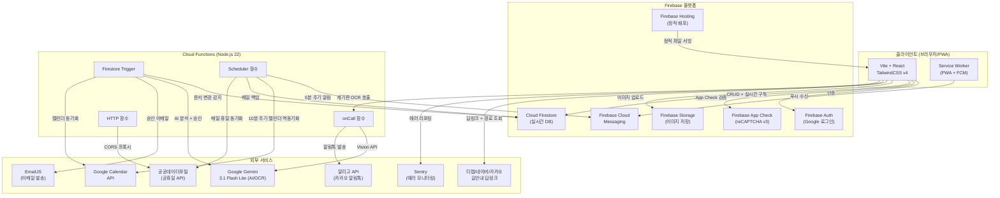
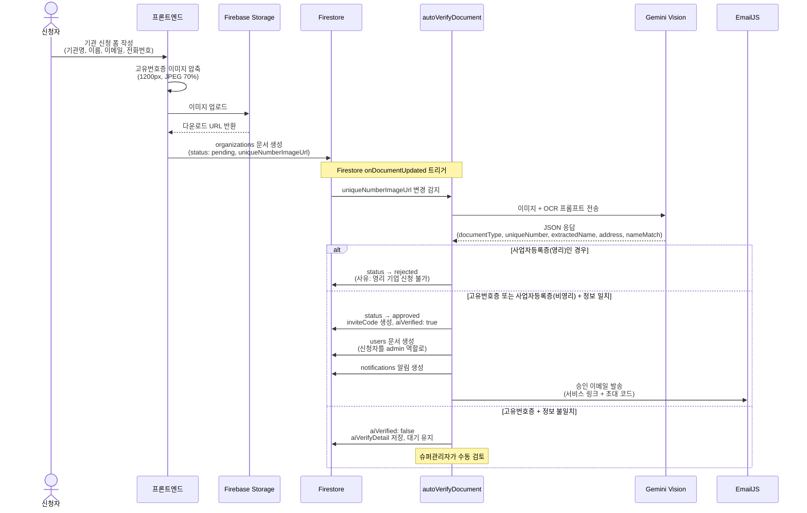
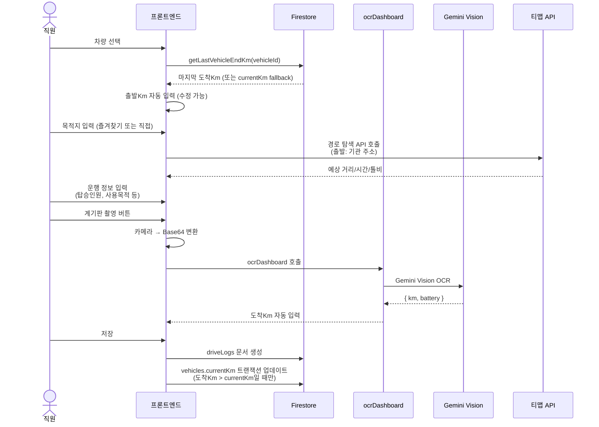
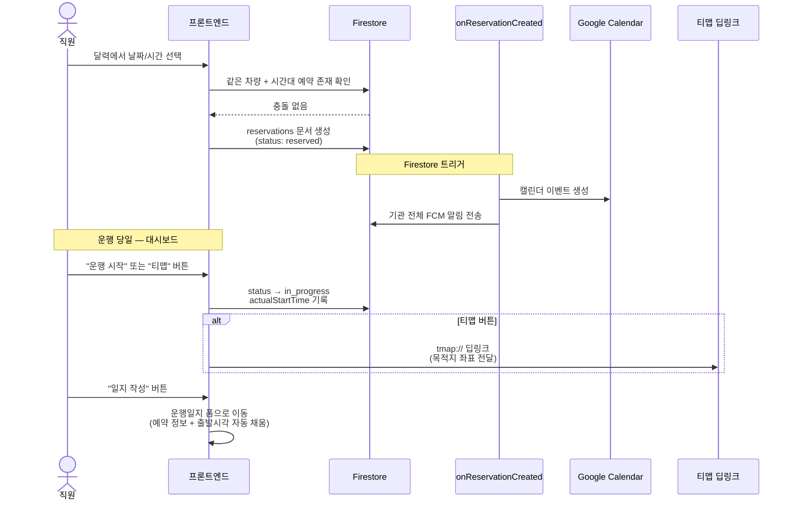
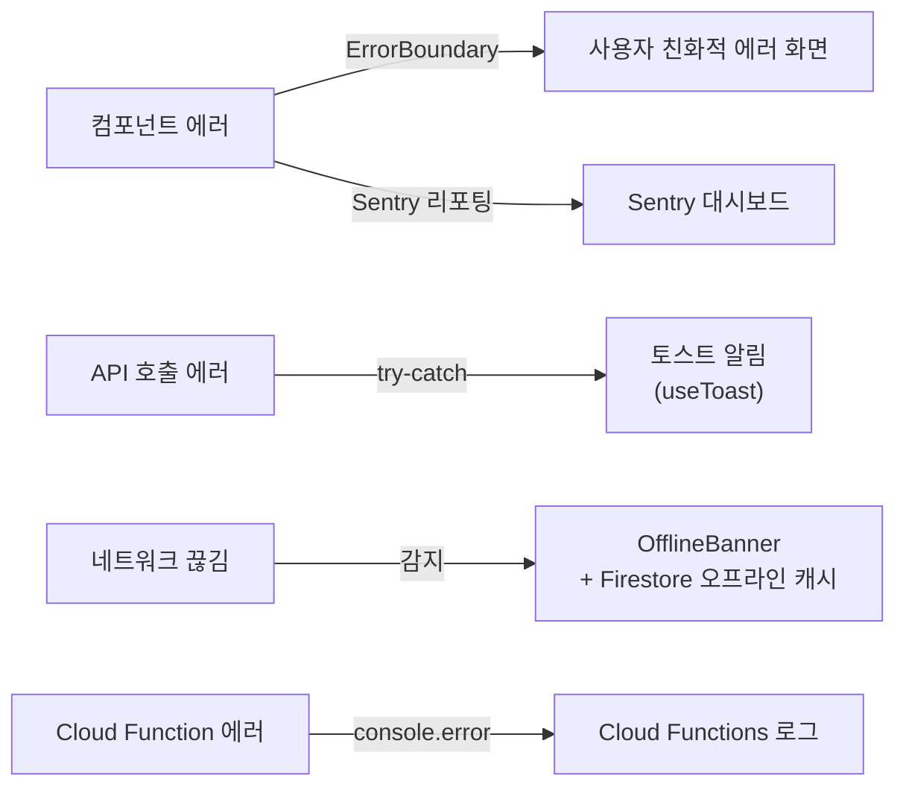

# 🚗 차량 운행일지 앱 — 구현 계획서

> **최종 업데이트**: 2026-07-04 | **전체 진행률**: Phase 1~58 완료 ✅ (테스트 신뢰성 강화 및 거대 훅 분해), 운영 로그 Phase 83까지 기록(65까지 배포 완료, 66~83 CI 배포) | 서비스 운영 중 (190개+ 기관)

---

## 1. 프로젝트 개요

본 프로젝트는 **사회복지기관 및 비영리단체**를 대상으로 **무료**로 제공되는 **차량 운행일지 웹 애플리케이션**입니다.  
차량 사용 기록 관리, 예약, 계기판 OCR 인식, 그리고 네이버, 카카오, 티맵을 활용한 길안내 딥링크 연동 등 다양한 편의 기능을 제공합니다.  
단, 일반 영리 기업(사업자등록증 보유 기관)은 서비스 이용 대상에서 제외되며, 가입 신청 시 반려될 수 있습니다.

---

## 2. 기술 스택

| 영역 | 기술 |
|------|------|
| **프론트엔드** | Vite + React + TypeScript |
| **상태 관리** | Zustand (글로벌 UI 상태: 테마, 폰트, Toast, 모달) |
| **스타일링** | TailwindCSS v4 (CSS-first `@theme`, 반응형, 다크 모드) |
| **언어** | TypeScript (프론트엔드 + Cloud Functions + 테스트 + 스크립트) |
| **인증** | Firebase Auth (Google 로그인 전용) |
| **보안** | Firebase App Check (reCAPTCHA v3) |
| **데이터베이스** | Cloud Firestore |
| **서버리스 함수** | Cloud Functions for Firebase (TypeScript ESM) |
| **호스팅** | Firebase Hosting |
| **AI/OCR** | Gemini 3.1 Flash Lite (정식 모델) (Cloud Functions 경유) |
| **외부 연동** | 네이버맵 / 카카오맵 / 티맵 딥링크 |

---

## 3. 시스템 아키텍처



### 데이터 흐름 요약

| 흐름 | 경로 |
|------|------|
| **인증** | 브라우저 → Firebase Auth (Google OAuth) → Firestore `users/` |
| **운행일지 작성** | 브라우저 → Firestore `driveLogs/` + `vehicles.currentKm` 트랜잭션 |
| **계기판 OCR** | 브라우저 → Cloud Function `ocrDashboard` → Gemini Vision → 브라우저 |
| **기관 신청** | 브라우저 → Storage (이미지) + Firestore `organizations/` → Cloud Function `autoVerifyDocument` (트리거) → Gemini + EmailJS |
| **예약 알림** | Cloud Function `reservationReminder` (스케줄) → FCM → Service Worker → 브라우저 |
| **캘린더 연동** | Firestore 예약 변경 → Cloud Function 트리거 → Google Calendar API ↔ 역동기화 |

---

## 4. 사용자 역할 및 권한

### 4.1 시스템 관리자 (`admin@example.com`)
- 특정 기관에 소속되지 않는 최상위 관리자입니다.
- 신규 기관의 사용 신청을 승인하거나 거절할 수 있습니다.
- 승인 시 신청자에게 서비스 링크와 초대 코드가 포함된 이메일을 발송합니다.
- 반려된 기관 신청 내역을 조회하고 삭제하여 관리합니다.
- 기관 목록을 관리하며, 기관명과 주소를 직접 편집할 수 있습니다.
- 특정 기관 삭제 시, 해당 기관에 소속된 관리자 및 직원의 계정을 일괄 삭제하여 즉시 로그인을 차단합니다.
- 기기에 구애받지 않는 반응형 웹 화면을 제공합니다.

### 4.2 기관관리자
- 소속 기관의 직원을 등록하고 관리할 수 있습니다.
- 기관의 차량 정보를 등록하고 관리합니다.
- 직원을 초대하기 위한 기관 전용 6자리 초대 코드를 발급합니다.
- 소속 직원이 작성한 운행일지를 조회, 수정, 출력 및 다운로드할 수 있습니다.
- 기관의 전체 차량 예약 내역을 관리합니다.
- 직원이 운행일지에 잘못 입력한 정보를 수정할 수 있는 권한이 있습니다.
- **관리자 화면 ↔ 직원 화면 간 자유로운 전환이 가능합니다.** (기관관리자 본인도 차량을 직접 운행하는 경우를 지원합니다.)
- PC 환경에 최적화된 반응형 웹 화면을 제공하며, 모바일 화면도 지원합니다.

### 4.3 기관직원
- 계기판 OCR 기능을 활용하여 손쉽게 운행일지를 작성할 수 있습니다.
- 본인이 작성한 운행일지 기록에 한해 수정이 가능합니다.
- 최근 1개월간의 차량별 이용 내역을 조회할 수 있습니다.
- 차량별 보험 정보를 조회할 수 있으며, 전화번호 터치 시 즉시 보험사로 통화가 연결됩니다.
- 달력 UI를 통해 차량을 예약할 수 있습니다.
- 길안내 앱 연동을 지원하여, 네이버 지도, 카카오내비, 티맵 중 선호하는 앱을 기본값으로 선택할 수 있습니다.
- 모바일 환경에 최적화된 화면을 제공하며, PC에서도 동일하게 작동합니다.

---

## 5. Firestore 데이터베이스 설계

### 5.1 컬렉션 구조

```
Firestore
├── organizations/                    ← 기관 정보
│   └── {orgId}
│       ├── name: string              (기관명)
│       ├── uniqueNumber: string      (고유번호, AI OCR로 사본에서 추출)
│       ├── status: string            (pending | approved | rejected)
│       ├── applicantName: string     (신청자 이름)
│       ├── applicantEmail: string    (신청자 이메일)
│       ├── applicantPhone: string    (신청자 전화번호)
│       ├── uniqueNumberImageUrl: string (고유번호증 사본 URL)
│       ├── aiVerified: boolean       (AI 문서유형+기관명 검증 통과 여부)
│       ├── aiVerifyDetail: object    ({documentType, numberMatch, nameMatch, extractedNumber, extractedName})
│       ├── inviteCode: string        (6자리 직원 초대 코드)
│       ├── address: string           (기관 주소, AI OCR로 사본에서 추출)
│       ├── approvalSignatures: array (결재란 항목 목록, 예: ['담당', '팀장', '관장'])
│       ├── createdAt: timestamp
│       ├── approvedAt: timestamp
│       ├── rejectedAt: timestamp
│       └── customHolidays/            ← 커스텀 휴일 (서브컬렉션)
│           └── {holidayId}
│               ├── name: string       (휴일명)
│               ├── date: string       (YYYY-MM-DD)
│               └── createdAt: timestamp
│
├── users/                            ← 사용자 정보
│   └── {uid}
│       ├── email: string
│       ├── name: string
│       ├── role: string              (superAdmin | admin | employee)
│       ├── organizationId: string
│       ├── phone: string
│       ├── disabled: boolean         (soft delete 비활성화 여부)
│       └── createdAt: timestamp
│
├── vehicles/                         ← 차량 목록
│   └── {vehicleId}
│       ├── displayName: string       (예: "소나타2744")
│       ├── modelName: string         (모델명)
│       ├── plateNumber: string       (차량번호)
│       ├── type: string              (compact | sedan | van | bus | truck)
│       ├── fuelType: string          (gasoline | diesel | lpg | electric)
│       ├── organizationId: string
│       ├── currentKm: number         (최신 누적Km 캐시)
│       ├── currentBattery: number    (전기차만, 현재 배터리 %)
│       ├── status: string            (active | retired, 기본값 active)
│       ├── retiredAt: timestamp      (퇴역 시점, status=retired일 때)
│       ├── hipassCardNumber: string  (선택, 하이패스 카드번호)
│       ├── googleCalendarId: string  (선택, 구글 캘린더 리소스 ID)
│       ├── insurance: object         (보험 정보, 선택)
│       │   ├── company: string       (보험사명, 예: "삼성화재")
│       │   └── phone: string         (보험사 전화번호, 예: "1588-5114")
│       └── createdAt: timestamp
│
├── driveLogs/                        ← 운행일지
│   └── {logId}
│       ├── timestamp: timestamp      (작성 시각)
│       ├── vehicleId: string
│       ├── vehicleDisplayName: string
│       ├── date: string              (운행 날짜, YYYY-MM-DD)
│       ├── departureTime: string     (출발시각, HH:mm)
│       ├── arrivalTime: string       (도착시각, HH:mm)
│       ├── driverUid: string
│       ├── driverName: string
│       ├── passengerCount: number    (탑승인원 수)
│       ├── passengerNames: array     (탑승자 이름 목록)
│       ├── destination: string       (목적지)
│       ├── purposeCategory: string   (가정방문|관공서|외부교육|물품운송|기타)
│       ├── purposeDetail: string     (상세 목적, 자유 텍스트)
│       ├── linkedLogId: string       (이전 운행 연결 ID, 다중 방문 시)
│       ├── departureKm: number       (출발Km)
│       ├── arrivalKm: number         (도착Km)
│       ├── fuelAmount: number        (주유/충전금액 — 신규 필드, energyCost 대체)
│       ├── energyCost: number        (내연기관: 주유금액 / 전기차: 충전금액, 레거시)
│       ├── departureBattery: number  (전기차만, 출발 배터리 %)
│       ├── arrivalBattery: number    (전기차만, 도착 배터리 %)
│       ├── note: string              (비고)
│       ├── organizationId: string
│       ├── reservationId: string     (연동된 예약 ID, 있으면)
│       └── createdAt: timestamp
│
├── reservations/                     ← 차량 예약
│   └── {reservationId}
│       ├── vehicleId: string
│       ├── vehicleDisplayName: string
│       ├── userId: string
│       ├── userName: string
│       ├── date: string              (YYYY-MM-DD)
│       ├── startTime: string         (HH:mm, 예약 시작)
│       ├── endTime: string           (HH:mm, 예약 종료)
│       ├── destination: string       (목적지)
│       ├── purpose: string           (용도)
│       ├── status: string            (reserved | in_progress | completed | cancelled)
│       ├── actualStartTime: string   (실제 출발 시각, HH:mm — 운행 시작 시 기록)
│       ├── organizationId: string
│       └── createdAt: timestamp
│
├── notifications/                    ← 앱 내 알림
│   └── {notificationId}
│       ├── targetUid: string         (수신자)
│       ├── type: string              (approval | rejection | info | reservation_reminder | drive_log_reminder | no_show_reminder)
│       ├── title: string
│       ├── message: string
│       ├── read: boolean
│       ├── organizationId: string
│       └── createdAt: timestamp
│
├── favorites/                        ← 자주 가는 목적지 (사용자별)
│   └── {favoriteId}
│       ├── userId: string
│       ├── name: string              (별칭, 예: "김OO 어르신 댁")
│       ├── address: string           (주소)
│       ├── organizationId: string
│       └── createdAt: timestamp
│
├── maintenanceRecords/               ← 차량 정비/수리 기록
│   └── {recordId}
│       ├── vehicleId: string
│       ├── vehicleName: string
│       ├── organizationId: string
│       ├── type: string              (정기점검|오일교환|타이어|수리|기타)
│       ├── date: string              (YYYY-MM-DD)
│       ├── cost: number              (비용)
│       ├── memo: string
│       ├── blockVehicle: boolean     (정비 중 차량 사용 차단 여부)
│       ├── maintenanceEndDate: string (정비 종료 예정일, YYYY-MM-DD)
│       └── createdAt: timestamp
│
├── fuelLogs/                         ← 주유/충전 기록
│   └── {fuelLogId}
│       ├── organizationId: string
│       ├── vehicleId: string
│       ├── vehicleName: string       (비정규화)
│       ├── driverUid: string
│       ├── driverName: string        (비정규화)
│       ├── date: string              (YYYY-MM-DD)
│       ├── meterReading: number      (주유 시 계기판 km)
│       ├── meterPhotoUrl: string     (선택, 계기판 사진 URL)
│       ├── fuelAmount: number        (주유량, 리터)
│       ├── fuelCost: number          (주유 금액, 원)
│       └── createdAt: timestamp
│
└── orgApplications/                  ← 기관 가입 신청
    └── {appId}
        ├── orgName: string
        ├── adminEmail: string
        ├── status: string            (pending|approved|rejected)
        ├── uniqueNumberImageUrl: string
        └── createdAt: timestamp
```

### 5.2 주요 설계 결정사항

| 결정 | 이유 |
|------|------|
| **결정론적 ID(Hash ID) 기반 운행일지 생성** | 오프라인 환경에서 네트워크 단절/복구 시 동일한 로그가 중복 생성되는 것(Idempotency)을 막고, 서버측 중복 체크 쿼리 비용을 절감하기 위해 `{vehicleId}_{uid}_{date}_{startKm}_{endKm}` 형태의 고정 ID를 사용해 `setDoc`을 수행합니다. |
| `vehicles.currentKm` 캐시 + 마지막 운행 endKm 조회 | 출발Km 자동 입력 시 `getLastVehicleEndKm()`로 최신 endKm 우선 사용, fallback으로 `currentKm` 사용 |
| 출발Km는 추천값, 수동 수정 가능 | 입력 순서가 뒤바뀌어도 문제없도록 |
| `currentKm` 갱신은 조건부 | 도착Km > currentKm일 때만 갱신 (뒤늦은 입력 대응) |
| `driveLogs`에 `vehicleDisplayName`, `driverName` 비정규화 | 목록 조회 시 JOIN 불필요 |
| `reservations`에 `userName`, `vehicleDisplayName` 비정규화 | 달력 표시 시 추가 쿼리 방지 |
| `inviteCode`를 organizations에 저장 | 기관 단위 1개 코드, 재발급 가능 |
| 기관 삭제 시 소속 사용자 일괄 삭제 | `writeBatch`로 원자적 처리, 삭제된 사용자는 로그인 불가 |
| 사용자 문서 실시간 감시 (`onSnapshot`) | 기관 삭제 시 새로고침 없이 즉시 차단 |
| 관리자 대시보드 훅 최적화 (상태 객체화) | 개별 useState 54개를 도메인별 4개 그룹 객체(summary, timeSeries, rankings, external)로 병합하여 대시보드 컴포넌트의 불필요한 리렌더링 차단 및 유지보수성 향상 |

---

## 6. 화면 구성

### 6.1 공통 화면
- 구글 계정을 이용한 로그인 화면
- 신규 직원을 위한 초대 코드 입력 화면
- 기관 가입 신청 후 결과를 기다리는 승인 대기 화면

### 6.2 시스템 관리자 화면 (반응형)
- 기관 신청 목록: 대기 중이거나 거절된 내역을 탭으로 구분하며, 신청 정보와 AI 검증 결과를 함께 표시합니다.
  - 승인 시: 신청자에게 감사 메시지, 서비스 링크, 기관관리자용 초대 코드를 이메일로 자동 발송합니다.
  - 거절 시: 거절 내역을 조회하거나 삭제할 수 있습니다.
- 기관 관리: 승인된 기관 목록을 조회하고, 기관명과 주소를 화면에서 직접(인라인) 편집할 수 있습니다.
- 사용자 피드백 관리: 사용자가 제출한 피드백 목록을 조회하고 처리 상태를 관리합니다.
- 알림 관리

### 6.3 공통 공개 페이지
- **FAQ 페이지** (`FAQPage.tsx`): 자주 묻는 질문을 아코디언 UI로 제공하며, 대시보드 우측에 배치됩니다.
- **업데이트 소식** (`ReleaseNotesPage.tsx`): 서비스의 주요 변경 이력을 사용자가 이해하기 쉽게 제공합니다.

### 6.4 기관관리자 화면 (반응형, PC 중심)
- **대시보드**: 당일 운행 현황과 전체 차량의 상태를 한눈에 요약하여 보여줍니다.
- **직원 관리**: 소속 직원 목록을 조회하고 기관 초대 코드를 관리합니다.
- **차량 관리**: 차량을 신규 등록, 수정, 삭제할 수 있으며, 보험사명과 전화번호 등 보험 정보를 등록합니다.
- **운행일지**: 직원이 작성한 운행일지를 조회, 검색, 수정하고 PDF나 Excel 형태로 출력할 수 있습니다.
- **차량 예약**: 달력 UI를 통해 차량 예약 현황을 확인하고 관리합니다.
- **설정**: 기관 정보(이메일, 전화번호 수정 가능), 결재란 항목, 공휴일, 푸시 알림, 다크 모드 등을 설정할 수 있습니다. (단, 기관명과 주소는 읽기 전용입니다.)

### 6.5 기관직원 화면 (모바일 최적화)
- **오늘 대시보드 (메인)**: 당일 본인의 예약 목록과 '운행 시작', '길안내' 버튼을 제공합니다. 예약이 없을 경우 안내 문구를 표시하며, 운행 중에는 다른 시작 버튼이 비활성화되는 **동시 운행 제한** 기능이 적용됩니다.
- **운행일지 작성**: 계기판 OCR, 목적지 프리셋, 동승자 선택, 다중 방문을 위한 '이어서 기록' 등 운행일지 입력을 위한 다양한 편의 기능을 제공하는 폼입니다.
- **즐겨찾기**: 자주 방문하는 목적지를 등록하고 선택할 수 있습니다.
- **내 기록**: 본인이 작성한 운행 기록 목록을 확인하고 수정할 수 있으며, 미완료된 기록이 있을 경우 알림을 제공합니다.
- **차량 이용 내역**: 특정 차량의 최근 1개월간 이용 내역을 검색할 수 있습니다.
- **차량 보험 정보**: 차량별 보험사 이름과 전화번호를 제공하며, 전화번호 터치 시 즉시 전화가 연결됩니다.
- **차량 예약**: 달력 기반으로 차량을 예약(목적지 및 용도 입력)하거나 취소할 수 있으며, 현재 시각 기준 미래 일정만 예약 가능합니다.
- **예약 없는 운행**: 예약 없이 대시보드 하단에서 즉시 운행을 시작할 수 있습니다. (운행 중에는 해당 카드가 숨겨집니다.)
- **길안내 연동**: 예약 카드 내 길안내 버튼 클릭 시, 설정된 기본 앱(네이버 지도, 카카오내비, 티맵)을 통해 길안내를 시작합니다.
- **더보기**: 기본 길안내 앱 변경, 화면 글자 크기 조절(소/중/대), 다크 모드, 알림 수신 여부 등을 설정할 수 있습니다.

---

## 7. 핵심 기능 상세

### 7.1 기관 신청 및 승인 프로세스

```
기관 대표 → 신청 폼 작성
  (이름, 기관명, 고유번호증 사본, 이메일, 전화번호)
      ↓
프론트: 이미지 업로드 → Firestore에 uniqueNumberImageUrl 저장
      ↓
Cloud Function(autoVerifyDocument) 자동 트리거 (Firestore onDocumentUpdated)
  → Gemini Vision으로 사본 OCR (서버사이드)
  → 검증 단계:
    ① 문서 유형 판별 (3분류):
       - 고유번호증 → 다음 단계 진행
       - 사업자등록증(비영리) → 다음 단계 진행 (비영리사단법인, 사회복지법인 등)
       - 사업자등록증(영리) → 중간 자리 '82'인 경우에 한하여 비영리로 취급하여 다음 단계 진행. 그 외는 즉시 자동 거부 (영리 기업 신청 불가)
    ② 고유번호/사업자번호 추출 → organizations.uniqueNumber에 저장
    ③ 기관명(단체명) 추출 → 입력된 기관명과 비교
    ④ 기관 주소 추출 → organizations.address에 저장
      ↓
모두 일치 → organizations.aiVerified = true → ✅ 자동 승인
  - status = "approved", inviteCode 생성
  - 알림 생성 + 승인 이메일 발송 (@emailjs/nodejs, 서버사이드)
  - 사용자 organizationStatus = "approved"로 등록
일부 불일치 → organizations.aiVerified = false, aiVerifyDetail 저장
  → ⏳ 대기중(pending) 유지 → 슈퍼관리자 수동 검토
사업자등록증(영리) → 자동 거부 (rejected)
AI 분석 실패 → 대기중 유지 (관리자가 수동으로 AI 재분석 또는 직접 승인)
      ↓
슈퍼관리자 수동 승인 시:
  - 승인 이메일 발송 (프론트 EmailJS, 실패 시 alert으로 관리자에게 알림)
  - 수동 거절 시 알림 생성
```

> ⚡ **핵심 구조**: 프론트는 이미지 URL 저장만 담당, AI 분석 + 자동 승인 + 이메일 발송은 모두 Cloud Function이 처리

### 7.2 직원 등록 프로세스

```
기관관리자 → 직원 목록에 이름/이메일 사전 등록
        → 기관 초대 코드를 직원에게 공유
             ↓
직원 → 구글 로그인 → 초대 코드 입력
     → 코드 검증 → 기관에 연결 (role: employee)
     → 사전 등록된 이메일과 매칭되면 이름 자동 설정
```

### 7.3 운행일지 작성 (직원)

```
차량 선택 → 출발 Km 추천값 표시 (getLastVehicleEndKm()로 최신 endKm 우선, fallback: vehicles.currentKm, 수동 수정 가능)
         → 전기차인 경우: 출발 배터리 % 입력 (수동 또는 OCR)
         → 목적지 입력 (즐겨찾기에서 선택 또는 직접 입력, 저장 가능)
         → 사용목적 (프리셋 선택 + 상세 내용 자유 입력)
            프리셋: 가정방문 | 관공서 | 외부교육 | 물품운송 | 기타
         → 예약 연동 시 자동 채움
         → 탑승인원 (숫자 + 직원 목록에서 선택 또는 직접 입력)
         → 운행 후 도착 시:
            → 계기판 사진 촬영
            → Gemini Vision OCR → 누적Km 추출 (전기차는 배터리%도 추출)
            → (사진은 저장하지 않음)
         → 도착시각 입력
         → 차량 연료 유형에 따라:
            → 내연기관(LPG/휘발유/경유/하이브리드): "주유금액" 입력
            → 전기차: "충전금액" + "도착 배터리%" 입력
         → 비고 입력
         → 저장 시 도착Km > currentKm이면 vehicles.currentKm 트랜잭션 업데이트
         → 전기차는 vehicles.currentBattery도 조건부 업데이트

[이어서 기록] (하루 다중 방문 시)
이전 기록의 도착지 → 다음 기록의 출발지로 자동 연결
         → 출발Km = 이전 도착Km 자동 입력
         → 나머지는 일반 모드와 동일
```

### 7.4 차량 예약

```
달력 UI → 날짜 선택 → 시간대별 예약 현황 표시
       → 예약은 시간 기준으로 미래만 가능:
          - 과거 날짜: 예약 불가 (+ 예약 버튼 미표시)
          - 오늘 날짜: 현재 시각 이후만 예약 가능 (시작 시간 자동 설정)
          - 미래 날짜: 자유롭게 예약
       → 오늘 선택 시 시작 시간이 30분 단위 올림으로 자동 설정
       → 예약 시 차량, 시작/종료 시간, 용도, 목적지 입력
       → 다일 예약(연속) 및 요일 기반 반복 예약(휴일 제외, 시작/종료일 지정) 동시 생성 지원
       → 겹치는 시간 있으면 차단 (생성 불가)
       → 취소: 본인 또는 관리자만 가능
       → 같은 기관 직원 간 예약 상호 조회 가능
       → 예약 → 운행일지 작성 시 자동 연동
       → 차량에 googleCalendarId가 있으면:
          → 예약 생성 시 구글 캘린더에 일정 자동 추가
          → 예약 취소 시 구글 캘린더 일정 자동 삭제

[운행 시작 워크플로우]
예약 카드에서:
  1. "운행 시작" 버튼 클릭
     → 예약 상태: reserved → in_progress
     → 현재 시각을 actualStartTime으로 Firestore에 기록
     → 페이지 이동 없이 현재 화면 유지
     → 버튼이 "🚗 운행 중" 뱃지 + "일지 작성" 버튼으로 변경
  2. "티맵" 버튼 클릭
     → 위 1번과 동일한 상태 변경 수행
     → + 티맵 앱 딥링크로 실행 (목적지 자동 입력)
  3. "일지 작성" 버튼 클릭 (운행 중 상태)
     → 운행일지 작성 페이지로 이동 (예약 정보 + actualStartTime 전달)
```

#### 7.4.1 원클릭 예약 추천 (스마트 패턴 분석)

사용자의 이전 예약 기록을 통계적으로 분석하여 다가올 일정을 예측하고, 이를 바탕으로 원클릭 추천 배너를 제공합니다.

1. **데이터 추출**: 해당 사용자의 최근 차량 예약 기록 30건을 조회합니다.
2. **패턴 검증**: `요일 + 시간 + 차량 + 목적지` 조합의 빈도를 분석합니다. 동일한 패턴이 3회 이상 발견될 경우, 해당 요일과 시각을 다음 예약일로 예측합니다.
3. **가용성 확인 및 차선책 제공 (Smart Alternative)**: 
   - 추천된 시간에 사용자가 이미 다른 일정을 예약해 둔 경우, 최대 10주 앞까지 탐색하여 겹치지 않는 일정으로 미룹니다.
   - 1순위로 추천된 차량이 이미 예약 마감된 상태라면, **평소 자주 이용하던 다른 가용 차량 중 가장 이용 빈도가 높은 차량을 자동으로 찾아** 대체 차량으로 추천합니다.
4. **빠른 예약 지원**: **대시보드 하단에 단일 박스 형태의 리스트 UI로 추천 내역을 노출**합니다. 우측의 '예약' 버튼을 클릭하면, 분석된 정보(`prefillPattern`)가 중복되지 않는 가장 빠른 날짜로 예약 폼에 자동 입력되어 진입합니다.

### 7.5 길안내 앱 연동 (네이버/카카오/티맵)

```
[더보기에서 기본 앱 선택]
  → localStorage에 preferred-nav-app 저장 (naver | kakao | tmap)
  → 기본값: naver (네이버맵만 다중 경유지 지원)

[예약 카드에서 길안내 버튼]
  → 🗺️ 버튼 클릭 → 설정된 기본 앱으로 길안내 시작
  → 네이버: nmap:// 딥링크 (경유지 자동 설정)
  → 카카오: kakaomap:// 딥링크
  → 티맵: tmap:// 딥링크 (목적지 자동 입력)
  → 목적지가 없으면 앱만 실행
  → PC에서는 딥링크가 동작하지 않을 수 있음 (모바일 전용)

[운행일지 작성 화면에서]
   → 목적지 입력 시 티맵 경로 탐색 API 호출 (출발지: 기관 주소)
   → 다중 목적지 지원: 쉼표(,)로 구분하여 최대 5곳 입력 가능
   → 다중 경로: 출발지→목적지1→목적지2→...→출발지 순환 경로 합산
   → 예상 거리(km), 예상 시간, 예상 톨비 표시
   → 톨비가 있는 경로: ▼ 펼치기로 무통행료(무료도로) 경로 거리/시간 비교 가능
   → 길안내 버튼 → 설정된 기본 앱으로 딥링크 열기 (경유지 자동 설정)
   → PC에서는 딥링크 대신 경로 정보만 표시
```

### 7.6 계기판 OCR

```
직원 화면에서 "계기판 촬영" 버튼
  → 카메라로 사진 촬영 (input type="file" capture="environment")
  → 이미지를 Base64로 변환
  → Cloud Functions 호출 → Gemini Vision API에 전달
  → 프롬프트: "이 계기판 사진에서 누적 주행거리(총 Km)를 숫자만 추출해주세요"
  → 반환된 숫자를 도착Km 필드에 자동 입력
  → 이미지는 서버/스토리지에 저장하지 않음
```

### 7.7 구글 캘린더 연동

차량 예약 일정을 Google Calendar와 자동으로 동기화하는 기능입니다. 관리자가 개별 차량에 구글 캘린더를 연결해 두면, 앱 내에서의 예약 변경 사항이 캘린더에 실시간으로 반영됩니다.

#### 관리자 설정

```
차량 관리 → 차량 수정 → Google Calendar ID 입력
  → vehicles.googleCalendarId에 저장
  → 해당 차량의 예약부터 캘린더 연동 활성화
```

> ⚡ `googleCalendarId`가 비어있는 차량은 캘린더 연동을 건너뜁니다.

#### 정방향 동기화 (예약 → Google Calendar)

```
[예약 생성] Firestore onDocumentCreated 트리거
  → calendarSync.js: 해당 차량의 googleCalendarId 확인
  → Google Calendar API: events.insert()
     - summary: "🚗 차량명 - 예약자명"
     - description: "목적지: OOO / 목적: OOO"
     - start/end: 예약 시작~종료 시간 (KST)
  → 생성된 calendarEventId를 reservations 문서에 저장

[예약 수정] Firestore onDocumentUpdated 트리거
  → calendarSync.js: calendarEventId로 기존 일정 검색
  → Google Calendar API: events.update()
  → 시간/목적지/목적 변경 반영

[예약 취소] Firestore onDocumentUpdated 트리거 (status → cancelled)
  → calendarSync.js: calendarEventId로 일정 삭제
  → Google Calendar API: events.delete()

[예약 삭제] Firestore onDocumentDeleted 트리거
  → calendarSync.js: calendarEventId로 일정 삭제
```

#### 역방향 동기화 (Google Calendar → 예약)

```
syncCalendarToApp (10분 주기 스케줄 함수)
  → googleCalendarId가 설정된 모든 차량 조회
  → Google Calendar API: events.list() (향후 7일 범위)
  → 캘린더 이벤트 중 앱에 없는 일정:
     → Firestore reservations에 새 예약 문서 생성
     → source: 'google_calendar' 표시
  → 앱 예약 중 캘린더에서 삭제된 일정:
     → Firestore 예약 상태를 cancelled로 변경
  → ReservationSidePanel에 "📅 캘린더" 출처 뱃지 표시
```

#### 에러 처리

| 상황 | 처리 |
|------|------|
| Google Calendar API 장애 | 예약 자체는 정상 저장, 캘린더 동기화 실패 로그 기록 |
| calendarEventId 누락 | 역동기화 시 매칭 불가 → 새 이벤트로 생성 |
| 인증 토큰 만료 | Cloud Function에서 서비스 계정 재인증 |
| 중복 이벤트 감지 (시간 충돌) | 같은 차량 + 같은 시간대 이벤트 → 생성 건너뛰기 |
| 중복 이벤트 감지 (동일 일정) | 같은 `calendarEventId`가 기관 내 여러 차량에 연동된 경우 → 첫 번째 차량에만 생성하고 나머지는 건너뛰기 |

#### 7.7.5 향후 계획: 개인 캘린더 연동 (Google OAuth 2.0)

현재 적용된 공용 서비스 계정(Service Account) 연동 방식에서 나아가, 개별 사용자의 개인 캘린더에 직접 일정을 연동할 수 있도록 시스템 확장을 계획하고 있습니다.

*   **권한 동의**: 앱 내에서 "Google 캘린더 개인 연동" 버튼을 클릭하면 구글의 OAuth 2.0 동의 화면(Consent Screen)이 호출됩니다.
*   **토큰 보관**: 인증 후 발급된 Access Token과 Refresh Token은 Firestore의 개별 사용자 프로필(`users/{uid}`) 내부에 안전하게 저장됩니다.
*   **이벤트 생성 주체**: 사용자가 차량을 예약할 때 공용 서비스 계정이 아닌 사용자 본인의 Access Token을 사용하여, 개인 캘린더에 직접 예약 이벤트를 생성합니다.
*   **오프라인 갱신**: Access Token이 만료될 경우, 시스템이 보관 중인 Refresh Token을 활용하여 자동으로 Access Token을 재발급받습니다.
*   **정책 심사**: Google Calendar API의 민감한 권한 범위를 사용하므로, 프로덕션 배포 전 Google Cloud Console을 통한 OAuth 동의 화면 심사 및 승인이 필수적으로 요구됩니다.

---

## 8. Cloud Functions API 명세

> 💡 **안내**: 최신 API 명세는 빌드 과정에서 `scripts/generate-functions-doc.ts` 스크립트를 통해 `docs/FUNCTIONS_REFERENCE.md` 문서로 자동 생성 및 갱신됩니다. 상세 파라미터 및 반환값은 해당 문서를 참조하세요.

### 8.1 호출형 함수 (onCall)

| 함수명 | 파일 | 리전 | 인증 | 입력 | 출력 | 타임아웃 | 메모리 |
|--------|------|------|------|------|------|----------|--------|
| `ocrDashboard` | `ocrDashboard.ts` | asia-northeast3 | ✅ 필수 | `{ imageBase64, mimeType, isElectric }` | `{ km: number\|null, battery: number\|null, raw: string }` | 60초 | 512MiB |
| `createReservationSafe` | `createReservationSafe.ts` | asia-northeast3 | ✅ 필수 | `{ vehicleId, date, startTime, endTime, ... }` | `{ reservationId }` | 30초 | 256MiB |
| `sendAdminNotice` | `sendAdminNotice.ts` | asia-northeast3 | ✅ 필수 (admin) | `{ title, message }` | `{ success: boolean }` | 30초 | 256MiB |
| `calendarSchedule` | `calendarSchedule.ts` | asia-northeast3 | ✅ 필수 (admin) | `{ vehicleId, calendarId }` | `{ events: array }` | 60초 | 256MiB |
| `disableUser` | `disableUser.ts` | asia-northeast3 | ✅ 필수 (superAdmin) | `{ uid }` | `{ success: boolean }` | 30초 | 256MiB |
| `restoreUser` | `restoreUser.ts` | asia-northeast3 | ✅ 필수 (superAdmin) | `{ email, name, organizationId }` | `{ uid, success: boolean }` | 30초 | 256MiB |
| `joinOrganization` | `joinOrganization.ts` | asia-northeast3 | ✅ 필수 | `{ code }` | `{ success, orgId, orgName, role }` | 30초 | 256MiB |
| `sendBulkReminder` | `index.ts` | asia-northeast3 | ✅ 필수 (superAdmin) | — | `{ sentCount, failCount, noPhoneCount, results }` | 120초 | 256MiB |
| `askAI` | `askAI.ts` | asia-northeast3 | ✅ 필수 | `{ question: string }` | `{ answer: string }` | 30초 | 256MiB |

### 8.2 Firestore 트리거 함수

| 함수명 | 파일 | 트리거 | 감시 경로 | 동작 |
|--------|------|--------|-----------|------|
| `autoVerifyDocument` | `autoVerifyDocument.ts` | `onDocumentUpdated` | `organizations/{orgId}` | `uniqueNumberImageUrl` 추가 시 Gemini OCR → 문서유형 판별 → 자동 승인/거절 → 이메일 발송 |
| `notifyNewApplication` | `notifyNewApplication.ts` | `onDocumentCreated` | `organizations/{orgId}` | 신규 기관 신청 시 시스템 관리자에게 FCM 푸시 알림 전송 |
| `onReservationCreated` | `reservationTriggers.ts` | `onDocumentCreated` | `reservations/{id}` | 구글 캘린더 이벤트 생성 + 기관 전체 FCM 알림 |
| `onReservationUpdated` | `reservationTriggers.ts` | `onDocumentUpdated` | `reservations/{id}` | 예약 취소 시 캘린더 이벤트 삭제, 수정 시 이벤트 업데이트 |
| `onReservationDeleted` | `reservationTriggers.ts` | `onDocumentDeleted` | `reservations/{id}` | 캘린더 이벤트 삭제 |
| `setCustomClaims` | `setCustomClaims.ts` | `onDocumentWritten` | `users/{uid}` | 사용자 role/orgId 변경 시 Firebase Auth Custom Claims 자동 동기화 |

### 8.3 스케줄 함수

| 함수명 | 파일 | 실행 주기 | 시간대 | 재시도 | 동작 |
|--------|------|-----------|--------|--------|------|
| `reservationReminder` | `reservationReminder.ts` | 5분마다 | KST | 0회 | ① 예약 시작 10분 전 FCM+인앱 알림 ② 운행 종료 후 일지 미작성 FCM+인앱 알림 ③ 미출발(No-show) 15분 경과 FCM+인앱 알림 |
| `syncCalendarToApp` | `index.ts` | 10분마다 | KST | 1회 | Google Calendar → Firestore 예약 역동기화 (7일 범위) |
| `backupFirestore` | `backupFirestore.ts` | 매일 03:00 KST | KST | 1회 | Firestore 전체 컨렉션 → GCS `backups/firestore/YYYY-MM-DD/` |
| `autoPurgeOrgs` | `autoPurgeOrgs.ts` | 매일 04:00 KST | KST | 1회 | soft delete 후 30일 경과한 기관 + 소속 사용자 일괄 영구 삭제 |
| `archiveDriveLogs` | `archiveDriveLogs.ts` | 매일 04:30 KST | KST | 1회 | 3년+ 오래된 운행 기록 → GCS 아카이빙 후 Firestore 삭제 |
| `syncHolidaysScheduled` | `syncHolidays.ts` | 매일 06:00 KST | KST | 3회 | 공공데이터포털 공휴일 API → Firestore `system/holidays` 캐시 |
| `cleanupCertificateImages` | `cleanupCertificateImages.ts` | 매일 04:00 KST | KST | 1회 | 승인 30일 경과 기관의 고유번호증 이미지 Storage 삭제 + URL 초기화 |

### 8.4 HTTP 함수

| 함수명 | 파일 | 리전 | CORS | 입력 (쿼리) | 출력 |
|--------|------|------|------|------------|------|
| `holidayProxy` | `holidayProxy.ts` | asia-northeast3 | ✅ | `?solYear=2026&numOfRows=50` | 공공데이터포털 응답 JSON 그대로 전달 |
| `tmapProxy` | `tmapProxy.ts` | asia-northeast3 | ✅ | `{ startX, startY, endX, endY, startName, endName }` | 티맵 경로 탐색 결과 (거리/시간/톨비) |
| `warmupOcr` | `warmupOcr.ts` | asia-northeast3 | — | 스케줄 호출 | OCR 함수 콜드 스타트 방지용 웜업 |

### 8.5 에러 코드

| 함수 | 에러 코드 | 의미 |
|------|----------|------|
| `ocrDashboard` | `unauthenticated` | 로그인 필요 |
| `ocrDashboard` | `invalid-argument` | 이미지 데이터 누락 |
| `ocrDashboard` | `internal` | Gemini API 호출 실패 |
| `holidayProxy` | `400` | `solYear` 파라미터 누락 |
| `holidayProxy` | `500` | 공공데이터포털 API 호출 실패 |

---

## 9. 핵심 프로세스 시퀀스 다이어그램

### 9.1 기관 신청 → AI 자동 승인



### 9.2 운행일지 작성



### 9.3 차량 예약 → 운행 시작



---

## 10. 보안 규칙

### Firestore Security Rules 핵심 원칙

```text
1. 시스템 관리자 (슈퍼관리자): 전체 기관(organizations)의 데이터에 대한 읽기 및 쓰기 권한 보유
2. 기관관리자: 본인이 소속된 기관의 데이터에 한정하여 읽기 및 쓰기 권한 보유
3. 기관직원: 본인이 소속된 기관의 데이터는 읽을 수 있으나, 쓰기 및 수정은 본인이 작성한 기록에 한정
4. 데이터 격리: organizationId를 기준으로 각 기관 간의 데이터 접근을 완벽하게 차단
5. 가입 대기 제한: 승인 대기(pending) 상태의 기관은 운행일지, 차량 예약, 차량 정보 컬렉션에 접근 불가
```

### Storage Security Rules

- Firebase 인증을 통과한 사용자(익명 로그인 포함)에 한해 파일 업로드를 허용합니다.
- 기관 가입 시 제출하는 고유번호증 등의 증빙 이미지는 `organizations/{orgId}/` 경로에 엄격히 분리하여 저장합니다.

---

## 11. 에러 처리 전략

### 11.1 에러 처리 계층



### 11.2 에러 처리 테이블

| 상황 | 컴포넌트/함수 | 처리 |
|------|-------------|------|
| **OCR 인식 실패** | `DriveLogForm` | 안내 메시지 + "수동 입력하기" 포커스 버튼, 오류 제보 기능 |
| **고유번호증 분석 실패** | `autoVerifyDocument` | 대기(pending) 유지, 관리자 수동 검토. AI 재분석 버튼 제공, 수동 승인 시 관리자에게 alert |
| **FCM 토큰 만료** | `sendPushToUser` | `messaging/registration-token-not-registered` 에러 시 토큰 자동 삭제 |
| **네트워크 오프라인** | `OfflineBanner` + Firestore 캐시 | 오프라인 안내 표시, `persistentLocalCache`로 로컬 작업 가능, 복구 시 자동 동기화 |
| **외부 API 장애** (티맵, 공휴일) | `try-catch` | 경로 정보 미표시, 캐시된 휴일 데이터 사용 |

### 11.3 모니터링 체계

| 도구 | 대상 | 확인 방법 |
|------|------|-----------| 
| **Sentry** | 프론트엔드 런타임 에러, **App Check 검증 실패 로그** | Sentry 대시보드 (자동 알림) |
| **Cloud Functions 로그** | 서버사이드 에러 | `firebase functions:log` 또는 `/logs` 워크플로우 |
| **Firebase Console** | Firestore 사용량, Auth 활성 사용자 | Google Cloud Console |

#### Sentry 에러 로깅 및 필터링 정책
- **기본 방침**: 무해한 환경 오류(단순 네트워크 끊김, 브라우저 확장 프로그램 충돌 등)는 Sentry 전송을 억제(`ignoreErrors`)하여 노이즈를 줄입니다.
- **App Check 모니터링 강화**: Firebase App Check 연동 중 발생하는 "잘못된 요청(Invalid requests)"의 클라이언트 환경(인앱 브라우저, 광고 차단기, 네트워크 타임아웃 등)을 파악하기 위해, **임시적으로 App Check 및 reCAPTCHA 관련 에러의 Sentry 필터링을 해제**하여 실사용자 로그를 적극 수집/분석하고 있습니다.

---

## 12. 배포 및 환경 구성

### 12.1 런타임 요구사항

| 항목 | 요구사항 | 비고 |
|------|----------|------|
| **Node.js** | v22 LTS 필수 | `fnm use 22` 사용. Node 24에서는 Rollup 스택 오버플로우 발생 |
| **패키지 매니저** | npm | `package-lock.json` 사용 |
| **Firebase CLI** | 최신 버전 | `firebase deploy` 명령 |

### 12.2 환경변수

#### 프론트엔드 (`.env`)

| 키 | 용도 |
|----|------|
| `VITE_FIREBASE_*` (7개) | Firebase SDK 설정 |
| `VITE_EMAILJS_*` (3개) | EmailJS 브라우저 발송 (수동 승인) |
| `VITE_TMAP_APP_KEY` | 티맵 경로 탐색 API |
| `VITE_HOLIDAY_API_KEY` | 공휴일 API (개발용) |
| `VITE_SENTRY_DSN` | Sentry 에러 모니터링 |
| `VITE_RECAPTCHA_ENTERPRISE_SITE_KEY` | App Check reCAPTCHA Enterprise 사이트 키 |
| `VITE_APPCHECK_DEBUG_TOKEN` | App Check 개발용 디버그 토큰 |
| `VITE_FCM_VAPID_KEY` | FCM 푸시 알림 |

#### Cloud Functions (`functions/.env`)

| 키 | 용도 |
|----|------|
| `GEMINI_API_KEY` | Gemini AI API (OCR + 문서 분석) |
| `EMAILJS_PRIVATE_KEY` | EmailJS 서버사이드 발송 (자동 승인) |
| `HOLIDAY_API_KEY` | 공공데이터포털 공휴일 API |

### 12.3 배포 명령

```bash
# 전체 배포 (프론트 + Functions + Rules)
fnm use 22 → npm run build → firebase deploy

# Cloud Functions만 배포
firebase deploy --only functions

# 보안 규칙만 배포
firebase deploy --only firestore:rules,storage
```

### 12.4 서비스 URL

| 환경 | URL |
|------|-----|
| 프로덕션 | `https://vehicle-drive-log.web.app` |
| 개발 서버 | `http://localhost:5173` (Vite dev server) |

---

## 13. 프로젝트 디렉토리 구조

```
d:\apps\차량운행일지\
├── public/
│   ├── firebase-messaging-sw.js         FCM Service Worker
│   ├── manifest.json                    PWA 매니페스트
│   └── icons/                           앱 아이콘
├── src/
│   ├── App.tsx                       ← 역할별 라우팅 + 비로그인 시 랜딩 페이지
│   ├── index.css                     ← TailwindCSS + 커스텀 스타일
│   ├── main.tsx                      ← 앱 진입점 (Sentry 초기화)
│   ├── components/
│   │   ├── auth/                     ← 인증 관련
│   │   │   ├── LandingPage.tsx           서비스 소개 랜딩 (비로그인 첫 화면, 3단계 안내 + 주요 기능 6카드 + 부가 기능 칩)
│   │   │   ├── LoginPage.tsx             구글 로그인 화면
│   │   │   ├── FAQPage.tsx              자주 묻는 질문 (FAQ) 페이지
│   │   │   ├── ReleaseNotesPage.tsx      업데이트 소식 페이지
│   │   │   ├── InviteCodePage.tsx        초대 코드 입력 (신규 직원/관리자)
│   │   │   ├── OrgApplicationPage.tsx    기관 신청 폼
│   │   │   ├── PendingApprovalPage.tsx   승인 대기 화면
│   │   │   ├── PrivacyPage.tsx           개인정보 처리방침 페이지
│   │   │   └── TermsPage.tsx             이용약관 페이지
│   │   ├── superAdmin/               ← 시스템 관리자 화면
│   │   │   ├── SuperAdminLayout.tsx       레이아웃 + 사이드바 (배지 카운트 포함)
│   │   │   ├── ServiceDashboard.tsx       서비스 운영 대시보드 (통계/지표)
│   │   │   ├── OrgApplicationList.tsx     기관 신청 목록 (대기/거절 탭)
│   │   │   ├── OrgAppCard.tsx             기관 신청 카드 (모바일 반응형)
│   │   │   ├── OrgCard.tsx                승인된 기관 카드 (기관명·주소 인라인 편집, 사용자 복원)
│   │   │   ├── DeletedOrgCard.tsx          삭제된 기관 카드 (복구/영구삭제)
│   │   │   ├── OrgManagement.tsx          기관 관리 (활성/삭제된 기관 탭, 복구/영구삭제)
│   │   │   ├── OrgMapView.tsx             기관 위치 지도 (Leaflet + OpenStreetMap, 좌표 수정)
│   │   │   ├── SuperAdminManager.tsx      시스템 관리자 관리 기능
│   │   │   ├── FeedbackManagement.tsx     사용자 피드백 관리
│   │   │   └── OcrTestPage.tsx            OCR 테스트/오류 신고 관리
│   │   │   [신규 Phase 43]
│   │   │   (변경 없음)
│   │   ├── admin/                    ← 기관관리자 화면
│   │   │   ├── AdminLayout.tsx            레이아웃 + 사이드바 + 직원 화면 전환
│   │   │   ├── AdminDashboard.tsx         관리자 대시보드 (통계 + 온보딩 위자드 + Empty State 개선)
│   │   │   ├── AdminNotice.tsx            관리자 공지 작성/전송 (FCM 푸시)
│   │   │   ├── AdminOnboardingWizard.tsx  관리자 온보딩 4단계 가이드 (차량→직원→초대코드→완료)
│   │   │   ├── AnalyticsDashboard.tsx     고도화 분석 대시보드 (트렌드 + 비용 최적화 탭)
│   │   │   ├── TrendCharts.tsx            트렌드 분석 차트 (월별 추이/직원 비교/가동률/히트맵)
│   │   │   ├── CostOptimization.tsx       비용 최적화 분석 (연료 효율/정비비/비정상 탐지/추천)
│   │   │   ├── EmployeeManager.tsx        직원 관리 CRUD
│   │   │   ├── VehicleManager.tsx         차량 관리 CRUD (퇴역/복귀 포함)
│   │   │   ├── VehicleForm.tsx            차량 등록/수정 폼 (모달, 하이패스 카드번호 포함)
│   │   │   ├── FuelLogManager.tsx         관리자용 주유 기록 조회/관리
│   │   │   ├── HipassChargeLogManager.tsx 하이패스 충전 기록 조회/관리/통계
│   │   │   ├── HipassManager.tsx          하이패스 카드 관리
│   │   │   ├── DailyLogView.tsx           일별일지 뷰 (날짜+차량 기준)
│   │   │   ├── LogManager.tsx             통합 로그 관리
│   │   │   ├── DriveLogList.tsx           운행일지 조회/검색/수정
│   │   │   ├── MonthlyReport.tsx          운행 통계 보고서 (차트 UI)
│   │   │   ├── ReportCharts.tsx           통계 보고서 차트 컴포넌트 (Recharts, 비용 추이 AreaChart 포함)
│   │   │   ├── ReportTables.tsx           통계 보고서 테이블 컴포넌트
│   │   │   ├── MaintenanceLog.tsx         차량 정비 기록 CRUD (차량 사용 차단 옵션)
│   │   │   ├── HolidayManager.tsx         커스텀 휴일 관리 (3열 그리드/연도 선택)
│   │   │   └── Settings.tsx               기관 설정(기관명·주소 잠금)/결재란(표시 제어)/공휴일/알림 설정
│   │   ├── employee/                 ← 직원 화면 (모바일 최적화)
│   │   │   ├── EmployeeLayout.tsx         레이아웃 + 하단 네비게이션 (운행/예약/주유/내기록/더보기)
│   │   │   ├── TodayDashboard.tsx         오늘 대시보드 (예약/운행 시작/알림/웰컴 가이드/동시 운행 제한)
│   │   │   ├── QuickDriveStart.tsx        예약 없는 운행 시작 (도착 처리)
│   │   │   ├── ReservationCard.tsx        오늘 예약 카드 (운행 시작/티맵/도착 버튼, disabled 지원)
│   │   │   ├── WelcomeGuide.tsx           초기 화면 환영 가이드
│   │   │   ├── WeekReservationList.tsx    주간 예약 목록 (요약)
│   │   │   ├── DriveLogForm.tsx           운행일지 작성 폼 (주유비 분리 완료)
│   │   │   ├── FuelLogTab.tsx            주유 기록 탭 (주유 CRUD + 편집)
│   │   │   ├── HipassChargeTab.tsx       하이패스 충전 기록 탭
│   │   │   ├── MileageInput.tsx           주행거리 입력 (OCR 연동)
│   │   │   ├── VehicleSelector.tsx        차량 선택 카드 UI
│   │   │   ├── MyStatsSummary.tsx         개인 운행 통계 요약
│   │   │   ├── MorePage.tsx              더보기 페이지 (설정 통합)
│   │   │   ├── MyRecords.tsx              내 운행 기록 목록/수정
│   │   │   ├── VehicleHistory.tsx         차량별 이용 내역 조회
│   │   │   └── FavoritesManager.tsx       즐겨찾기 목적지 관리
│   │   └── common/                   ← 공통 컴포넌트
│   │       ├── NotificationBell.tsx       알림 벨 (실시간 구독, "이름, 날짜 시간, 차량, 행선지" 형식)
│   │       ├── ReservationCalendar.tsx    차량 예약 달력 (관리자/직원 공용)
│   │       ├── CalendarGrid.tsx           달력 그리드 (월간 뷰, 공휴일 다크모드 대응)
│   │       ├── ReservationSidePanel.tsx   예약 사이드 패널 (상세/생성)
│   │       ├── CancelReservationHandler.tsx  예약 취소 핸들러 (취소 로직 분리)
│   │       ├── VehicleTimelineBar.tsx     차량별 시간대 예약 현황 타임라인 바 (아코디언 + 과거 차단)
│   │       ├── HeatmapGrid.tsx           운행 밀도 히트맵 공유 컴포넌트 (요일×시간대)
│   │       ├── SEOHead.tsx               페이지별 SEO 메타 태그 (Helmet)
│   │       ├── ConfirmModal.tsx           범용 확인 모달 (prompt/confirm 대체)
│   │       ├── ErrorBoundary.tsx          에러 바운더리 (에러 격리 + Sentry 연동)
│   │       ├── OfflineBanner.tsx          오프라인 감지 배너 (오프라인 큐 대기 수 표시)
│   │       ├── Skeleton.tsx              로딩 스켈레톤 UI
│   │       ├── FeedbackForm.tsx          사용자 피드백 제출 폼
│   │       ├── IOSInstallPrompt.tsx      iOS Safari PWA 설치 안내
│   │       ├── InstallPrompt.tsx         일반 PWA 설치 안내
│   │       ├── UserManual.tsx            앱 내 사용 가이드
│   │       └── UpdatePrompt.tsx          PWA 업데이트 알림 배너 (새 버전 감지 시 표시)
│   ├── store/                        ← Zustand 전역 상태 (4개)
│   │   ├── useThemeStore.ts             다크/라이트 모드 (Firestore 저장)
│   │   ├── useFontSizeStore.ts          글꼴 크기 (소/중/대, localStorage)
│   │   ├── useToastStore.ts             토스트 메시지 상태
│   │   └── useConfirmStore.ts           확인 모달 상태
│   ├── contexts/                     ← React 컨텍스트 (Zustand 래퍼)
│   │   ├── ThemeContext.tsx              useThemeStore 래퍼
│   │   ├── FontSizeContext.tsx           useFontSizeStore 래퍼
│   │   └── ConfirmContext.tsx            useConfirmStore 래퍼
│   ├── hooks/                        ← 커스텀 훅 (35개, 로직 분리)
│   │   ├── ToastProvider.tsx             토스트 메시지 프로바이더
│   │   ├── useAdminBadges.ts             관리자 사이드바 배지 (미처리 건수)
│   │   ├── useAnalytics.ts               고도화 분석 훅 (트렌드/비용 최적화 데이터 가공)
│   │   ├── useAuth.tsx                   인증 컨텍스트 + 실시간 사용자 감시
│   │   ├── useBackButton.ts              안드로이드 뒤로가기 버튼 처리 훅
│   │   ├── useConfirm.ts                 useConfirmStore 단축 훅
│   │   ├── useDailyLog.ts                일별일지 로직
│   │   ├── useDriveLogForm.ts            운행일지 작성 폼 로직 (주유비 분리)
│   │   ├── useDriveLogOcr.ts             운행일지 OCR 관련 로직 분리
│   │   ├── useEmployeeManager.ts         직원 관리 로직
│   │   ├── useFeedbackManagement.ts      피드백 관리 로직 (그룹핑/필터)
│   │   ├── useFontSize.ts                useFontSizeStore 단축 훅
│   │   ├── useForceLightMode.ts          특정 화면 라이트 모드 강제 적용 훅
│   │   ├── useFuelLog.ts                 주유 기록 로직 (CRUD + 편집 모드)
│   │   ├── useFuelLogAdmin.ts            관리자용 주유 기록 조회 로직
│   │   ├── useHipassCharge.ts            하이패스 충전 기록 로직
│   │   ├── useHipassChargeAdmin.ts       관리자용 하이패스 충전 통계 로직
│   │   ├── useHipassManager.ts           하이패스 카드 관리 로직
│   │   ├── useMaintenanceLog.ts          정비 기록 로직 (차량 차단 포함)
│   │   ├── useMonthlyReport.ts           통계 보고서 로직 (차트 데이터 가공)
│   │   ├── useNotification.ts            FCM 푸시 알림 토큰 관리 훅
│   │   ├── useOrgApplication.ts          기관 신청 폼 로직 훅
│   │   ├── useOrientationLock.ts         화면 회전 잠금 훅 (PDF 출력 시 가로 모드)
│   │   ├── useQuickDriveStart.ts         예약 없이 바로 운행 시작 로직
│   │   ├── useReservationCalendar.ts     예약 달력 로직 (실시간 구독, 다일 예약 편집)
│   │   ├── useRetry.ts                   재시도 로직 훅 (에러 시 자동 재시도)
│   │   ├── useServiceDashboard.ts        서비스 대시보드 데이터 로직 (차트/통계)
│   │   ├── useSettings.ts                기관 설정 로직 (결재란 표시 제어 포함)
│   │   ├── useTheme.ts                   useThemeStore 단축 훅
│   │   ├── useTimelineDrag.ts            타임라인 드래그 로직 훅
│   │   ├── useToast.ts                   useToastStore 단축 훅
│   │   ├── useTodayDashboard.ts          오늘 대시보드 로직 (알림 포함)
│   │   ├── useVehicleHistory.ts          차량 이용 내역 로직
│   │   ├── useVehicleManager.ts          차량 관리 로직 (퇴역/복귀 포함)
│   │   ├── useVehiclePriority.ts         차량 우선순위 (자주 사용 차량 상단 표시)
│   │   └── utils/                    ← 훅 유틸리티 (순수 함수)
│   │       ├── analyticsCalc.ts          분석 계산 유틸리티
│   │       ├── driveLogValidation.ts     운행일지 유효성 검증 (주유비 제거)
│   │       └── reservationUtils.ts       예약 관련 유틸리티
│   ├── __tests__/                    ← 단위 테스트 (39개 파일)
│   │   ├── setup.ts                      테스트 셋업
│   │   ├── components/               (1개 컴포넌트 테스트)
│   │   │   └── MyStatsSummary.test.tsx
│   │   ├── hooks/                    (22개 훅 테스트)
│   │   │   ├── useAnalytics.test.ts
│   │   │   ├── useAuth.test.tsx
│   │   │   ├── useDriveLogForm.test.ts
│   │   │   ├── useDriveLogOcr.test.ts
│   │   │   ├── useEmployeeManager.test.ts
│   │   │   ├── useForceLightMode.test.ts
│   │   │   ├── useFuelLog.test.ts
│   │   │   ├── useHipassCharge.test.ts
│   │   │   ├── useMaintenanceLog.test.ts
│   │   │   ├── useMonthlyReport.test.ts
│   │   │   ├── useNotification.test.ts
│   │   │   ├── useOrgApplication.test.ts
│   │   │   ├── useOrientationLock.test.ts
│   │   │   ├── useQuickDriveStart.test.ts
│   │   │   ├── useReservationCalendar.test.ts
│   │   │   ├── useRetry.test.ts
│   │   │   ├── useSettings.test.ts
│   │   │   ├── useTimelineDrag.test.ts
│   │   │   ├── useToast.test.tsx
│   │   │   ├── useTodayDashboard.test.ts
│   │   │   ├── useVehicleHistory.test.ts
│   │   │   └── useVehicleManager.test.ts
│   │   └── lib/                      (16개 라이브러리 테스트)
│   │       ├── analyticsCalc.test.ts
│   │       ├── constants.test.ts
│   │       ├── dateUtils.test.ts
│   │       ├── driveLogValidation.extra.test.ts
│   │       ├── driveLogValidation.test.ts
│   │       ├── excelExport.test.ts
│   │       ├── firestore.test.ts
│   │       ├── inAppBrowser.test.ts
│   │       ├── manualSections.test.ts
│   │       ├── ocr.test.ts
│   │       ├── pdfStyles.test.ts
│   │       ├── reservationUtils.test.ts
│   │       ├── timelineUtils.test.ts
│   │       ├── tmap.test.ts
│   │       ├── offlineQueue.test.ts
│   │       └── tokenRefresh.test.ts
│   └── lib/                          ← 유틸리티/서비스
│       ├── firebase.ts                   Firebase 초기화
│       ├── firestore/                ← Firestore CRUD 함수 (도메인별 분리)
│       │   ├── index.ts                  모듈 re-export 진입점
│       │   ├── driveLogs.ts              운행일지 CRUD
│       │   ├── dailyLogQueries.ts        일별일지 쿼리
│       │   ├── favorites.ts              즐겨찾기 CRUD
│       │   ├── feedbacks.ts              피드백 CRUD
│       │   ├── fuelLogs.ts               주유 기록 CRUD (생성/수정/삭제/조회)
│       │   ├── hipass.ts                 하이패스 카드 CRUD
│       │   ├── hipassCharges.ts          하이패스 충전 기록 CRUD
│       │   ├── holidays.ts               휴일 관리
│       │   ├── maintenance.ts            정비 기록 CRUD
│       │   ├── notifications.ts          알림 CRUD
│       │   ├── organizations.ts          기관 관리 CRUD
│       │   ├── reservations.ts           예약 CRUD
│       │   ├── superAdmin.ts             시스템 관리자 전용 함수
│       │   ├── users.ts                  사용자 CRUD
│       │   └── vehicles.ts              차량 CRUD
│       ├── auth.ts                       Google Auth 함수
│       ├── constants.ts                  프로젝트 전역 상수 (차량 아이콘/색상 등)
│       ├── dateUtils.ts                  날짜 유틸리티 (KST 변환, 날짜 포맷, 축약 포맷)
│       ├── emailService.ts               EmailJS 이메일 발송
│       ├── excelExport.ts                운행일지 + 주유 기록 + 하이패스 충전 엑셀 다운로드
│       ├── holiday.ts                    휴일 관련 유틸리티
│       ├── holidayApi.ts                 공공데이터포털 공휴일 API
│       ├── inAppBrowser.ts               인앱 브라우저 감지 + 외부 열기 유틸리티
│       ├── lazyWithRetry.ts              React.lazy 로드 실패 시 자동 재시도
│       ├── faqData.ts                    FAQ 질문/답변 데이터 목록
│       ├── releaseNotes.ts               업데이트 소식 (릴리스 노트) 데이터
│       ├── manualSections.ts             사용자 매뉴얼 섹션 데이터
│       ├── ocr.ts                        OCR Cloud Function 호출
│       ├── pdfExport.ts                  운행일지 PDF 출력 (결재란 포함, 표시 제어)
│       ├── dailyLogPdfExport.ts          일별일지 PDF 출력 (날짜+차량 기준, 운행·주유 포함)
│       ├── fuelLogPdfExport.ts           주유 기록 PDF 출력
│       ├── hipassChargePdfExport.ts      하이패스 충전 기록 PDF 출력
│       ├── maintenancePdfExport.ts       정비 기록 PDF 출력
│       ├── pdfStyles.ts                  PDF 스타일/포맷 유틸리티
│       ├── sentry.ts                     Sentry 에러 모니터링 초기화 (Web Vitals 포함)
│       ├── offlineQueue.ts               오프라인 큐잉 (IndexedDB 기반 create/update)
│       ├── tokenRefresh.ts               토큰 갱신 (지수 백오프 + 디바운스)
│       ├── timelineUtils.ts              타임라인 바 유틸리티 (시간 계산)
│       ├── vehicleUtils.ts               차량 상태 유틸리티 (정비 차단 판별 등)
│       └── tmap.ts                       티맵 딥링크 + 경로 탐색 API (3회 실패 쿨다운)
├── functions/                        ← Cloud Functions (TypeScript ESM)
│   ├── src/
│   │   ├── index.ts                      함수 진입점 (전체 함수 등록)
│   │   ├── constants.ts                  공유 상수 (속도 제한, 크기 제한 등)
│   │   ├── helpers.ts                    공통 에러 래퍼 + 구조화 로깅 유틸
│   │   ├── ocrDashboard.ts               계기판 OCR (Gemini 3.1 Flash Lite 정식 모델)
│   │   ├── ocrDocument.ts                고유번호증 OCR + 자동 검증
│   │   ├── autoVerifyDocument.ts         AI 자동 분석 + 승인 + 이메일
│   │   ├── createReservationSafe.ts      서버사이드 예약 생성 (동시성 안전, 트랜잭션)
│   │   ├── joinOrganization.ts           초대 코드로 기관 가입 (onCall)
│   │   ├── setCustomClaims.ts            Firebase Auth Custom Claims 설정 (onCall)
│   │   ├── cleanupCertificateImages.ts   미사용 고유번호증 이미지 정리 (HTTP)
│   │   ├── notifyNewApplication.ts       신규 기관 신청 시 시스템 관리자 FCM 알림
│   │   ├── calendarSync.ts               구글 캘린더 정방향 동기화 (예약→캘린더)
│   │   ├── calendarSchedule.ts           구글 캘린더 역동기화 (캘린더→예약, 10분 주기)
│   │   ├── reservationTriggers.ts        예약 Firestore 트리거 (생성/수정/삭제)
│   │   ├── syncHolidays.ts               공휴일 캐시 동기화 (매일 06:00 KST)
│   │   ├── backupFirestore.ts            Firestore 자동 백업 (매일 03:00 KST)
│   │   ├── autoPurgeOrgs.ts              삭제 기관 자동 영구 삭제 (매일 04:00 KST, 30일 경과)
│   │   ├── archiveDriveLogs.ts           오래된 운행 기록 GCS 아카이빙 (매일 04:30 KST)
│   │   ├── holidayProxy.ts               공휴일 API 프록시 (CORS)
│   │   ├── tmapProxy.ts                  티맵 API 프록시 (CORS, 서버사이드 경로 탐색)
│   │   ├── rateLimit.ts                  Firestore 기반 Rate Limiting 유틸리티 (uid/IP별)
│   │   ├── warmupOcr.ts                  OCR 함수 웜업 (콜드 스타트 방지)
│   │   ├── reservationReminder.ts        예약 알림 + 일지 미작성 FCM 알림 (5분 주기)
│   │   ├── sendAdminNotice.ts            관리자 공지 전송 (onCall)
│   │   ├── sendAlimtalk.ts               카카오 알림톡 발송 헬퍼 (승인 + 리마인드)
│   │   ├── sendManualApprovalAlimtalk.ts  수동 승인 시 알림톡 발송
│   │   ├── sendNotification.ts           FCM 푸시 알림 전송
│   │   ├── trackFirstEmployee.ts         첫 직원 가입 추적
│   │   ├── cleanupDuplicateLogs.ts       중복 운행 기록 정리 (HTTP)
│   │   ├── disableUser.ts                사용자 비활성화 (Firebase Auth 비활성화 + Firestore disabled 플래그)
│   │   ├── restoreUser.ts                사용자 복원 (Firebase Auth 재활성화 + Firestore 문서 복구)
│   │   └── __tests__/                ← Cloud Functions 테스트 (5개)
│   │       ├── createReservationSafe.test.ts
│   │       ├── helpers.test.ts
│   │       ├── rateLimit.test.ts
│   │       ├── reservationReminder.test.ts
│   │       └── sendNotification.test.ts
│   ├── tsconfig.json                     TypeScript 설정
│   ├── package.json
│   └── lib/                              빌드 출력 디렉토리
├── e2e/                              ← E2E 테스트 (Playwright, TypeScript, 12개)
│   ├── accessibility.spec.ts             접근성 테스트
│   ├── accessibility-advanced.spec.ts    접근성 심화 테스트
│   ├── auth-guard.spec.ts                인증 가드 테스트
│   ├── landing.spec.ts                   랜딩 페이지 테스트
│   ├── login.spec.ts                     로그인 페이지 테스트
│   ├── navigation.spec.ts                내비게이션 테스트
│   ├── offline-pwa.spec.ts               오프라인/PWA 테스트
│   ├── org-application.spec.ts           기관 신청 테스트
│   ├── performance.spec.ts               성능 테스트
│   ├── responsive.spec.ts                반응형 테스트
│   ├── terms-privacy.spec.ts             약관/개인정보 테스트
│   └── vehicle-crud.spec.ts              차량 CRUD 테스트
├── scripts/                          ← 빌드/운영 스크립트 (TypeScript)
│   ├── check-bundle-size.ts              번들 크기 모니터링 (JS 600KB / CSS 60KB)
│   ├── check-feedbacks.ts                피드백 데이터 점검 스크립트
│   ├── check-functions-health.ts         Cloud Functions 에러 분석 리포트
│   ├── generate-icons.ts                 앱 아이콘 PNG 생성
│   ├── generate-screenshots.ts           PWA 스크린샷 생성 (Playwright + sharp)
│   ├── generate-sw-config.ts             FCM SW .env 자동 주입
│   └── security-audit.ts                 npm 보안 감사 리포트
├── dist/                             ← 프로덕션 빌드 출력
├── .agent/                           ← AI 에이전트 설정
│   ├── rules/                            디자인 시스템, 코딩 컨벤션 규칙
│   ├── workflows/                        워크플로우 (/dev, /deploy, /cleanup, /git 등)
│   └── skills/                           스킬 (add-component, firestore-model-pattern, settings-ui 등)
├── API_FALLBACK.md                   ← 외부 API 장애 대응 매뉴얼
├── OPERATIONS.md                     ← 시스템 관리자 운영 가이드
├── CONTRIBUTING.md                   ← 개발 참여 가이드 (코딩 컨벤션, PR 규칙)
├── CHANGELOG.md                      ← Phase별 변경 이력
├── TYPESCRIPT_MIGRATION.md           ← TypeScript 마이그레이션 가이드
├── firebase.json                     ← Firebase 설정
├── firestore.rules                   ← Firestore 보안 규칙 (인증+역할 기반)
├── firestore.indexes.json            ← Firestore 인덱스
├── storage.rules                     ← Storage 보안 규칙
├── tsconfig.json                     ← TypeScript 컴파일러 설정
├── vite.config.js                    ← Vite 7 빌드 설정 (프록시 포함)
├── vitest.config.js                  ← Vitest 테스트 설정
├── playwright.config.js              ← Playwright E2E 테스트 설정
├── eslint.config.js                  ← ESLint 린트 설정
├── .firebaserc
├── .env                              ← 환경변수 (API 키, Firebase, Sentry DSN, FCM VAPID)
├── package.json
└── 구현계획서.md                      ← 이 문서
```

---

## 14. 접근성 및 호환성

| 항목 | 기준 |
|------|------|
| 지원 브라우저 | Chrome 90+, Safari 15+ (iOS), Edge 90+ |
| 모바일 최소 사양 | 카메라 API 지원 기기 (OCR 기능용) |
| 네트워크 환경 | 셀룰러 저속 환경에서 Skeleton UI로 대응, 오프라인 시 OfflineBanner 표시 |
| PC 화면 | 관리자 화면 — PC 최적화 (사이드바 레이아웃), 모바일 대응 |
| 모바일 화면 | 직원 화면 — 모바일 최적화 (하단 탭 네비게이션), PC에서도 작동 |

---

## 15. 개발 워크플로우 & 주요 패키지

### 15.1 워크플로우 (`.agent/workflows/`)

| 워크플로우 | 명령 | 용도 |
|-----------|------|------|
| `/dev` | `npm run dev` | 개발 서버 실행 |
| `/deploy` | `fnm use 22` → `npm run build` → `firebase deploy` | 프로덕션 배포 |
| `/deploy-functions` | `firebase deploy --only functions` | Cloud Functions만 배포 |
| `/deploy-hosting` | `npm run build` → `firebase deploy --only hosting` | 프론트엔드(Hosting)만 배포 |
| `/deploy-rules` | `firebase deploy --only firestore:rules,storage` | 보안 규칙만 배포 |
| `/cleanup` | ESLint + 미사용 패키지 탐지 + 빌드 검증 | 코드 정리 |
| `/logs` | Cloud Functions 로그 확인 | 최근 50줄 로그 |
| `/git` | `git add .` → `commit` → `push` | 변경사항 커밋 및 푸시 |
| `/test` | Vitest + Playwright | 단위 테스트 + E2E 테스트 |
| `/coverage` | `npm run test:coverage` | 커버리지 수집 + HTML 리포트 |
| `/perf` | `npm run build` + 번들 분석 | 성능 점검 + 번들 크기 확인 |
| `/sync-configs` | CLAUDE.md ↔ agents.md ↔ skills/ 점검 | 에이전트 설정 정합성 검증 |

### 15.2 주요 npm 패키지

| 패키지 | 용도 | 유형 |
|--------|------|------|
| `firebase` | Firebase SDK (Auth, Firestore, Storage, Messaging) | dependencies |
| `react` / `react-dom` | UI 프레임워크 | dependencies |
| `react-router-dom` | 라우팅 | dependencies |
| `recharts` | 통계 차트 (운행 보고서) | dependencies |
| `xlsx/mini` | 엑셀 다운로드 (경량 빌드, 419→231KB) | dependencies |
| `@emailjs/browser` | 프론트 이메일 발송 | dependencies |
| `@sentry/react` | 에러 모니터링 | dependencies |
| `react-helmet-async` | 페이지별 SEO 메타 태그 | dependencies |
| `tailwindcss` v4 | CSS 프레임워크 (CSS-first, `@theme`) | devDependencies |
| `vite` v7 | 빌드 도구 | devDependencies |
| `vite-plugin-pwa` | PWA 지원 | devDependencies |
| `vitest` | 단위 테스트 | devDependencies |
| `@playwright/test` | E2E 테스트 | devDependencies |
| `@testing-library/react` | React 컴포넌트 테스트 | devDependencies |

### 15.3 MCP 서버 활용

| MCP 서버 | 활용 |
|----------|------|
| `firebase-mcp-server` | Firestore 데이터 확인, Auth 사용자 관리, 보안규칙 검증 |

---

## 16. 검증 계획

### 16.1 Phase별 검증

| Phase | 검증 방법 |
|-------|----------|
| Phase 1 | 구글 로그인 → 역할별 화면 분기 확인, 기관 신청→승인 흐름 테스트 |
| Phase 2 | 초대 코드로 직원 등록 → 기관 연결 확인, 차량 CRUD 테스트 |
| Phase 3 | 운행일지 작성 → 출발Km 자동 입력 → 저장 → currentKm 갱신 확인 |
| Phase 4 | 계기판 사진 → OCR 결과 확인, 고유번호증 OCR 검증, 티맵 딥링크 동작 |
| Phase 5 | 예약 생성 → 충돌 차단 확인, 예약→운행일지 연동 확인 |
| Phase 6 | PDF/Excel 출력 확인 (양식 반영), 차트 데이터 정확성 |
| Phase 6.5 | Skeleton UI/ErrorBoundary/오프라인 배너 동작, Sentry 에러 리포팅 확인 |
| Phase 7 | Vitest 11개 단위 테스트 + Playwright E2E 테스트 통과, FCM 알림 수신 확인 |
| Phase 8 | Firestore 백업 실행 확인, soft delete→복구 흐름, 약관/개인정보 페이지 렌더링 |
| Phase 9 | 랜딩 페이지 → 온보딩 위자드 완주, 다중 관리자 권한 전환, 다크 모드 전 화면 적용 |
| Phase 10 | iOS Safari FCM 가드, 예약 폼 필드 순서, KST 날짜 계산, 모바일 반응형 카드 확인 |
| Phase 11 | PNG 아이콘 렌더링, SW 업데이트 prompt, IndexedDB 선별 삭제 동작 확인 |
| Phase 17 | 타임라인 아코디언 동작, 과거 시간 예약 차단, ConfirmModal 동작, Tmap 경로 톨비 정확도, 다크 모드 탭 스타일 확인 |
| Phase 24 | 다중 목적지 경로 탐색 동작, 글꼴 크기 3단계 전환, OCR 모델 변경 후 인식률, Cloud Functions 테스트 통과, Firestore 보안 규칙 배포 확인 |
| Phase 58 | 전체 단위 테스트 330개 통과(신규 12개: 운행일지 제출 7 + 내보내기 5), 거짓 통과 E2E를 `test.fixme`로 정직 표기, type-check·lint 무경고 확인 |

### 16.2 검증 방법

- 브라우저에서 `npm run dev` 실행 후 직접 화면 테스트
- Firestore 데이터 확인 (Firebase Console)
- Cloud Functions 로그 확인 (`/logs` 워크플로우)
- 모바일 화면 확인 (브라우저 DevTools 모바일 모드 + 실기기 테스트)
- 단위 테스트: `npm test` (Vitest)
- E2E 테스트: `npx playwright test` (Playwright)

---

## 17. 구현 이력 (Phase별)

전체 Phase별 상세 이력은 분량 관계로 **[구현이력.md](구현이력.md)** 로 분리했다.
두 개의 독립 번호 트랙이 있다 — **트랙 A**(초기 상세 이력 Phase 1~58) / **트랙 B**(운영 고도화 로그 Phase 49~83). 시기가 겹쳐 단일 연속 번호로 합치지 않고 트랙을 분리 표기한다.

**최근 작업 (트랙 B 최신):**

| Phase | 일자 | 요약 |
|------|------|------|
| 83 | 2026-07-04 | 차량별 사용 가능 직원 제한 — 기관 피드백(전용 차량을 타 직원이 예약) 대응. `Vehicle.allowedUserIds`(없거나 빈 배열 = 전체 허용, 하위 호환) + 차량 폼 직원 칩 토글·카드 "🔒 지정 N명" 배지, 예약·운행일지·빠른운행 선택기 잠금 disabled(`isVehicleRestrictedForUser` 헬퍼 단일 판정, admin 예외), `createReservationSafe` 서버 검증(기존 vehicleSnap 재사용, 추가 read 0). Rules 미변경(no-get 유지). 프론트 469/469·functions 232/232 |
| 82 | 2026-07-04 | `/cso` 보안 감사 환류 — 멀티테넌트 **쓰기** 격리 8건(N1~N8) 수정. N1(HIGH) orgAdmin의 `organizationId` 변경 차단(규칙 org 불변 강제, 교차 테넌트 관리자 권한상승), N2 예약 트리거 알림 대상 org 검증(`isNotifiableOrgMember`), N3 `vehicleId` 소속 미검증 클러스터(createReservationSafe·syncDriveLogKm·getVehicleCalendar org 대조), N4 공개 onCall IP 레이트리밋+길이 상한, N5 관리자 이메일 HTML 이스케이프(`escapeHtml`), N6 피드백 이미지 개수·크기 상한(`fetchPromptImages`), N7 regenerateFeedbackDraft 프롬프트 위생화 쌍둥이 동등화, N8 `.gitignore` 서비스계정 키 패턴. 단위 228/228·Rules 8/8 통과 |
| 81 | 2026-07-03 | 월별 집계 근본 원인 수정 — 프로듀서 비용 쿼리에 `orderBy(date desc)` 추가(orderBy 없는 date 범위가 date ASC 인덱스를 요구 → `FAILED_PRECONDITION`으로 조용히 실패해 `orgStats/monthly`를 아예 못 쓰던 최심층 원인), 기관별 오류 격리 + 요약 반환으로 조용한 실패 차단. 백필 재실행 195/195 성공(105초). Phase 78→79→81로 분석 대시보드 전 카드 복구 |
| 80 | 2026-07-03 | 월별 집계 백필 콜러블(`backfillMonthlyStats`, superAdmin 전용, `requireSuperAdmin` + `runDailyAggregation(months)`, 1~24 클램프, 멱등) — 야간 배치가 당월+전월만 갱신하므로 분석 대시보드 6개월 창 소급 교정용 일회성 트리거. 테스트 4건 |
| 79 | 2026-07-03 | 프로듀서 확장 — 집계 필드명 버그 3건 수정(운전자 `driverUid`·주유비 `fuelCost` 오독으로 driverStats 공백·fuelCost 0) + 차량별 연비(distance/fuelCost)·정비비·이상탐지(주말/심야/과다주행) 산출, `aggregateOrgMonth` 추출로 당월+전월 2개월 재집계. CI 인증 E2E 콜드스타트 재시도(`retries: CI 2`)로 안정화. 테스트 6건 |
| 78 | 2026-07-03 | admin 분석 대시보드 집계 스키마 불일치 수정 — 프로듀서 중첩 스키마 ↔ 소비자 평탄 필드 불일치(무변환 `as` 캐스팅이 은폐)로 대시보드 0/빈값. `mapMonthlyDoc` 소비자 변환 계층 신설(heatmap 배열화·driver name 그룹·vehicle id 매칭). 테스트 6건 |
| 77 | 2026-07-03 | 리팩토링·최적화 — 번들 로딩 경로 교정(`react-vendor` 서브패스 명시로 매 배포 캐싱 낭비 제거·Sentry 지연 로딩·이미지압축 동적화), superAdmin 대시보드 전 테넌트 무제한 스캔에 상한·기관 필터, functions 중복 단일화(`requireSuperAdmin`·Gmail mailer·알림톡 헬퍼), 시각 포맷 유틸 재사용, 레거시 집계 파일 삭제 |
| 76 | 2026-07-03 | 운영 후속 정리 — 헬스 체크 스크립트 복구(Windows 리다이렉트·CLI 옵션·심각도 분류, 오탐 13→실제 2), 보안 세션 잔여물 커밋(ts-deepmerge override·2026-06-26 감사 리포트), 로컬 권한 12건 정리 |
| 75 | 2026-07-03 | 정리 — 죽은 코드 4파일 삭제(backupFirestore·discordScheduler·calendarWebhook·registerCalendarWatch), 폼 계통 `isQuickDrive` 도달불가 분기 제거, `useServiceDashboard` any 7필드 타입화, 반려 경로 `rejectReservation` 도메인 흡수, E2E 위장 잔재 정리, `/health`에 Storage lifecycle 확인 추가. 동작 변경 0 |
| 74 | 2026-07-03 | 보안 하드닝 — preview.yml 서드파티 액션→CLI 전환(F1), `sanitizePromptValue` 공용 위생 유틸로 autoVerifyDocument orgName(F2)·generateFeedbackDraft few-shot(F3) 인젝션 하드닝 + documentType enum 강제, OCR 일일 한도(사용자 20/조직 50, `checkDailyOcrQuota`), warmupOcr 스케줄러 편승 배선. 테스트 64건 |
| 73 | 2026-07-03 | notifications 생성 규칙 잠금(`isSignedIn` 분기 제거 → superAdmin 전용, 타 기관 UID 알림 주입 차단) + Rules 테스트 3→7건 확대(reservations 격리·비용 3종 교차 조직 차단·notifications). 에뮬레이터 7/7 통과 |
| 72 | 2026-07-03 | 배포 파이프라인 게이트 재구조 — `deploy.yml`을 `workflow_run`(CI 성공 시)으로 전환 + `head_sha` 고정 배포, CI에 Firestore Rules 테스트·인증 E2E(에뮬레이터)·커버리지(`--coverage`)·번들 예산(`exit 1`) 게이트 편입, 에뮬레이터·Playwright 캐시. 편입 과정에서 CI 밖에서 3중으로 썩어 있던 오프라인 E2E 발견·재작성 |
| 71 | 2026-07-03 | 내보내기·월간보고서 주유/하이패스 조인 200건 한도 제거 — `getFuelLogs`·`getAllHipassCharges` 기간 조회 상한 5,000건 확대(화면 목록은 200 유지), 상한 도달 경고. 조용한 금액 누락 해소. 테스트 7건 |
| 70 | 2026-07-03 | 에이전트 하네스 재정비 — 훅 2건 신설(로컬 `firebase deploy` ask 강등 가드, `.agent`→`.claude` 브리지 자동 동기화), `cleanup` 스킬→`code-cleanup` 리네임(워크플로우 동명 충돌 해소), CLAUDE.md·agents.md·룰·워크플로우 정합성 정리, `/sync-configs` 검사 강화. 코드 변경 없음 |
| 69 | 2026-07-01 | 운행일지 내보내기 '주유 포함' 열 추가 — `DriveLogExportBar`에 체크박스(하이패스 왼쪽), `attachFuelSummary`로 별도 `fuelLogs`를 차량+날짜 조인해 그날 첫 운행 행에만 `주유금액(주유량)` 부착. 엑셀·PDF 한 열. 테스트 5건 |
| 68 | 2026-06-27 | 온디맨드 캘린더 동기화 백오프 우회 차단 — 자동 호출되는 `triggerOnDemandCalendarSync`에 `shouldSkipVehicleCalendar` 가드 추가(공유 깨진 차량 카운터 192까지 증가·쿼터 낭비 차단) + `recordCalendarFailure` 카운터 MAX 캡. 테스트 7건 |
| 67 | 2026-06-27 | 헬스 체크 스케줄러 상태 오탐 수정 — 예약 알림·캘린더 싱크가 주말·야간마다 에러로 뜨던 문제. `apiHealthCheck`에 cron 활성 창(`activeWindow`) 인지 추가, `getLastScheduledTick`·`evaluateSchedulerStatus` 순수 함수 분리 + 테스트 10건. (별건: 캘린더 동기화 61대 영구중단=실제 공유 누락) |
| 66 | 2026-06-26 | 내보내기 중복 제거 & 거대 제출 훅 외과적 분리 (동작 보존) — `driveLogExportFields` 신설, `useDriveLogSubmit.handleSubmit` 로직 추출(editKmRange·adjustAdjacentLogs·handleSubmitError). plan-review HOLD |

---

## 18. 참고 사항

- PDF 양식: 공식 차량운행일지 양식 (A4 가로, 결재란 포함), **브라우저 인쇄 전용** (`window.print()`) 방식. jsPDF 라이브러리는 Phase 48에서 완전 제거. 결재란은 기관 설정에서 커스터마이징 가능
- Gemini API 키는 Cloud Functions 환경변수로 관리 (보안)
- 고유번호증 사본: JPG, PNG 이미지 또는 PDF 허용, 5MB 이하 제한, 이미지는 클라이언트에서 압축(1200px, JPEG 70%) 후 업로드 / PDF는 원본 그대로 업로드. Storage 경로: `organizations/{orgId}/uniqueNumberImage.{jpg|pdf}`
- 고유번호·기관주소는 신청 폼에서 입력받지 않고, AI OCR이 증빙서류에서 자동 추출하여 DB에 저장
- AI는 문서를 3분류(고유번호증 / 사업자등록증(비영리) / 사업자등록증(영리))로 판별하여 **영리 사업자등록증만 자동 차단**, 비영리 사업자등록증은 고유번호증과 동일하게 승인 대상. **사회적협동조합, 협동조합, 사회적기업, 면세법인사업자** 표기는 비영리로 자동 판별
- **AI 자동 승인 (Cloud Function 완전 위임)**: 프론트는 이미지 URL 저장만 → Cloud Function `autoVerifyDocument`가 AI 분석 + 자동 승인 + 이메일 발송 일괄 처리
- **전화번호 자동 포맷**: 신청 폼에서 전화번호 입력 시 `010-0000-0000` 형식으로 자동 변환
- 서비스 대상: 사회복지기관, 비영리단체 (무료). 일반 기업은 대상이 아님
- 승인 이메일 구조:
  - **자동 승인**: `@emailjs/nodejs` (서버사이드), Cloud Function에서 직접 발송
  - **수동 승인**: `@emailjs/browser` (프론트), 슈퍼관리자가 승인 시 브라우저에서 발송
  - 템플릿 변수: `to_email`(수신자), `to_name`/`name`/`org_name`(기관명), `invite_code`(초대코드), `service_url`(서비스링크)
  - EmailJS Account > Security에서 "Allow non-browser requests" 활성화 필요
  - 초대 코드로 첫 번째 등록한 Google 계정이 기관관리자로 등록
- 기관 삭제: 소속 사용자(`users`) 일괄 삭제 → `onSnapshot`으로 실시간 감지 → 새로고침 없이 즉시 로그아웃
- 티맵 딥링크는 모바일 환경에서만 정상 동작 (PC에서는 안내 메시지 표시)
- **빌드 시 Node.js 22 LTS 필수** (`fnm use 22`). Node 24에서는 Rollup 스택 오버플로우(0xC0000409) 발생
- Firebase Cloud Functions도 Node 22 LTS만 지원
- **환경변수 (.env)**: Firebase 설정, EmailJS, 티맵 API, 공휴일 API, Sentry DSN, FCM VAPID 키 — 모두 확보 완료
- **개인정보 처리방침 핵심 명시 사항**:
  - 계기판 사진은 AI 분석 후 **즉시 폐기** (서버/스토리지 미저장)
  - AI 분석은 Google Gemini API를 통해 **서버사이드에서 처리**
  - 모든 데이터는 **기관 소유** (기관 삭제 시 데이터 완전 삭제)
  - Google 로그인으로 이메일/이름만 수집, 비밀번호 미저장
- **데이터 보존 기간**: 최소 3년~5년 보존 (오래된 데이터는 GCS 아카이빙)
  - **탑승자 이름 정책**: `passengerNames`에는 **직원명만 기록** (이용자 이름 기록 금지)

---

---

### 📌 향후 권장 사항 및 기술 부채 이관 (Technical Debts)

이번 최적화 및 리팩토링 과정에서 식별되었으나 프로젝트 범위를 벗어나 차기 과제로 이관된 기술 부채 및 개선 권장 사항은 다음과 같습니다.

1. **프론트엔드 레거시 파일 내 직접 Firestore 호출 해소 (아키텍처 규칙 D9 준수)**
   - **상태**: 규칙 D9(컴포넌트 내 직접 Firestore 호출 금지, `lib/firestore/` 도메인 파일에서만 호출)와 관련하여, 프론트엔드 레거시 파일 3종에서 직접 Firestore API(`getDoc`, `updateDoc` 등)를 호출하는 부분이 일부 잔존하고 있습니다.
   - **해당 파일**:
     - `CancelReservationHandler.tsx`
     - `EmployeeLayout.tsx`
     - `OrgApplicationList.tsx`
   - **이관 내용**: 본 프로젝트의 주요 범위가 백엔드/API 최적화 및 프론트엔드 번들 경량화였으므로 최종 무결성 판정에는 지장이 없으나, 차기 마일스톤인 **"프론트엔드 리팩토링 및 커스텀 훅 분리 작업"** 시 해당 레거시 파일들에서 Firestore 직접 호출부를 걷어내고 `src/lib/firestore/` 헬퍼 및 커스텀 훅으로 안전하게 이관하여 구조적 통일성을 유지할 것을 적극 권고합니다.

2. **Google Calendar API 개인 캘린더 동기화 확장**
   - 현재 공용 서비스 계정 기반의 동기화 구조에서 사용자 개인 구글 계정 OAuth 연동으로 전환하기 위해 사전 설계된 토큰 보관 및 오프라인 갱신 정책을 실제 구현으로 확장할 때, 구글 측의 API 민감 권한 심사 일정을 사전 고려해야 합니다.
