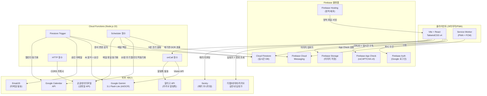
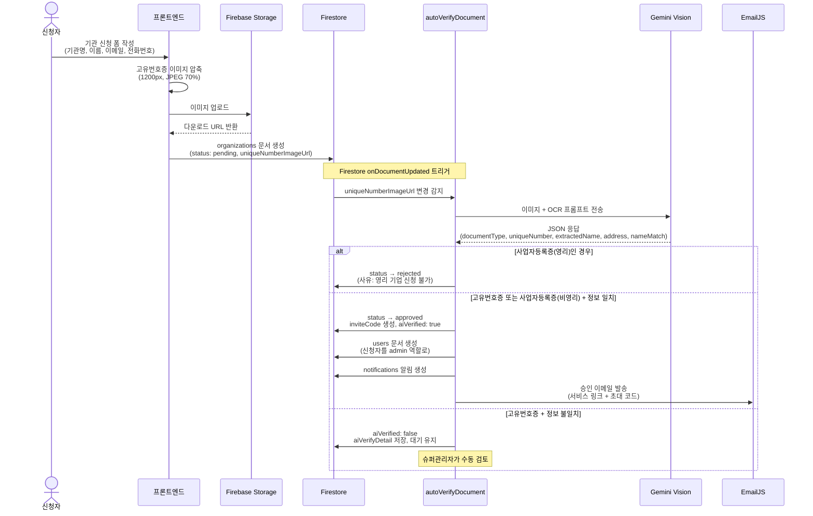
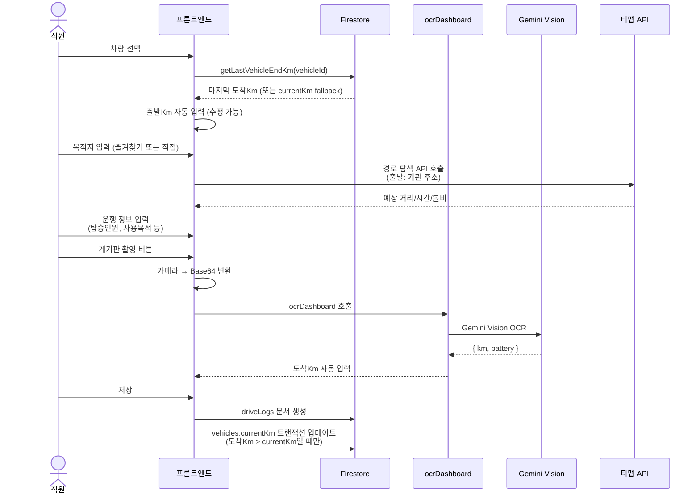
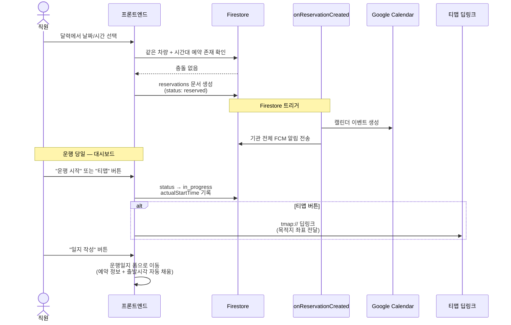
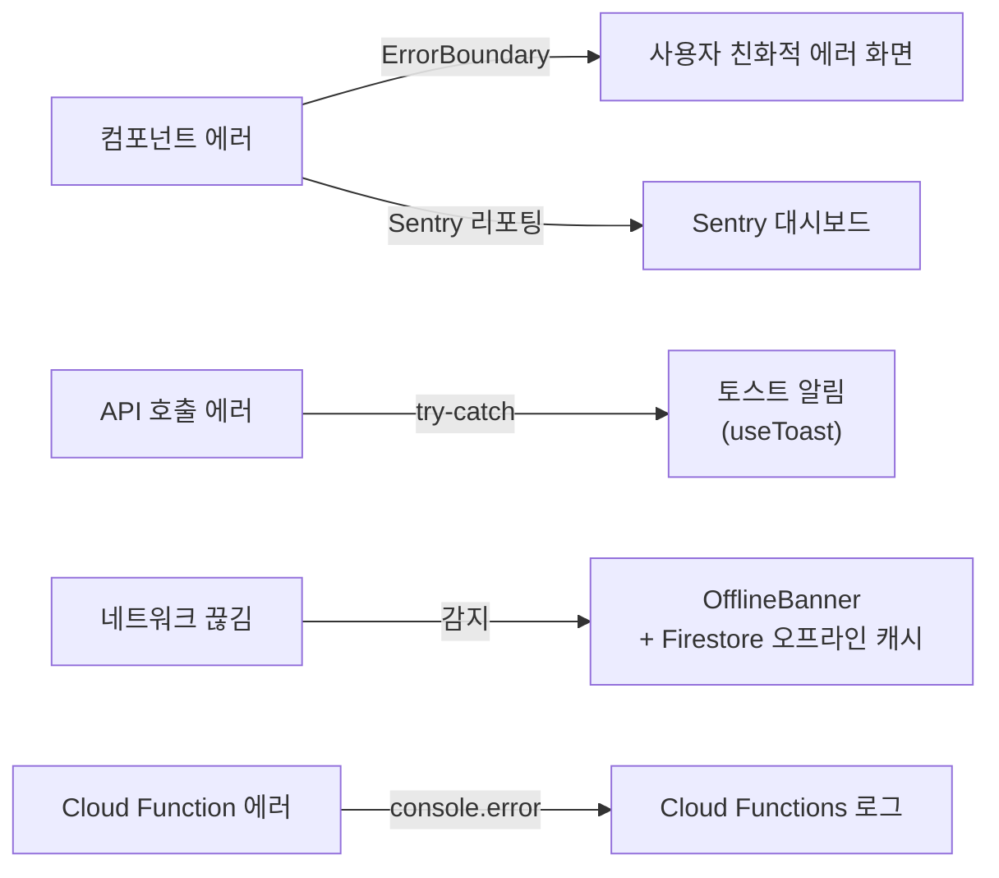

# 🚗 차량 운행일지 앱 — 구현 계획서

> **최종 업데이트**: 2026-07-31 | **전체 진행률**: Phase 1~58 완료 ✅ (테스트 신뢰성 강화 및 거대 훅 분해), 운영 로그 Phase 129까지 기록(65까지 배포 완료, 66~92 CI 배포, 93~96 코드 완료·배포 대기, 97~108 CI 배포, 109 커밋, 110 CI 배포 완료, 111 커밋·PR, 112 CI 배포 완료, 113~123 CI 배포 완료, 124~125 문서·하네스, 126 커밋·PR, 127~128 Hosting 수동 선배포·CI 배포 완료, 129 커밋·PR) | 서비스 운영 중 (210개+ 기관)

---

## 1. 프로젝트 개요

본 프로젝트는 **사회복지기관 및 비영리단체**를 대상으로 **무료**로 제공되는 **차량 운행일지 웹 애플리케이션**입니다.  
차량 사용 기록 관리, 예약, 계기판 OCR 인식, 그리고 네이버, 카카오, 티맵을 활용한 길안내 딥링크 연동 등 다양한 편의 기능을 제공합니다.  
단, 일반 영리 기업(사업자등록증 보유 기관)은 서비스 이용 대상에서 제외되며, 가입 신청 시 반려될 수 있습니다.

---

## 2. 기술 스택

| 영역 | 기술 |
|------|------|
| **프론트엔드** | Vite + React + TypeScript |
| **상태 관리** | Zustand (글로벌 UI 상태: 테마, 폰트, Toast, 모달) |
| **스타일링** | TailwindCSS v4 (CSS-first `@theme`, 반응형, 다크 모드) |
| **언어** | TypeScript (프론트엔드 + Cloud Functions + 테스트 + 스크립트) |
| **인증** | Firebase Auth (Google 로그인 전용) |
| **보안** | Firebase App Check (reCAPTCHA v3) |
| **데이터베이스** | Cloud Firestore |
| **서버리스 함수** | Cloud Functions for Firebase (TypeScript ESM) |
| **호스팅** | Firebase Hosting |
| **AI/OCR** | Gemini 3.1 Flash Lite (정식 모델) (Cloud Functions 경유) |
| **외부 연동** | 네이버맵 / 카카오맵 / 티맵 딥링크 |

---

## 3. 시스템 아키텍처


```mermaid
graph TB
    subgraph Client["클라이언트 (브라우저/PWA)"]
        FE["Vite + React<br/>TailwindCSS v4"]
        SW["Service Worker<br/>(PWA + FCM)"]
    end

    subgraph Firebase["Firebase 플랫폼"]
        AUTH["Firebase Auth<br/>(Google 로그인)"]
        FS["Cloud Firestore<br/>(실시간 DB)"]
        STORAGE["Firebase Storage<br/>(이미지 저장)"]
        HOSTING["Firebase Hosting<br/>(정적 배포)"]
        FCM["Firebase Cloud<br/>Messaging"]
        APPCHECK["Firebase App Check<br/>(reCAPTCHA v3)"]
    end

    subgraph CF["Cloud Functions (Node.js 22)"]
        direction TB
        CF_CALL["onCall 함수"]
        CF_TRIGGER["Firestore Trigger"]
        CF_SCHEDULE["Scheduler 함수"]
        CF_HTTP["HTTP 함수"]
    end

    subgraph External["외부 서비스"]
        GEMINI["Google Gemini<br/>3.1 Flash Lite (AI/OCR)"]
        EMAILJS["EmailJS<br/>(이메일 발송)"]
        TMAP["티맵/네이버/카카오<br/>길안내 딥링크"]
        HOLIDAY["공공데이터포털<br/>(공휴일 API)"]
        GCAL["Google Calendar<br/>API"]
        SENTRY["Sentry<br/>(에러 모니터링)"]
        ALIMTALK["알리고 API<br/>(카카오 알림톡)"]
    end

    FE -->|인증| AUTH
    FE -->|App Check 검증| APPCHECK
    FE -->|CRUD + 실시간 구독| FS
    FE -->|이미지 업로드| STORAGE
    FE -->|계기판 OCR 호출| CF_CALL
    FE -->|딥링크 + 경로 조회| TMAP
    FE -->|에러 리포팅| SENTRY
    SW -->|푸시 수신| FCM

    CF_CALL -->|Vision API| GEMINI
    CF_TRIGGER -->|문서 변경 감지| FS
    CF_TRIGGER -->|AI 분석 + 승인| GEMINI
    CF_TRIGGER -->|승인 이메일| EMAILJS
    CF_TRIGGER -->|캘린더 동기화| GCAL
    CF_SCHEDULE -->|5분 주기 알림| FCM
    CF_SCHEDULE -->|10분 주기 캘린더 역동기화| GCAL
    CF_SCHEDULE -->|매일 백업| FS
    CF_SCHEDULE -->|매일 휴일 동기화| HOLIDAY
    CF_HTTP -->|CORS 프록시| HOLIDAY
    CF_CALL -->|알림톡 발송| ALIMTALK

    HOSTING -->|정적 파일 서빙| FE
```

### 데이터 흐름 요약

| 흐름 | 경로 |
|------|------|
| **인증** | 브라우저 → Firebase Auth (Google OAuth) → Firestore `users/` |
| **운행일지 작성** | 브라우저 → Firestore `driveLogs/` + `vehicles.currentKm` 트랜잭션 |
| **계기판 OCR** | 브라우저 → Cloud Function `ocrDashboard` → Gemini Vision → 브라우저 |
| **기관 신청** | 브라우저 → Storage (이미지) + Firestore `organizations/` → Cloud Function `autoVerifyDocument` (트리거) → Gemini + EmailJS |
| **예약 알림** | Cloud Function `reservationReminder` (스케줄) → FCM → Service Worker → 브라우저 |
| **캘린더 연동** | Firestore 예약 변경 → Cloud Function 트리거 → Google Calendar API ↔ 역동기화 |

---

## 4. 사용자 역할 및 권한

### 4.1 시스템 관리자 (`admin@example.com`)
- 특정 기관에 소속되지 않는 최상위 관리자입니다.
- 신규 기관의 사용 신청을 승인하거나 거절할 수 있습니다.
- 승인 시 신청자에게 서비스 링크와 초대 코드가 포함된 이메일을 발송합니다.
- 반려된 기관 신청 내역을 조회하고 삭제하여 관리합니다.
- 기관 목록을 관리하며, 기관명과 주소를 직접 편집할 수 있습니다.
- 특정 기관 삭제 시, 해당 기관에 소속된 관리자 및 직원의 계정을 일괄 삭제하여 즉시 로그인을 차단합니다.
- 기기에 구애받지 않는 반응형 웹 화면을 제공합니다.

### 4.2 기관관리자
- 소속 기관의 직원을 등록하고 관리할 수 있습니다.
- 기관의 차량 정보를 등록하고 관리합니다.
- 직원을 초대하기 위한 기관 전용 6자리 초대 코드를 발급합니다.
- 소속 직원이 작성한 운행일지를 조회, 수정, 출력 및 다운로드할 수 있습니다.
- 기관의 전체 차량 예약 내역을 관리합니다.
- 직원이 운행일지에 잘못 입력한 정보를 수정할 수 있는 권한이 있습니다.
- **관리자 화면 ↔ 직원 화면 간 자유로운 전환이 가능합니다.** (기관관리자 본인도 차량을 직접 운행하는 경우를 지원합니다.)
- PC 환경에 최적화된 반응형 웹 화면을 제공하며, 모바일 화면도 지원합니다.

### 4.3 기관직원
- 계기판 OCR 기능을 활용하여 손쉽게 운행일지를 작성할 수 있습니다.
- 본인이 작성한 운행일지 기록에 한해 수정이 가능합니다.
- 최근 1개월간의 차량별 이용 내역을 조회할 수 있습니다.
- 차량별 보험 정보를 조회할 수 있으며, 전화번호 터치 시 즉시 보험사로 통화가 연결됩니다.
- 달력 UI를 통해 차량을 예약할 수 있습니다.
- 길안내 앱 연동을 지원하여, 네이버 지도, 카카오내비, 티맵 중 선호하는 앱을 기본값으로 선택할 수 있습니다.
- 모바일 환경에 최적화된 화면을 제공하며, PC에서도 동일하게 작동합니다.

---

## 5. Firestore 데이터베이스 설계

### 5.1 컬렉션 구조

```
Firestore
├── organizations/                    ← 기관 정보
│   └── {orgId}
│       ├── name: string              (기관명)
│       ├── uniqueNumber: string      (고유번호, AI OCR로 사본에서 추출)
│       ├── status: string            (pending | approved | rejected)
│       ├── applicantName: string     (신청자 이름)
│       ├── applicantEmail: string    (신청자 이메일)
│       ├── applicantPhone: string    (신청자 전화번호)
│       ├── uniqueNumberImageUrl: string (고유번호증 사본 URL)
│       ├── aiVerified: boolean       (AI 문서유형+기관명 검증 통과 여부)
│       ├── aiVerifyDetail: object    ({documentType, numberMatch, nameMatch, extractedNumber, extractedName})
│       ├── inviteCode: string        (6자리 직원 초대 코드)
│       ├── address: string           (기관 주소, AI OCR로 사본에서 추출)
│       ├── approvalSignatures: array (결재란 항목 목록, 예: ['담당', '팀장', '관장'])
│       ├── createdAt: timestamp
│       ├── approvedAt: timestamp
│       ├── rejectedAt: timestamp
│       └── customHolidays/            ← 커스텀 휴일 (서브컬렉션)
│           └── {holidayId}
│               ├── name: string       (휴일명)
│               ├── date: string       (YYYY-MM-DD)
│               └── createdAt: timestamp
│
├── users/                            ← 사용자 정보
│   └── {uid}
│       ├── email: string
│       ├── name: string
│       ├── role: string              (superAdmin | admin | employee)
│       ├── organizationId: string
│       ├── phone: string
│       ├── disabled: boolean         (soft delete 비활성화 여부)
│       └── createdAt: timestamp
│
├── vehicles/                         ← 차량 목록
│   └── {vehicleId}
│       ├── displayName: string       (예: "소나타2744")
│       ├── modelName: string         (모델명)
│       ├── plateNumber: string       (차량번호)
│       ├── type: string              (compact | sedan | van | bus | truck)
│       ├── fuelType: string          (gasoline | diesel | lpg | electric)
│       ├── organizationId: string
│       ├── currentKm: number         (최신 누적Km 캐시)
│       ├── currentBattery: number    (전기차만, 현재 배터리 %)
│       ├── status: string            (active | retired, 기본값 active)
│       ├── retiredAt: timestamp      (퇴역 시점, status=retired일 때)
│       ├── hipassCardNumber: string  (선택, 하이패스 카드번호)
│       ├── googleCalendarId: string  (선택, 구글 캘린더 리소스 ID)
│       ├── insurance: object         (보험 정보, 선택)
│       │   ├── company: string       (보험사명, 예: "삼성화재")
│       │   └── phone: string         (보험사 전화번호, 예: "1588-5114")
│       └── createdAt: timestamp
│
├── driveLogs/                        ← 운행일지
│   └── {logId}
│       ├── timestamp: timestamp      (작성 시각)
│       ├── vehicleId: string
│       ├── vehicleDisplayName: string
│       ├── date: string              (운행 날짜, YYYY-MM-DD)
│       ├── departureTime: string     (출발시각, HH:mm)
│       ├── arrivalTime: string       (도착시각, HH:mm)
│       ├── driverUid: string
│       ├── driverName: string
│       ├── passengerCount: number    (탑승인원 수)
│       ├── passengerNames: array     (탑승자 이름 목록)
│       ├── destination: string       (목적지)
│       ├── purposeCategory: string   (가정방문|관공서|외부교육|물품운송|기타)
│       ├── purposeDetail: string     (상세 목적, 자유 텍스트)
│       ├── linkedLogId: string       (이전 운행 연결 ID, 다중 방문 시)
│       ├── departureKm: number       (출발Km)
│       ├── arrivalKm: number         (도착Km)
│       ├── fuelAmount: number        (주유/충전금액 — 신규 필드, energyCost 대체)
│       ├── energyCost: number        (내연기관: 주유금액 / 전기차: 충전금액, 레거시)
│       ├── departureBattery: number  (전기차만, 출발 배터리 %)
│       ├── arrivalBattery: number    (전기차만, 도착 배터리 %)
│       ├── note: string              (비고)
│       ├── organizationId: string
│       ├── reservationId: string     (연동된 예약 ID, 있으면)
│       └── createdAt: timestamp
│
├── reservations/                     ← 차량 예약
│   └── {reservationId}
│       ├── vehicleId: string
│       ├── vehicleDisplayName: string
│       ├── userId: string
│       ├── userName: string
│       ├── date: string              (YYYY-MM-DD)
│       ├── startTime: string         (HH:mm, 예약 시작)
│       ├── endTime: string           (HH:mm, 예약 종료)
│       ├── destination: string       (목적지)
│       ├── purpose: string           (용도)
│       ├── status: string            (reserved | in_progress | completed | cancelled)
│       ├── actualStartTime: string   (실제 출발 시각, HH:mm — 운행 시작 시 기록)
│       ├── organizationId: string
│       └── createdAt: timestamp
│
├── notifications/                    ← 앱 내 알림
│   └── {notificationId}
│       ├── targetUid: string         (수신자)
│       ├── type: string              (approval | rejection | info | reservation_reminder | drive_log_reminder | no_show_reminder)
│       ├── title: string
│       ├── message: string
│       ├── read: boolean
│       ├── organizationId: string
│       └── createdAt: timestamp
│
├── favorites/                        ← 자주 가는 목적지 (사용자별)
│   └── {favoriteId}
│       ├── userId: string
│       ├── name: string              (별칭, 예: "김OO 어르신 댁")
│       ├── address: string           (주소)
│       ├── organizationId: string
│       └── createdAt: timestamp
│
├── maintenanceRecords/               ← 차량 정비/수리 기록
│   └── {recordId}
│       ├── vehicleId: string
│       ├── vehicleName: string
│       ├── organizationId: string
│       ├── type: string              (정기점검|오일교환|타이어|수리|기타)
│       ├── date: string              (YYYY-MM-DD)
│       ├── cost: number              (비용)
│       ├── memo: string
│       ├── blockVehicle: boolean     (정비 중 차량 사용 차단 여부)
│       ├── maintenanceEndDate: string (정비 종료 예정일, YYYY-MM-DD)
│       └── createdAt: timestamp
│
├── fuelLogs/                         ← 주유/충전 기록
│   └── {fuelLogId}
│       ├── organizationId: string
│       ├── vehicleId: string
│       ├── vehicleName: string       (비정규화)
│       ├── driverUid: string
│       ├── driverName: string        (비정규화)
│       ├── date: string              (YYYY-MM-DD)
│       ├── meterReading: number      (주유 시 계기판 km)
│       ├── meterPhotoUrl: string     (선택, 계기판 사진 URL)
│       ├── fuelAmount: number        (주유량, 리터)
│       ├── fuelCost: number          (주유 금액, 원)
│       └── createdAt: timestamp
│
└── orgApplications/                  ← 기관 가입 신청
    └── {appId}
        ├── orgName: string
        ├── adminEmail: string
        ├── status: string            (pending|approved|rejected)
        ├── uniqueNumberImageUrl: string
        └── createdAt: timestamp
```

### 5.2 주요 설계 결정사항

| 결정 | 이유 |
|------|------|
| **결정론적 ID(Hash ID) 기반 운행일지 생성** | 오프라인 환경에서 네트워크 단절/복구 시 동일한 로그가 중복 생성되는 것(Idempotency)을 막고, 서버측 중복 체크 쿼리 비용을 절감하기 위해 `{vehicleId}_{uid}_{date}_{startKm}_{endKm}` 형태의 고정 ID를 사용해 `setDoc`을 수행합니다. |
| `vehicles.currentKm` 캐시 + 마지막 운행 endKm 조회 | 출발Km 자동 입력 시 `getLastVehicleEndKm()`로 최신 endKm 우선 사용, fallback으로 `currentKm` 사용 |
| 출발Km는 추천값, 수동 수정 가능 | 입력 순서가 뒤바뀌어도 문제없도록 |
| `currentKm` 갱신은 조건부 | 도착Km > currentKm일 때만 갱신 (뒤늦은 입력 대응) |
| `driveLogs`에 `vehicleDisplayName`, `driverName` 비정규화 | 목록 조회 시 JOIN 불필요 |
| `reservations`에 `userName`, `vehicleDisplayName` 비정규화 | 달력 표시 시 추가 쿼리 방지 |
| `inviteCode`를 organizations에 저장 | 기관 단위 1개 코드, 재발급 가능 |
| 기관 삭제 시 소속 사용자 일괄 삭제 | `writeBatch`로 원자적 처리, 삭제된 사용자는 로그인 불가 |
| 사용자 문서 실시간 감시 (`onSnapshot`) | 기관 삭제 시 새로고침 없이 즉시 차단 |
| 관리자 대시보드 훅 최적화 (상태 객체화) | 개별 useState 54개를 도메인별 4개 그룹 객체(summary, timeSeries, rankings, external)로 병합하여 대시보드 컴포넌트의 불필요한 리렌더링 차단 및 유지보수성 향상 |

---

## 6. 화면 구성

### 6.1 공통 화면
- 구글 계정을 이용한 로그인 화면
- 신규 직원을 위한 초대 코드 입력 화면
- 기관 가입 신청 후 결과를 기다리는 승인 대기 화면

### 6.2 시스템 관리자 화면 (반응형)
- 기관 신청 목록: 대기 중이거나 거절된 내역을 탭으로 구분하며, 신청 정보와 AI 검증 결과를 함께 표시합니다.
  - 승인 시: 신청자에게 감사 메시지, 서비스 링크, 기관관리자용 초대 코드를 이메일로 자동 발송합니다.
  - 거절 시: 거절 내역을 조회하거나 삭제할 수 있습니다.
- 기관 관리: 승인된 기관 목록을 조회하고, 기관명과 주소를 화면에서 직접(인라인) 편집할 수 있습니다.
- 사용자 피드백 관리: 사용자가 제출한 피드백 목록을 조회하고 처리 상태를 관리합니다.
- 알림 관리

### 6.3 공통 공개 페이지
- **FAQ 페이지** (`FAQPage.tsx`): 자주 묻는 질문을 아코디언 UI로 제공하며, 대시보드 우측에 배치됩니다.
- **업데이트 소식** (`ReleaseNotesPage.tsx`): 서비스의 주요 변경 이력을 사용자가 이해하기 쉽게 제공합니다.

### 6.4 기관관리자 화면 (반응형, PC 중심)
- **대시보드**: 당일 운행 현황과 전체 차량의 상태를 한눈에 요약하여 보여줍니다.
- **직원 관리**: 소속 직원 목록을 조회하고 기관 초대 코드를 관리합니다.
- **차량 관리**: 차량을 신규 등록, 수정, 삭제할 수 있으며, 보험사명과 전화번호 등 보험 정보를 등록합니다.
- **운행일지**: 직원이 작성한 운행일지를 조회, 검색, 수정하고 PDF나 Excel 형태로 출력할 수 있습니다.
- **차량 예약**: 달력 UI를 통해 차량 예약 현황을 확인하고 관리합니다.
- **설정**: 기관 정보(이메일, 전화번호 수정 가능), 결재란 항목, 공휴일, 푸시 알림, 다크 모드 등을 설정할 수 있습니다. (단, 기관명과 주소는 읽기 전용입니다.)

### 6.5 기관직원 화면 (모바일 최적화)
- **오늘 대시보드 (메인)**: 당일 본인의 예약 목록과 '운행 시작', '길안내' 버튼을 제공합니다. 예약이 없을 경우 안내 문구를 표시하며, 운행 중에는 다른 시작 버튼이 비활성화되는 **동시 운행 제한** 기능이 적용됩니다.
- **운행일지 작성**: 계기판 OCR, 목적지 프리셋, 동승자 선택, 다중 방문을 위한 '이어서 기록' 등 운행일지 입력을 위한 다양한 편의 기능을 제공하는 폼입니다.
- **즐겨찾기**: 자주 방문하는 목적지를 등록하고 선택할 수 있습니다.
- **내 기록**: 본인이 작성한 운행 기록 목록을 확인하고 수정할 수 있으며, 미완료된 기록이 있을 경우 알림을 제공합니다.
- **차량 이용 내역**: 특정 차량의 최근 1개월간 이용 내역을 검색할 수 있습니다.
- **차량 보험 정보**: 차량별 보험사 이름과 전화번호를 제공하며, 전화번호 터치 시 즉시 전화가 연결됩니다.
- **차량 예약**: 달력 기반으로 차량을 예약(목적지 및 용도 입력)하거나 취소할 수 있으며, 현재 시각 기준 미래 일정만 예약 가능합니다.
- **예약 없는 운행**: 예약 없이 대시보드 하단에서 즉시 운행을 시작할 수 있습니다. (운행 중에는 해당 카드가 숨겨집니다.)
- **길안내 연동**: 예약 카드 내 길안내 버튼 클릭 시, 설정된 기본 앱(네이버 지도, 카카오내비, 티맵)을 통해 길안내를 시작합니다.
- **더보기**: 기본 길안내 앱 변경, 화면 글자 크기 조절(소/중/대), 다크 모드, 알림 수신 여부 등을 설정할 수 있습니다.

---

## 7. 핵심 기능 상세

### 7.1 기관 신청 및 승인 프로세스

```
기관 대표 → 신청 폼 작성
  (이름, 기관명, 고유번호증 사본, 이메일, 전화번호)
      ↓
프론트: 이미지 업로드 → Firestore에 uniqueNumberImageUrl 저장
      ↓
Cloud Function(autoVerifyDocument) 자동 트리거 (Firestore onDocumentUpdated)
  → Gemini Vision으로 사본 OCR (서버사이드)
  → 검증 단계:
    ① 문서 유형 판별 (3분류):
       - 고유번호증 → 다음 단계 진행
       - 사업자등록증(비영리) → 다음 단계 진행 (비영리사단법인, 사회복지법인 등)
       - 사업자등록증(영리) → 중간 자리 '82'인 경우에 한하여 비영리로 취급하여 다음 단계 진행. 그 외는 즉시 자동 거부 (영리 기업 신청 불가)
    ② 고유번호/사업자번호 추출 → organizations.uniqueNumber에 저장
    ③ 기관명(단체명) 추출 → 입력된 기관명과 비교
    ④ 기관 주소 추출 → organizations.address에 저장
      ↓
모두 일치 → organizations.aiVerified = true → ✅ 자동 승인
  - status = "approved", inviteCode 생성
  - 알림 생성 + 승인 이메일 발송 (@emailjs/nodejs, 서버사이드)
  - 사용자 organizationStatus = "approved"로 등록
일부 불일치 → organizations.aiVerified = false, aiVerifyDetail 저장
  → ⏳ 대기중(pending) 유지 → 슈퍼관리자 수동 검토
사업자등록증(영리) → 자동 거부 (rejected)
AI 분석 실패 → 대기중 유지 (관리자가 수동으로 AI 재분석 또는 직접 승인)
      ↓
슈퍼관리자 수동 승인 시:
  - 승인 이메일 발송 (프론트 EmailJS, 실패 시 alert으로 관리자에게 알림)
  - 수동 거절 시 알림 생성
```

> ⚡ **핵심 구조**: 프론트는 이미지 URL 저장만 담당, AI 분석 + 자동 승인 + 이메일 발송은 모두 Cloud Function이 처리

### 7.2 직원 등록 프로세스

```
기관관리자 → 직원 목록에 이름/이메일 사전 등록
        → 기관 초대 코드를 직원에게 공유
             ↓
직원 → 구글 로그인 → 초대 코드 입력
     → 코드 검증 → 기관에 연결 (role: employee)
     → 사전 등록된 이메일과 매칭되면 이름 자동 설정
```

### 7.3 운행일지 작성 (직원)

```
차량 선택 → 출발 Km 추천값 표시 (getLastVehicleEndKm()로 최신 endKm 우선, fallback: vehicles.currentKm, 수동 수정 가능)
         → 전기차인 경우: 출발 배터리 % 입력 (수동 또는 OCR)
         → 목적지 입력 (즐겨찾기에서 선택 또는 직접 입력, 저장 가능)
         → 사용목적 (프리셋 선택 + 상세 내용 자유 입력)
            프리셋: 가정방문 | 관공서 | 외부교육 | 물품운송 | 기타
         → 예약 연동 시 자동 채움
         → 탑승인원 (숫자 + 직원 목록에서 선택 또는 직접 입력)
         → 운행 후 도착 시:
            → 계기판 사진 촬영
            → Gemini Vision OCR → 누적Km 추출 (전기차는 배터리%도 추출)
            → (사진은 저장하지 않음)
         → 도착시각 입력
         → 차량 연료 유형에 따라:
            → 내연기관(LPG/휘발유/경유/하이브리드): "주유금액" 입력
            → 전기차: "충전금액" + "도착 배터리%" 입력
         → 비고 입력
         → 저장 시 도착Km > currentKm이면 vehicles.currentKm 트랜잭션 업데이트
         → 전기차는 vehicles.currentBattery도 조건부 업데이트

[이어서 기록] (하루 다중 방문 시)
이전 기록의 도착지 → 다음 기록의 출발지로 자동 연결
         → 출발Km = 이전 도착Km 자동 입력
         → 나머지는 일반 모드와 동일
```

### 7.4 차량 예약

```
달력 UI → 날짜 선택 → 시간대별 예약 현황 표시
       → 예약은 시간 기준으로 미래만 가능:
          - 과거 날짜: 예약 불가 (+ 예약 버튼 미표시)
          - 오늘 날짜: 현재 시각 이후만 예약 가능 (시작 시간 자동 설정)
          - 미래 날짜: 자유롭게 예약
       → 오늘 선택 시 시작 시간이 30분 단위 올림으로 자동 설정
       → 예약 시 차량, 시작/종료 시간, 용도, 목적지 입력
       → 다일 예약(연속) 및 요일 기반 반복 예약(휴일 제외, 시작/종료일 지정) 동시 생성 지원
       → 겹치는 시간 있으면 차단 (생성 불가)
       → 취소: 본인 또는 관리자만 가능
       → 같은 기관 직원 간 예약 상호 조회 가능
       → 예약 → 운행일지 작성 시 자동 연동
       → 차량에 googleCalendarId가 있으면:
          → 예약 생성 시 구글 캘린더에 일정 자동 추가
          → 예약 취소 시 구글 캘린더 일정 자동 삭제

[운행 시작 워크플로우]
예약 카드에서:
  1. "운행 시작" 버튼 클릭
     → 예약 상태: reserved → in_progress
     → 현재 시각을 actualStartTime으로 Firestore에 기록
     → 페이지 이동 없이 현재 화면 유지
     → 버튼이 "🚗 운행 중" 뱃지 + "일지 작성" 버튼으로 변경
  2. "티맵" 버튼 클릭
     → 위 1번과 동일한 상태 변경 수행
     → + 티맵 앱 딥링크로 실행 (목적지 자동 입력)
  3. "일지 작성" 버튼 클릭 (운행 중 상태)
     → 운행일지 작성 페이지로 이동 (예약 정보 + actualStartTime 전달)
```

#### 7.4.1 원클릭 예약 추천 (스마트 패턴 분석)

사용자의 이전 예약 기록을 통계적으로 분석하여 다가올 일정을 예측하고, 이를 바탕으로 원클릭 추천 배너를 제공합니다.

1. **데이터 추출**: 해당 사용자의 최근 차량 예약 기록 30건을 조회합니다.
2. **패턴 검증**: `요일 + 시간 + 차량 + 목적지` 조합의 빈도를 분석합니다. 동일한 패턴이 3회 이상 발견될 경우, 해당 요일과 시각을 다음 예약일로 예측합니다.
3. **가용성 확인 및 차선책 제공 (Smart Alternative)**: 
   - 추천된 시간에 사용자가 이미 다른 일정을 예약해 둔 경우, 최대 10주 앞까지 탐색하여 겹치지 않는 일정으로 미룹니다.
   - 1순위로 추천된 차량이 이미 예약 마감된 상태라면, **평소 자주 이용하던 다른 가용 차량 중 가장 이용 빈도가 높은 차량을 자동으로 찾아** 대체 차량으로 추천합니다.
4. **빠른 예약 지원**: **대시보드 하단에 단일 박스 형태의 리스트 UI로 추천 내역을 노출**합니다. 우측의 '예약' 버튼을 클릭하면, 분석된 정보(`prefillPattern`)가 중복되지 않는 가장 빠른 날짜로 예약 폼에 자동 입력되어 진입합니다.

### 7.5 길안내 앱 연동 (네이버/카카오/티맵)

```
[더보기에서 기본 앱 선택]
  → localStorage에 preferred-nav-app 저장 (naver | kakao | tmap)
  → 기본값: naver (네이버맵만 다중 경유지 지원)

[예약 카드에서 길안내 버튼]
  → 🗺️ 버튼 클릭 → 설정된 기본 앱으로 길안내 시작
  → 네이버: nmap:// 딥링크 (경유지 자동 설정)
  → 카카오: kakaomap:// 딥링크
  → 티맵: tmap:// 딥링크 (목적지 자동 입력)
  → 목적지가 없으면 앱만 실행
  → PC에서는 딥링크가 동작하지 않을 수 있음 (모바일 전용)

[운행일지 작성 화면에서]
   → 목적지 입력 시 티맵 경로 탐색 API 호출 (출발지: 기관 주소)
   → 다중 목적지 지원: 쉼표(,)로 구분하여 최대 5곳 입력 가능
   → 다중 경로: 출발지→목적지1→목적지2→...→출발지 순환 경로 합산
   → 예상 거리(km), 예상 시간, 예상 톨비 표시
   → 톨비가 있는 경로: ▼ 펼치기로 무통행료(무료도로) 경로 거리/시간 비교 가능
   → 길안내 버튼 → 설정된 기본 앱으로 딥링크 열기 (경유지 자동 설정)
   → PC에서는 딥링크 대신 경로 정보만 표시
```

### 7.6 계기판 OCR

```
직원 화면에서 "계기판 촬영" 버튼
  → 카메라로 사진 촬영 (input type="file" capture="environment")
  → 이미지를 Base64로 변환
  → Cloud Functions 호출 → Gemini Vision API에 전달
  → 프롬프트: "이 계기판 사진에서 누적 주행거리(총 Km)를 숫자만 추출해주세요"
  → 반환된 숫자를 도착Km 필드에 자동 입력
  → 이미지는 서버/스토리지에 저장하지 않음
```

### 7.7 구글 캘린더 연동

차량 예약 일정을 Google Calendar와 자동으로 동기화하는 기능입니다. 관리자가 개별 차량에 구글 캘린더를 연결해 두면, 앱 내에서의 예약 변경 사항이 캘린더에 실시간으로 반영됩니다.

#### 관리자 설정

```
차량 관리 → 차량 수정 → Google Calendar ID 입력
  → vehicles.googleCalendarId에 저장
  → 해당 차량의 예약부터 캘린더 연동 활성화
```

> ⚡ `googleCalendarId`가 비어있는 차량은 캘린더 연동을 건너뜁니다.

#### 정방향 동기화 (예약 → Google Calendar)

```
[예약 생성] Firestore onDocumentCreated 트리거
  → calendarSync.js: 해당 차량의 googleCalendarId 확인
  → Google Calendar API: events.insert()
     - summary: "🚗 차량명 - 예약자명"
     - description: "목적지: OOO / 목적: OOO"
     - start/end: 예약 시작~종료 시간 (KST)
  → 생성된 calendarEventId를 reservations 문서에 저장

[예약 수정] Firestore onDocumentUpdated 트리거
  → calendarSync.js: calendarEventId로 기존 일정 검색
  → Google Calendar API: events.update()
  → 시간/목적지/목적 변경 반영

[예약 취소] Firestore onDocumentUpdated 트리거 (status → cancelled)
  → calendarSync.js: calendarEventId로 일정 삭제
  → Google Calendar API: events.delete()

[예약 삭제] Firestore onDocumentDeleted 트리거
  → calendarSync.js: calendarEventId로 일정 삭제
```

#### 역방향 동기화 (Google Calendar → 예약)

```
syncCalendarToApp (10분 주기 스케줄 함수)
  → googleCalendarId가 설정된 모든 차량 조회
  → Google Calendar API: events.list() (향후 7일 범위)
  → 캘린더 이벤트 중 앱에 없는 일정:
     → Firestore reservations에 새 예약 문서 생성
     → source: 'google_calendar' 표시
  → 앱 예약 중 캘린더에서 삭제된 일정:
     → Firestore 예약 상태를 cancelled로 변경
  → ReservationSidePanel에 "📅 캘린더" 출처 뱃지 표시
```

#### 에러 처리

| 상황 | 처리 |
|------|------|
| Google Calendar API 장애 | 예약 자체는 정상 저장, 캘린더 동기화 실패 로그 기록 |
| calendarEventId 누락 | 역동기화 시 매칭 불가 → 새 이벤트로 생성 |
| 인증 토큰 만료 | Cloud Function에서 서비스 계정 재인증 |
| 중복 이벤트 감지 (시간 충돌) | 같은 차량 + 같은 시간대 이벤트 → 생성 건너뛰기 |
| 중복 이벤트 감지 (동일 일정) | 같은 `calendarEventId`가 기관 내 여러 차량에 연동된 경우 → 첫 번째 차량에만 생성하고 나머지는 건너뛰기 |

#### 7.7.5 향후 계획: 개인 캘린더 연동 (Google OAuth 2.0)

현재 적용된 공용 서비스 계정(Service Account) 연동 방식에서 나아가, 개별 사용자의 개인 캘린더에 직접 일정을 연동할 수 있도록 시스템 확장을 계획하고 있습니다.

*   **권한 동의**: 앱 내에서 "Google 캘린더 개인 연동" 버튼을 클릭하면 구글의 OAuth 2.0 동의 화면(Consent Screen)이 호출됩니다.
*   **토큰 보관**: 인증 후 발급된 Access Token과 Refresh Token은 Firestore의 개별 사용자 프로필(`users/{uid}`) 내부에 안전하게 저장됩니다.
*   **이벤트 생성 주체**: 사용자가 차량을 예약할 때 공용 서비스 계정이 아닌 사용자 본인의 Access Token을 사용하여, 개인 캘린더에 직접 예약 이벤트를 생성합니다.
*   **오프라인 갱신**: Access Token이 만료될 경우, 시스템이 보관 중인 Refresh Token을 활용하여 자동으로 Access Token을 재발급받습니다.
*   **정책 심사**: Google Calendar API의 민감한 권한 범위를 사용하므로, 프로덕션 배포 전 Google Cloud Console을 통한 OAuth 동의 화면 심사 및 승인이 필수적으로 요구됩니다.

---

## 8. Cloud Functions API 명세

> 💡 **안내**: 최신 API 명세는 빌드 과정에서 `scripts/generate-functions-doc.ts` 스크립트를 통해 `docs/FUNCTIONS_REFERENCE.md` 문서로 자동 생성 및 갱신됩니다. 상세 파라미터 및 반환값은 해당 문서를 참조하세요.

### 8.1 호출형 함수 (onCall)

| 함수명 | 파일 | 리전 | 인증 | 입력 | 출력 | 타임아웃 | 메모리 |
|--------|------|------|------|------|------|----------|--------|
| `ocrDashboard` | `ocrDashboard.ts` | asia-northeast3 | ✅ 필수 | `{ imageBase64, mimeType, isElectric }` | `{ km: number\|null, battery: number\|null, raw: string }` | 60초 | 512MiB |
| `createReservationSafe` | `createReservationSafe.ts` | asia-northeast3 | ✅ 필수 | `{ vehicleId, date, startTime, endTime, ... }` | `{ reservationId }` | 30초 | 256MiB |
| `sendAdminNotice` | `sendAdminNotice.ts` | asia-northeast3 | ✅ 필수 (admin) | `{ title, message }` | `{ success: boolean }` | 30초 | 256MiB |
| `calendarSchedule` | `calendarSchedule.ts` | asia-northeast3 | ✅ 필수 (admin) | `{ vehicleId, calendarId }` | `{ events: array }` | 60초 | 256MiB |
| `disableUser` | `disableUser.ts` | asia-northeast3 | ✅ 필수 (superAdmin) | `{ uid }` | `{ success: boolean }` | 30초 | 256MiB |
| `restoreUser` | `restoreUser.ts` | asia-northeast3 | ✅ 필수 (superAdmin) | `{ email, name, organizationId }` | `{ uid, success: boolean }` | 30초 | 256MiB |
| `joinOrganization` | `joinOrganization.ts` | asia-northeast3 | ✅ 필수 | `{ code }` | `{ success, orgId, orgName, role }` | 30초 | 256MiB |
| `sendBulkReminder` | `index.ts` | asia-northeast3 | ✅ 필수 (superAdmin) | — | `{ sentCount, failCount, noPhoneCount, results }` | 120초 | 256MiB |
| `askAI` | `askAI.ts` | asia-northeast3 | ✅ 필수 | `{ question: string }` | `{ answer: string }` | 30초 | 256MiB |

### 8.2 Firestore 트리거 함수

| 함수명 | 파일 | 트리거 | 감시 경로 | 동작 |
|--------|------|--------|-----------|------|
| `autoVerifyDocument` | `autoVerifyDocument.ts` | `onDocumentUpdated` | `organizations/{orgId}` | `uniqueNumberImageUrl` 추가 시 Gemini OCR → 문서유형 판별 → 자동 승인/거절 → 이메일 발송 |
| `notifyNewApplication` | `notifyNewApplication.ts` | `onDocumentCreated` | `organizations/{orgId}` | 신규 기관 신청 시 시스템 관리자에게 FCM 푸시 알림 전송 |
| `onReservationCreated` | `reservationTriggers.ts` | `onDocumentCreated` | `reservations/{id}` | 구글 캘린더 이벤트 생성 + 기관 전체 FCM 알림 |
| `onReservationUpdated` | `reservationTriggers.ts` | `onDocumentUpdated` | `reservations/{id}` | 예약 취소 시 캘린더 이벤트 삭제, 수정 시 이벤트 업데이트 |
| `onReservationDeleted` | `reservationTriggers.ts` | `onDocumentDeleted` | `reservations/{id}` | 캘린더 이벤트 삭제 |
| `setCustomClaims` | `setCustomClaims.ts` | `onDocumentWritten` | `users/{uid}` | 사용자 role/orgId 변경 시 Firebase Auth Custom Claims 자동 동기화 |

### 8.3 스케줄 함수

| 함수명 | 파일 | 실행 주기 | 시간대 | 재시도 | 동작 |
|--------|------|-----------|--------|--------|------|
| `reservationReminder` | `reservationReminder.ts` | 5분마다 | KST | 0회 | ① 예약 시작 10분 전 FCM+인앱 알림 ② 운행 종료 후 일지 미작성 FCM+인앱 알림 ③ 미출발(No-show) 15분 경과 FCM+인앱 알림 |
| `syncCalendarToApp` | `index.ts` | 10분마다 | KST | 1회 | Google Calendar → Firestore 예약 역동기화 (7일 범위) |
| `backupFirestore` | `backupFirestore.ts` | 매일 03:00 KST | KST | 1회 | Firestore 전체 컨렉션 → GCS `backups/firestore/YYYY-MM-DD/` |
| `autoPurgeOrgs` | `autoPurgeOrgs.ts` | 매일 04:00 KST | KST | 1회 | soft delete 후 30일 경과한 기관 + 소속 사용자 일괄 영구 삭제 |
| `archiveDriveLogs` | `archiveDriveLogs.ts` | 매일 04:30 KST | KST | 1회 | 3년+ 오래된 운행 기록 → GCS 아카이빙 후 Firestore 삭제 |
| `syncHolidaysScheduled` | `syncHolidays.ts` | 매일 06:00 KST | KST | 3회 | 공공데이터포털 공휴일 API → Firestore `system/holidays` 캐시 |
| `cleanupCertificateImages` | `cleanupCertificateImages.ts` | 매일 04:00 KST | KST | 1회 | 승인 30일 경과 기관의 고유번호증 이미지 Storage 삭제 + URL 초기화 |

### 8.4 HTTP 함수

| 함수명 | 파일 | 리전 | CORS | 입력 (쿼리) | 출력 |
|--------|------|------|------|------------|------|
| `holidayProxy` | `holidayProxy.ts` | asia-northeast3 | ✅ | `?solYear=2026&numOfRows=50` | 공공데이터포털 응답 JSON 그대로 전달 |
| `tmapProxy` | `tmapProxy.ts` | asia-northeast3 | ✅ | `{ startX, startY, endX, endY, startName, endName }` | 티맵 경로 탐색 결과 (거리/시간/톨비) |
| `warmupOcr` | `warmupOcr.ts` | asia-northeast3 | — | 스케줄 호출 | OCR 함수 콜드 스타트 방지용 웜업 |

### 8.5 에러 코드

| 함수 | 에러 코드 | 의미 |
|------|----------|------|
| `ocrDashboard` | `unauthenticated` | 로그인 필요 |
| `ocrDashboard` | `invalid-argument` | 이미지 데이터 누락 |
| `ocrDashboard` | `internal` | Gemini API 호출 실패 |
| `holidayProxy` | `400` | `solYear` 파라미터 누락 |
| `holidayProxy` | `500` | 공공데이터포털 API 호출 실패 |

---

## 9. 핵심 프로세스 시퀀스 다이어그램

### 9.1 기관 신청 → AI 자동 승인


```mermaid
sequenceDiagram
    actor 신청자
    participant FE as 프론트엔드
    participant Storage as Firebase Storage
    participant FS as Firestore
    participant CF as autoVerifyDocument
    participant AI as Gemini Vision
    participant Email as EmailJS

    신청자->>FE: 기관 신청 폼 작성<br/>(기관명, 이름, 이메일, 전화번호)
    FE->>FE: 고유번호증 이미지 압축<br/>(1200px, JPEG 70%)
    FE->>Storage: 이미지 업로드
    Storage-->>FE: 다운로드 URL 반환
    FE->>FS: organizations 문서 생성<br/>(status: pending, uniqueNumberImageUrl)
    
    Note over FS,CF: Firestore onDocumentUpdated 트리거
    
    FS->>CF: uniqueNumberImageUrl 변경 감지
    CF->>AI: 이미지 + OCR 프롬프트 전송
    AI-->>CF: JSON 응답<br/>(documentType, uniqueNumber, extractedName, address, nameMatch)
    
    alt 사업자등록증(영리)인 경우
        CF->>FS: status → rejected<br/>(사유: 영리 기업 신청 불가)
    else 고유번호증 또는 사업자등록증(비영리) + 정보 일치
        CF->>FS: status → approved<br/>inviteCode 생성, aiVerified: true
        CF->>FS: users 문서 생성<br/>(신청자를 admin 역할로)
        CF->>FS: notifications 알림 생성
        CF->>Email: 승인 이메일 발송<br/>(서비스 링크 + 초대 코드)
    else 고유번호증 + 정보 불일치
        CF->>FS: aiVerified: false<br/>aiVerifyDetail 저장, 대기 유지
        Note over CF: 슈퍼관리자가 수동 검토
    end
```

### 9.2 운행일지 작성


```mermaid
sequenceDiagram
    actor 직원
    participant FE as 프론트엔드
    participant FS as Firestore
    participant CF as ocrDashboard
    participant AI as Gemini Vision
    participant TMap as 티맵 API

    직원->>FE: 차량 선택
    FE->>FS: getLastVehicleEndKm(vehicleId)
    FS-->>FE: 마지막 도착Km (또는 currentKm fallback)
    FE->>FE: 출발Km 자동 입력 (수정 가능)

    직원->>FE: 목적지 입력 (즐겨찾기 또는 직접)
    FE->>TMap: 경로 탐색 API 호출<br/>(출발: 기관 주소)
    TMap-->>FE: 예상 거리/시간/톨비

    직원->>FE: 운행 정보 입력<br/>(탑승인원, 사용목적 등)
    직원->>FE: 계기판 촬영 버튼
    FE->>FE: 카메라 → Base64 변환
    FE->>CF: ocrDashboard 호출
    CF->>AI: Gemini Vision OCR
    AI-->>CF: { km, battery }
    CF-->>FE: 도착Km 자동 입력

    직원->>FE: 저장
    FE->>FS: driveLogs 문서 생성
    FE->>FS: vehicles.currentKm 트랜잭션 업데이트<br/>(도착Km > currentKm일 때만)
```

### 9.3 차량 예약 → 운행 시작


```mermaid
sequenceDiagram
    actor 직원
    participant FE as 프론트엔드
    participant FS as Firestore
    participant CF as onReservationCreated
    participant GCal as Google Calendar
    participant TMap as 티맵 딥링크

    직원->>FE: 달력에서 날짜/시간 선택
    FE->>FS: 같은 차량 + 시간대 예약 존재 확인
    FS-->>FE: 충돌 없음
    FE->>FS: reservations 문서 생성<br/>(status: reserved)

    Note over FS,CF: Firestore 트리거

    CF->>GCal: 캘린더 이벤트 생성
    CF->>FS: 기관 전체 FCM 알림 전송

    Note over 직원,FE: 운행 당일 — 대시보드

    직원->>FE: "운행 시작" 또는 "티맵" 버튼
    FE->>FS: status → in_progress<br/>actualStartTime 기록
    
    alt 티맵 버튼
        FE->>TMap: tmap:// 딥링크<br/>(목적지 좌표 전달)
    end

    직원->>FE: "일지 작성" 버튼
    FE->>FE: 운행일지 폼으로 이동<br/>(예약 정보 + 출발시각 자동 채움)
```

---

## 10. 보안 규칙

### Firestore Security Rules 핵심 원칙

```text
1. 시스템 관리자 (슈퍼관리자): 전체 기관(organizations)의 데이터에 대한 읽기 및 쓰기 권한 보유
2. 기관관리자: 본인이 소속된 기관의 데이터에 한정하여 읽기 및 쓰기 권한 보유
3. 기관직원: 본인이 소속된 기관의 데이터는 읽을 수 있으나, 쓰기 및 수정은 본인이 작성한 기록에 한정
4. 데이터 격리: organizationId를 기준으로 각 기관 간의 데이터 접근을 완벽하게 차단
5. 가입 대기 제한: 승인 대기(pending) 상태의 기관은 운행일지, 차량 예약, 차량 정보 컬렉션에 접근 불가
```

### Storage Security Rules

- Firebase 인증을 통과한 사용자(익명 로그인 포함)에 한해 파일 업로드를 허용합니다.
- 기관 가입 시 제출하는 고유번호증 등의 증빙 이미지는 `organizations/{orgId}/` 경로에 엄격히 분리하여 저장합니다.

---

## 11. 에러 처리 전략

### 11.1 에러 처리 계층


```mermaid
graph LR
    A["컴포넌트 에러"] -->|ErrorBoundary| B["사용자 친화적 에러 화면"]
    A -->|Sentry 리포팅| C["Sentry 대시보드"]
    D["API 호출 에러"] -->|try-catch| E["토스트 알림<br/>(useToast)"]
    F["네트워크 끊김"] -->|감지| G["OfflineBanner<br/>+ Firestore 오프라인 캐시"]
    H["Cloud Function 에러"] -->|console.error| I["Cloud Functions 로그"]
```

### 11.2 에러 처리 테이블

| 상황 | 컴포넌트/함수 | 처리 |
|------|-------------|------|
| **OCR 인식 실패** | `DriveLogForm` | 안내 메시지 + "수동 입력하기" 포커스 버튼, 오류 제보 기능 |
| **고유번호증 분석 실패** | `autoVerifyDocument` | 대기(pending) 유지, 관리자 수동 검토. AI 재분석 버튼 제공, 수동 승인 시 관리자에게 alert |
| **FCM 토큰 만료** | `sendPushToUser` | `messaging/registration-token-not-registered` 에러 시 토큰 자동 삭제 |
| **네트워크 오프라인** | `OfflineBanner` + Firestore 캐시 | 오프라인 안내 표시, `persistentLocalCache`로 로컬 작업 가능, 복구 시 자동 동기화 |
| **외부 API 장애** (티맵, 공휴일) | `try-catch` | 경로 정보 미표시, 캐시된 휴일 데이터 사용 |

### 11.3 모니터링 체계

| 도구 | 대상 | 확인 방법 |
|------|------|-----------| 
| **Sentry** | 프론트엔드 런타임 에러, **App Check 검증 실패 로그** | Sentry 대시보드 (자동 알림) |
| **Cloud Functions 로그** | 서버사이드 에러 | `firebase functions:log` 또는 `/logs` 워크플로우 |
| **Firebase Console** | Firestore 사용량, Auth 활성 사용자 | Google Cloud Console |

#### Sentry 에러 로깅 및 필터링 정책
- **기본 방침**: 무해한 환경 오류(단순 네트워크 끊김, 브라우저 확장 프로그램 충돌 등)는 Sentry 전송을 억제(`ignoreErrors`)하여 노이즈를 줄입니다.
- **App Check 모니터링 강화**: Firebase App Check 연동 중 발생하는 "잘못된 요청(Invalid requests)"의 클라이언트 환경(인앱 브라우저, 광고 차단기, 네트워크 타임아웃 등)을 파악하기 위해, **임시적으로 App Check 및 reCAPTCHA 관련 에러의 Sentry 필터링을 해제**하여 실사용자 로그를 적극 수집/분석하고 있습니다.

---

## 12. 배포 및 환경 구성

### 12.1 런타임 요구사항

| 항목 | 요구사항 | 비고 |
|------|----------|------|
| **Node.js** | v22 LTS 필수 | `fnm use 22` 사용. Node 24에서는 Rollup 스택 오버플로우 발생 |
| **패키지 매니저** | npm | `package-lock.json` 사용 |
| **Firebase CLI** | 최신 버전 | `firebase deploy` 명령 |

### 12.2 환경변수

#### 프론트엔드 (`.env`)

| 키 | 용도 |
|----|------|
| `VITE_FIREBASE_*` (7개) | Firebase SDK 설정 |
| `VITE_EMAILJS_*` (3개) | EmailJS 브라우저 발송 (수동 승인) |
| `VITE_TMAP_APP_KEY` | 티맵 경로 탐색 API |
| `VITE_HOLIDAY_API_KEY` | 공휴일 API (개발용) |
| `VITE_SENTRY_DSN` | Sentry 에러 모니터링 |
| `VITE_RECAPTCHA_ENTERPRISE_SITE_KEY` | App Check reCAPTCHA Enterprise 사이트 키 |
| `VITE_APPCHECK_DEBUG_TOKEN` | App Check 개발용 디버그 토큰 |
| `VITE_FCM_VAPID_KEY` | FCM 푸시 알림 |

#### Cloud Functions (`functions/.env`)

| 키 | 용도 |
|----|------|
| `GEMINI_API_KEY` | Gemini AI API (OCR + 문서 분석) |
| `EMAILJS_PRIVATE_KEY` | EmailJS 서버사이드 발송 (자동 승인) |
| `HOLIDAY_API_KEY` | 공공데이터포털 공휴일 API |

### 12.3 배포 명령

```bash
# 전체 배포 (프론트 + Functions + Rules)
fnm use 22 → npm run build → firebase deploy

# Cloud Functions만 배포
firebase deploy --only functions

# 보안 규칙만 배포
firebase deploy --only firestore:rules,storage
```

### 12.4 서비스 URL

| 환경 | URL |
|------|-----|
| 프로덕션 | `https://vehicle-drive-log.web.app` |
| 개발 서버 | `http://localhost:5173` (Vite dev server) |

---

## 13. 프로젝트 디렉토리 구조

```
d:\apps\차량운행일지\
├── public/
│   ├── firebase-messaging-sw.js         FCM Service Worker
│   ├── manifest.json                    PWA 매니페스트
│   └── icons/                           앱 아이콘
├── src/
│   ├── App.tsx                       ← 역할별 라우팅 + 비로그인 시 랜딩 페이지
│   ├── index.css                     ← TailwindCSS + 커스텀 스타일
│   ├── main.tsx                      ← 앱 진입점 (Sentry 초기화)
│   ├── components/
│   │   ├── auth/                     ← 인증 관련
│   │   │   ├── LandingPage.tsx           서비스 소개 랜딩 (비로그인 첫 화면, 3단계 안내 + 주요 기능 6카드 + 부가 기능 칩)
│   │   │   ├── LoginPage.tsx             구글 로그인 화면
│   │   │   ├── FAQPage.tsx              자주 묻는 질문 (FAQ) 페이지
│   │   │   ├── ReleaseNotesPage.tsx      업데이트 소식 페이지
│   │   │   ├── InviteCodePage.tsx        초대 코드 입력 (신규 직원/관리자)
│   │   │   ├── OrgApplicationPage.tsx    기관 신청 폼
│   │   │   ├── PendingApprovalPage.tsx   승인 대기 화면
│   │   │   ├── PrivacyPage.tsx           개인정보 처리방침 페이지
│   │   │   └── TermsPage.tsx             이용약관 페이지
│   │   ├── superAdmin/               ← 시스템 관리자 화면
│   │   │   ├── SuperAdminLayout.tsx       레이아웃 + 사이드바 (배지 카운트 포함)
│   │   │   ├── ServiceDashboard.tsx       서비스 운영 대시보드 (통계/지표)
│   │   │   ├── OrgApplicationList.tsx     기관 신청 목록 (대기/거절 탭)
│   │   │   ├── OrgAppCard.tsx             기관 신청 카드 (모바일 반응형)
│   │   │   ├── OrgCard.tsx                승인된 기관 카드 (기관명·주소 인라인 편집, 사용자 복원)
│   │   │   ├── DeletedOrgCard.tsx          삭제된 기관 카드 (복구/영구삭제)
│   │   │   ├── OrgManagement.tsx          기관 관리 (활성/삭제된 기관 탭, 복구/영구삭제)
│   │   │   ├── OrgMapView.tsx             기관 위치 지도 (Leaflet + OpenStreetMap, 좌표 수정)
│   │   │   ├── SuperAdminManager.tsx      시스템 관리자 관리 기능
│   │   │   ├── FeedbackManagement.tsx     사용자 피드백 관리
│   │   │   └── OcrTestPage.tsx            OCR 테스트/오류 신고 관리
│   │   │   [신규 Phase 43]
│   │   │   (변경 없음)
│   │   ├── admin/                    ← 기관관리자 화면
│   │   │   ├── AdminLayout.tsx            레이아웃 + 사이드바 + 직원 화면 전환
│   │   │   ├── AdminDashboard.tsx         관리자 대시보드 (통계 + 온보딩 위자드 + Empty State 개선)
│   │   │   ├── AdminNotice.tsx            관리자 공지 작성/전송 (FCM 푸시)
│   │   │   ├── AdminOnboardingWizard.tsx  관리자 온보딩 4단계 가이드 (차량→직원→초대코드→완료)
│   │   │   ├── AnalyticsDashboard.tsx     고도화 분석 대시보드 (트렌드 + 비용 최적화 탭)
│   │   │   ├── TrendCharts.tsx            트렌드 분석 차트 (월별 추이/직원 비교/가동률/히트맵)
│   │   │   ├── CostOptimization.tsx       비용 최적화 분석 (연료 효율/정비비/비정상 탐지/추천)
│   │   │   ├── EmployeeManager.tsx        직원 관리 CRUD
│   │   │   ├── VehicleManager.tsx         차량 관리 CRUD (퇴역/복귀 포함)
│   │   │   ├── VehicleForm.tsx            차량 등록/수정 폼 (모달, 하이패스 카드번호 포함)
│   │   │   ├── FuelLogManager.tsx         관리자용 주유 기록 조회/관리
│   │   │   ├── HipassChargeLogManager.tsx 하이패스 충전 기록 조회/관리/통계
│   │   │   ├── HipassManager.tsx          하이패스 카드 관리
│   │   │   ├── DailyLogView.tsx           일별일지 뷰 (날짜+차량 기준)
│   │   │   ├── LogManager.tsx             통합 로그 관리
│   │   │   ├── DriveLogList.tsx           운행일지 조회/검색/수정
│   │   │   ├── MonthlyReport.tsx          운행 통계 보고서 (차트 UI)
│   │   │   ├── ReportCharts.tsx           통계 보고서 차트 컴포넌트 (Recharts, 비용 추이 AreaChart 포함)
│   │   │   ├── ReportTables.tsx           통계 보고서 테이블 컴포넌트
│   │   │   ├── MaintenanceLog.tsx         차량 정비 기록 CRUD (차량 사용 차단 옵션)
│   │   │   ├── HolidayManager.tsx         커스텀 휴일 관리 (3열 그리드/연도 선택)
│   │   │   └── Settings.tsx               기관 설정(기관명·주소 잠금)/결재란(표시 제어)/공휴일/알림 설정
│   │   ├── employee/                 ← 직원 화면 (모바일 최적화)
│   │   │   ├── EmployeeLayout.tsx         레이아웃 + 하단 네비게이션 (운행/예약/주유/내기록/더보기)
│   │   │   ├── TodayDashboard.tsx         오늘 대시보드 (예약/운행 시작/알림/웰컴 가이드/동시 운행 제한)
│   │   │   ├── QuickDriveStart.tsx        예약 없는 운행 시작 (도착 처리)
│   │   │   ├── ReservationCard.tsx        오늘 예약 카드 (운행 시작/티맵/도착 버튼, disabled 지원)
│   │   │   ├── WelcomeGuide.tsx           초기 화면 환영 가이드
│   │   │   ├── WeekReservationList.tsx    주간 예약 목록 (요약)
│   │   │   ├── DriveLogForm.tsx           운행일지 작성 폼 (주유비 분리 완료)
│   │   │   ├── FuelLogTab.tsx            주유 기록 탭 (주유 CRUD + 편집)
│   │   │   ├── HipassChargeTab.tsx       하이패스 충전 기록 탭
│   │   │   ├── MileageInput.tsx           주행거리 입력 (OCR 연동)
│   │   │   ├── VehicleSelector.tsx        차량 선택 카드 UI
│   │   │   ├── MyStatsSummary.tsx         개인 운행 통계 요약
│   │   │   ├── MorePage.tsx              더보기 페이지 (설정 통합)
│   │   │   ├── MyRecords.tsx              내 운행 기록 목록/수정
│   │   │   ├── VehicleHistory.tsx         차량별 이용 내역 조회
│   │   │   └── FavoritesManager.tsx       즐겨찾기 목적지 관리
│   │   └── common/                   ← 공통 컴포넌트
│   │       ├── NotificationBell.tsx       알림 벨 (실시간 구독, "이름, 날짜 시간, 차량, 행선지" 형식)
│   │       ├── ReservationCalendar.tsx    차량 예약 달력 (관리자/직원 공용)
│   │       ├── CalendarGrid.tsx           달력 그리드 (월간 뷰, 공휴일 다크모드 대응)
│   │       ├── ReservationSidePanel.tsx   예약 사이드 패널 (상세/생성)
│   │       ├── CancelReservationHandler.tsx  예약 취소 핸들러 (취소 로직 분리)
│   │       ├── VehicleTimelineBar.tsx     차량별 시간대 예약 현황 타임라인 바 (아코디언 + 과거 차단)
│   │       ├── HeatmapGrid.tsx           운행 밀도 히트맵 공유 컴포넌트 (요일×시간대)
│   │       ├── SEOHead.tsx               페이지별 SEO 메타 태그 (Helmet)
│   │       ├── ConfirmModal.tsx           범용 확인 모달 (prompt/confirm 대체)
│   │       ├── ErrorBoundary.tsx          에러 바운더리 (에러 격리 + Sentry 연동)
│   │       ├── OfflineBanner.tsx          오프라인 감지 배너 (오프라인 큐 대기 수 표시)
│   │       ├── Skeleton.tsx              로딩 스켈레톤 UI
│   │       ├── FeedbackForm.tsx          사용자 피드백 제출 폼
│   │       ├── IOSInstallPrompt.tsx      iOS Safari PWA 설치 안내
│   │       ├── InstallPrompt.tsx         일반 PWA 설치 안내
│   │       ├── UserManual.tsx            앱 내 사용 가이드
│   │       └── UpdatePrompt.tsx          PWA 업데이트 알림 배너 (새 버전 감지 시 표시)
│   ├── store/                        ← Zustand 전역 상태 (4개)
│   │   ├── useThemeStore.ts             다크/라이트 모드 (Firestore 저장)
│   │   ├── useFontSizeStore.ts          글꼴 크기 (소/중/대, localStorage)
│   │   ├── useToastStore.ts             토스트 메시지 상태
│   │   └── useConfirmStore.ts           확인 모달 상태
│   ├── contexts/                     ← React 컨텍스트 (Zustand 래퍼)
│   │   ├── ThemeContext.tsx              useThemeStore 래퍼
│   │   ├── FontSizeContext.tsx           useFontSizeStore 래퍼
│   │   └── ConfirmContext.tsx            useConfirmStore 래퍼
│   ├── hooks/                        ← 커스텀 훅 (35개, 로직 분리)
│   │   ├── ToastProvider.tsx             토스트 메시지 프로바이더
│   │   ├── useAdminBadges.ts             관리자 사이드바 배지 (미처리 건수)
│   │   ├── useAnalytics.ts               고도화 분석 훅 (트렌드/비용 최적화 데이터 가공)
│   │   ├── useAuth.tsx                   인증 컨텍스트 + 실시간 사용자 감시
│   │   ├── useBackButton.ts              안드로이드 뒤로가기 버튼 처리 훅
│   │   ├── useConfirm.ts                 useConfirmStore 단축 훅
│   │   ├── useDailyLog.ts                일별일지 로직
│   │   ├── useDriveLogForm.ts            운행일지 작성 폼 로직 (주유비 분리)
│   │   ├── useDriveLogOcr.ts             운행일지 OCR 관련 로직 분리
│   │   ├── useEmployeeManager.ts         직원 관리 로직
│   │   ├── useFeedbackManagement.ts      피드백 관리 로직 (그룹핑/필터)
│   │   ├── useFontSize.ts                useFontSizeStore 단축 훅
│   │   ├── useForceLightMode.ts          특정 화면 라이트 모드 강제 적용 훅
│   │   ├── useFuelLog.ts                 주유 기록 로직 (CRUD + 편집 모드)
│   │   ├── useFuelLogAdmin.ts            관리자용 주유 기록 조회 로직
│   │   ├── useHipassCharge.ts            하이패스 충전 기록 로직
│   │   ├── useHipassChargeAdmin.ts       관리자용 하이패스 충전 통계 로직
│   │   ├── useHipassManager.ts           하이패스 카드 관리 로직
│   │   ├── useMaintenanceLog.ts          정비 기록 로직 (차량 차단 포함)
│   │   ├── useMonthlyReport.ts           통계 보고서 로직 (차트 데이터 가공)
│   │   ├── useNotification.ts            FCM 푸시 알림 토큰 관리 훅
│   │   ├── useOrgApplication.ts          기관 신청 폼 로직 훅
│   │   ├── useOrientationLock.ts         화면 회전 잠금 훅 (PDF 출력 시 가로 모드)
│   │   ├── useQuickDriveStart.ts         예약 없이 바로 운행 시작 로직
│   │   ├── useReservationCalendar.ts     예약 달력 로직 (실시간 구독, 다일 예약 편집)
│   │   ├── useRetry.ts                   재시도 로직 훅 (에러 시 자동 재시도)
│   │   ├── useServiceDashboard.ts        서비스 대시보드 데이터 로직 (차트/통계)
│   │   ├── useSettings.ts                기관 설정 로직 (결재란 표시 제어 포함)
│   │   ├── useTheme.ts                   useThemeStore 단축 훅
│   │   ├── useTimelineDrag.ts            타임라인 드래그 로직 훅
│   │   ├── useToast.ts                   useToastStore 단축 훅
│   │   ├── useTodayDashboard.ts          오늘 대시보드 로직 (알림 포함)
│   │   ├── useVehicleHistory.ts          차량 이용 내역 로직
│   │   ├── useVehicleManager.ts          차량 관리 로직 (퇴역/복귀 포함)
│   │   ├── useVehiclePriority.ts         차량 우선순위 (자주 사용 차량 상단 표시)
│   │   └── utils/                    ← 훅 유틸리티 (순수 함수)
│   │       ├── analyticsCalc.ts          분석 계산 유틸리티
│   │       ├── driveLogValidation.ts     운행일지 유효성 검증 (주유비 제거)
│   │       └── reservationUtils.ts       예약 관련 유틸리티
│   ├── __tests__/                    ← 단위 테스트 (39개 파일)
│   │   ├── setup.ts                      테스트 셋업
│   │   ├── components/               (1개 컴포넌트 테스트)
│   │   │   └── MyStatsSummary.test.tsx
│   │   ├── hooks/                    (22개 훅 테스트)
│   │   │   ├── useAnalytics.test.ts
│   │   │   ├── useAuth.test.tsx
│   │   │   ├── useDriveLogForm.test.ts
│   │   │   ├── useDriveLogOcr.test.ts
│   │   │   ├── useEmployeeManager.test.ts
│   │   │   ├── useForceLightMode.test.ts
│   │   │   ├── useFuelLog.test.ts
│   │   │   ├── useHipassCharge.test.ts
│   │   │   ├── useMaintenanceLog.test.ts
│   │   │   ├── useMonthlyReport.test.ts
│   │   │   ├── useNotification.test.ts
│   │   │   ├── useOrgApplication.test.ts
│   │   │   ├── useOrientationLock.test.ts
│   │   │   ├── useQuickDriveStart.test.ts
│   │   │   ├── useReservationCalendar.test.ts
│   │   │   ├── useRetry.test.ts
│   │   │   ├── useSettings.test.ts
│   │   │   ├── useTimelineDrag.test.ts
│   │   │   ├── useToast.test.tsx
│   │   │   ├── useTodayDashboard.test.ts
│   │   │   ├── useVehicleHistory.test.ts
│   │   │   └── useVehicleManager.test.ts
│   │   └── lib/                      (16개 라이브러리 테스트)
│   │       ├── analyticsCalc.test.ts
│   │       ├── constants.test.ts
│   │       ├── dateUtils.test.ts
│   │       ├── driveLogValidation.extra.test.ts
│   │       ├── driveLogValidation.test.ts
│   │       ├── excelExport.test.ts
│   │       ├── firestore.test.ts
│   │       ├── inAppBrowser.test.ts
│   │       ├── manualSections.test.ts
│   │       ├── ocr.test.ts
│   │       ├── pdfStyles.test.ts
│   │       ├── reservationUtils.test.ts
│   │       ├── timelineUtils.test.ts
│   │       ├── tmap.test.ts
│   │       ├── offlineQueue.test.ts
│   │       └── tokenRefresh.test.ts
│   └── lib/                          ← 유틸리티/서비스
│       ├── firebase.ts                   Firebase 초기화
│       ├── firestore/                ← Firestore CRUD 함수 (도메인별 분리)
│       │   ├── index.ts                  모듈 re-export 진입점
│       │   ├── driveLogs.ts              운행일지 CRUD
│       │   ├── dailyLogQueries.ts        일별일지 쿼리
│       │   ├── favorites.ts              즐겨찾기 CRUD
│       │   ├── feedbacks.ts              피드백 CRUD
│       │   ├── fuelLogs.ts               주유 기록 CRUD (생성/수정/삭제/조회)
│       │   ├── hipass.ts                 하이패스 카드 CRUD
│       │   ├── hipassCharges.ts          하이패스 충전 기록 CRUD
│       │   ├── holidays.ts               휴일 관리
│       │   ├── maintenance.ts            정비 기록 CRUD
│       │   ├── notifications.ts          알림 CRUD
│       │   ├── organizations.ts          기관 관리 CRUD
│       │   ├── reservations.ts           예약 CRUD
│       │   ├── superAdmin.ts             시스템 관리자 전용 함수
│       │   ├── users.ts                  사용자 CRUD
│       │   └── vehicles.ts              차량 CRUD
│       ├── auth.ts                       Google Auth 함수
│       ├── constants.ts                  프로젝트 전역 상수 (차량 아이콘/색상 등)
│       ├── dateUtils.ts                  날짜 유틸리티 (KST 변환, 날짜 포맷, 축약 포맷)
│       ├── emailService.ts               EmailJS 이메일 발송
│       ├── excelExport.ts                운행일지 + 주유 기록 + 하이패스 충전 엑셀 다운로드
│       ├── holiday.ts                    휴일 관련 유틸리티
│       ├── holidayApi.ts                 공공데이터포털 공휴일 API
│       ├── inAppBrowser.ts               인앱 브라우저 감지 + 외부 열기 유틸리티
│       ├── lazyWithRetry.ts              React.lazy 로드 실패 시 자동 재시도
│       ├── faqData.ts                    FAQ 질문/답변 데이터 목록
│       ├── releaseNotes.ts               업데이트 소식 (릴리스 노트) 데이터
│       ├── manualSections.ts             사용자 매뉴얼 섹션 데이터
│       ├── ocr.ts                        OCR Cloud Function 호출
│       ├── pdfExport.ts                  운행일지 PDF 출력 (결재란 포함, 표시 제어)
│       ├── dailyLogPdfExport.ts          일별일지 PDF 출력 (날짜+차량 기준, 운행·주유 포함)
│       ├── fuelLogPdfExport.ts           주유 기록 PDF 출력
│       ├── hipassChargePdfExport.ts      하이패스 충전 기록 PDF 출력
│       ├── maintenancePdfExport.ts       정비 기록 PDF 출력
│       ├── pdfStyles.ts                  PDF 스타일/포맷 유틸리티
│       ├── sentry.ts                     Sentry 에러 모니터링 초기화 (Web Vitals 포함)
│       ├── offlineQueue.ts               오프라인 큐잉 (IndexedDB 기반 create/update)
│       ├── tokenRefresh.ts               토큰 갱신 (지수 백오프 + 디바운스)
│       ├── timelineUtils.ts              타임라인 바 유틸리티 (시간 계산)
│       ├── vehicleUtils.ts               차량 상태 유틸리티 (정비 차단 판별 등)
│       └── tmap.ts                       티맵 딥링크 + 경로 탐색 API (3회 실패 쿨다운)
├── functions/                        ← Cloud Functions (TypeScript ESM)
│   ├── src/
│   │   ├── index.ts                      함수 진입점 (전체 함수 등록)
│   │   ├── constants.ts                  공유 상수 (속도 제한, 크기 제한 등)
│   │   ├── helpers.ts                    공통 에러 래퍼 + 구조화 로깅 유틸
│   │   ├── ocrDashboard.ts               계기판 OCR (Gemini 3.1 Flash Lite 정식 모델)
│   │   ├── ocrDocument.ts                고유번호증 OCR + 자동 검증
│   │   ├── autoVerifyDocument.ts         AI 자동 분석 + 승인 + 이메일
│   │   ├── createReservationSafe.ts      서버사이드 예약 생성 (동시성 안전, 트랜잭션)
│   │   ├── joinOrganization.ts           초대 코드로 기관 가입 (onCall)
│   │   ├── setCustomClaims.ts            Firebase Auth Custom Claims 설정 (onCall)
│   │   ├── cleanupCertificateImages.ts   미사용 고유번호증 이미지 정리 (HTTP)
│   │   ├── notifyNewApplication.ts       신규 기관 신청 시 시스템 관리자 FCM 알림
│   │   ├── calendarSync.ts               구글 캘린더 정방향 동기화 (예약→캘린더)
│   │   ├── calendarSchedule.ts           구글 캘린더 역동기화 (캘린더→예약, 10분 주기)
│   │   ├── reservationTriggers.ts        예약 Firestore 트리거 (생성/수정/삭제)
│   │   ├── syncHolidays.ts               공휴일 캐시 동기화 (매일 06:00 KST)
│   │   ├── backupFirestore.ts            Firestore 자동 백업 (매일 03:00 KST)
│   │   ├── autoPurgeOrgs.ts              삭제 기관 자동 영구 삭제 (매일 04:00 KST, 30일 경과)
│   │   ├── archiveDriveLogs.ts           오래된 운행 기록 GCS 아카이빙 (매일 04:30 KST)
│   │   ├── holidayProxy.ts               공휴일 API 프록시 (CORS)
│   │   ├── tmapProxy.ts                  티맵 API 프록시 (CORS, 서버사이드 경로 탐색)
│   │   ├── rateLimit.ts                  Firestore 기반 Rate Limiting 유틸리티 (uid/IP별)
│   │   ├── warmupOcr.ts                  OCR 함수 웜업 (콜드 스타트 방지)
│   │   ├── reservationReminder.ts        예약 알림 + 일지 미작성 FCM 알림 (5분 주기)
│   │   ├── sendAdminNotice.ts            관리자 공지 전송 (onCall)
│   │   ├── sendAlimtalk.ts               카카오 알림톡 발송 헬퍼 (승인 + 리마인드)
│   │   ├── sendManualApprovalAlimtalk.ts  수동 승인 시 알림톡 발송
│   │   ├── sendNotification.ts           FCM 푸시 알림 전송
│   │   ├── trackFirstEmployee.ts         첫 직원 가입 추적
│   │   ├── cleanupDuplicateLogs.ts       중복 운행 기록 정리 (HTTP)
│   │   ├── disableUser.ts                사용자 비활성화 (Firebase Auth 비활성화 + Firestore disabled 플래그)
│   │   ├── restoreUser.ts                사용자 복원 (Firebase Auth 재활성화 + Firestore 문서 복구)
│   │   └── __tests__/                ← Cloud Functions 테스트 (5개)
│   │       ├── createReservationSafe.test.ts
│   │       ├── helpers.test.ts
│   │       ├── rateLimit.test.ts
│   │       ├── reservationReminder.test.ts
│   │       └── sendNotification.test.ts
│   ├── tsconfig.json                     TypeScript 설정
│   ├── package.json
│   └── lib/                              빌드 출력 디렉토리
├── e2e/                              ← E2E 테스트 (Playwright, TypeScript, 12개)
│   ├── accessibility.spec.ts             접근성 테스트
│   ├── accessibility-advanced.spec.ts    접근성 심화 테스트
│   ├── auth-guard.spec.ts                인증 가드 테스트
│   ├── landing.spec.ts                   랜딩 페이지 테스트
│   ├── login.spec.ts                     로그인 페이지 테스트
│   ├── navigation.spec.ts                내비게이션 테스트
│   ├── offline-pwa.spec.ts               오프라인/PWA 테스트
│   ├── org-application.spec.ts           기관 신청 테스트
│   ├── performance.spec.ts               성능 테스트
│   ├── responsive.spec.ts                반응형 테스트
│   ├── terms-privacy.spec.ts             약관/개인정보 테스트
│   └── vehicle-crud.spec.ts              차량 CRUD 테스트
├── scripts/                          ← 빌드/운영 스크립트 (TypeScript)
│   ├── check-bundle-size.ts              번들 크기 모니터링 (JS 600KB / CSS 60KB)
│   ├── check-feedbacks.ts                피드백 데이터 점검 스크립트
│   ├── check-functions-health.ts         Cloud Functions 에러 분석 리포트
│   ├── generate-icons.ts                 앱 아이콘 PNG 생성
│   ├── generate-screenshots.ts           PWA 스크린샷 생성 (Playwright + sharp)
│   ├── generate-sw-config.ts             FCM SW .env 자동 주입
│   └── security-audit.ts                 npm 보안 감사 리포트
├── dist/                             ← 프로덕션 빌드 출력
├── .agent/                           ← AI 에이전트 설정
│   ├── rules/                            디자인 시스템, 코딩 컨벤션 규칙
│   ├── workflows/                        워크플로우 (/dev, /deploy, /cleanup, /git 등)
│   └── skills/                           스킬 (add-component, firestore-model-pattern, settings-ui 등)
├── API_FALLBACK.md                   ← 외부 API 장애 대응 매뉴얼
├── OPERATIONS.md                     ← 시스템 관리자 운영 가이드
├── CONTRIBUTING.md                   ← 개발 참여 가이드 (코딩 컨벤션, PR 규칙)
├── CHANGELOG.md                      ← Phase별 변경 이력
├── TYPESCRIPT_MIGRATION.md           ← TypeScript 마이그레이션 가이드
├── firebase.json                     ← Firebase 설정
├── firestore.rules                   ← Firestore 보안 규칙 (인증+역할 기반)
├── firestore.indexes.json            ← Firestore 인덱스
├── storage.rules                     ← Storage 보안 규칙
├── tsconfig.json                     ← TypeScript 컴파일러 설정
├── vite.config.js                    ← Vite 7 빌드 설정 (프록시 포함)
├── vitest.config.js                  ← Vitest 테스트 설정
├── playwright.config.js              ← Playwright E2E 테스트 설정
├── eslint.config.js                  ← ESLint 린트 설정
├── .firebaserc
├── .env                              ← 환경변수 (API 키, Firebase, Sentry DSN, FCM VAPID)
├── package.json
└── 구현계획서.md                      ← 이 문서
```

---

## 14. 접근성 및 호환성

| 항목 | 기준 |
|------|------|
| 지원 브라우저 | Chrome 90+, Safari 15+ (iOS), Edge 90+ |
| 모바일 최소 사양 | 카메라 API 지원 기기 (OCR 기능용) |
| 네트워크 환경 | 셀룰러 저속 환경에서 Skeleton UI로 대응, 오프라인 시 OfflineBanner 표시 |
| PC 화면 | 관리자 화면 — PC 최적화 (사이드바 레이아웃), 모바일 대응 |
| 모바일 화면 | 직원 화면 — 모바일 최적화 (하단 탭 네비게이션), PC에서도 작동 |

---

## 15. 개발 워크플로우 & 주요 패키지

### 15.1 워크플로우 (`.agent/workflows/`)

| 워크플로우 | 명령 | 용도 |
|-----------|------|------|
| `/dev` | `npm run dev` | 개발 서버 실행 |
| `/deploy` | `fnm use 22` → `npm run build` → `firebase deploy` | 프로덕션 배포 |
| `/deploy-functions` | `firebase deploy --only functions` | Cloud Functions만 배포 |
| `/deploy-hosting` | `npm run build` → `firebase deploy --only hosting` | 프론트엔드(Hosting)만 배포 |
| `/deploy-rules` | `firebase deploy --only firestore:rules,storage` | 보안 규칙만 배포 |
| `/cleanup` | ESLint + 미사용 패키지 탐지 + 빌드 검증 | 코드 정리 |
| `/logs` | Cloud Functions 로그 확인 | 최근 50줄 로그 |
| `/git` | `git add .` → `commit` → `push` | 변경사항 커밋 및 푸시 |
| `/test` | Vitest + Playwright | 단위 테스트 + E2E 테스트 |
| `/coverage` | `npm run test:coverage` | 커버리지 수집 + HTML 리포트 |
| `/perf` | `npm run build` + 번들 분석 | 성능 점검 + 번들 크기 확인 |
| `/sync-configs` | CLAUDE.md ↔ agents.md ↔ skills/ 점검 | 에이전트 설정 정합성 검증 |

### 15.2 주요 npm 패키지

| 패키지 | 용도 | 유형 |
|--------|------|------|
| `firebase` | Firebase SDK (Auth, Firestore, Storage, Messaging) | dependencies |
| `react` / `react-dom` | UI 프레임워크 | dependencies |
| `react-router-dom` | 라우팅 | dependencies |
| `recharts` | 통계 차트 (운행 보고서) | dependencies |
| `xlsx/mini` | 엑셀 다운로드 (경량 빌드, 419→231KB) | dependencies |
| `@emailjs/browser` | 프론트 이메일 발송 | dependencies |
| `@sentry/react` | 에러 모니터링 | dependencies |
| `react-helmet-async` | 페이지별 SEO 메타 태그 | dependencies |
| `tailwindcss` v4 | CSS 프레임워크 (CSS-first, `@theme`) | devDependencies |
| `vite` v7 | 빌드 도구 | devDependencies |
| `vite-plugin-pwa` | PWA 지원 | devDependencies |
| `vitest` | 단위 테스트 | devDependencies |
| `@playwright/test` | E2E 테스트 | devDependencies |
| `@testing-library/react` | React 컴포넌트 테스트 | devDependencies |

### 15.3 MCP 서버 활용

| MCP 서버 | 활용 |
|----------|------|
| `firebase-mcp-server` | Firestore 데이터 확인, Auth 사용자 관리, 보안규칙 검증 |

---

## 16. 검증 계획

### 16.1 Phase별 검증

| Phase | 검증 방법 |
|-------|----------|
| Phase 1 | 구글 로그인 → 역할별 화면 분기 확인, 기관 신청→승인 흐름 테스트 |
| Phase 2 | 초대 코드로 직원 등록 → 기관 연결 확인, 차량 CRUD 테스트 |
| Phase 3 | 운행일지 작성 → 출발Km 자동 입력 → 저장 → currentKm 갱신 확인 |
| Phase 4 | 계기판 사진 → OCR 결과 확인, 고유번호증 OCR 검증, 티맵 딥링크 동작 |
| Phase 5 | 예약 생성 → 충돌 차단 확인, 예약→운행일지 연동 확인 |
| Phase 6 | PDF/Excel 출력 확인 (양식 반영), 차트 데이터 정확성 |
| Phase 6.5 | Skeleton UI/ErrorBoundary/오프라인 배너 동작, Sentry 에러 리포팅 확인 |
| Phase 7 | Vitest 11개 단위 테스트 + Playwright E2E 테스트 통과, FCM 알림 수신 확인 |
| Phase 8 | Firestore 백업 실행 확인, soft delete→복구 흐름, 약관/개인정보 페이지 렌더링 |
| Phase 9 | 랜딩 페이지 → 온보딩 위자드 완주, 다중 관리자 권한 전환, 다크 모드 전 화면 적용 |
| Phase 10 | iOS Safari FCM 가드, 예약 폼 필드 순서, KST 날짜 계산, 모바일 반응형 카드 확인 |
| Phase 11 | PNG 아이콘 렌더링, SW 업데이트 prompt, IndexedDB 선별 삭제 동작 확인 |
| Phase 17 | 타임라인 아코디언 동작, 과거 시간 예약 차단, ConfirmModal 동작, Tmap 경로 톨비 정확도, 다크 모드 탭 스타일 확인 |
| Phase 24 | 다중 목적지 경로 탐색 동작, 글꼴 크기 3단계 전환, OCR 모델 변경 후 인식률, Cloud Functions 테스트 통과, Firestore 보안 규칙 배포 확인 |
| Phase 58 | 전체 단위 테스트 330개 통과(신규 12개: 운행일지 제출 7 + 내보내기 5), 거짓 통과 E2E를 `test.fixme`로 정직 표기, type-check·lint 무경고 확인 |

### 16.2 검증 방법

- 브라우저에서 `npm run dev` 실행 후 직접 화면 테스트
- Firestore 데이터 확인 (Firebase Console)
- Cloud Functions 로그 확인 (`/logs` 워크플로우)
- 모바일 화면 확인 (브라우저 DevTools 모바일 모드 + 실기기 테스트)
- 단위 테스트: `npm test` (Vitest)
- E2E 테스트: `npx playwright test` (Playwright)

---

## 17. 구현 이력 (Phase별)

전체 Phase별 상세 이력은 분량 관계로 **[구현이력.md](구현이력.md)** 로 분리했고, 그 파일이 다시 270KB를 넘어 2026-07-25에 구간별 4개 파일로 쪼갰다(구현이력.md는 **색인**으로 유지 — 기존 링크 경로 보존).
두 개의 독립 번호 트랙이 있다 — **트랙 A**(초기 상세 이력 Phase 1~58) / **트랙 B**(운영 고도화 로그 Phase 49~). 시기가 겹쳐 단일 연속 번호로 합치지 않고 트랙을 분리 표기한다.
새 Phase는 열린 구간 파일 **[구현이력/트랙B_Phase103부터.md](구현이력/트랙B_Phase103부터.md)** 끝에 append한다.

**최근 작업 (트랙 B 최신):**

| Phase | 일자 | 요약 |
|------|------|------|
| 139 | 2026-08-02 | 접속기록 조회 화면 — "접속기록은 누가 어떤 메뉴에서 확인하나"라는 질문에서 출발했고, 답은 **메뉴가 없다**였다. 기록(Phase 123·132)과 Rules 읽기 권한(`isSuperAdmin() || isOrgAdmin(...)`)은 완성돼 있고 고시 제16조 ②의 **월 1회 점검 주체는 기관 관리자**로 지정돼 있는데, 그 관리자가 볼 화면만 Phase 3으로 남아 있었다 — **권한은 열렸고 의무는 부여됐는데 수단이 없는 상태**가 두 회차째 유지되던 것. **선행 결함 — 스키마가 서버 값을 삼키고 있었다**: `writeAuditEntry`(Phase 132)가 쓰는 수행업무 `export`·`read`와 대상 `export`·`orgDocument`가 프론트 enum에 없어 Zod의 `.catch('update')`·`.catch('driveLog')`가 조용히 대체하고 있었다. 그대로 화면을 만들었다면 **반출 기록이 '운행일지 수정'으로 표시**된다 — 저장은 정상이고 조회만 틀리는 유형이라 서버 테스트로는 잡히지 않고, 파싱이 성공하므로 Sentry에도 남지 않는다. `.catch()`가 "모르는 값"과 "실제 update"를 구분 불가능하게 만드는 구조이므로 `schemas/auditLog.test.ts`에 서버가 쓰는 값 전부와 "알 수 없는 값은 update로 대체된다"는 사실까지 고정 — 서버 값이 또 늘면 여기가 먼저 깨진다. **조회 설계**: 관리자에게 필요한 구분은 "누가 들어왔나 / 무엇이 바뀌었나 / 무엇이 나갔나"라 전체·접속·변경·반출 4유형으로 묶고 수행업무를 `action in [...]` 하나로 던진다 — 유형별 등가 필터를 따로 만들면 인덱스가 유형 수만큼 늘지만 이 형태는 **인덱스 하나로 끝난다**(`(organizationId, action, at 내림차순)` 추가, 전체 유형은 Phase 123의 기존 인덱스 재사용). 기간은 서버에서 자르고 커서로 50건씩 이어 읽어 전량 조회를 열지 않는다. **uid를 이름으로 바꾸는 지점**: 기록에는 최소수집으로 uid만 남으므로(이름을 남기면 감사 로그가 또 하나의 개인정보 데이터셋이 된다) **저장은 uid, 표시는 이름**으로 갈라 조회 시점에만 구성원 목록으로 매핑하고, 구성원이 아닌 계정은 앞 6자만 보인다. 이름 조회가 실패해도 기록은 보여준다. **한계를 화면에 적었다**: 브라우저에서 생성되는 엑셀·PDF는 기록이 남지 않는 경로가 있고, 삭제 행위자는 확정 불가라 '행위자 미확인'으로 남는다(Phase 132의 판단) — 점검자가 한계를 모르면 "기록에 없으니 없었다"로 잘못 결론 낸다. **Rules는 손대지 않고 목록 조회(list) 경로만 테스트로 고정** — 단건 `get` 통과와 list 통과는 별개고, 기관 필터가 빠지면 쿼리가 통째로 거부돼 **화면이 조용히 빈다**(Rules 21 → 22건). 배치는 상단 메뉴가 아니라 설정 안(월 1회 점검용). 검증: lint · type-check · build(gzip 971.8/1050KB) · 프론트 1072 → **1080건** · Rules **22건** · 하네스 Doctor 0건. 남은 것: 유형 필터는 배포 후 인덱스 빌드 완료까지 오류(전체 유형은 즉시 동작) · 정보주체 본인 열람 화면 미제공(처리방침 제12조 경로) · 점검 사실 자체의 기록 여부 판단 · superAdmin 전체 기관 조회는 범위 밖 |
| 136 | 2026-08-02 | 게이트가 조용히 건너뛰어지던 구조 해소 — "감사가 계속 작동을 못한다"는 신고에서 출발. 확인해 보니 **감사는 실패한 게 아니라 도달하지 못하고 `skipped`** 되고 있었다. `Security audit`이 `ci` 잡의 24번째(마지막) 스텝이라 앞이 하나라도 깨지면 뒤가 전부 건너뛰어진다. 열려 있던 Dependabot PR 3건이 전부 그 상태 — #85(eslint 10, `npm ci` ERESOLVE) · #86(vite 8, Rolldown `manualChunks is not a function`) · #88(plugin-react 6, vite 8 peer). 실패 지점은 제각각인데 **감사에 도달하지 못했다는 결과만 같다**. 체크에는 "설치 실패"로만 뜨고 감사 미실행 사실은 어디에도 남지 않는다. 의존성 PR이야말로 감사가 가장 필요한 자리인데 정확히 거기서 빠졌다. **Phase 114의 fail-closed 하드닝은 스크립트가 실행됐을 때만 작동한다** — 실행 자체가 막히는 경로는 하드닝 바깥이었다. **① 감사 독립 잡화**: `needs` 없는 `security-audit`으로 분리, Deploy는 워크플로 전체 결과에 종속되므로 배포 차단력은 유지. **`npm ci`를 두지 않았다** — `npm audit`은 lockfile만으로 동작하고(node_modules 없는 임시 디렉터리에서 실증) 스크립트는 Node 내장 모듈만 써서 `--experimental-strip-types`로 직접 실행(실측 8초). 설치를 두면 같은 결합이 되살아난다. **② 마스킹 방지**: 기본 동작은 한 번에 하나씩만 드러내 16분 CI를 실패 개수만큼 반복시킨다. 실제 선행 산출물이 필요한 스텝만 묶고(`steps.install.outcome`·`steps.build.outcome`) 나머지는 `!cancelled()`로 각자 결론. **번들 예산을 빌드 직후로** — E2E 뒤에 있어 플레이크 한 번에 예산 초과가 묻혔다(#112로 실제 master가 막힌 전례, Phase 115·122 플레이크 이력). **Rules 테스트 분리** — 멀티테넌트 격리의 유일한 자동 검증인데 단위 테스트 실패에 묶여 있었다. **진짜 의존은 남겼다**(E2E·번들은 빌드 산출물이 실제로 필요) — 위치 때문에 묶인 것과 실제 의존을 구분하는 것이 이 작업의 전부. **③ 올릴 수 없는 메이저 보류**: eslint·vite·plugin-react 메이저를 Dependabot `ignore`(재검토 조건 주석 명시), PR 3건은 원인·해제 조건 코멘트 후 닫음. 열어 두면 매주 되살아나 CI를 빨간 상태로 점유하고 **실패가 일상이 되면 진짜 실패를 못 알아본다**. **④ 고치는 도중 같은 병이 재현**: `c2d4051` 푸시 40초 뒤 PR 본문을 고쳤더니 **진행 중이던 진짜 CI(실행 465)가 취소되고 잡이 전부 skipped인 466이 그 자리를 차지**해, 그 커밋에 게이트 결과가 하나도 남지 않았다. 제목·본문만 고친 `edited` 실행이 `ci-${{ github.ref }}` 같은 concurrency 그룹에서 `cancel-in-progress`로 진짜 실행을 죽인 것. 그룹에 `meta`/`code` 구분자를 붙여 격리하고, CI가 도는 중에 일부러 본문을 고쳐 **메타 실행은 skipped로 끝나고 진짜 실행은 살아남음**을 실측. **⑤ 덮어쓸 이름 자체를 제거**: ④는 "진짜 실행이 죽는 것"만 막았다. **잡을 `if`로 건너뛰어도 그 이름의 체크 런은 `skipped`로 생성되고 필수 체크는 skipped를 성공으로 취급**하므로, 앞선 실행이 실패해 있었다면 본문 수정만으로 빨간 PR이 초록이 된다(master는 보호 브랜치 → 실제 머지 위험). `edited`를 ci.yml에서 빼고 **`ci-retarget.yml`**로 분리 — 거기서 건너뛰는 잡 이름은 `revalidate` 하나뿐이고 게이트가 쓰지 않는 이름이라 **덮어쓸 대상이 존재하지 않는다**. GITHUB_TOKEN의 close/reopen·`workflow_dispatch`는 새 실행을 만들지 않지만(PAT 필요) **`workflow_call`은 같은 실행 안의 호출이라 제약을 받지 않아** base 재지정 시 ci.yml 전체를 `secrets: inherit`으로 호출한다. 평상시 체크 이름은 하나도 안 바뀌어 브랜치 보호 설정 변경 불필요. 감수한 것: 재지정 경로는 `revalidate / ci` 이름이라 필수 체크가 걸려 있으면 푸시를 한 번 해야 머지된다 — **초록으로 잘못 보이는 것보다 막히는 쪽이 안전**. 검증: PR #115에서 `security-audit`이 `ci`와 나란히 독립 체크로 등장해 8초 통과, 워크플로 6개를 파싱해 "제목·본문 edited로 발화하는 워크플로의 잡 이름 ∩ 게이트 이름 = ∅" 등 불변식 9개 확인. 남은 것: vite 8 마이그레이션 · 스케줄 워크플로·pre-push의 같은 패턴 미점검 · `revalidate` 경로 실전 미검증 |
| 137 | 2026-08-02 | 알림 패널이 하단 배너에 가려지던 문제 — 사용자가 화면에서 발견. **패널에 `z-50`을 줬는데도 `z-40` 배너가 위를 덮고 있었다.** 값이 아니라 무대가 문제였다: 알림 패널은 헤더 안에 있는데 그 헤더가 `sticky`+`z-30`으로도 `backdrop-blur-md`로도 **각각 stacking context를 만들어**, 패널의 z-50은 헤더 내부 순서일 뿐이고 바깥에서 패널의 실질 높이는 **헤더의 z-30**이 된다. 헤더 밖 최상위의 `fixed z-[40]` 배너가 40 > 30으로 이긴다. 480px 미만에서 패널이 `position: fixed`로 바뀌어도 `backdrop-filter`가 **fixed 자손의 기준 상자까지 헤더로 바꿔** 탈출하지 못한다. **조치**: 세 레이아웃(Admin·SuperAdmin·Employee, 모두 `z-30`으로 동일했다 — 관리자 화면은 하단 배너가 없어 안 드러났을 뿐)의 헤더를 **`z-[45]`**로 올려 고정 배너(40) 위, 모달(50) 아래에 뒀다. 배너 z를 낮추면 **패널이 갇혀 있다는 원인은 그대로**라 다음 요소가 같은 함정에 빠진다. **회귀 가드가 붙자마자 두 번째 건을 잡았다** — 추천 예약 접힘 버튼이 z-index 90이라 헤더는 물론 **모달까지 덮고 있었다**(→ `z-40`). 가드 자체도 한 번 틀렸다: `ConsentGate`의 하단 배너(40)와 관리자 모달(50)을 구분 못 해 모달까지 헤더 아래로 요구했다 → `inset-0`=모달 / `bottom-*`=배너로 나눠 **양방향**으로 고정. 검증: 실제 Chromium에서 구조를 재현해 겹치는 좌표의 `elementFromPoint`가 z-30이면 배너, z-45면 패널을 반환함을 확인 · 변형 4종 전부 실패로 잡힘 · 단위 테스트 1,044건 통과. 남은 것: 근본 해법인 포털(바깥 클릭 감지 재작업 필요) · z 층 이름을 테마 스케일로 정의 |
| 138 | 2026-08-02 | E2E 실패 증거가 스스로를 지우던 문제 — master CI가 E2E 한 건으로 빨개져 재실행으로 통과(플레이크 확정)했는데, 원인을 보려고 아티팩트를 열었더니 **아무것도 업로드돼 있지 않았다**(`No files were found with the provided path: test-results/`). 업로드 스텝 자체는 success라 실패로도 안 보인다. 원인은 **Playwright가 실행 시작 시 자기 `outputDir`를 지우는데 비인증 E2E와 인증 E2E가 둘 다 기본값 `test-results/`를 쓰고 있던 것** — 앞선 E2E가 남긴 스크린샷·trace를 뒤이어 도는 인증 E2E가 통째로 지웠다. **Phase 136이 만든 회귀다**: 그전에는 앞이 실패하면 뒤가 skipped라 지워질 일이 없었고, 게이트 마스킹을 걷어내 둘을 독립시킨 그 변경이 증거 보존을 함께 깨뜨렸다. 조치는 `outputDir`를 `test-results/e2e`·`test-results/authed`로 분리(ci.yml 업로드 경로가 `test-results/` 전체라 워크플로 무수정). 검증: 일부러 실패하는 스펙으로 실측해 **분리 전 5개 → 2차 실행 후 1개로 소멸, 분리 후 5개 생존** 확인, 가드는 변형 4종을 모두 실패로 잡음. **곁가지로 실제 결함 발견** — 랜딩 청크를 두 번 연속 실패시키면 화면이 "로딩 중..."에서 멈추고 `Failed to fetch dynamically imported module`이 uncaught로 남는다(1회 실패는 1.1초 더 걸릴 뿐 복구). `main.tsx`가 `await import('./lightEntry')`를 **catch 없이** 기다려 **React가 아예 마운트되지 않으므로 ErrorBoundary가 낄 자리가 없다**. 처음 세운 `lazyWithRetry` 가설은 실험으로 기각(비인증 엔트리는 LandingPage를 정적 import). **부팅 결함도 함께 수정** — `main.tsx`를 try/catch로 감싸 "앱을 불러오지 못했습니다 · 다시 시도" 화면을 띄우고, `e2e/boot-failure.spec.ts`로 재시도 화면·복구 진입·정상 회선 대조군 3건을 고정. catch를 뺀 빌드에서 앞 두 건이 실패함을 실측. 남은 것: 플레이크 확정 원인은 다음 발생 때 trace로 판정(실험 중 관찰된 재로드는 lazyWithRetry가 아니라 서비스 워커 controllerchange 핸들러였다) |
| 135 | 2026-08-01 | 전체 공지 발송 이력 (`broadcasts`) — Phase 134가 "이력이 Functions 로그에만 있다"로 남긴 건. 기능은 컬렉션 하나와 목록 하나지만 **언제 쓰느냐**가 실질이다. 푸시까지 끝난 뒤 한 번만 쓰면 그 사이 함수가 죽었을 때 **알림은 나갔는데 이력은 없는** 상태가 되고, 운영자는 보낸 적 없다고 판단해 다시 보낸다(수천 명이 같은 공지를 두 번 받는다). 그래서 앱 내 알림 커밋 **직후** `status:'sending'`으로 먼저 남기고 푸시 결과를 `merge`로 덧써 `'sent'`로 마감한다. **중간 상태를 숨기지 않는다** — 푸시 도중 죽으면 `sending`으로 남고 화면도 `푸시 결과 미확인`으로 표시한다("보냈는지 모른다"가 아니라 "알림은 나갔고 푸시 결과만 모른다"). **실패 처리를 두 방향으로 갈랐다** — 시작 이력 쓰기 실패는 그대로 던진다(아직 푸시 전이라 피해가 앱 내 알림에 그치고, 이력 없는 발송을 만들지 않는 편이 낫다). 결과 갱신 실패는 삼킨다(이미 나간 알림을 되돌릴 수 없는데 실패로 보이면 재발송을 유도한다). Rules는 읽기 superAdmin·쓰기 `if false` — **운영자조차 쓸 수 없다**(발송하지 않은 이력을 만들거나 지울 수 있으면 기록의 의미가 없다). `broadcasts`는 기관 경계가 없는 전역 도메인이라 `organizationId` 필터가 없고 `local/require-organization-filter` 적용 목록에서 제외. 타입·스키마·firestore 배럴 3곳 등록(Phase 123의 배럴 누락 전례 — `createZodConverter`는 모르는 키를 조용히 제거해 저장은 되고 조회만 안 된다). 목록은 최근 20건 상한, 이력 조회 실패해도 발송 화면은 계속 쓸 수 있다. **거짓 녹색 가드에 걸렸다** — 비동기 `useEffect`로 동기 테스트 3건에서 `act()` 경고가 나 실패로 승격됐고, 초기 로딩 완료를 기다리는 헬퍼로 해소(가드 작동 재확인). 검증: Functions **675건** · 프론트 **1037건** · Rules 20 → **21건** · 빌드 · Doctor 0건. 커밋 `dd77a76` |
| 134 | 2026-08-01 | 전체 기관 일괄 공지 (superAdmin) — Phase 133이 남긴 사전 공지를 **앱 내 공지**로 하기로 정하고 나서야 드러난 사실: 그 경로가 없었다. `sendAdminNotice`는 기관 관리자가 자기 기관에만 보내는 구조(`organizationId` 불일치면 거부)이고 superAdmin은 소속 기관이 없어 호출 자체가 막힌다. 채널 검토 결과 알림톡은 승인 템플릿이 3종(승인·미활성·반려)뿐이라 개정 공지용은 **카카오 사전 승인**부터 필요해 8/10까지 촉박하고, 일괄 이메일은 발송 함수가 없어 앱 내로 결정. 이 회차의 핵심은 팬아웃 기능이 아니라 **되돌릴 수 없는 대량 행위를 실수하기 어렵게 만드는 것**이다. **2단계 강제** — `dryRun`이 대상 수만 반환하고 화면이 그 인원을 표시한 뒤에만 [발송]이 열린다("몇 명에게 가는지 모르고" 누르는 상황 제거). **확인한 문안 = 보내는 문안** — 제목·본문을 고치면 확인 결과를 버린다(A를 확인하고 B를 보내는 것이 이 화면 최대 위험). **중복 차단** — 문서 ID `broadcast_{noticeId}_{uid}` 고정으로 재클릭·재시도가 같은 사람에게 두 번 띄우지 않되, 화면이 발송마다 새 `noticeId`를 만들어 의도적 재발송은 막지 않는다. **읽기 N+1 제거** — 기존 `sendPushToOrg`·`createInAppNotificationForOrg`는 기관 단위라 200여 기관을 돌면 users 쿼리가 기관 수만큼 반복되고 `sendPushToUser`가 uid마다 users를 다시 읽는다. users를 한 번만 훑고 그때 얻은 fcmToken으로 `sendEach`를 쓴다. **순서가 안전장치** — 앱 내 알림을 먼저 커밋하고 푸시한다(뒤집으면 푸시 받고 들어온 사용자의 알림함이 비어 있을 수 있다). 커밋 2회 → 푸시 2회 순서를 테스트로 고정. 푸시 청크 실패는 삼키고 성공/실패 수만 반환(전체를 되돌리면 일부만 받은 상태에서 재발송해야 한다). **500건 상한** 실측 고정 — 1,201명 → 커밋 500·500·201, 1,100명 → 푸시 500·500·100. 비활성·기관 미소속 계정 제외, `status` 없는 구 문서는 활성으로 간주. 화면 기본 문안은 8/10 시행 공지이며 시행일을 `TERMS_VERSION`에서 파생(Phase 133 불변식의 연장). 검증: Functions **668건**(신설 21) · 프론트 **1031건**(신설 9) · 빌드 · 카탈로그 67개 · Doctor 0건. 남은 것: 발송 이력 미기록(Functions 로그에만 존재) · 알림톡 템플릿 승인 · 일괄 이메일 경로 |
| 133 | 2026-08-01 | 약관·처리방침 시행일 재지정 (2026-08-05 → **2026-08-10**) — Phase 132가 운영자 판단으로 남긴 건이 "재동의를 받자"로 결정됐다. Phase 132가 처리방침 제1조에 접속기록(계정·일시·접속지 IP·접속 환경) 항목을 신설했으므로, 8/1~8/4 동의 기관은 **그 항목이 없는 문안**에 동의한 셈이다. 시행일을 옮기면 `ConsentGate`가 저장 버전과 현행 상수를 비교해 코드 변경 없이 관리자에게 동의 창을 다시 띄운다. **왜 둘 다 옮겼나** — `PRIVACY_VERSION`만 올리면 약관 제9조(위탁)는 8/5, 처리방침 제7·8조는 8/10 시행이 되어 5일간 "약관은 위탁을 규정하는데 처리방침 구버전엔 수탁자 고지가 없는" 구간이 생긴다. `PrivacyPage.tsx` 기존 주석이 이미 "이용약관 제9조와 짝을 이루므로 함께 개정해야 한다"고 적고 있었다 — 코드가 스스로 답을 갖고 있던 경우. 날짜는 8/10(월) — 8/1(토) 기준 **9일 유예**로 처리방침 변경 최소 7일 전 공지 관행을 넘고 영업일이다. "두 시행일은 같다"를 `legalVersions.test.ts` 단정으로 고정(주석만으로는 다음 개정 때 한쪽만 올려도 아무것도 실패하지 않는다). 직원 배너도 함께 재노출되나 비차단이라 업무를 막지 않는다. 페이지 시행일·개정 이력·E2E 시드가 전부 상수 파생이라 **상수 두 줄로 끝났다**(Phase 130이 만든 구조의 값). 업데이트 소식의 8/5 표기를 고치고 "동의 창이 한 번 더 뜨는 사유"를 항목으로 추가 — 설명 없이 두 번째 모달이 뜨면 오작동으로 보인다. 검증: verify:fast · 프론트 **1022건** · 빌드 · 하네스 Doctor 0건 · **에뮬레이터 E2E 10/11**(실패 1건은 컨테이너 Chromium 1194 ↔ Playwright 1.62 빌드 1234 불일치를 심볼릭 링크로 대체한 환경 문제 — `recordExport` 계측을 빼고 재실행해도 동일 실패해 코드 원인이 아님을 확인) |
| 132 | 2026-08-01 | 접속기록 Phase 2 — 행위자 스탬프 · 세션 IP · 반출 기록. Phase 123이 "#91~#93 머지 이후"로 걸어 둔 후속(조건은 Phase 130으로 충족). 고시 제16조의 다섯 항목 중 Phase 1이 채운 것은 셋뿐이었다. **① 행위자 스탬프** — 클라이언트가 `lastEditedByUid`를 심고 Rules `actorStampValid()`가 `request.auth.uid`와의 일치를 강제해 **타인 명의 위조가 불가능**하다. 콜러블 이관·오프라인 큐 변경 없이 행위자가 확정된다(적용 7곳). **"변경될 때만" 검사한 근거를 뮤테이션이 실증** — 모든 update에 스탬프를 요구하는 엄격 형태로 조이자 기존 Rules 테스트 3건이 깨졌다(관리자 organizationId 차단·consent 주입 차단·대표 운전자 수정). 엄격 형태였다면 스탬프를 심지 않는 경로가 통째로 permission-denied가 됐을 것이다 — Phase 129의 함정과 동일. 생략은 가능하지만 `actorSource:'unknown'`으로 남아 누락이 성공으로 위장되지 않는다. **삭제에는 쓰지 않는다** — 남은 스탬프는 마지막 '수정자'이지 '삭제자'가 아니고, 삭제자로 확언하면 무고한 사용자에게 책임이 귀속돼 unknown보다 나쁘다. **② 세션 기록** — 접속지(IP)는 트리거가 볼 수 없어 전무했다. `recordSession` 콜러블이 rawRequest에서 IP·UA를 읽고, 문서 ID를 세션 난수로 고정해 탭 복원·리렌더 재호출이 중복을 만들지 않는다. UA는 `"Chrome / Android"` 수준으로 축약(원문은 기기 모델·버전을 담아 지문화되고, Edge·삼성인터넷이 UA에 Chrome을 포함하므로 좁은 것부터 판정). **블로킹 함수(beforeUserSignedIn)를 안 쓴 이유** — Identity Platform 업그레이드로 요금 체계가 바뀌고, 함수 실패가 로그인 자체를 막는다(감사 실패가 가용성을 끊는 교환은 나쁘다). **③ 반출 기록** — Phase 123의 "전면 열람 로그는 하지 않는다" 결론에 따라 반출 지점만. `recordExport` 콜러블 + 엑셀 4종·PDF 5종 배선(`pdfEngine`이 `auditDataset`을 필수로 요구해 새 리포트가 기록을 빠뜨리면 타입 검사에서 걸린다), `getOrgDocumentUrl`에 superAdmin 타 기관 증빙서류 열람 기록. **형식·대상·건수만 남기고 데이터 내용도 검색 조건도 남기지 않는다**(목적지·이름이 검색어에 들어갈 수 있다). dataset은 화이트리스트라 임의 값 주입 불가. **우회 가능성을 구분해 적었다** — 엑셀·PDF는 브라우저 생성이라 클라이언트가 부르지 않으면 안 남지만, 증빙서류 열람은 서버 콜러블이라 우회 불가. **범위 조정** — 직원 목록 일괄 조회는 이 코드베이스에 내보내기가 없고 화면 조회는 반출이 아니라 제외. 처리방침 제1조에 접속기록 항목 신설(수집 전 고지), 제2조·개정 이력 갱신. ⚠️ **PRIVACY_VERSION은 올리지 않았다** — 시행일(8/5) 전이라 시행 전 보완으로 봤고, 올리면 어제 동의한 관리자에게 두 번째 차단 모달이 뜬다(운영자 판단 필요). 검증: Rules 19→**20** · Functions 단위 **647** · 프론트 **1021** · 카탈로그 66개 · 하네스 Doctor 0건. 커밋 `c725662`·`c24980e`·`911b996` |
| 131 | 2026-08-01 | 문서에만 남아 있던 결함 정리 — Phase 122·128이 "부수 발견"·"정리 대상"으로 적어만 두고 지나간 두 건. **① 예약 화면 무한 스피너**(실사용자 영향): `useReservationData`의 `Promise.all`이 `getHolidays()`를 await → `system/holidays` 미스 시 외부 공공데이터 API 폴백 → 그 fetch에 타임아웃이 없어 무기한 대기 → `loading`이 `finally`에서만 풀려 미해제 → 예약 화면이 영구 스피너. **두 층에서 끊었다** — 폴백 fetch에 AbortController 5초 상한(useSettings의 공휴일 조회에도 적용) + 공휴일을 Promise.all에서 빼내 비차단화. 공휴일 실패에는 토스트를 띄우지 않는다(부가 표시일 뿐이고 사용자가 할 일이 없다). 차량 조회 실패는 기존대로 토스트가 뜨는 **대조군**을 테스트로 고정. 뮤테이션 실측 — 되돌리면 3건 실패, 원복 후 4/4. **② 죽은 코드** `findUserOverlappingReservation` 제거 — Phase 128 이후 프로덕션 호출부 0건이고 사용자 단위 겹침 정책은 서버·FAQ 어디에도 없다(Phase 126의 죽은 사본 제거 전례). 프론트 테스트 7건 신설. 커밋 `3d96100`·`0cb10b2` |
| 130 | 2026-08-01 | 수탁자 지위 명시 · 약관 위탁 조항 신설 · 재동의 게이트 — Phase 121이 처리방침에 위탁을 **고지**했다면 이 회차는 그 위탁에 **동의를 받고 기록**한다. 세 PR을 스택으로 쌓았다(#91 기관 → #92 직원 → #93 기존 사용자 재동의). 소속 기관이 개인정보처리자(위탁자), 서비스 제공자가 수탁자임을 약관 **제9조(개인정보 처리의 위탁)** 신설로 계약 조항화하고 시행일을 `2026-08-05`로 고정(`TERMS_VERSION`·`PRIVACY_VERSION` 단일 원본에서 본문 시행일 표기까지 파생). **#91**: `submitOrgApplication`이 동의 여부·버전을 서버에서 확정해 기관 문서 `consent`에 저장(프론트 `disabled`는 콜러블 직접 호출을 못 막는다). 동의 IP는 최소수집 원칙에 따라 미수집. **#92**: `joinOrganization`은 이용약관 동의만 기록하고 **개인정보 동의는 일부러 받지 않는다** — 직원 개인정보의 처리 근거는 동의가 아니라 기관의 업무 수행(제15조 ① 2·4호)이라 동의를 근거로 삼으면 철회 즉시 운행일지를 못 쓰게 되고, 수탁자가 정보주체에게 직접 동의를 받는 것 자체가 **처리자처럼 행동한 증거**가 된다. 버전값은 형식(`YYYY-MM-DD`)만 검증하고 현행 일치는 강제하지 않는다 — PWA 캐시된 번들이 직전 버전을 보내는데 이를 거부하면 정상 신청자가 가입 자체를 못 한다. **동의 기록 봉인**: Rules에서 `consent`를 필드 단위로 막아 users·organizations 모두 본인·기관관리자·superAdmin 전원 변경 불가, organizations는 `create`에서도 `consent` 주입 차단(막지 않으면 update 차단이 무의미). **#93**: 시행일 이전 가입자용 재동의 — 기관 관리자는 **차단 모달**(위탁 계약 당사자), 직원은 **비차단 배너**(계정 개설·면책 근거일 뿐 업무를 막을 사유가 아니다). 관리자 1회 동의로 기관·본인 `consent`를 batch 원자 기록(`source: 'reconsent'`). 게이트를 **띄우지 않는** 조건이 설계의 절반 — 문서 로딩 미확정·`organizationId` 없음(가입 플로우가 이미 동의를 받고 superAdmin은 자연 제외)·**기관 문서 읽기 실패**(읽기 실패로 관리자를 차단하면 복구 수단 없이 앱을 못 쓴다). 리뷰 발견 — `restoreUser`가 `merge` 없는 `set`이라 복원 시 `consent`가 소실되는데 재수집 경로가 없어(`joinOrganization`은 미가입자 전용, Rules가 수기 입력 차단) 명시적으로 승계. CI가 처음 붙으며 드러난 결함 2건: `acceptCurrentTerms` 함수 카탈로그 미등록(하네스 Doctor 차단) · 인증 E2E 시드 동의 누락으로 **게이트 모달이 클릭을 가로채 6건 실패**(게이트가 동작한다는 역설적 증거). 테스트 — `acceptCurrentTerms` 11 · `useConsentGate` 12 · `joinOrganization` +6 · `submitOrgApplication` +7 · `InviteCodePage` 7 · `useOrgApplication` 18, Rules 17 → **19건**, 프론트 991건. 함께 업데이트 소식 7건 소급 작성(7/19 이후 2주 공백 — 관리자에게 동의 모달이 뜨는 이유를 설명할 문서가 없었다). 커밋 `f963a71`·`ef7dcf8`·`53c7f97`(PR #91·#92·#93), CI Deploy 완료 |
| 129 | 2026-07-31 | 다일·반복 예약 수정이 항상 실패하던 문제 — Phase 128 리뷰가 "범위 밖 관찰"로 남긴 의심을 에뮬레이터로 재현했더니 **살아 있는 버그**였다. 그룹 수정은 "기존 그룹 삭제 → 재생성" 구조라 삭제 권한이 필요한데 `firestore.rules`의 reservations `delete`가 `isSuperAdmin()` 한정이라, superAdmin 외 **전원**(직원·기관 관리자)이 다일·반복 예약을 수정하면 `PERMISSION_DENIED: false for 'delete' @ L192`로 실패했다. 사용자에게는 Firebase 원문 `Missing or insufficient permissions.` 영문 토스트가 뜨고 원본 그룹은 남았다. 도달 경로는 전부 살아 있다(`onEdit={handleEdit}` → `setEditingGroupId(res.groupId)` → `deleteReservationGroup()` → `batch.delete()`). 규칙이 Phase 30 무렵부터라 그룹 수정은 사실상 도입 이후 계속 이 상태였고, 다일·반복 예약 **수정**이 드문 조작이라 묻혀 있었다. 조치는 `allow delete`에 **소유자 본인 분기만** 추가 — `update`가 이미 소유자에게 같은 범위를 허용하므로 새로 열리는 권한이 아니고, 타 기관·같은 기관 타인 삭제는 계속 차단. **기관 관리자를 뺀 이유는 적대적 리뷰가 잡아낸 함정**: `createReservationSafe`가 `request.data`의 `reservedByUid`를 꺼내지 않고 `createReservationCore`가 `reservedByUid: actorUid`로 호출자를 강제하는데 `reservedByName`은 클라이언트 값을 쓴다. `ReservationAccordion`이 `isAdmin || 본인`에게 수정 버튼을 노출하므로, 관리자를 넣으면 관리자가 직원 그룹을 수정할 때마다 재생성분 명의가 관리자로 넘어가 **직원이 자기 예약 권한을 전부 잃는다**(update·delete 둘 다 `reservedByUid` 기준, `getMyRecentReservations`에서도 누락, 본인에게 "본인이 예약했습니다" 푸시). 지금까진 삭제에서 막혀 아무 일도 안 일어났으므로 관리자 분기를 넣는 순간 "실패"가 "조용한 오염"으로 바뀐다 — 서버 명의 지정을 먼저 고친 뒤 별도 개방. **양방향 뮤테이션 실측**: ① `isSuperAdmin()`만 → 허용 케이스 실패(재현 그 자체) ② `belongsToMyOrg()`만 → 차단 케이스 실패(`Expected request to fail, but it succeeded`). Rules 테스트에 reservations `delete` 케이스가 **아예 없어** 회귀로도 안 잡히던 것을 4방향(소유자 허용 / 같은 기관 타인·타 기관·기관 관리자의 타인 예약 차단)으로 신설, Firestore Rules 16 → **17건**. **남는 것 3가지**: ① 삭제→재생성이 트랜잭션이 아니고 클라이언트 사전 겹침 검사가 첫날만 봐서, 종료일 연장 시 2일차 이후가 서버에서 걸리면 원본이 이미 지워진 뒤다 ② `batchGroupAction` 필터가 `cancelled`·`completed`만 제외해 `in_progress` 예약도 하드 삭제된다(운행 중 그룹 수정 시 `reservationId` 끊김) ③ 관리자 그룹 수정. 셋 다 그룹 수정을 콜러블(트랜잭션 + 명의 지정 + 상태 검사)로 이전하면 한 번에 정리되며 별건 |
| 128 | 2026-07-31 | 한 사람의 동시 다중 차량 예약 차단 제거 — 사용자 화면 캡처 문의로 확인. **세 곳의 정책이 어긋나 있었다**: 클라이언트 `handleSubmit`만 사용자 단위 겹침(`findUserOverlappingReservation`)을 검사했고, 서버 코어 `createReservationCore`는 `organizationId + vehicleId + date` 기준 겹침만 보며 `reservedByUid`는 판정에 쓰지 않고, FAQ(`multiple-reservations-same-time`)는 "여러 대 동시 예약은 전혀 막지 않는다"고 **이미 안내 중**이었다. 행사·대규모 외근 상황을 클라이언트가 단독으로 막고 있었다. **2차 원인은 배포 공백** — 수정이 워킹트리에만 있고 커밋조차 없어 master·프로덕션 어디에도 없었다("고쳤다"는 기억과 배포 상태의 간극이 그대로 미해결 버그로 남아 있었다). 조치는 사용자 단위 검사 제거(차량 기준 `findOverlappingReservation`은 유지). 남는 방어선은 서버 트랜잭션 단일 경로 — `createReservationSafe`는 콜러블 전용에 직접 쓰기 폴백이 없고 `firestore.rules`가 클라이언트 create를 막으며, 서버가 차량 문서 락 + 트랜잭션으로 겹침을 `already-exists`로 거부한다. 제거된 블록은 원래 `if (userOverlap && !isRecurring)`이라 반복 예약에선 이미 무력이었다. **리뷰 지적 반영 — 테스트가 허수였다**: `reservationUtils`가 통째로 mock돼 예약 픽스처가 로직에 도달조차 않았다(빈 배열로 바꿔도 통과) → `vi.importActual`로 실제 구현 주입 + 호출 인자 단언 + 같은 차량 차단 대조군 추가, 뮤테이션 실측(차단 로직 복원 시 1건 실패). 배포는 사용자 요청으로 **Hosting만 수동 선배포**(CLAUDE.md 긴급 예외 — 프론트 전용이라 Functions 충돌 없음, CI 미실행 확인 후 Node 22). 선배포가 master를 앞서게 하므로 Phase 127과 한 PR로 묶어 되돌림을 막았다. ESLint·tsc 0 · 프론트 94파일/976건 · 빌드 통과. **남는 것**: `findUserOverlappingReservation`이 호출부 0건 죽은 코드로 남음(Phase 126 전례상 정리 대상), 다일 그룹 수정의 클라이언트 `batch.delete()` vs Rules `isSuperAdmin()` 불일치 의심(범위 밖, 에뮬레이터 재현 확인 필요) |
| 127 | 2026-07-31 | Google 로그인 계정 전환 불가 수정 — 사용자 문의로 확인. 모바일에서 "다른 계정으로 로그인"을 눌러도 직전 계정으로 되돌아왔다. 원인은 `googleProvider`에 `prompt` 미지정 — 브라우저에 활성 Google 세션이 **하나뿐이면 Google이 계정 선택 화면을 건너뛰고** 그 계정으로 바로 인증시킨다. 앱의 `logout()`은 Firebase 세션·오프라인 큐·Firestore 캐시를 지우지만 **Google 쪽 브라우저 세션은 지울 수 없어**(권한 밖), InviteCodePage의 "다른 계정으로 로그인" 버튼이 실질적으로 동작하지 않았다. 조치는 `setCustomParameters({ prompt: 'select_account' })` 한 줄 — 로그인 진입점(`src/lib/auth.ts`)이 하나이고 popup/redirect 분기가 같은 provider를 쓰므로 한 곳으로 끝난다. 부수 효과로 **기관 공용 기기**에서 직전 사용자 계정으로 무의식 재로그인되던 것도 막힌다(비용은 재로그인 시 클릭 1회). `prompt: 'consent'`는 매번 동의 화면까지 띄워 과하므로 채택하지 않았다. 인증 경로에 display-mode 분기가 없어 **설치형 PWA도 동일 흐름**이며, 이 변경은 Google이 띄우는 화면만 바꾸므로 리다이렉트 복귀 메커니즘은 그대로다. ESLint·tsc 0 · 프론트 94파일/974건 · 빌드 통과. 계정 선택 화면은 외부 도메인이라 E2E 불가 — 배포 후 실기기 확인 |
| 126 | 2026-07-30 | km 연쇄 동기화 증폭 제거 — Phase 123이 이연한 결함. 핵심은 상한을 키운 게 아니라 **연쇄가 트리거를 타고 번지던 경로를 끊은 것**이다. `MAX_CHAIN=20`은 한 호출만 제한했고, 20번째 문서의 update가 `onDriveLogUpdated`를 재발동해 21~40을 또 쓰는 파도가 꼬리 끝까지 이어졌다(기록 1,000건 차량의 km 1 정정 = 쓰기 ~1,000건 + 호출 ~2,000회, 파도마다 같은 구간 재조회 + 문서마다 통계·감사 트리거 헛돌기). 조치 세 개: ① 페이지(200) 단위 `WriteBatch`로 **한 호출에서 꼬리 끝까지**(22건 → 커밋 1회) ② 연쇄 쓰기에 `kmSyncRev` 증가 → `onDriveLogUpdated`가 즉시 반환해 **재발동 차단**(호출·조회 O(N)→O(1)) ③ 이제 상한(1,000)이 진짜 멈추므로 넘으면 마지막 문서에 `kmSyncContinue`를 남겨 그 문서 트리거가 **이어받아 완결**(이어받기 호출은 1,000건당 1회). 함정 — 이어받기 표시는 rev와 **함께** 올려야 한다(rev가 그대로면 "마일리지 필드 미변경"으로 조기 반환돼 이어받기가 죽는다). **끊고 나서 드러난 의존**: 예전엔 연쇄의 마지막 문서 update가 "최신 기록 수정"으로 판정돼 차량 `currentKm`을 **우연히** 보정했다 → `applyChainCurrentKm`으로 명시화(`reachedEnd`일 때만 마지막 endKm 변화량 증분 + 차량 기관 소속 검증, 최신 기록 직접 수정 시 delta 0이라 이중 계상 없음). 죽은 사본 제거 — `src/lib/firestore/driveLogs/utils.ts`의 동명 클라이언트 구현이 배럴 3곳에 export돼 있었으나 호출부 0건(`SyncResult` 타입도 미사용). 고친 사본과 안 고친 사본을 함께 두면 재발한다. **기존 테스트가 버그를 계약으로 굳히고 있었다** — "연쇄는 최대 20건까지만 전파"를 전 구간 전파 + 이어받기로 교체. 테스트 6 → **14건**, 가드 뮤테이션 실측(차단 조건을 false로 → 2건 실패). **Greptile 지적 1건 반영** — 이어받기 표시를 재정합 전에 지워, 도중에 죽으면(retry:false라 재전달도 없다) 1,000건 이후가 조용히 방치될 수 있었다 → 표시 해제를 재정합 뒤로 옮기고 쓰기 순서를 테스트로 고정(중복 실행은 멱등이라 무해). Functions 52 suites/**556건**·프론트 94/974·ESLint·tsc 0. 남는 것: 쓰기 건수 자체는 `startKm` 비정규화상 불가피(줄인 것은 호출·조회·중복 파도), 동일 timestamp 형제 스킵은 기존 한계 유지 |
| 125 | 2026-07-30 | 카탈로그 드리프트 CI 가드 + 내부 문서 아카이브 — Phase 124가 별건으로 남긴 두 건. 핵심은 아카이빙이 아니라 **가드**다: 124는 벌어진 격차(47 vs 63)를 손으로 메웠을 뿐 재발을 막지 못했으므로, 문서 낡음을 규율에서 **실행 가능한 검사**로 옮겼다. 하네스 Doctor에 13번 검사 추가 — 카탈로그 `name` 집합과 `functions/src/index.ts` export 집합을 **양방향** 대조(추가 누락·삭제 누락·중복)하고, 카탈로그만 고치고 생성기를 안 돌린 경우까지 생성 문서의 `총 함수 수` 표기 대조로 잡는다. `verify:harness`가 `harness-ci.yml`에서 돌아 CLAUDE.md 절대 규칙 #3과 같은 층에서 강제된다. 파서는 순수 함수로 분리(`extractFunctionExports` — 여러 줄 export·`as` 별칭은 배포 이름 쪽 / `extractCatalogNames` — 설명 문자열 안 가짜 `name:` 앵커로 배제). **가드 실효성 뮤테이션 실측**: `askAI` → `askAI_TYPO`로 바꿔 양방향 2건 검출 + exit 1, 원복 후 0건(Phase 119의 "revert해도 그린" 공백 반복 방지). 테스트 14 → **20건**(파서 6 + 판정 규칙 3). 아카이브: 공개 전환 이전 산출물 8개를 `docs/archive/`로 `git mv`(ORIGINAL_REQUEST·PROJECT·로그인문제해결계획서 + 코덱스평가 2·개선계획서 3). 지우지 않은 건 당시 판단 근거로서의 가치, 옮긴 건 처음 보는 사람이 낡은 계획서를 현재 상태로 **오독**하는 것을 막기 위함. `docs/archive/README.md`에 "지금 볼 곳" 표 + **잔여 항목 명시**(개선계획서_2026-07의 Functions `enforceAppCheck` 단계 강제) — 아카이빙으로 열린 항목이 묻히는 것이 유일한 실질 위험이었다. `progress.md`는 Phase 124 기록의 오기로, `.gitignore:109`에 있어 **애초에 공개되지 않으므로** 제외. 이동이 깨뜨린 링크 복구 — 인바운드 5곳 + 아카이브 문서 밖 링크 30곳, 저장소 전체 마크다운 스캔 48 → **6건**(남은 6건은 무관한 기존 로트). 부수 수확: 트랙B_Phase82-102의 개선계획서 링크 4곳은 2026-07-25 이력 분할 때부터 이미 깨져 있던 것을 함께 정상화. 하네스 13영역 0오류 0경고 · ESLint · tsc 0 |
| 124 | 2026-07-30 | 공개 문서 현행화 — "저장소에 갱신할 게 있을까"에서 출발해 README·SELF_HOSTING·Functions 레퍼런스를 코드와 대조. 결과는 낡음이 아니라 **오류**였고, 어긋난 지점이 전부 "설정값" 한 종류였다: ① `VITE_TMAP_APP_KEY` → 실제 **`VITE_TMAP_API_KEY`**(이름이 달라 경로 탐색이 조용히 비활성) ② `firebase.ts:73`이 읽는 **`VITE_RECAPTCHA_SITE_KEY`가 두 문서 모두 미기재** — reCAPTCHA 등록 안내만 있고 키를 넣을 곳이 없어 App Check를 켤 수 없었다 ③ README의 `functions/.env` 예시가 `EMAILJS_PRIVATE_KEY`·`ALIMTALK_PROXY_TOKEN`을 평문으로 안내 → 둘은 `defineSecret` 대상이라 **같은 키가 .env에 있으면 배포가 거부**된다(예시를 따르는 것이 실패 조건). Secret 8종 `functions:secrets:set` 절차 신설 + "선택 기능이라도 시크릿 미등록 시 그 함수 배포 실패" 경고. 미사용 `VITE_EMAILJS_*` 제거·`MEASUREMENT_ID` 추가. **Functions 레퍼런스는 "자동 생성" 머리말과 달리 수동 카탈로그**라 47개에 멈춰 누락 22개(Slack 8·감사로그 6·운행일지 트리거 3 등) + **존재하지 않는 7개**(개별 배치 → `dailyNightlyBatch`/`monthlyBatch` 통합분, `scheduledDiscordBriefing` 제거분)를 문서화하고 파일 경로는 전부 `handlers/` 이전 값이었다 → 전면 재작성 후 `index.ts` export 집합과 `comm` 대조로 **63=63 완전 일치** 확인. 스케줄 주기도 셋 다 오기(문서 "10분"·"15분"·"2시간" → 실제 `0 8-18 * * 1-5`, `0,30 6-22 * * 1-5`). README는 함수 4표(28개만)를 종류별 요약 + 레퍼런스 링크로 대체(같은 목록을 두 곳에서 손으로 유지하던 구조가 낡음의 원인), 배포 절의 로컬 `firebase deploy`를 CI 단일 경로로 교체(CLAUDE.md와 모순이었다), `src/contexts/`(삭제됨)→`src/schemas/`, 주요 기능·기술 스택에 Slack·AI 도움말·App Check 반영. 테스트 규모 실측 갱신(49파일/357 → **94/965**, Functions 19 suites/172 → **52/548**, Rules 1 → Firestore 16+Storage 6, E2E 18 → 24). ESLint·tsc·하네스 Doctor 0오류. **보류**: 공개 전환 이전 내부 문서 아카이빙(기능 영향 없고 레퍼런스 목적엔 자료), 카탈로그 드리프트 CI 가드(별건) |
| 123 | 2026-07-30 | 접속기록 Phase 1 — 개인정보 변경 로그 서버 기록. "변경사항 로그·열람 로그를 해야 하는지"에서 출발해 의무를 판정: 법 제29조+시행령 제30조 → 고시 제16조, **규모 예외 없음**(1만명 미만은 내부관리계획만 생략 가능, 접속기록은 대상 아님), 보관 **1년**. `driveLogs`·`users`의 생성·수정·삭제를 Firestore 트리거 6개가 `auditLogs`에 기록하고 클라이언트 쓰기는 전면 차단. **적대적 리뷰 16건이 설계의 본체를 드러냈다** — 초안의 블랙리스트를 `AUDITED_FIELDS` **화이트리스트**로 뒤집자 세 결함이 동시에 사라졌다: ① `syncNextLogStartKm`의 **연쇄 증폭**(`MAX_CHAIN=20`이 한 호출만 제한하고 20번째 문서의 update가 트리거를 재발동해 21~40을 또 씀 → 기록 1,000건 차량의 km 1 정정이 쓰기 ~1,000건. km은 개인정보가 아니라 자연히 제외) ② **필드명 오염**(create 규칙에 `hasOnly`가 없어 임의 필드명 주입 가능 → 필드명에 개인정보를 담아 삭제 불가 컬렉션에 1년 박아 넣는 경로) ③ **UI 선호 기록**(다크모드·배너·FCM 토큰이 전부 감사 1건, 최소수집 위반). 유실 대책으로 `retry: true` + 멱등 문서 ID(`대상타입_대상ID_이벤트ID`) — 기존엔 `retry:false` 기본값에 `catch`가 실패를 삼켜 법정 기록이 조용히 사라졌고 `add()`라 retry를 켤 수도 없었다. superAdmin은 `organizationId`가 없어 **권한 변경·삭제가 한 줄도 안 남던 사각지대** → `'__system__'`으로 기록(기관 관리자 조회에는 불성립). `restoreUser`가 타인 문서를 만드는데 본인 행위 + `actorSource:'document'`로 확언하던 **행위자 오기재**를 `restoredAt`으로 분기. 보관기간 근거의 사실오인 정정 — `passengerNames`는 실제로 저장되므로 근거를 고유식별정보·민감정보 미수집 + 5만명 미달로 다시 씀, 탑승자를 `subjectUids`에서 뺀 판단도 명시. Greptile P2 1건 반영(`organizationId` before 우선 통일). 테스트 14 → **30건** — `RETENTION_DAYS`를 1로 바꿔도 통과하던 것, `index.ts` export를 지워도 통과하던 것, `toMatchObject`가 추가 키를 못 잡던 것을 각각 고정. `verify:full` 통과(프론트 965·Functions **548**·Rules 16·E2E 67·에뮬레이터 11), CI 7체크. **프로덕션 실증**: 10:41 배포 → 10:43:49 첫 기록, create/update 쌍의 `changedFields`가 `["destination"]` 하나뿐(`editedAt`·km 정확히 제외), `expiresAt`이 `at`+365일 초 단위 일치. TTL 정책 설정 완료. **역할별 체감 변화 0** — 화면 변경 없음, 조회 화면은 Phase 3. 달라진 건 UX가 아니라 기관의 법적 지위. 남은 것: Phase 2를 **전면 열람 로그에서 3점 타격으로 축소** — ① `lastEditedByUid` + Rules `== request.auth.uid`로 위조 불가 강제(콜러블 이관·오프라인 큐 변경 불필요) ② 세션 콜러블로 IP 확보(트리거는 IP를 못 봄) ③ 반출 기록(내보내기·일괄 조회·superAdmin 타 기관). ①② 2h면 제16조 항목 요건 충족. MAX_CHAIN 증폭은 별건 이연. 커밋 `8203792`, PR #95 |
| 122 | 2026-07-30 | E2E 플레이크 2계열 제거 — PR을 반복 차단한 실패 둘을 근본 원인까지 파서 없앰. 핵심은 수정이 아니라 **진단**이다. ① **접근성 포커스**: `waitForTimeout(2000)` 후 `Tab`이라 느린 CI에서 하이드레이션 미완 시 포커스가 `body`에 남았다 → 인터랙티브 요소 가시성 대기 + `toPass` 재시도, **재시도마다 `blur()`로 초기화**(안 하면 2회차가 이미 이동한 지점에서 출발해 재시도가 무의미). ② **예약 승인**: 코드만 보고 "`signIn` 완료 미대기 + 하드 네비게이션"으로 추정했으나 **오진**이었다(앞서 `verify:full`을 `tail`에 파이프해 **`tail`의 exit 0**이 반환되며 E2E 하드 실패를 통과로 오판한 사고도 있었다 → 이후 `> log 2>&1; echo "EXIT:$?"` 고정). CI 실패 아티팩트를 받아 확정: 로그인·Claims·Firestore 전부 정상, 사이드바 배지까지 채워진 채 **본문만 스피너**, 트레이스 네트워크 254건 중 4xx/5xx **0건**(모듈은 다 로드됨), 결정적 단서는 콘솔의 `Fetching holidays for 2026 from public API as fallback`. 진짜 원인 — `.env.emulator`에 `VITE_HOLIDAY_API_KEY`가 없고 `system/holidays` 미시드 → **외부 실서비스**(`apis.data.go.kr`) 폴백 → `useReservationData`가 `Promise.all`로 await → `loading` 미해제 → `ReservationCalendar.tsx:49`가 스피너만 반환 → 승인 목록이 **마운트조차 안 됨**. 조치는 `seedHolidays`로 `system/holidays` 시드(프로덕션은 `monthlyBatch`가 채우므로 Firestore 경로가 정상 경로. 음력 제외 고정 8건, 러너 UTC·사용자 KST 연말 엇갈림 대비 올해+내년) + `openAdminReservations`가 제목을 먼저 단언해 **"로딩 미완"과 "행 없음"을 구분**. 검증 — 에뮬레이터 E2E 11/11(43.3s), 브라우저 콘솔에서 `Loaded holidays for 2026 from Firestore` 확인(외부 폴백 **0회**) 2/2(11.8s). Greptile P2 **기각** — "heading이 로딩 게이트 밖"이라는 지적은 사실이 아니고(`if (loading) return <spinner>` 뒤에 있음), 실패 스냅샷의 `main`에 heading이 없는 것이 직접 증거. 부수 발견: `system/holidays`에 해당 연도가 없는 **실사용자도 같은 무한 스피너**(범위 밖으로 명시). 커밋 `5cfc051`(PR #94)·`a4e92f8`(PR #96) |
| 121 | 2026-07-28 | 처리방침 위탁·국외이전·보호책임자 조항 신설 + Greptile 코드리뷰 도입 — 두 갈래. ① **처리방침**: 기존 방침에 처리위탁 수탁자 고지가 아예 없고 제6조가 "제3자 제공 안 함"으로만 되어 있어 외부 이전이 없는 것처럼 읽혔다(실제로는 증빙서류가 Gemini로, 신청자 연락처가 Cafe24·알리고·Discord로 나간다). 제7조(위탁) 신설 — 코드상 실제 연동 9건을 `PROCESSORS` **단일 원본**으로 공개, 선택 연동은 `optional` 플래그로 구분. 제8조(국외 이전) 신설 — 보호법 제28조의8 제2항 고지 항목 전부, `PROCESSORS.filter(country !== '대한민국')` **파생**이라 두 조항이 구조적으로 어긋날 수 없다. 제12조(보호책임자) 신설(필수 기재사항 누락분), 제6조에 위탁↔제3자 제공 구분, 시행일 2026-08-05. **머지 전 적대적 리뷰가 사실관계 오류 6건** 적발 — 문서가 코드보다 좁았다: EmailJS 누락(승인 메일은 nodemailer가 아니라 EmailJS. callable만 이관되고 트리거 경로는 그대로), Gemini 처리 항목 확대(문의 본문·챗봇 질문 원문·예약자 정보가 프롬프트로), Discord 확대(`notifyRoleChange` 이메일·`generateFeedbackDraft` 문의 전체), Slack 이메일(`users.lookupByEmail`), Sentry 이메일·기관 식별자(`setUser`/`setTag`로 명시 전송, `beforeSend`가 PII 미제거), 리전 문구를 Firestore로 한정(Storage 버킷 리전 설정 부재로 "Firebase 전체 서울"은 무근거). 국외 이전 거부 방법도 '이용 안 하면 미발생'과 '개별 거부 불가'로 분리(Discord·Sentry·Gmail·EmailJS는 회피 불가). ② **Greptile**: Gemini Code Assist 종료(2026-07-22)로 빈 머지 전 자동 리뷰 자리를 대체. `greptileai` 조직이 앱을 3개 운영해(로그인용 OAuth 앱 / 권한 전무한 `greptile` 껍데기 / 실제 봇 **`greptile-apps`**) 초기 트리거 2회가 7분 무반응이던 구간이 있었다. 설정은 노이즈 최소·코드베이스 인식 우선(PR Summary·다이어그램 OFF, **Comments Outside Diff** ON, 접기는 Default Open, Retrigger ON, 결제수단 미등록, 사용 데이터 학습 OFF). 검증 2경로 — 수동 멘션 **220초**, 새 커밋 자동 재리뷰 `Greptile Review` **2m46s pass**. 첫 리뷰 P2 2건 중 **1건 반영**(제8조에 `기관 선택 연동 시` 배지 누락 → Calendar·Slack이 상시 국외 이전으로 오인. 6줄) / **1건 기각**(React key 축약 — 동명 수탁 업무 추가 시 충돌, 방어력 손실 교환). 민감도는 Low 권고에서 **Medium 유지로 정정** — 유효 지적이 P2로 분류되어 Low면 리뷰가 비었을 것. 남은 것: GitHub App이 저장소 41개(공개 20·비공개 21) 전부에 붙어 있어 쿼터 분산 + 비공개 시크릿 인덱싱 위험(해제해도 벤더 인덱스는 불가역) → 연결 전 점검 후 축소, OSS 프로그램 신청(트라이얼 만료 08-11경), Dependabot 제외. 커밋 `30acd40`, PR #89 |
| 120 | 2026-07-25 | 품질 평가 후속 3건 — ① **출력물·경로 계산 테스트 보강**: 평가에서 "조용히 틀릴 수 있는데 검증이 없다"로 지목된 `lib/pdf`(5.4%)·`lib/tmap`(15.9%)에 244건 추가 → 둘 다 **97%**, 전체 lines 29.17→32.46·branches 18.19→22.37, 임계치 재상향(28→31 등). 하네스가 `window.open`으로 쓰인 HTML을 DOM으로 파싱해 **표 구조를 단언**하므로 문자열 매칭이 아닌 실제 인쇄물 회귀를 잡는다(핵심: 조건부 컬럼이 헤더/데이터행/빈행/소계/합계 다섯 곳에 흩어져 한 곳만 빠져도 린트·tsc는 통과하는 문제를 불변식으로 고정). **테스트를 쓰는 중 실제 버그 발견** — 운행일지 PDF '하이패스 포함'에서 사용액↔잔액이 뒤바뀌어 인쇄되고 있었다(`after`를 '사용액', `before-after`를 '남음'으로 표기. 저장부·화면·Excel은 정상이라 PDF만 어긋남) → `fix(pdf)`로 교정 + 하한 0 적용. ② **앱 체크 4차**: Phase 119가 미룬 5종 중 비용·민감도 상위 2종(`sendAdminNotice` FCM 팬아웃, `getOrgDocumentUrl` 증빙서류 서명 URL — 119 리뷰 M2의 정책 모순 항목) 강제. `AdminNotice.tsx`의 별도 Functions 인스턴스를 공용으로 통일, `enforceAppCheckInvariant`에 `BATCH4_ENFORCED` 추가(목록 정확 일치 + 개별 확인 이중 가드). 남은 3종은 **진단·동기화 계열이라 강제 실패가 곧 원인 추적 불가**가 되어 제외. ③ **이력 분할**: 272KB 단일 파일 → 색인(15KB) + 구간 4파일, 원 경로는 색인으로 유지해 기존 링크 보존(Phase 헤딩 135개 무결성 확인). 열린 구간은 `…부터` 명명으로 Phase마다 리네임하지 않도록 규칙화. 프론트 94파일/965건·Functions 51 suites/518건·harness 0오류·번들 938.3KB 무변동, CI 6체크 1회 통과. 커밋 `ef88785`, PR #79. 관찰 진행 중(2영업일) |
| 119 | 2026-07-25 | App Check 3차 강제 — 비용 유발 callable 7종 `enforceAppCheck: true`(`askAI`·`ocrDashboard`·`ocrDocument`·알림톡 2종·이메일 2종). 미강제 15종을 분류해 남용이 곧 과금인 것만 우선(피해 반경 최소). `06e155f`(2026-07-19, 3종)가 "2차 관찰 게이트 통과 후 병합"으로 보류해둔 작업을 잇는다. **게이트 실측**: Firestore가 이미 강제 상태에서 7일 33만 건 중 확인 100%·알 수 없는 출처 0건(꼬리 0.037%) — 같은 로그인 세션·같은 기본 앱·같은 토큰 경로라 신규 차단 반경 사실상 없음. 호출 경로 전수 확인(인증 화면 전용, 인앱 브라우저는 `InAppBrowserGuard`가 차단하고 App Check 초기화 조건과 **동일 술어**라 "미초기화+통과" 불가). **리뷰 [중] 3건 반영** — ① 실패가 블라인드: SDK가 토큰 교환 에러 시 헤더만 생략하고 호출하고 서버는 핸들러 진입 전 거절해 Sentry·Discord 무신호 + 직원에게 "사진이 흐릿한지 확인" 오안내 → 3곳에 `functions/unauthenticated` 분기 추가 ② revert해도 CI 그린이던 공백 → `enforceAppCheckInvariant.test.ts` 7건(목록 정확 일치 + 예외 근거 검증), 뮤테이션으로 파일명 지목 실패 확인. 이 가드가 **Slack 콜러블 4종의 `enforceAppCheck` 미선언**을 발견(4차 대상으로 명시) ③ 콘솔 킬스위치 부재 → `rollback.md`에 `--only functions:<name>` 단독 배포 절차 추가. 공개 폼 2종은 기관신청 유입 차단 위험으로 제외, 인증 전용 미강제 9종은 4차 결정(같은 훅에서 `regenerateFeedbackDraft` 강제 / `sendFeedbackReply` 미강제 모순 정리 포함). 프론트 86파일/720건·Functions 51 suites/518건·tsc·ESLint 0, CI 1회 통과. 커밋 `07ef77f`, PR #76. 관찰 진행 중(2영업일) |
| 118 | 2026-07-25 | lightEntry 테마 소유자 + 기관신청 다크 지원 활성화 — Phase 117 후속 별건 2건 해소(둘 다 단일 writer 구조가 전제). ① 비로그인 경로에 테마 소유자가 없어 `index.html`이 박은 다크 `theme-color`가 라이트 화면에 남던 문제(안드로이드 상태바만 어두움)를 신규 `ThemeRoot`(useThemeSync 마운트)로 해소 — 예전엔 effect 순서(자식→부모)로 강제 라이트가 덮여 불가했으나 Phase 117의 단일 writer로 안전해졌다. ② `/apply`의 `dark:` 40곳이 강제 라이트로 사장돼 있던 것을, 정적 감사로 색상 클래스 누락 0을 확인한 뒤 `useForceLightMode` 제거해 활성화(나머지 공개 4곳은 최상위 배경에 dark 변형이 없어 강제 라이트 유지). `react-refresh` 규칙상 컴포넌트를 `components/common/ThemeRoot.tsx`로 분리. 불변식 테스트 전제를 "소유자 없음"→"ThemeRoot 마운트"로 갱신하고, 예외(OrgApplicationPage)의 근거가 사실인지 검증하는 테스트를 함께 추가. 단위 85파일/713건·tsc·ESLint 0·비인증 E2E 67건 통과, CI 1회 통과. 커밋 `3f743f7`, PR #74 |
| 117 | 2026-07-25 | 공개 페이지 강제 라이트 단일 writer 재설계 — Phase 116 미조치 ① 해소. 공개 페이지 **체류 중** 테마가 dark로 바뀌면 페이지가 다크로 뒤집혔다(로그인 다크 사용자가 `/faq` 등 링크를 열면 Firestore 테마 동기화 도착 시 발생). **단순 수정 불가**: React effect가 자식→부모 순이라 훅에 `deps:[theme]`을 줘도 부모인 `useThemeSync`가 나중에 실행되며 dark를 다시 붙인다. 조치: dark 클래스 writer를 `useThemeSync` 하나로 모으고, `useThemeStore`에 `forceLightCount`(카운터, `pop`은 음수 방지) + push/pop 추가, `useForceLightMode`는 DOM 대신 카운터만 조작, `theme-color`도 실제 적용값과 통일. 부수 효과로 Phase 116이 막았던 lightEntry dark 잔류 위험이 구조적으로 소멸(리포 전체 dark writer 1곳). 리뷰 [중] 지적 반영 — 기존 테스트가 카운터를 직접 주입해 push/pop·effect 순서를 지나지 않아 구독을 잃어도 녹색이던 공백을 통합 테스트 6건(부모/자식 실제 트리 + StrictMode 누수)으로 메움, 뮤테이션으로 9건 실패 확인. 과대 주장("순서 경쟁 소멸"→"최종 적용값 경쟁 소멸", passive effect라 전환 1프레임 잔존)·낡은 주석·불변식 테스트 열거 한계도 교정. 단위 85파일/712건·tsc·ESLint 0, CI 1회 통과. 커밋 `75ea639`, PR #72. 후속(별건): lightEntry의 theme-color 다크 잔존, `/apply`의 dark 변형 죽은 코드 |
| 116 | 2026-07-25 | 공개 페이지 테마 desync 제거 + lightEntry 불변식 정적 강제 — Phase 115 관찰 ② 해소. `useForceLightMode`가 마운트 시점 DOM을 스냅샷(`wasDark`)으로 복원해, 체류 중 테마가 바뀌면(로그인 상태 `/faq` 딥링크 → App.tsx Firestore 테마 동기화가 늦게 도착) 이탈 시 낡은 값이 dark를 되살리고 `useThemeSync`는 값이 그대로라 재실행되지 않아 DOM↔스토어가 어긋난 채 유지됐다. 조치: 스냅샷 폐기 → **언마운트 시 스토어 현재값으로 재적용**. **적대적 리뷰가 그 2줄이 만든 새 위험을 발견** — lightEntry에는 `useThemeSync`가 없어 dark를 되돌릴 주체가 없고, 이 훅 cleanup이 dark를 켤 유일한 경로가 됨(당시 도달 불가였으나 `<Link>` 전환·공개 라우트 추가 시 영구 잔류 → 밝은 배경 + 다크 텍스트로 대비 파손). 대응: `TermsPage`·`PrivacyPage`에 훅 추가로 lightEntry 전 라우트 커버 + `scripts/__tests__/lightEntryForceLightMode.test.ts` 4건으로 **불변식 정적 강제**(Route element 파싱, 훅 없는 라우트 추가 시 실패, 위임 래퍼의 대체 분기도 검증). 뮤테이션 실측으로 가드 작동 확인. 단위 84파일/702건·tsc·ESLint 0, CI 1회 통과. 커밋 `8fed4c9`, PR #70. 미조치: 체류 중 강제 라이트 미보장(기존 동작), Phase 115 관찰 ①(호출부 무검증) |
| 115 | 2026-07-25 | 거짓 녹색 E2E 제거 — theme-toggle을 useThemeSync 단위 테스트로 대체. `theme-toggle` E2E가 PR을 두 번 막아(각 retry 3회 실패) 조사한 결과 인프라 플레이키가 아니라 **테스트 자체가 잘못**이었고 통과할 때도 아무것도 검증하지 않았다: 비인증 `/`는 `lightEntry.tsx`가 렌더해 **`App`이 마운트되지 않아** 대상 effect가 실행조차 안 됐고, `LandingPage`의 `useForceLightMode`가 dark를 지우는 위에서 dark를 수동으로 붙여 "있어야 한다"고 단언(레이스), 두 번째 테스트는 `getComputedStyle(...).backgroundColor`가 절대 null이 아니라 항상 통과, localStorage 키도 스토어가 읽지 않는 `'theme'`을 사용. 조치: App.tsx 인라인 effect(dark 클래스 + theme-color 메타)를 `useThemeSync` 훅으로 추출(`useForceLightMode`와 같은 패턴)하고 단위 7건 신설, E2E 스펙 삭제. 초안이 프로젝트의 거짓녹색 가드(setup.ts act 경고 승격)에 걸려 `act()`로 수정 — 가드 작동 확인. 적대적 리뷰 차단 결함 없음(뮤테이션 관점 검증). 단위 83파일/696건·tsc·ESLint 0, **CI 1회 통과**. 커밋 `14112aa`, PR #68. 남은 관찰: 호출부(`useThemeSync()` 한 줄) 무검증, `useForceLightMode` 스냅샷 복원 결함(기존) |
| 114 | 2026-07-25 | 신규 의존성 권고 대응 + 보안 감사 게이트 하드닝 — Phase 113 문서 푸시가 pre-push 보안 게이트(신규 High)에 막힌 데서 출발. 권고를 판정해 해당하는 건 패치(react-router 7.18.1·postcss 8.5.23·brace-expansion 5.0.8, 전부 비파괴 lock 변경), 해당하지 않는 1건(react-router **RSC Mode CSRF** — 이 앱은 순수 SPA로 RSC/SSR·서버 액션 미사용, 코드로 확인. 패치 버전 없고 `--force`는 7.11.0 breaking 다운그레이드)은 근거·재검토 조건과 함께 수용 등록. **핵심**: 등록부를 실제 차감에 연결하다 적대적 리뷰가 **기존 fail-open을 실증** — npm은 레지스트리 장애 시 exit 0으로 오류 JSON만 내보내는데 이를 "취약점 0건"으로 읽어 게이트가 통과하고 있었다(2026-07-18 보고서 #5 P1 미조치분) → 리포트 형태 검증으로 차단(실측 exit 0 → **exit 1**). 등록부도 하드닝(GHSA 형식 강제·URL 정확 일치로 오기입 부비트랩 제거, `pkgs` 배열화로 스코프 패키지 오분해 제거, 심각도 상승 시 수용 무효화, stale 항목 경고, realpath entrypoint 가드). 리뷰 2회 지적 전부 반영, 회귀 **37건** 신설(픽스처 주입으로 등록부 정리가 테스트를 깨지 않게). `--no-verify` 우회 없이 처리. 커밋 `9e30b50`(PR #60)·`0df01ad`(PR #64) |
| 113 | 2026-07-24 | 어시스턴트 정비 거부 시 예약 컨텍스트 보존 + "변경해서 예약" 오분류 폴백 — 실사용에서 "모닝4578 정비 중 → 스타렉스로 변경해서 예약해줘"에 날짜·시간을 처음부터 되묻던 결함. 원인: 멀티턴 컨텍스트는 있었으나 정비 거부 경로에서만 `clearPending`으로 이미 받은 슬롯(날짜·시간·목적지)까지 폐기 + "변경"이 LLM을 modify로 유도. 조치: 정비 거부 시 차량 슬롯만 비우고 나머지 보존(`savePending`)+보존 안내, create 완결 로직을 `completeCreate`로 추출해 modify 후보 0건+진행 중 생성 슬롯 시 새 차량으로 create 이어가기 폴백(오케스트레이터 레벨 결정적 처리), 미완결 슬롯 크래시 가드, 프롬프트에 "차량만 바꿔 말하면 create" 명시. 머지 전 독립 에이전트 **2회 적대적 리뷰**(오분류 위험·null 크래시 위험 각각 반영). 회귀 3건 신설·functions 50 suites/479 통과·tsc·ESLint 0. 커밋 `3bd6395`, PR #59. **후속**: 리뷰 관찰(진행 중 초안 있을 때 진짜 수정 0건이 새 예약 제안으로 전환) 해소 — 폴백을 "새 스케줄 값 없음"으로 한정(차량 지목만 이어가기, 시간 수정은 정확히 안내), 회귀 1건 추가·CI 플레이키(theme-toggle E2E) 재실행 그린, 커밋 `2c3b464`, PR #63 |
| 112 | 2026-07-23 | 예약 운행 10분 전 예약자 Slack DM 알림 — "예약 알림을 Slack으로"가 "운행 10분 전 본인 DM"으로 구체화. 기존 Slack은 inbound(대화형)뿐이라 outbound 신설. 핵심: 새 스케줄러 없이 이미 10분 전 감지+FCM/인앱을 보내던 리마인더 스케줄러(`checkReservationReminders`) 블록에 Slack DM 한 줄만 추가(같은 예약 집합·`reservedByUid` 재사용). 매핑은 `lookupUserByEmail`(`users.lookupByEmail`, 기존 `users:read.email` 스코프로 커버 → 재연결 불필요), 격리는 `organizationId`로만 봇 토큰 조회(org별 캐시). best-effort(미연동·미매칭·API 실패 조용히 skip, `reminderSent`는 FCM 기준). **Gemini Code Assist 서비스 종료(2026-07-22) 확인** → 머지 전 diff를 독립 에이전트로 적대적 리뷰(치명·중요 없음), 지적 1건(미매칭 로그 노이즈 `silentErrors` 억제)+캐시 테스트 반영. functions 단위 신규 11건 포함 전체 통과·CI 배포 완료. 커밋 `96a87dc`, PR #57. 미결: 봇 DM 이력 없는 사용자 실수신 확인(실패 시 `im:write`+재연결) |
| 111 | 2026-07-22 | 캘린더 동기화 쿨다운·재시도 UI 차단 E2E — 외부 평가(Gemini 3.6 Flash) 4대 개선안 중 3개(오프라인 큐·xlsx 동적 import·야간 통계 사전집계)는 이미 구현·배포 확인, 남은 항목인 캘린더 동기화 UI 계약만 E2E로 보강(핵심 백오프/쿨다운·서버 판정은 이미 단위테스트 커버). 케이스1: 클라 30분 쿨다운 시 예약 페이지 진입 배경 동기화 미호출(재시도 억제). 케이스2: 수동 '지금 동기화'는 쿨다운 우회 1회 호출 + 서버 `calendar-not-found` 시 지수 백오프 없이 경고 노출. functions 에뮬레이터 부재로 콜러블을 `page.route` 모킹(CORS 프리플라이트 포함), `TEST_CALENDAR_VEHICLE` 시드 헬퍼로 타 스펙과 격리. type-check·ESLint 0, E2E 2케이스 통과(18.3s). 커밋 `9d8ee0d`, 브랜치 `test/calendar-sync-cooldown-e2e`→PR |
| 110 | 2026-07-21 | 누락 운행 소급 입력 경로 — 직원이 "오늘 가짜 예약→주행→내 기록 날짜 수정" 편법을 쓰던 문의에서 출발. 예약 없이 과거 날짜로 신규 운행일지를 쓰는 UI 경로가 없던 게 원인(km 계산·연쇄 재정합은 이미 구현). 내 기록에 "누락 운행 입력" 버튼(`state.retroactive`) 추가, 소급 모드에서 운행 일자 섹션 노출 + 안내 배너, `useDriveLogInitializer`가 과거 날짜 시 `getAdjacentDriveLogs`로 직전(출발km 자동채움)·직후(배너·경고) 기록 조회. km 재정합은 기존 트리거(`onDriveLogCreated`→`syncNextLogStartKm`) 재사용. 무테스트였던 재정합 트리거에 단위 테스트 6건 신설(빈틈 무변동·거리 보존·20건 상한·소급 currentKm 미증분). 소급 UI E2E(`authed-driveLogRetro`)·프론트 단위 38·양 빌드 통과. 커밋 `b57435f`. **후속(프로덕션 실사용 검증 중 조치)**: 의존성 DoS 패치(`64a9c26`), FAQ 현행화+24시간 항목(`72faefc`), 입력 검증(도착<출발·누적km 음수, `42c7907`), PWA 업데이트 미전파 근본 수정(SW `skipWaiting`, `f37d439`), E2E 하이드레이션 레이스 하드닝(`dc1c95e`) — 전부 CI 배포 완료 |
| 109 | 2026-07-20 | 하네스 엔지니어링 전면 개선 — 외부 평가(74/100) 갭 일괄 해소. AGENTS.md를 Codex 공용 진입점으로 재작성(.agent/ 단일 원본 유지), 하네스 Doctor(`scripts/check-harness.ts`, 12영역 정합성·exit 1 게이트, 첫 실행에서 결함 18건 적발·해소) + `verify:harness/fast/full` 진입점 신설, 배포 가드에 npm 스크립트 간접 배포 감지 추가(+테스트 35건), deploy.md `npm test run`·PS5.1 `&&`·pre-commit.md 복구 절차 오류 수정, CI에 `shared/**` Functions 필터·Functions 병렬 잡+커버리지 게이트(43/74/46/43, 실측 45.25/76.5/48.59)·E2E 실패 아티팩트·`harness-ci.yml`(.md 전용 푸시 갭 해소) 도입, trigger eval 22→29케이스(전 26스킬+음성 3건) 블라인드 재측정 29/29 + 베이스라인 provenance·history 도입, `.claude/settings.local.json` 추적 해제. 전 게이트 로컬 통과(lint·tsc·프론트 652·Functions 492·build·Rules·비인증 E2E) |
| 108 | 2026-07-20 | iOS Safari IndexedDB "Internal error" Sentry 노이즈 필터 — Sentry `TypeError: Internal error`(iOS 18.7 Mobile Safari, `/employee/drive-log`, unhandledrejection) 보고. 스택 없는 바닥 "Internal error"로 우리 코드 미발생(grep 0건)·Firestore 영속성 레이어의 WebKit IDB 내부 실패 전파 환경 노이즈로 확진(Phase 97 계열, `Internal error opening backing store`와 동일 WebKit 버그). `src/lib/sentry.ts` `ignoreErrors`에 앵커 정규식 `/^Internal error\.?$/` 추가(부분 매칭 회피 위해 정확 일치만, 기존 IDB 항목과 비충돌). type-check·pre-commit 통과. 커밋 `89df6ed` |
| 107 | 2026-07-19 | 어시스턴트 예약 생성 목적지 필수화 + TMAP 종료시간 자동계산(+1시간 폴백 철회) — 사용자가 "목적지 필수 유도, 없으면 +1시간 취소"로 방향 정정. 앱 흐름(목적지→기관주소→목적지 이동시간으로 종료 자동) 재현. `parseIntent` create 필수를 날짜·시작·차량·**목적지**로(종료 제외, 없으면 목적지 되묻기, +1시간 로직 제거). 신규 `services/tmap/routeEstimate`(`estimateOneWayDurationMin`: 지오코딩 POI우선·`fullAddrGeo` 폴백 + 경로 → 편도 분, `calcEndTimeFromDuration`: 왕복×2+1h·10분올림·23:59 상한, `TMAP_API_KEY` 재사용, 단일목적지·carType='0'). `handleAssistantMessage` create: 종료 미지정 시 `getOrgAddress`→TMAP→종료 자동, **실패 시 종료 되묻기**(사용자 확정 폴백), 종료 직접 입력 시 미호출. README에 데모영상 링크. 48 suites/488 통과(신규 12), 맥락적 수정 유지. 커밋 `764bf4a` |
| 105 | 2026-07-19 | 어시스턴트 예약 차량 변경은 앱으로 안내(채팅 미지원 우회) — Phase 104가 남긴 "차량 변경 수정"을 검토, 차량 변경은 캘린더 크로스무브(옛 차량 캘린더 삭제→새 차량 생성)로 공용 동기화 트리거를 건드려야 해 날짜·시간 수정과 회귀 급이 다름. 파일럿·낮은 빈도·트리거 리스크로 **완전 지원 대신 "앱으로 안내" 우회** 채택(사용자 확정). `parseIntent`에 `newVehicleId`(새 차량 감지·무효화), `handleAssistantMessage`는 대상과 다른 차량 지목 시 "차량 변경은 앱에서" 안내(오탐 방지 위해 대상과 다를 때만). 코어·트리거 무변경(저위험). 47 suites/469 통과(신규 4). 커밋 `4302b2d` |
| 104 | 2026-07-19 | 메신저 어시스턴트 예약 수정 intent + README 종합 구조도 — Phase 103(취소) 후속으로 **예약 수정** 추가("내일 스타렉스 예약을 15시로 옮겨줘"). `parseIntent` `modify`(대상 단서 date·vehicleId·startTime + 새 값 newDate·newStartTime·newEndTime 구분) + 신규 `modifyReservationTx`(트랜잭션 조직격리·소유자·상태가드 + 차량락 + 겹침 재검사 self 제외 → date/time 갱신, 캘린더·알림은 기존 트리거 자동). `handleAssistantMessage` modify 분기(새 시작만 주면 소요시간 유지·자정 넘김 거부·변경없음 되묻기·과거일 거부)+`executeModifyProposal`, Slack `confirm_modify` 버튼+소유자 이중 검증. 취소의 대상 특정·확인 인프라 재사용. README에 종합 구조도(6계층) 이미지 추가(`docs/images/vehicle-drive-log-architecture.png`). 47 suites/465 통과(신규 23), type-check·ESLint 0. 커밋 `ae372a1` |
| 103 | 2026-07-19 | 메신저 어시스턴트 예약 취소 intent — 조회·생성만 되던 어시스턴트에 **예약 취소** 추가("내일 스타렉스 예약 취소해줘"). 취소/수정 중 취소 먼저(수정은 후속). `parseIntent` `cancel` 의도(취소 단서 추출·멀티턴 병합 제외) + 신규 `findCancelCandidates`(본인 reservedByUid+기관 스코프로 취소 가능 후보, 날짜 없으면 오늘 이후, 0/1/N 처리) + 권위 코어 `cancelReservationTx`(트랜잭션 조직격리·소유자·상태가드 후 status='cancelled', 캘린더 삭제·알림은 기존 트리거가 자동). `handleAssistantMessage` cancel 분기+`executeCancelProposal`, Slack 워커 취소 확인 버튼(`confirm_cancel` danger)+소유자 이중 검증. 기존 `org+reservedByUid+date` 인덱스 재사용. 46 suites/442 통과(신규 26), type-check·ESLint 0. 커밋 `430ea15` |
| 102 | 2026-07-19 | App Check Functions 2차 강제 — 콘솔 Authentication 미검증률(24%) 문의에서 출발해 **2차를 막던 게이트("Auth 미검증률 원인", Phase 95 보류 사유)를 규명**(로그인 경로 `firebaseAuth.ts`가 번들 경량화로 App Check 미탑재 → 비로그인 로그인 순간이 구조적으로 '알 수 없는 출처'로 집계 + 개발 트래픽 스파이크). Auth 레이어 강제는 보류(강제 시 로그인 차단), 인증 앱에서만 호출되는 callable 6종에 `enforceAppCheck: true` — `createReservationSafe`(예약)+`disableUser`·`deleteUserPermanently`·`restoreUser`·`joinOrganization`·`withdrawOrganization`(사용자/기관 관리). 운행일지는 Firestore 직접 write라 기존 강제로 커버. 안전 논리: 로그인 후 `firebase.ts`(App Check 로드) 호출 → 이미 강제 중인 Firestore App Check를 99% 통과하는 동일 토큰 공유 → 신규 차단 반경 사실상 0. 제외: `askAI`·OCR(3차)·공개 접수 2종. 관찰 게이트 2영업일(온보딩·예약 실패 UA 집계, 이상 시 함수 단위 롤백). type-check·ESLint 0·jest 44/416 통과. 커밋 `5ad90cc` |
| 101 | 2026-07-19 | 메신저 어시스턴트 데이터 자유질의(`qa`) 모드 — `query`/`create`로 분류 안 되던 자유 질문("홍길동이 예약한 차", "이번주 예약 누가 했어", "우리 기관 차량 뭐 있어")이 엉뚱하게 그날 예약 현황만 반환하던 문제 해결. 손코딩 의도를 늘리는 대신 **자기 기관 ±1개월 예약 창 + 차량 목록을 LLM 근거로 주고 답하게 하는** `qa` 의도 추가(플랫폼 독립 코어 → 슬랙·구글 챗 공용). 신규 `services/assistant/answerDataQuestion`(기관 스코프 + `date` 범위 조회·취소반려 제외·상한 400 → 가드레일 프롬프트 `temperature 0` → "🔎 최근 1개월~향후 1개월" 푸터). 환각 방지(근거-only·없으면 "찾지 못했습니다"·범위 안내·인젝션 위생)·예약 0건이어도 차량 질문 응답. 기존 인덱스 `reservations(organizationId, date)` 재사용(새 인덱스·`index.ts` 등록 불필요). 단위 379 그린·type-check 통과, 프로덕션 E2E(차량 목록·이번주 예약자·푸터) 실증. 커밋 `7e9aba8` |
| 100 | 2026-07-18 | Slack 멀티테넌트 셀프서비스 — Phase 99 파일럿(단일 워크스페이스 콘솔 수동)을 210개+ 기관이 스스로 연결하는 셀프서비스로 확장. 관리자가 설정 "Slack 연결" 버튼 → 자기 워크스페이스 OAuth 허용 → `team_id`로 기관·토큰 자동 분기. **A** 전역 `SLACK_BOT_TOKEN`→`integrations/slack_{teamId}.tokenCipher` AES-256-GCM 암호화(마스터키 `SLACK_TOKEN_ENC_KEY`·AAD 바인딩, `core/crypto`+`tokenCrypto`), 무중단 마이그레이션(`scripts/migrateSlackToken`, 구 워커는 신규 필드 무시). **B** 배포형 앱 1개 OAuth v2 — `getSlackInstallUrl`(org를 인증 토큰에서 확정→서명 state·1회 nonce) + `slackOauthCallback`(state 검증·nonce 트랜잭션 소비·code 교환·토큰 암호화 저장·중복 바인딩 거부). **C** 설정 카드 `SlackIntegrationSection`(미연결 예시대화+체크리스트 / 연결됨 직원 준비 상태 진단) + 콜러블 `getSlackConnectionStatus`(안전 필드만)·`disconnectSlack`(revoke→토큰 삭제)·`diagnoseSlackConnection`(`users.list` 이메일 대조=연결 테스트 겸). **D** `SLACK_BOT_TOKEN` 제거. 새 시크릿 4개 모두 배포 전 compute SA secretAccessor 부여(§2.5). 코어(`handleAssistantMessage` 등) 무변경 재사용 → Google Chat 확장 시 어댑터만 추가. 프로덕션 E2E(설정→OAuth 허용→연결+진단) 실증. 커밋 `a9f8ec4`·`4ce8e45`·`198b25d`. (Phase 99 이후 멀티턴 대화 기억도 추가 `c52a808`) |
| 99 | 2026-07-18 | Slack 자연어 차량 예약 어시스턴트(파일럿) — Slack DM에서 자연어로 예약 조회·생성(단일 워크스페이스, Google Chat·운영현황 질의 확장 대비). 플랫폼 독립 코어(`services/assistant/`: Gemini 파싱+서버 재검증·조회 요약·오케스트레이터) + Slack 어댑터(`services/slack/`: 서명검증·API·신원매핑) 경계 분리. 예약 생성 권위 로직을 `createReservationSafe`→`createReservationCore.ts`로 추출해 콜러블·봇 공유. 3초 ack는 `slackTasks` 문서+onCreate 워커로 우회, 생성은 `[확정][취소]` 버튼 확인(10분 TTL·클릭자 검증), 접수 시 eyes 리액션. `integrations/slack_{teamId}` org 매핑·3중 격리·fail-closed rate limit·신규 컬렉션 Rules 잠금. 디버깅 핵심: **`users.info`는 form-urlencoded 필수**(JSON 본문 미파싱→user_not_found, `fd9caf1`), 새 시크릿·공개 HTTP 첫 배포 IAM([troubleshoot-deployment §2.5](../.agent/skills/troubleshoot-deployment/SKILL.md)). 프로덕션 엔드투엔드 실증(조회·생성·충돌거부). 커밋 `c2b3c94`·`6efd7a5`·`fd9caf1`·`810a809`. 멀티턴·셀프서비스·Chat 어댑터는 후속 |
| 98 | 2026-07-17 | 기관별 기능 사용 설정 + 입력 방식 선택 + 업데이트 소식 인앱 노출 — 관리자 설정에서 하이패스·수리정비·운전자지정·공동운전자·동승자·예약승인·사용가능직원·캘린더를 도메인 그룹으로 켜고 끔(미설정=켜짐, 기존 212개 무영향). 동승자(직접선택/검색/숫자)·운전자(목록/검색) 입력 방식 개별 토글 + 운전자 8명 자동 전환, 수리·정비 관리자 전용 옵션. 슈퍼관리자도 본인 기관 토글 반영(orgFeatures 구독, soft-delete 로그아웃 제외). 중복 검사를 ⋮ 더보기 메뉴로 이동. 공개 페이지에만 있던 업데이트 소식을 인앱 모달(최근 7일)·첫화면 배너·더보기/헤더 진입점+새 소식 배지로 노출(`useReleaseNotesStatus`). FAQ·releaseNotes 갱신. 커밋 `372c436`·`b3a20a3`·`d86834b`·`8811dc2`. 프론트 588 통과 |
| 97 | 2026-07-16 | iOS IndexedDB Sentry 노이즈 필터 + 오프라인 큐 flush 트랜잭션 버그 + websocket-driver CVE — Sentry `Attempt to delete range...`(iOS Chrome/WebKit) 보고를 Firebase 영속성 발 IDB 노이즈로 확진(iOS는 Background Sync 미지원으로 자체 flushQueue 미실행), `ignoreErrors`에 필터 추가. 조사 중 발견한 `flushQueue`의 트랜잭션 auto-commit 후 `store.delete` 실패 버그를 `database.getAll`/`database.delete` 분리로 수정(Chromium 발현 별개 결함). 푸시를 막던 신규 websocket-driver Critical CVE(GHSA-mp7j-qc5w-4988·GHSA-xv26-6w52-cph6, faye-websocket 경유)를 `0.7.4→0.7.5` non-breaking 패치. 커밋 `2d70362`(fix)·`d8f7f78`(fix(deps)) |
| 96 | 2026-07-12 | 캘린더 → 앱 동기화 UX — 구글 캘린더 직접 등록 일정이 폴링 사각지대(평일 전용 스케줄러 + 온디맨드가 예약 캘린더 화면에만 트리거)로 늦게 반영되던 문제. 예약 캘린더에 '지금 동기화' 버튼(쿨다운 우회) + 마지막 동기화 시각, 홈(오늘의 운행) 진입 시 백그라운드 동기화(30분 쿨다운 유지 + 대시보드 캐시 refresh), 역동기화 예약자 폴백 체인(displayName→프로필 name→이메일 로컬파트) + 연동 안내문 권장 제목 형식. 회귀 테스트 8건(`calendarReverseSync.test.ts`). 실시간 Webhook은 규모 대비 과설계로 기각. 상세 [개선계획서_캘린더동기화_2026-07](archive/개선계획서_캘린더동기화_2026-07.md) |
| 95 | 2026-07-11 | 보안 개선 — PII 로그 마스킹(`utils/mask.ts` 신설, 알림톡 전화번호+이름 3곳·이메일 11곳), 기관 신청 MIME 화이트리스트(jpeg/png/webp/pdf, 개선계획 작업 3), Rate Limit `failMode` 옵션 + 고위험 5곳(OCR·AI·공개 접수) fail-closed(작업 2, OCR 일일 쿼터 항상 closed), 실크리덴셜 3종(GMAIL·EMAILJS·ALIMTALK) defineSecret 이관(`core/params.ts`, 소비 함수 9곳 secrets 바인딩 — GOOGLE_OAUTH_CLIENT_SECRET은 배포 env 부재·토큰 갱신 휴면 확인으로 제외). App Check 2·3배치는 Authentication 미검증 30% 원인 규명까지 보류. Functions 31 suites/284 통과. defineSecret 커밋은 시크릿 3종 등록 + FUNCTIONS_ENV_FILE 정리 전 푸시 금지 |
| 94 | 2026-07-10 | 2026-07-10 품질 개선 위험순 티어링 — 외부(GPT 5.6) 개선계획서를 실제 코드와 대조 검증 후 규모에 맞게 3티어로 재정렬. 인증 E2E 결정성(차량 시드 `modelName`·`merge` 제거·단일 워커·콜드스타트 goto `toPass` 재시도·`[Zod]` 계약 단언, 3회 연속 8/8), App Check 1배치(운영 onCall 8종 `enforceAppCheck:true`, 2영업일 관찰 게이트), 임계경로 커버리지(logout 순서·오프라인 큐·예약 제출 `handleSubmit`, 하한 lines 28/stmts 27/branches 17), 접근성·번들 게이트(axe serious/critical + color-contrast 부채 분리, 무의미 단언 제거, ConfirmModal 포커스 트랩, gzip·최대 청크 예산), PROJECT.md 경로·CI 최소 권한. 마이그레이션 스크립트 dry-run/verify-only + 종료 코드. 프론트 573·Functions 251·Rules 12·E2E 8/8×3 통과 |
| 93 | 2026-07-10 | 외부 감사(GPT 5.6) 검증·조치 — 실재 확인된 8건 + 하드닝 1건을 배포 표면별로 조치. 배치 A(rules): 6개 컬렉션 admin update `organizationId` 불변 확장(#6)·`organizations` 클라이언트 create 잠금(#2)·예약 create 콜러블 전용화 + 소유자 자가승인 차단(#5)·`users/{uid}/private` Functions 전용 서브컬렉션(#4). 배치 B: `disableUser` Auth 비활성화+토큰 폐기(#1)·OCR 경로 prefix 강제 + 화이트리스트 env 게이팅(#3)·OAuth 토큰 서브컬렉션 이전+마이그레이션+죽은 클라 함수·Sentry 제거(#4)·`logout` 캐시/큐 폐기(#8)·security-audit fail-closed. rules 12/12·프론트 551·Functions 251 통과. 상세 [security-reports/2026-07-10](security-reports/2026-07-10.md) |
| 92 | 2026-07-06 | firestore 예약·운행일지 쓰기 도메인 테스트 — 신중 트랙 2파일(reservations 23건·driveLogsMutations 12건)로 지속 트랙 1번 완결. 오프라인 큐(enqueue)·`navigator.onLine` 토글·비-트랜잭션 상태 변경·그룹 배치·콜러블 커버(기존 트랜잭션 에러 테스트와 중복 없음). mock 함정 3종(오프라인 `.catch()`용 Promise 반환·onLine getter·idb hang)은 Opus 계획서가 선해결, Fable 실행 35건 첫 통과. 커버리지 임계치 27/26/21/16 상향(lines 실측 28.08) |
| 91 | 2026-07-06 | GitHub Actions 무료 분량 90% 소진 대응 — 푸시 1회 ≈ 20분(CI 15.6분+Deploy 4.1분) 실측 후 `ci.yml`에 문서 전용 푸시 CI 스킵(`paths-ignore: docs/**, **.md`)과 연속 푸시 낡은 CI 자동 취소(concurrency cancel-in-progress) 적용. 취소된 CI는 Deploy로 이어지지 않아 안전. 운영 습관: 푸시는 작업 단위로 모아서 1회 |
| 90 | 2026-07-06 | react-hot-toast 잔재 제거 — `<Toaster>` 미마운트로 죽은 toast() 2곳(App.tsx AppCheck 안내→notifyUser+재알림 억제, PublicFeedbackModal 문의 폼→useToast) 교체, lightEntry에 ToastProviderWrapper 마운트로 랜딩 문의 폼 토스트 사각지대 해소(+0.1KB), 패키지 제거(번들 -8.4KB), CLAUDE.md 토스트 규칙 현행화 |
| 89 | 2026-07-06 | 대시보드 수동 갱신 5분 쿨다운 — "전체 통계 갱신" 연타·동시 클릭이 매번 전역 풀스캔 재집계(~1-2만 read)로 이어지던 구멍을 서버(`lastUpdatedAt` 1건 read 판정, NaN·시계 스큐는 fail-open)·클라이언트(재진입 가드, 생략 시 재로드 생략) 이중 방어. 최초 작성분의 react-hot-toast 토스트가 `<Toaster>` 미마운트로 죽은 호출임을 발견해 커스텀 useToast로 교체. functions Jest 7건 신규 |
| 88 | 2026-07-06 | 동작 줄이기(prefers-reduced-motion) 접근성 대응 — 무한 반복 애니메이션(랜딩 CTA·라이브 도트 등)이 시스템 동작 줄이기 설정을 무시하던 것을 index.css 전역 미디어쿼리로 해소, 로딩 스피너는 상태 전달 수단이라 예외 유지. 같은 트랙의 "Zod 오류 노출" 항목은 전제 무효 확인(스키마 전 필드 `.catch()` 자가 치유라 ZodError 도달 불가) — `.catch()` 제거 여부는 별도 판단 대기 |
| 87 | 2026-07-06 | firestore 도메인 데이터 접근 테스트 신설 — `src/lib/firestore/`의 CRUD 함수에 테스트가 없던 공백(테스트 6.0/10, 개선계획서 지속 트랙 1번)을 vehicles(10건)·users(18건)·favorites(5건)·holidays(5건, 서브컬렉션 격리)·fuelLogs(11건, 기간 상한 분기) 5파일 49건으로 메꿈. org 격리 `where` 단언 필수화, `.withConverter` 체이닝 스텁 등 재사용 가능한 firebase/firestore mock 하네스 확립. reservations·driveLogs(트랜잭션·오프라인 큐)는 후속 신중 트랙으로 분리. Opus 계획 + Fable 5 실행 분업 첫 작업 |
| 86 | 2026-07-06 | 로그인 차단 회복 함정 3건 수정 — 기관 실사용 장애("차량 운행 잦은 직원 갑자기 로그인 불가, 비활성↔활성 토글 복구 실패") 대응. ① `joinOrganization`에 `status:'disabled'` 재가입 차단(비활성 사용자가 org 비우고 재가입해 비활성 상태를 `.set()`으로 무력화하는 우회 봉쇄), ② `BlockedScreen` `allowTransfer` 프롭 — "다른 기관으로 가입"을 기관삭제 화면에만 노출·비활성 화면에서 제거(org 초기화→관리자 재활성화 불가 함정 차단), ③ `InviteCodePage`에서 org 보유 멤버를 대시보드로 리다이렉트(초대링크 유입 "이미 소속" 막다른 화면 제거). 진단·복구 `scripts/diagnose-user.ts`(읽기전용 기본, `--fix` 게이트) 신설. joinOrganization 에뮬레이터 6/6·AuthGuard 5/5 |
| 85 | 2026-07-04 | 카드 액션 아이콘 모바일 상시 노출 — 차량·하이패스·휴일·피드백 카드의 수정·삭제 아이콘이 `opacity-0 group-hover:opacity-100`이라 hover 없는 휴대폰·태블릿에서 접근 불가하던 문제. 앱 전역 전수 조사 후 실제 액션 버튼 4곳을 `pointer-fine:` 변형으로 교체(터치=상시 표시, 마우스=hover 유지). AnalyticsDashboard 힌트 텍스트는 액션 아님·카드 탭 가능이라 의도적 제외 |
| 84 | 2026-07-04 | 대시보드 주유·하이패스·알림 통계 서버 캐시 이관 — superAdmin 대시보드가 열람마다 세 컬렉션 30일 원본을 라이브 스캔(최대 ~1.5만 읽기)하던 것을 `computeAllDashboardStats` 사전집계(ALL 스코프 전용)로 대체, 열람당 4~6 읽기. 섹션 함수 2개 신설 + 집계쿼리 8종, 날짜 키 KST 스큐 잠복 버그 수정, `dailyNightlyBatch` 02:00 자동 재집계 편입, 클라이언트는 캐시 우선·라이브 폴백 존치. 에뮬레이터 통합 테스트로 재집계 왕복 검증 |
| 83 | 2026-07-04 | 차량별 사용 가능 직원 제한 — 기관 피드백(전용 차량을 타 직원이 예약) 대응. `Vehicle.allowedUserIds`(없거나 빈 배열 = 전체 허용, 하위 호환) + 차량 폼 직원 칩 토글·카드 "🔒 지정 N명" 배지, 예약·운행일지·빠른운행 선택기 잠금 disabled(`isVehicleRestrictedForUser` 헬퍼 단일 판정, **역할 예외 없음** — 관리자도 목록에 없으면 불가), `createReservationSafe` 서버 검증(기존 vehicleSnap 재사용, 추가 read 0). Rules 미변경(no-get 유지) |
| 82 | 2026-07-04 | `/cso` 보안 감사 환류 — 멀티테넌트 **쓰기** 격리 8건(N1~N8) 수정. N1(HIGH) orgAdmin의 `organizationId` 변경 차단(규칙 org 불변 강제, 교차 테넌트 관리자 권한상승), N2 예약 트리거 알림 대상 org 검증(`isNotifiableOrgMember`), N3 `vehicleId` 소속 미검증 클러스터(createReservationSafe·syncDriveLogKm·getVehicleCalendar org 대조), N4 공개 onCall IP 레이트리밋+길이 상한, N5 관리자 이메일 HTML 이스케이프(`escapeHtml`), N6 피드백 이미지 개수·크기 상한(`fetchPromptImages`), N7 regenerateFeedbackDraft 프롬프트 위생화 쌍둥이 동등화, N8 `.gitignore` 서비스계정 키 패턴. 단위 228/228·Rules 8/8 통과 |
| 81 | 2026-07-03 | 월별 집계 근본 원인 수정 — 프로듀서 비용 쿼리에 `orderBy(date desc)` 추가(orderBy 없는 date 범위가 date ASC 인덱스를 요구 → `FAILED_PRECONDITION`으로 조용히 실패해 `orgStats/monthly`를 아예 못 쓰던 최심층 원인), 기관별 오류 격리 + 요약 반환으로 조용한 실패 차단. 백필 재실행 195/195 성공(105초). Phase 78→79→81로 분석 대시보드 전 카드 복구 |
| 80 | 2026-07-03 | 월별 집계 백필 콜러블(`backfillMonthlyStats`, superAdmin 전용, `requireSuperAdmin` + `runDailyAggregation(months)`, 1~24 클램프, 멱등) — 야간 배치가 당월+전월만 갱신하므로 분석 대시보드 6개월 창 소급 교정용 일회성 트리거. 테스트 4건 |
| 79 | 2026-07-03 | 프로듀서 확장 — 집계 필드명 버그 3건 수정(운전자 `driverUid`·주유비 `fuelCost` 오독으로 driverStats 공백·fuelCost 0) + 차량별 연비(distance/fuelCost)·정비비·이상탐지(주말/심야/과다주행) 산출, `aggregateOrgMonth` 추출로 당월+전월 2개월 재집계. CI 인증 E2E 콜드스타트 재시도(`retries: CI 2`)로 안정화. 테스트 6건 |
| 78 | 2026-07-03 | admin 분석 대시보드 집계 스키마 불일치 수정 — 프로듀서 중첩 스키마 ↔ 소비자 평탄 필드 불일치(무변환 `as` 캐스팅이 은폐)로 대시보드 0/빈값. `mapMonthlyDoc` 소비자 변환 계층 신설(heatmap 배열화·driver name 그룹·vehicle id 매칭). 테스트 6건 |
| 77 | 2026-07-03 | 리팩토링·최적화 — 번들 로딩 경로 교정(`react-vendor` 서브패스 명시로 매 배포 캐싱 낭비 제거·Sentry 지연 로딩·이미지압축 동적화), superAdmin 대시보드 전 테넌트 무제한 스캔에 상한·기관 필터, functions 중복 단일화(`requireSuperAdmin`·Gmail mailer·알림톡 헬퍼), 시각 포맷 유틸 재사용, 레거시 집계 파일 삭제 |
| 76 | 2026-07-03 | 운영 후속 정리 — 헬스 체크 스크립트 복구(Windows 리다이렉트·CLI 옵션·심각도 분류, 오탐 13→실제 2), 보안 세션 잔여물 커밋(ts-deepmerge override·2026-06-26 감사 리포트), 로컬 권한 12건 정리 |
| 75 | 2026-07-03 | 정리 — 죽은 코드 4파일 삭제(backupFirestore·discordScheduler·calendarWebhook·registerCalendarWatch), 폼 계통 `isQuickDrive` 도달불가 분기 제거, `useServiceDashboard` any 7필드 타입화, 반려 경로 `rejectReservation` 도메인 흡수, E2E 위장 잔재 정리, `/health`에 Storage lifecycle 확인 추가. 동작 변경 0 |
| 74 | 2026-07-03 | 보안 하드닝 — preview.yml 서드파티 액션→CLI 전환(F1), `sanitizePromptValue` 공용 위생 유틸로 autoVerifyDocument orgName(F2)·generateFeedbackDraft few-shot(F3) 인젝션 하드닝 + documentType enum 강제, OCR 일일 한도(사용자 20/조직 50, `checkDailyOcrQuota`), warmupOcr 스케줄러 편승 배선. 테스트 64건 |
| 73 | 2026-07-03 | notifications 생성 규칙 잠금(`isSignedIn` 분기 제거 → superAdmin 전용, 타 기관 UID 알림 주입 차단) + Rules 테스트 3→7건 확대(reservations 격리·비용 3종 교차 조직 차단·notifications). 에뮬레이터 7/7 통과 |
| 72 | 2026-07-03 | 배포 파이프라인 게이트 재구조 — `deploy.yml`을 `workflow_run`(CI 성공 시)으로 전환 + `head_sha` 고정 배포, CI에 Firestore Rules 테스트·인증 E2E(에뮬레이터)·커버리지(`--coverage`)·번들 예산(`exit 1`) 게이트 편입, 에뮬레이터·Playwright 캐시. 편입 과정에서 CI 밖에서 3중으로 썩어 있던 오프라인 E2E 발견·재작성 |
| 71 | 2026-07-03 | 내보내기·월간보고서 주유/하이패스 조인 200건 한도 제거 — `getFuelLogs`·`getAllHipassCharges` 기간 조회 상한 5,000건 확대(화면 목록은 200 유지), 상한 도달 경고. 조용한 금액 누락 해소. 테스트 7건 |
| 70 | 2026-07-03 | 에이전트 하네스 재정비 — 훅 2건 신설(로컬 `firebase deploy` ask 강등 가드, `.agent`→`.claude` 브리지 자동 동기화), `cleanup` 스킬→`code-cleanup` 리네임(워크플로우 동명 충돌 해소), CLAUDE.md·agents.md·룰·워크플로우 정합성 정리, `/sync-configs` 검사 강화. 코드 변경 없음 |
| 69 | 2026-07-01 | 운행일지 내보내기 '주유 포함' 열 추가 — `DriveLogExportBar`에 체크박스(하이패스 왼쪽), `attachFuelSummary`로 별도 `fuelLogs`를 차량+날짜 조인해 그날 첫 운행 행에만 `주유금액(주유량)` 부착. 엑셀·PDF 한 열. 테스트 5건 |
| 68 | 2026-06-27 | 온디맨드 캘린더 동기화 백오프 우회 차단 — 자동 호출되는 `triggerOnDemandCalendarSync`에 `shouldSkipVehicleCalendar` 가드 추가(공유 깨진 차량 카운터 192까지 증가·쿼터 낭비 차단) + `recordCalendarFailure` 카운터 MAX 캡. 테스트 7건 |
| 67 | 2026-06-27 | 헬스 체크 스케줄러 상태 오탐 수정 — 예약 알림·캘린더 싱크가 주말·야간마다 에러로 뜨던 문제. `apiHealthCheck`에 cron 활성 창(`activeWindow`) 인지 추가, `getLastScheduledTick`·`evaluateSchedulerStatus` 순수 함수 분리 + 테스트 10건. (별건: 캘린더 동기화 61대 영구중단=실제 공유 누락) |
| 66 | 2026-06-26 | 내보내기 중복 제거 & 거대 제출 훅 외과적 분리 (동작 보존) — `driveLogExportFields` 신설, `useDriveLogSubmit.handleSubmit` 로직 추출(editKmRange·adjustAdjacentLogs·handleSubmitError). plan-review HOLD |

---

## 18. 참고 사항

- PDF 양식: 공식 차량운행일지 양식 (A4 가로, 결재란 포함), **브라우저 인쇄 전용** (`window.print()`) 방식. jsPDF 라이브러리는 Phase 48에서 완전 제거. 결재란은 기관 설정에서 커스터마이징 가능
- Gemini API 키는 Cloud Functions 환경변수로 관리 (보안)
- 고유번호증 사본: JPG, PNG 이미지 또는 PDF 허용, 5MB 이하 제한, 이미지는 클라이언트에서 압축(1200px, JPEG 70%) 후 업로드 / PDF는 원본 그대로 업로드. Storage 경로: `organizations/{orgId}/uniqueNumberImage.{jpg|pdf}`
- 고유번호·기관주소는 신청 폼에서 입력받지 않고, AI OCR이 증빙서류에서 자동 추출하여 DB에 저장
- AI는 문서를 3분류(고유번호증 / 사업자등록증(비영리) / 사업자등록증(영리))로 판별하여 **영리 사업자등록증만 자동 차단**, 비영리 사업자등록증은 고유번호증과 동일하게 승인 대상. **사회적협동조합, 협동조합, 사회적기업, 면세법인사업자** 표기는 비영리로 자동 판별
- **AI 자동 승인 (Cloud Function 완전 위임)**: 프론트는 이미지 URL 저장만 → Cloud Function `autoVerifyDocument`가 AI 분석 + 자동 승인 + 이메일 발송 일괄 처리
- **전화번호 자동 포맷**: 신청 폼에서 전화번호 입력 시 `010-0000-0000` 형식으로 자동 변환
- 서비스 대상: 사회복지기관, 비영리단체 (무료). 일반 기업은 대상이 아님
- 승인 이메일 구조:
  - **자동 승인**: `@emailjs/nodejs` (서버사이드), Cloud Function에서 직접 발송
  - **수동 승인**: `@emailjs/browser` (프론트), 슈퍼관리자가 승인 시 브라우저에서 발송
  - 템플릿 변수: `to_email`(수신자), `to_name`/`name`/`org_name`(기관명), `invite_code`(초대코드), `service_url`(서비스링크)
  - EmailJS Account > Security에서 "Allow non-browser requests" 활성화 필요
  - 초대 코드로 첫 번째 등록한 Google 계정이 기관관리자로 등록
- 기관 삭제: 소속 사용자(`users`) 일괄 삭제 → `onSnapshot`으로 실시간 감지 → 새로고침 없이 즉시 로그아웃
- 티맵 딥링크는 모바일 환경에서만 정상 동작 (PC에서는 안내 메시지 표시)
- **빌드 시 Node.js 22 LTS 필수** (`fnm use 22`). Node 24에서는 Rollup 스택 오버플로우(0xC0000409) 발생
- Firebase Cloud Functions도 Node 22 LTS만 지원
- **환경변수 (.env)**: Firebase 설정, EmailJS, 티맵 API, 공휴일 API, Sentry DSN, FCM VAPID 키 — 모두 확보 완료
- **개인정보 처리방침 핵심 명시 사항**:
  - 계기판 사진은 AI 분석 후 **즉시 폐기** (서버/스토리지 미저장)
  - AI 분석은 Google Gemini API를 통해 **서버사이드에서 처리**
  - 모든 데이터는 **기관 소유** (기관 삭제 시 데이터 완전 삭제)
  - Google 로그인으로 이메일/이름만 수집, 비밀번호 미저장
- **데이터 보존 기간**: 최소 3년~5년 보존 (오래된 데이터는 GCS 아카이빙)
  - **탑승자 이름 정책**: `passengerNames`에는 **직원명만 기록** (이용자 이름 기록 금지)

---

---

### 📌 향후 권장 사항 및 기술 부채 이관 (Technical Debts)

이번 최적화 및 리팩토링 과정에서 식별되었으나 프로젝트 범위를 벗어나 차기 과제로 이관된 기술 부채 및 개선 권장 사항은 다음과 같습니다.

1. **프론트엔드 레거시 파일 내 직접 Firestore 호출 해소 (아키텍처 규칙 D9 준수)**
   - **상태**: 규칙 D9(컴포넌트 내 직접 Firestore 호출 금지, `lib/firestore/` 도메인 파일에서만 호출)와 관련하여, 프론트엔드 레거시 파일 3종에서 직접 Firestore API(`getDoc`, `updateDoc` 등)를 호출하는 부분이 일부 잔존하고 있습니다.
   - **해당 파일**:
     - `CancelReservationHandler.tsx`
     - `EmployeeLayout.tsx`
     - `OrgApplicationList.tsx`
   - **이관 내용**: 본 프로젝트의 주요 범위가 백엔드/API 최적화 및 프론트엔드 번들 경량화였으므로 최종 무결성 판정에는 지장이 없으나, 차기 마일스톤인 **"프론트엔드 리팩토링 및 커스텀 훅 분리 작업"** 시 해당 레거시 파일들에서 Firestore 직접 호출부를 걷어내고 `src/lib/firestore/` 헬퍼 및 커스텀 훅으로 안전하게 이관하여 구조적 통일성을 유지할 것을 적극 권고합니다.

2. **Google Calendar API 개인 캘린더 동기화 확장**
   - 현재 공용 서비스 계정 기반의 동기화 구조에서 사용자 개인 구글 계정 OAuth 연동으로 전환하기 위해 사전 설계된 토큰 보관 및 오프라인 갱신 정책을 실제 구현으로 확장할 때, 구글 측의 API 민감 권한 심사 일정을 사전 고려해야 합니다.
